# CSS2

## 一、CSS基础

### 1. CSS简介

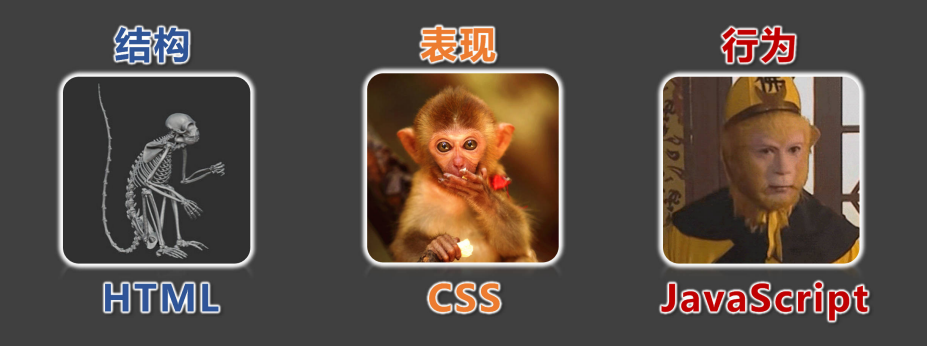

* `CSS`的全称为：层叠样式表(`Cascading Style Sheets`)。
* `CSS`也是一种标记语言，用于给`HTML`结构设置样式，例如：文字大小、颜色、元素宽高等等。

简单理解：`CSS`可以美化`HTML`，让`HTML`更漂亮。

核心思想：`HTML`搭建结构，`CSS`添加样式，实现了：结构与样式的分离。

### 2. CSS的编写位置

#### 2.1 行内样式

* 写在标签的`style`属性中，（又称：内联样式）。
* 语法：
  ```html
  <h1 style="color:red;font-size:60px;">欢迎来到尚硅谷学习</h1>
  ```
* 注意点：
  1. `style`属性的值不能随便写，写要符合`CSS`语法规范，是`名:值;`的形式。
  2. 行内样式表，只能控制当前标签的样式，对其他标签无效。
* 存在的问题：  
  书写繁琐、样式不能复用、并且没有体现出：结构与样式分离的思想，不推荐大量使用，只有对当前元素添加简单样式时，才偶尔使用。

相关代码：[行内样式](../../src/CSS2/CSS的编写位置/行内样式.html)

#### 2.2 内部样式

* 写在`html`页面内部，将所有的`CSS`代码提取出来，单独放在`<style>`标签中。
* 语法：
  ```html
  <style>
      h1 {
          color: red;
          font-size: 40px;
      }
  </style>
  ```
* 注意点：
  1. `<style>`标签理论上可以放在`HTML`文档的任何地方，但一般都放在`<head>`标签中。
  2. 此种写法：样式可以复用、代码结构清晰。
* 存在的问题：
  1. 并没有实现：结构与样式完全分离。
  2. 多个`HTML`页面无法复用样式。

相关代码：[内部样式](../../src/CSS2/CSS的编写位置/内部样式.html)

#### 2.3 外部样式

* 写在单独的`.css`文件中，随后在`HTML`文件中引入使用。
* 语法：
  1. 新建一个扩展名为`.css`的样式文件，把所有`CSS`代码都放入此文件中。
     ```css
     h1 {
         color: red;
         font-size: 40px;
     }
     ```
  2. 在`HTML`文件中引入`.css`文件。
     ```html
     <link rel="stylesheet" href="./xxx.css">
     ```    
* 注意点：
  1. `<link>`标签要写在`<head>`标签中。
  2. `<link>`标签属性说明：
     * `href`：引入的文档来自于哪里。
     * `rel`：（`relation`：关系）说明引入的文档与当前文档之间的关系。
  3. 外部样式的优势：样式可以复用、结构清晰、可触发浏览器的缓存机制，提高访问速度，实现了结构与样式的完全分离。
  4. 实际开发中，几乎都使用外部样式，这是最推荐的使用方式！

相关代码：[外部样式](../../src/CSS2/CSS的编写位置/外部样式.html)

### 3. 样式表的优先级

优先级规则：行内样式 > 内部样式 = 外部样式

1. 内部样式、外部样式，这二者的优先级相同，且：后面的会覆盖前面的（简记：“后来者居上”）。
2. 同一个样式表中，优先级也和编写顺序有关，且：后面的会覆盖前面的（简记：“后来者居上”）。

| 分类   | 优点                                                         | 缺点                                    | 使用频率 | 作用范围 |
|------|------------------------------------------------------------|---------------------------------------|------|------|
| 行内样式 | 优先级最高                                                      | 1. 结构与样式未分离<br>2. 代码结构混乱<br>3. 样式不能复用 | 很低   | 当前标签 |
| 内部样式 | 1. 样式可复用<br>2. 代码结构清晰                                      | 1. 结构与样式未彻底分离<br>2. 样式不能多页面复用         | 一般   | 当前页面 |
| 外部样式 | 1. 样式可多页面复用<br>2. 代码结构清晰<br>3. 可触发浏览器的缓存机制<br>4. 结构与样式彻底分离 | 需要引入才能使用                              | 最高   | 多个页面 |

相关代码：[优先级](../../src/CSS2/样式表的优先级/优先级.html)

### 4. CSS语法规范

`CSS`语法规范由两部分构成：
* 选择器：找到要添加样式的元素。
* 声明块：设置具体的样式（声明块是由一个或多个声明组成的），声明的格式为：`属性名: 属性值`
  > 备注1：最后一个声明后的分号理论上能省略，但最好还是写上。
  > 
  > 备注2：选择器与声明块之间，属性名与属性值之间，均有一个空格，理论上能省略，但最好还是写上。

  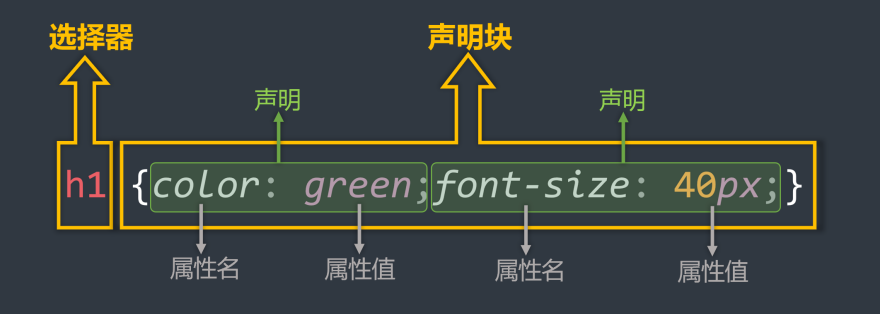
* 注释的写法：
  ```css
  /* 给h1元素添加样式 */
  h1 {
      /* 设置文字颜色为红色 */
      color: red;
      /* 设置文字大小为40px */
      font-size: 40px
  }
  ```

相关代码：[语法规范](../../src/CSS2/CSS语法规范/语法规范.html)

### 5. CSS代码风格

* 展开风格 —— 开发时推荐，便于维护和调试。
  ```css
  h1 {
      color: red;
      font-size: 40px;
  }
  ```
* 紧凑风格 —— 项目上线时推荐，可减小文件体积。
  ```css
  h1{color:red;font-size:40px;}
  ```
* 备注：  
  项目上线时，我们会通过工具将【展开风格】的代码，变成【紧凑风格】，这样可以减小文件体积，节约网络流量，同时也能让用户打开网页时速度更快。

相关代码：[代码风格](../../src/CSS2/CSS代码风格/代码风格.html)

## 二、CSS选择器

### 1. CSS基本选择器

1. 通配选择器
2. 元素选择器
3. 类选择器
4. id选择器

#### 1.1 通配选择器

* 作用：可以选中所有的`HTML`元素。
* 语法：
  ```css
  * {
      属性名: 属性值;
  }
  ```
* 举例：
  ```css
  /* 选中所有元素 */
  * {
      color: orange;
      font-size: 40px;
  }
  ```

备注：目前来看通配选择器貌似有点鸡肋，但后面清除样式时，会对我们有很大帮助，后面会详细讲。

相关代码：[通配选择器](../../src/CSS2/CSS基本选择器/通配选择器.html)

#### 1.2 元素选择器

* 作用：为页面中某种元素统一设置样式。
* 语法：
  ```css
  标签名 {
      属性名: 属性值;
  }
  ```
* 举例：
  ```css
  /* 选中所有h1元素 */
  h1 {
      color: orange;
      font-size: 40px;
  }
  
  /* 选中所有p元素 */
  p {
      color: blue;
      font-size: 60px;
  }
  ```
* 备注：元素选择器无法实现差异化设置，例如上面的代码中，所有的 p 元素效果都一样。

相关代码：[元素选择器](../../src/CSS2/CSS基本选择器/元素选择器.html)

#### 1.3 类选择器

* 作用：根据元素的`class`值，来选中某些元素。
  > `class`翻译过来有：种类、类别的含义，所以`class`值，又称：类名。
* 语法：
  ```css
  .类名 {
      属性名: 属性值;
  }
  ```
* 举例：
  ```css
  /* 选中所有class值为speak的元素 */
  .speak {
      color: red;
  }
  
  /* 选中所有class值为answer的元素 */
  .answer {
      color: blue;
  }
  ```
* 注意点：


1. 元素的`class`属性值不带`.`，但 CSS 的类选择器要带`.`。
2. `class`值，是我们自定义的，按照标准：不要使用纯数字、不要使用中文、尽量使用英文与数字的组合，若由多个单词组成，使用`-`做连接，例如：`left-menu`，且命名要有意义，做到“见名知意”。
3. 一个元素不能写多个`class`属性，下面是错误示例：
   ```html
   <!-- 该写法错误，元素的属性不能重复，后写的会失效 -->
   <h1 class="speak" class="big">你好啊</h1>
   ```
4. 一个元素的`class`属性，能写多个值，要用空格隔开，例如：
   ```html
   <!-- 该写法正确，class属性，能写多个值 -->
   <h1 class="speak big">你好啊</h1>
   ```

相关代码：[类选择器](../../src/CSS2/CSS基本选择器/类选择器.html)

#### 1.4 ID选择器

* 作用：根据元素的`id`属性值，来精准的选中某个元素。
* 语法：
  ```css
  #id值 {
      属性名: 属性值;
  }
  ```
* 举例：
  ```css
  /* 选中id值为earthy的那个元素 */
  #earthy {
      color: red;
      font-size: 60px;
  }
  ```
* 注意：
  - `id`属性值：尽量由字母、数字、下划线(`_`)、短杠(`-`)组成，最好以字母开头、不要包含空格、区分大小写。
  - 一个元素只能拥有一个`id`属性，多个元素的`id`属性值不能相同。
  - 一个元素可以同时拥有`id`和`class`属性。

相关代码：[ID选择器](../../src/CSS2/CSS基本选择器/ID选择器.html)

#### 1.5 基本选择器总结

| 基本选择器 | 特点                               | 用法                  |
|-------|----------------------------------|---------------------|
| 通配选择器 | 选中所有标签，一般用于清除样式。                 | * {color:red}       |
| 元素选择器 | 选中所有同种标签，但是不能差异化选择。              | h1 {color:red}      |
| 类选择器  | 选中所有特定类名（`class`值）的元素 —— 使用频率很高。 | .say {color:red}    |
| ID选择器 | 选中特定`id`值的那个元素（唯一的）。             | #earthy {color:red} |

### 2. CSS复合选择器

CSS选择器整体分类两大类：
* 一、基本选择器：
  1. 通配选择器
  2. 元素选择器
  3. 类选择器
  4. ID 选择器
* 二、复合选择器：
  1. 交集选择器
  2. 并集选择器
  3. 后代选择器
  4. 子元素选择器

注意：
1. 复合选择器建立在基本选择器之上，由多个基础选择器，通过不同的方式组合而成。
2. 复合选择器可以在复杂结构中，快速而准确的选中元素。

#### 2.1 交集选择器

* 作用：选中同时符合多个条件的元素。
  > 交集有并且的含义（通俗理解：即......又...... 的意思），例如：年轻且长得帅。
* 语法：
  ```css
  选择器1选择器2选择器3...选择器n {
  }
  ```
* 举例：
  ```css
  /* 选中：类名为beauty的p元素，为此种写法用的非常多！！！！ */
  p.beauty {
      color: blue;
  }
  
  /* 选中：类名包含rich和beauty的元素 */
  .rich.beauty {
      color: green;
  }
  ```
* 注意：
1. 有标签名，标签名必须写在前面。
2. `id`选择器、通配选择器，理论上可以作为交集的条件，但实际应用中几乎不用 —— 因为没有意义。
3. 交集选择器中不可能出现两个元素选择器，因为一个元素，不可能即是`p`元素又是`span`元素。
4. 用的最多的交集选择器是：元素选择器配合类名选择器，例如：`p.beauty`。

相关代码：[交集选择器](../../src/CSS2/CSS复合选择器/交集选择器.html)

#### 2.2 并集选择器

* 作用：选中多个选择器对应的元素，又称：分组选择器。
  > 所谓并集就是或者的含义（通俗理解：要么......要么...... 的意思），例如：给我转10万块钱或者我报警。
* 语法：
  ```css
  选择器1, 选择器2, 选择器3, ... 选择器n {
  }
  ```
  > 多个选择器通过`,`连接，此处`,`的含义就是：或。
* 举例：
  ```css
  /* 选中id为peiqi，或类名为rich，或类名为beauty的元素 */
  #peiqi,
  .rich,
  .beauty {
      font-size: 40px;
      background-color: skyblue;
      width: 200px;
  }
  ```
* 注意：
  1. 并集选择器，我们一般竖着写。
  2. 任何形式的选择器，都可以作为并集选择器的一部分 。
  3. 并集选择器，通常用于集体声明，可以缩小样式表体积。

相关代码：[并集选择器](../../src/CSS2/CSS复合选择器/并集选择器.html)

#### 2.3 HTML元素间的关系

分为：
1. 父元素
2. 子元素
3. 祖先元素
4. 后代元素
5. 兄弟元素


1. 父元素：直接包裹某个元素的元素，就是该元素的父元素。  
   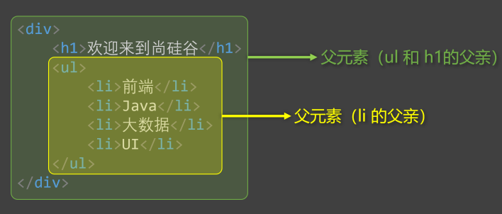
2. 子元素：被父元素直接包含的元素（简记：儿子元素）。  
   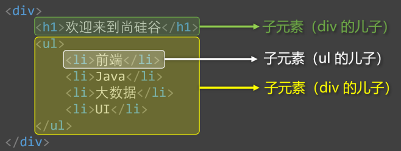
3. 祖先元素：父亲的父亲......，一直往外找，都是祖先。  
   备注：父元素，也算是祖先元素的一种。  
   例如：张三的父亲，也算是张三的祖先，但一般还是称呼：父亲。  
   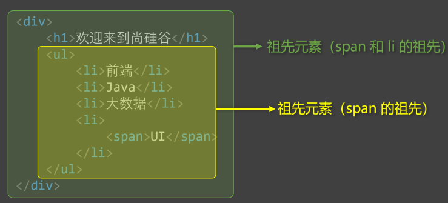
4. 后代元素：儿子的儿子......，一直往里找，都是后代。  
   备注：子元素，也算是后代元素的一种。  
   例如：张三的儿子，也算是张三的后代，但一般还是称呼：儿子。  
   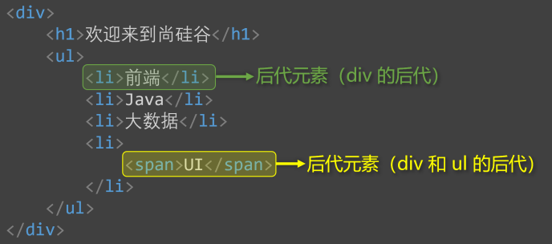
5. 兄弟元素：具有相同父元素的元素，互为兄弟元素。  
   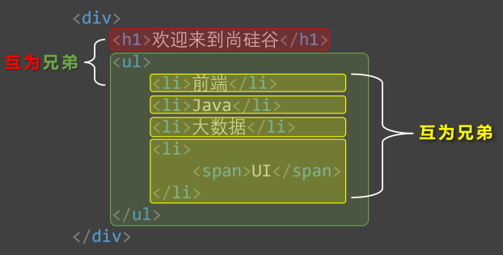

#### 2.4 后代选择器

* 作用：选中指定元素中，符合要求的后代元素。
* 语法：
  ```css
  /*（先写祖先，再写后代）*/
  选择器1 选择器2 选择器3 ...... 选择器n {
  } 
  ```
  > 选择器之间，用空格隔开，空格可以理解为："`xxx`中的`yyy`"，其实就是后代的意思。
  > 
  > 选择器`1234....n`，可以是我们之前学的任何一种选择器。
* 举例：
  ```css
  /* 选中ul中的所有li */
  ul li {
      color: red;
  }
  
  /* 选中ul中所有li中的a */
  ul li a {
      color: orange;
  }
  
  /* 选中类名为subject元素中的所有li */
  .subject li {
      color: blue;
  }
  
  /* 选中类名为subject元素中的所有类名为front-end的li */
  .subject li.front-end {
      color: blue;
  }
  ```
* 注意：
  1. 后代选择器，最终选择的是后代，不选中祖先。
  2. 儿子、孙子、重孙子，都算是后代。
  3. 结构一定要符合之前讲的`HTML`嵌套要求，例如：不能`p`中写`h1 ~ h6`。

相关代码：[后代选择器](../../src/CSS2/CSS复合选择器/后代选择器.html)

#### 2.5 子代选择器

* 作用：选中指定元素中，符合要求的子元素（儿子元素）。（先写父，再写子）
  > 子代选择器又称：子元素选择器、子选择器。
* 语法：
  ```css
  选择器1 > 选择器2 > 选择器3 > ...... 选择器n {
  }
  ```
  > 选择器之间，用`>`隔开，`>`可以理解为："`xxx`的子代"，其实就是儿子的意思。
  > 
  > 选择器`1234....n`，可以是我们之前学的任何一种选择器。
* 举例：
  ```css
  /* div中的子代a元素 */
  div > a {
      color: red;
  }
  
  /* 类名为persons的元素中的子代a元素 */
  .persons > a {
      color: red;
  }
  ```
* 注意：
  1. 子代选择器，最终选择的是子代，不是父级。
  2. 子、孙子、重孙子、重重孙子 ...... 统称后代！，子就是指儿子。

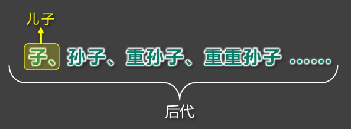

相关代码：[子代选择器](../../src/CSS2/CSS复合选择器/子代选择器.html)

#### 2.6 兄弟选择器

* 相邻兄弟选择器：
  - 作用：选中指定元素后，符合条件的相邻兄弟元素。
    > 所谓相邻，就是紧挨着他的下一个，简记：睡在我下铺的兄弟。
  - 语法：
    ```css
    选择器1 + 选择器2 {
    }
    ```
  - 示例：
    ```css
    /* 选中div后相邻的兄弟p元素 */
    div + p {
        color: red;
    }
    ```
* 通用兄弟选择器：
  - 作用：选中指定元素后，符合条件的所有兄弟元素。（简记：睡在我下铺的所有兄弟）
  - 语法：
    ```css
    选择器1 ~ 选择器2 {
    }
    ```
  - 实例：
    ```css
    /* 选中div后的所有的兄弟p元素 */
    div ~ p {
        color: red;
    }
    ```
  * 注意：两种兄弟选择器，选择的是下面的兄弟。

相关代码：[兄弟选择器](../../src/CSS2/CSS复合选择器/兄弟选择器.html)

#### 2.7 属性选择器

* 作用：选中属性值符合一定要求的元素。
* 语法：
  1. `[属性名]`选中具有某个属性的元素。
  2. `[属性名="值"]`选中包含某个属性，且属性值等于指定值的元素。
  3. `[属性名^="值"]`选中包含某个属性，且属性值以指定的值开头的元素。
  4. `[属性名$="值"]`选中包含某个属性，且属性值以指定的值结尾的元素。
  5. `[属性名*=“值”]`选择包含某个属性，属性值包含指定值的元素。
* 举例：
  ```css
  /* 选中具有title属性的元素 */
  div[title] {
      color: red;
  }
  
  /* 选中title属性值为atguigu的元素 */
  div[title="atguigu"] {
      color: red;
  }
  
  /* 选中title属性值以a开头的元素 */
  div[title^="a"] {
      color: red;
  }
  
  /* 选中title属性值以u结尾的元素 */
  div[title$="u"] {
      color: red;
  }
  
  /* 选中title属性值包含g的元素 */
  div[title*="g"] {
      color: red;
  }
  ```

相关代码：[属性选择器](../../src/CSS2/CSS复合选择器/属性选择器.html)

#### 2.8 伪类选择器

* 作用：选中特殊状态的元素。
  > 如何理解“伪”？ — 虚假的，不是真的。
  > 
  > 如何理解“伪类”？ — 像类(`class`)，但不是类，是元素的一种特殊状态。
* 常用的伪类选择器：  
  1. 动态伪类：
     1. :link 超链接未被访问的状态。
     2. :visited 超链接访问过的状态。
     3. :hover 鼠标悬停在元素上的状态。
     4. :active 元素激活的状态。
        > 什么是激活？—— 按下鼠标不松开。
        > 
        > 注意点：遵循 LVHA 的顺序，即：`link`、`visited`、`hover`、`active`。
     5. :focus 获取焦点的元素。
        > 表单类元素才能使用`:focus`伪类。
        > 
        > 当用户：点击元素、触摸元素、或通过键盘的“`tab`”键等方式，选择元素时，就是获得焦点。
  2. 结构伪类
     * 常用的：
       1. `:first-child`所有兄弟元素中的第一个。
       2. `:last-child`所有兄弟元素中的最后一个。
       3. `:nth-child(n)`所有兄弟元素中的第n个。
       4. `:first-of-type`所有同类型兄弟元素中的第一个。
       5. `:last-of-type`所有同类型兄弟元素中的最后一个。
       6. `:nth-of-type(n)`所有同类型兄弟元素中的第n个 。
     * 关于`n`的值： 
       1. `0`或`不写`：什么都选不中 —— 几乎不用。
       2. `n`：选中所有子元素 —— 几乎不用。
       3. `1~正无穷的整数`：选中对应序号的子元素。
       4. `2n`或`even`：选中序号为偶数的子元素。
       5. `2n+1`或`odd`：选中序号为奇数的子元素。
       6. `-n+3`：选中的是前 3 个。
     * 了解即可：
       1. `:nth-last-child(n)`所有兄弟元素中的倒数第 n 个。
       2. `:nth-last-of-type(n)`所有同类型兄弟元素中的 倒数第n个 。
       3. `:only-child`选择没有兄弟的元素（独生子女）。
       4. `:only-of-type`选择没有同类型兄弟的元素。
       5. `:root`根元素。
       6. `:empty`内容为空元素（空格也算内容）。
  3. 否定伪类：
     * `:not(选择器)`排除满足括号中条件的元素。
  4. UI伪类
     1. `:checked`被选中的复选框或单选按钮。
     2. `:enable`可用的表单元素（没有`disabled`属性）。
     3. `:disabled`不可用的表单元素（有`disabled`属性）。
  5. 目标伪类
     * `:target`选中锚点指向的元素。
  6. 语言伪类
     * `:lang()`根据指定的语言选择元素（本质是看`lang`属性的值）。

相关代码：
* [伪类选择器_概念](../../src/CSS2/CSS复合选择器/伪类选择器_概念.html)
* [伪类选择器_动态伪类](../../src/CSS2/CSS复合选择器/伪类选择器_动态伪类.html)
* [伪类选择器_结构伪类_1](../../src/CSS2/CSS复合选择器/伪类选择器_结构伪类_1.html)
* [伪类选择器_结构伪类_2](../../src/CSS2/CSS复合选择器/伪类选择器_结构伪类_2.html)
* [伪类选择器_结构伪类_3](../../src/CSS2/CSS复合选择器/伪类选择器_结构伪类_3.html)
* [伪类选择器_否定伪类](../../src/CSS2/CSS复合选择器/伪类选择器_否定伪类.html)
* [伪类选择器_UI伪类](../../src/CSS2/CSS复合选择器/伪类选择器_否定伪类.html)
* [伪类选择器_目标伪类](../../src/CSS2/CSS复合选择器/伪类选择器_否定伪类.html)
* [伪类选择器_语言伪类](../../src/CSS2/CSS复合选择器/伪类选择器_语言伪类.html)

#### 2.9 伪元素选择器

* 作用：选中元素中的一些特殊位置。
* 常用伪元素：
  - `::first-letter`选中元素中的第一个文字。
  - `::first-line`选中元素中的第一行文字。
  - `::selection`选中被鼠标选中的内容。
  - `::placeholder`选中输入框的提示文字。
  - `::before`在元素最开始的位置，创建一个子元素（必须用`content`属性指定内容）。
  - `::after`在元素最后的位置，创建一个子元素（必须用`content`属性指定内容）。

相关代码：[伪元素选择器](../../src/CSS2/CSS复合选择器/伪元素选择器.html)

### 3. 选择器的优先级（权重）

通过不同的选择器，选中相同的元素 ，并且为相同的样式名设置不同的值时，就发生了样式的冲突。到底应用哪个样式，此时就需要看优先级了。

* 简单描述：  
  行内样式 > ID选择器 > 类选择器 > 元素选择器 > 通配选择器。
* 详细描述：
  1. 计算方式：每个选择器，都可计算出一组权重，格式为：`(a,b,c)`
     * `a`：ID 选择器的个数。
     * `b`：类、伪类、属性 选择器的个数。
     * `c`：元素、伪元素 选择器的个数。
  2. 举例：
  
     | 选择器                      | 权重      |
     |--------------------------|---------|
     | ul > li                  | (0,0,2) |
     | div ul > li p a span     | (0,0,6) |
     | #atguigu .slogan         | (1,1,0) |
     | #atguigu .slogan a       | (1,1,1) |
     | #atguigu .slogan a:hover | (1,2,1) |
  3. 比较规则：按照从左到右的顺序，依次比较大小，当前位胜出后，后面的不再对比，例如：
     * (1,0,0) > (0,2,2)
     * (1,1,0) > (1,0,3)
     * (1,1,3) > (1,1,2)
  4. 特殊规则：
     * 行内样式权重大于所有选择器。
     * `!important`的权重，大于行内样式，大于所有选择器，权重最高！
     * 并集选择器的每一个部分是分开算的！
  5. 图示：  
     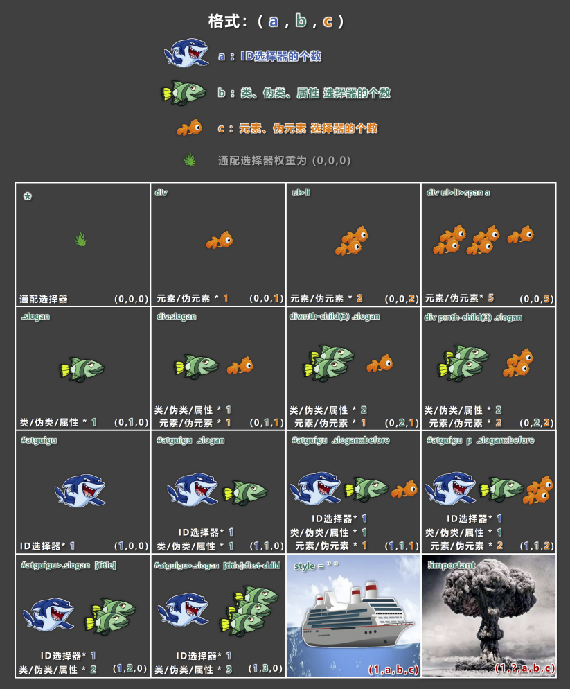

相关代码：[选择器优先级_详细聊](../../src/CSS2/CSS选择器优先级/选择器优先级_详细聊.html)

## 三、CSS三大特性

### 1. 层叠性

概念：如果发生了样式冲突，那就会根据一定的规则（选择器优先级），进行样式的层叠（覆盖）。

什么是样式冲突？ ——— 元素的同一个样式名，被设置了不同的值，这就是冲突。

### 2. 继承性

* 概念：元素会自动拥有其父元素、或其祖先元素上所设置的某些样式。
* 规则：优先继承离得近的。
* 常见的可继承属性：
  > `text-??`，`font-??`，`line-??`、`color`.....
* 备注：参照MDN网站，可查询属性是否可被继承。

### 3. 优先级

* 简单聊：`!important` > 行内样式 > ID选择器 > 类选择器 > 元素选择器 > * > 继承的样式。
* 详细聊：需要计算权重。
  > 计算权重时需要注意：并集选择器的每一个部分是分开算的！

相关代码：[CSS三大特性](../../src/CSS2/CSS三大特性/CSS三大特性.html)

## 四、CSS常用属性

### 1. 像素的概念

* 概念：我们的电脑屏幕是，是由一个一个“小点”组成的，每个“小点”，就是一个像素（px）。
* 规律：像素点越小，呈现的内容就越清晰、越细腻。

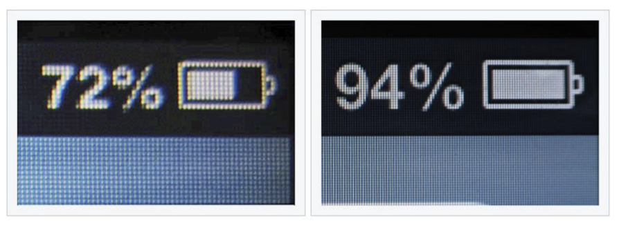

注意点：如果电脑设置中开启了缩放，那么就会影响一些工具的测量结果，但这无所谓，因为我们工作中都是参考详细的设计稿，去给元素设置宽高。

相关代码：[像素](../../src/CSS2/CSS像素_颜色/像素.html)

### 2. 颜色的表示

#### 2.1 表示方式一：颜色名

编写方式：直接使用颜色对应的英文单词，编写比较简单，例如：
1. 红色：red
2. 绿色：green
3. 蓝色：blue
4. 紫色：purple
5. 橙色：orange
6. 灰色：gray

提示：
1. 颜色名这种方式，表达的颜色比较单一，所以用的并不多。
2. 具体颜色名参考 MDN 官方文档：https://developer.mozilla.org/en-US/docs/Web/CSS/named-color

相关代码：[颜色_第1种表示_颜色名](../../src/CSS2/CSS像素_颜色/颜色_第1种表示_颜色名.html)

#### 2.2 表示方式二：rgb 或 rgba

* 编写方式：使用红、黄、蓝这三种光的三原色进行组合。
  - `r`表示红色
  - `g`表示绿色
  - `b`表示蓝色
  - `a`表示透明度
* 举例：
  ```css
  div {
      /* 使用 0~255 之间的数字表示一种颜色 */
      color: rgb(255, 0, 0); /* 红色 */
      color: rgb(0, 255, 0); /* 绿色 */
      color: rgb(0, 0, 255); /* 蓝色 */
      color: rgb(0, 0, 0); /* 黑色 */
      color: rgb(255, 255, 255); /* 白色 */
      
      /* 混合出任意一种颜色 */
      color: rgb(138, 43, 226); /* 紫罗兰色 */
      color: rgba(255, 0, 0, 0.5); /* 半透明的红色 */
      
      /* 也可以使用百分比表示一种颜色（用的少） */
      color: rgb(100%, 0%, 0%); /* 红色 */
      color: rgba(100%, 0%, 0%, 50%); /* 半透明的红色 */
  }
  ```
* 小规律：
  1. 若三种颜色值相同，呈现的是灰色，值越大，灰色越浅。
  2. `rgb(0, 0, 0)`是黑色，`rgb(255, 255, 255)`是白色。
  3. 对于`rbga`来说，前三位的`rgb`形式要保持一致，要么都是`0~255`的数字，要么都是`百分比`。

相关代码：[颜色_第2种表示_rgb或rgba](../../src/CSS2/CSS像素_颜色/颜色_第2种表示_rgb或rgba.html)

#### 2.3 表示方式三：HEX 或 HEXA

`HEX`的原理同与`rgb`一样，依然是通过：红、绿、蓝色进行组合，只不过要用6位（分成3组）来表达，格式为：`#rrggbb`

每一位数字的取值范围是：0 ~ f，即：（ 0, 1, 2, 3, 4, 5, 6, 7, 8, 9, a, b, c, d, e, f ）

所以每一种光的最小值是：00，最大值是：ff

```css
div {
    color: #ff0000; /* 红色 */
    color: #00ff00; /* 绿色 */
    color: #0000ff; /* 蓝色 */
    color: #000000; /* 黑色 */
    color: #ffffff; /* 白色 */
    /* 如果每种颜色的两位都是相同的，就可以简写*/
    color: #ff9988; /* 可简为：#f98 */
    /* 但要注意前三位简写了，那么透明度就也要简写 */
    color: #ff998866; /* 可简为：#f986 */
}
```

注意：`IE`浏览器不支持`HEXA`，但支持`HEX`。

相关代码：[颜色_第3种表示_HEX或HEXA](../../src/CSS2/CSS像素_颜色/颜色_第3种表示_HEX或HEXA.html)

#### 2.4 表示方式四：HSL 或 HSLA

* `HSL`是通过：色相、饱和度、亮度，来表示一个颜色的，格式为：`hsl(色相, 饱和度, 亮度)`
  - 色相：取值范围是`0~360`度，具体度数对应的颜色如下图：  
    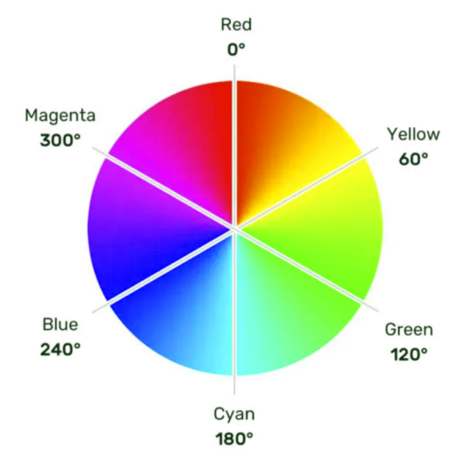、
  - 饱和度：取值范围是`0%~100%`。（向色相中对应颜色中添加灰色，`0%`全灰，`100%`没有灰）
  - 亮度：取值范围是`0%~100%`。（`0%`亮度没了，所以就是黑色。`100%`亮度太强，所以就是白色了）
* `HSLA`其实就是在`HSL`的基础上，添加了透明度。

相关代码：[颜色_第4种表示_HSL或HSLA](../../src/CSS2/CSS像素_颜色/颜色_第4种表示_HSL或HSLA.html)

### 3. CSS字体属性

#### 3.1 字体大小

* 属性名：`font-size`
* 作用：控制字体的大小。
* 语法：
  ```css
  div {
      font-size: 40px;
  }
  ```
* 注意点：
  1. `Chrome`浏览器支持的最小文字为`12px`，默认的文字大小为`16px`，并且`0px`会自动消失。
  2. 不同浏览器默认的字体大小可能不一致，所以最好给一个明确的值，不要用默认大小。
  3. 通常以给`body`设置`font-size`属性，这样`body`中的其他元素就都可以继承了。
* 借助控制台看样式：  
  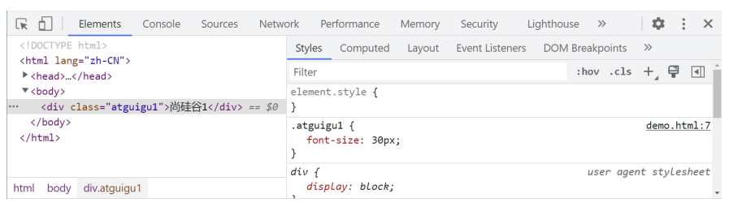

相关代码：[字体大小](../../src/CSS2/CSS常用字体属性/字体大小.html)

#### 3.2 字体族

* 属性名：`font-family`
* 作用：控制字体类型。
* 语法：
  ```css
  div {
      font-family: "STCaiyun", "Microsoft YaHei", sans-serif
  }
  ```
* 注意：
  1. 使用字体的英文名字兼容性会更好，具体的英文名可以自行查询，或在电脑的设置里去寻找。
  2. 如果字体名包含空格，必须使用引号包裹起来。
  3. 可以设置多个字体，按照从左到右的顺序逐个查找，找到就用，没有找到就使用后面的，且通常在最后写上`serif`（衬线字体）或`sans-serif`（非衬线字体）。
  4. `windows`系统中，默认的字体就是微软雅黑。

相关代码：[字体族](../../src/CSS2/CSS常用字体属性/字体族.html)

#### 3.3 字体风格

* 属性名：`font-style`
* 作用：控制字体是否为斜体。
* 常用值：
  1. `normal`：正常（默认值）
  2. `italic`：斜体（使用字体自带的斜体效果）
  3. `oblique`：斜体（强制倾斜产生的斜体效果）
* 语法：
  ```css
  div {
      font-style: italic;
  }
  ```
* 注意：
  1. 实现斜体时，更推荐使用`italic`。

相关代码：[字体风格](../../src/CSS2/CSS常用字体属性/字体风格.html)

#### 3.4 字体粗细

* 属性名：`font-weight`
* 作用：控制字体的粗细。
* 常用值：
  - 关键词
      1. `lighter`：细
      2. `normal`：正常
      3. `bold`：粗
      4. `bolder`：很粗 （多数字体不支持）
  - 数值
      1. `100~1000`且无单位，数值越大，字体越粗 （或一样粗，具体得看字体设计时的精确程度）。
      2. `100~300`等同于`lighter`，`400~500`等同于`normal`，`600`及以上等同于`bold`。
* 语法：
  ```css
  div {
      font-weight: bold;
  }
  
  div {
      font-weight: 600;
  }
  ```

相关代码：[字体粗细](../../src/CSS2/CSS常用字体属性/字体粗细.html)

#### 3.5 字体复合写法

* 属性名：`font`，可以把上述字体样式合并成一个属性。
* 作用：将上述所有字体相关的属性复合在一起编写。
* 编写规则：
  1. 字体大小、字体族必须都写上。
  2. 字体族必须是最后一位、字体大小必须是倒数第二位。
  3. 各个属性间用空格隔开。
* 实际开发中更推荐复合写法，但这也不是绝对的，比如只想设置字体大小，那就直接用`font-size`属性。

相关代码：[字体复合属性](../../src/CSS2/CSS常用字体属性/字体复合属性.html)

### 4. CSS文本属性

#### 4.1 文本颜色

* 属性名：`color`
* 作用：控制文字的颜色。
* 可选值：
  1. 颜色名
  2. `rgb`或`rgba`
  3. `HEX`或`HEXA`（十六进制）
  4. `HSL`或`HSLA`
  
  > 开发中常用的是：`rgb/rgba`或`HEX/HEXA`（十六进制）。
* 举例：
  ```css
  div {
      color: rgb(112, 45, 78);
  }
  ```

相关代码：[文本颜色](../../src/CSS2/CSS常用文本属性/文本颜色.html)

#### 4.2 文本间距

* 字母间距：`letter-spacing`
* 单词间距：`word-spacing`（通过空格识别词）
* 属性值为像素（`px`），正值让间距增大，负值让间距缩小。

相关代码：[文本间距](../../src/CSS2/CSS常用文本属性/文本间距.html)

#### 4.3 文本修饰

* 属性名：`text-decoration`
* 作用：控制文本的各种装饰线。
* 可选值：
  1. `none`：无装饰线（常用）
  2. `underline`：下划线（常用）
  3. `overline`：上划线
  4. `line-through`：删除线

  可搭配如下值使用：
  1. `dotted`：虚线
  2. `wavy`：波浪线
  3. 也可以指定颜色
* 举例：
  ```css
  a {
      text-decoration: none;
  }
  ```

相关代码：[文本修饰](../../src/CSS2/CSS常用文本属性/文本修饰.html)

#### 4.4 文本缩进

* 属性名：`text-indent`。
* 作用：控制文本首字母的缩进。
* 属性值： css 中的长度单位，例如： px
* 举例：
  ```css
  div {
      text-indent: 40px;
  }
  ```

后面我们会学习`css`中一些新的长度单位，目前我们只知道像素(`px`)。

相关代码：[文本缩进](../../src/CSS2/CSS常用文本属性/文本缩进.html)

#### 4.5 文本对齐_水平

* 属性名：`text-align`。
* 作用：控制文本的水平对齐方式。
* 常用值：
  1. `left`：左对齐（默认值）
  2. `right`：右对齐
  3. `center`：居中对齐
* 举例：
  ```css
  div {
      text-align: center;
  }
  ```

相关代码：[文本对齐_水平](../../src/CSS2/CSS常用文本属性/文本对齐_水平.html)

#### 4.6 细说 font-size

1. 由于字体设计原因，文字最终呈现的大小，并不一定与 font-size 的值一致，可能大，也可能小。
   > 例如：`font-size`设为`40px`，最终呈现的文字，可能比`40px`大，也可能比`40px`小。
2. 通常情况下，文字相对字体设计框，并不是垂直居中的，通常都靠下 一些。

相关代码：[细说_font-size](../../src/CSS2/CSS常用文本属性/细说_font-size.html)

#### 4.7 行高

* 属性名：`line-height`
* 作用：控制一行文字的高度。
* 可选值：
  1. `normal`：由浏览器根据文字大小决定的一个默认值。
  2. 像素(`px`)。
  3. 数字：参考自身`font-size`的倍数（很常用）。
  4. 百分比：参考自身`font-size`的百分比。
* 备注：由于字体设计原因，文字在一行中，并不是绝对垂直居中，若一行中都是文字，不会太影响观感。
* 举例：
  ```css
  div {
      line-height: 60px;
      line-height: 1.5;
      line-height: 150%;
  }
  ```
* 行高注意事项：
  1. `line-height`过小会怎样？—— 文字产生重叠，且最小值是`0`，不能为负数。
  2. `line-height`是可以继承的，且为了能更好的呈现文字，最好写数值。
  3. `line-height`和`height`是什么关系？
     * 设置了`height`，那么高度就是`height`的值。
     * 不设置`height`的时候，会根据`line-height`计算高度。
* 应用场景：
  1. 对于多行文字：控制行与行之间的距离。
  2. 对于单行文字：让`height`等于`line-height`，可以实现文字垂直居中。

备注：由于字体设计原因，靠上述办法实现的居中，并不是绝对的垂直居中，但如果一行中都是文字，不会太影响观感。

相关代码：[行高](../../src/CSS2/CSS常用文本属性/行高.html)
相关代码：[行高_注意事项](../../src/CSS2/CSS常用文本属性/行高_注意事项.html)

#### 4.8 文本对齐_垂直

1. 顶部：无需任何属性，在垂直方向上，默认就是顶部对齐。
2. 居中：对于单行文字，让`height=line-height`即可。
   > 问题：多行文字垂直居中怎么办？—— 后面我们用定位去做。
3. 底部：对于单行文字，目前一个临时的方式：  
   让`line-height = ( height × 2 ) - font-size - x`。  
   备注：`x`是根据字体族，动态决定的一个值。
   > 问题：垂直方向上的底部对齐，更好的解决办法是什么？—— 后面我们用定位去做。

相关代码：[文本对齐_垂直](../../src/CSS2/CSS常用文本属性/文本对齐_垂直.html)


