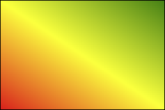

# CSS3

## 一、CSS3 简介

### 1. CSS3 概述

* CSS3是 CSS2 的升级版本，它在 CSS2 的基础上，新增了很多强大的新功能，从而解决一些实际面临的问题。
* CSS3在未来会按照模块化的方式去发展： https://www.w3.org/Style/CSS/current-work.html
* CSS3的新特性如下：
  - 新增了更加实用的选择器，例如：动态伪类选择器、目标伪类选择器、伪元素选择器等等。
  - 新增了更好的视觉效果，例如：圆角、阴影、渐变等。
  - 新增了丰富的背景效果，例如：支持多个背景图片，同时新增了若干个背景相关的属性。
  - 新增了全新的布局方案 —— 弹性盒子。
  - 新增了 Web 字体，可以显示用户电脑上没有安装的字体。
  - 增强了颜色，例如： HSL 、 HSLA 、 RGBA 几种新的颜色模式，新增 opacity 属性来控制透明度。
  - 增加了 2D 和 3D 变换，例如：旋转、扭曲、缩放、位移等。
  - 增加动画与过渡效果，让效果的变换更具流线性、平滑性。

### 2. CSS3私有前缀

#### 2.1 什么是私有前缀

如下代码中的`-webkit-`就是私有前缀

```css
div {
    width: 400px;
    height: 400px;
    -webkit-border-radius: 20px;
}
```

#### 2.2 为什么要有私有前缀

* W3C 标准所提出的某个 CSS 特性，在被浏览器正式支持之前，浏览器厂商会根据浏览器的内核，使用私有前缀来测试该 CSS 特性，在浏览器正式支持该 CSS 特性后，就不需要私有前缀了。
* 举个例子：

```css
.example {
    -webkit-border-radius: 20px;
    -moz-border-radius: 20px;
    -ms-border-radius: 20px;
    -o-border-radius: 20px;
    border-radius: 20px;
}
```

* 查询 CSS3 兼容性的网站：https://caniuse.com/

#### 2.3 常见浏览器私有前缀

* Chrome 浏览器：-webkit-
* Safari 浏览器：-webkit-
* Firefox 浏览器：-moz-
* Edge 浏览器：-webkit-
* 旧 Opera 浏览器：-o-
* 旧 IE 浏览器：-ms

注意：

我们在编码时，不用过于关注浏览器私有前缀，不用绞尽脑汁的去记忆，也不用每个都去查询，因为常用的 CSS3 新特性，主流浏览器都是支持的，即便是为了老浏览器而加前缀，我们也可以借助现代的构建工具，去帮我们添加私有前缀。

## 二、CSS3 基本语法

### 1. CSS3 新增长度单位

1. rem 根元素字体大小的倍数，只与根元素字体大小有关。
2. vw 视口宽度的百分之多少 10vw 就是视口宽度的 10% 。
3. vh 视口高度的百分之多少 10vh 就是视口高度的 10% 。
4. vmax 视口宽高中大的那个的百分之多少。（了解即可）
5. vmin 视口宽高中小的那个的百分之多少。（了解即可）

相关代码：[新增长度单位](../../src/CSS3/CSS3_新增长度单位/新增长度单位.html)

### 2. CSS3 新增颜色设置方式

CSS3 新增了三种颜色设置方式，分别是：rgba、hsl、hsla，由于之前已经详细讲解，此处略过。

### 3. CSS3 新增选择器

CSS3 新增的选择器有：动态伪类、目标伪类、语言伪类、 UI 伪类、结构伪类、否定伪类、伪元素；这些在 CSS2 中已经详细讲解，此处略过。

### 4. CSS3 新增盒模型相关属性

#### 4.1. box-sizing 怪异盒模型

使用 box-sizing 属性可以设置盒模型的两种类型

| 可选值         | 含义                                |
|-------------|-----------------------------------|
| content-box | width 和 height 设置的是盒子内容区的大小。（默认值） |
| border-box  | width 和 height 设置的是盒子总大小。（怪异盒模型）  |

相关代码：[box-sizing](../../src/CSS3/CSS3_新增盒子模型相关属性/box-sizing.html)

#### 4.2. resize 调整盒子大小

使用 resize 属性可以控制是否允许用户调节元素尺寸。

| 值          | 含义               |
|------------|------------------|
| none       | 不允许用户调整元素大小。(默认) |
| both       | 用户可以调节元素的宽度和高度。  |
| horizontal | 用户可以调节元素的宽度 。    |
| vertical   | 用户可以调节元素的高度。     |

注意：需要和`overflow`属性一起使用

相关代码：[resize](../../src/CSS3/CSS3_新增盒子模型相关属性/resize.html)

#### 4.3. box-shadow 盒子阴影

使用 box-shadow 属性为盒子添加阴影。

* 语法：  
  `box-shadow: h-shadow v-shadow blur spread color inset;`
* 各个值的含义：

  | 值        | 含义                 |
  |----------|--------------------|
  | h-shadow | 水平阴影的位置，必须填写，可以为负值 |
  | v-shadow | 垂直阴影的位置，必须填写，可以为负值 |
  | blur     | 可选，模糊距离            |
  | spread   | 可选，阴影的外延值          |
  | color    | 可选，阴影的颜色           |
  | inset    | 可选，将外部阴影改为内部阴影     |
* 默认值：`box-shadow: none`表示没有阴影
* 示例：
  ```css
  .example {
      /* 写两个值，含义：水平位置、垂直位置 */
      box-shadow: 10px 10px;
      /* 写三个值，含义：水平位置、垂直位置、颜色 */
      box-shadow: 10px 10px red;
      /* 写三个值，含义：水平位置、垂直位置、模糊值 */
      box-shadow: 10px 10px 10px;
      /* 写四个值，含义：水平位置、垂直位置、模糊值、颜色 */
      box-shadow: 10px 10px 10px red;
      /* 写五个值，含义：水平位置、垂直位置、模糊值、外延值、颜色 */
      box-shadow: 10px 10px 10px 10px blue;
      /* 写六个值，含义：水平位置、垂直位置、模糊值、外延值、颜色、内阴影 */
      box-shadow: 10px 10px 20px 3px blue inset;
  }
  ```

相关代码：[box-shadow](../../src/CSS3/CSS3_新增盒子模型相关属性/box-shadow.html)

#### 4.4. opacity 不透明度

opacity 属性能为整个元素添加透明效果，值是0到1之间的小数，0是完全透明，1表示完全不透明。

opacity 与 rgba 的区别？

opacity 是一个属性，设置的是整个元素（包括元素里的内容）的不透明度。

rgba 是颜色的设置方式，用于设置颜色，它的透明度，仅仅是调整颜色的透明度。

相关代码：[opacity](../../src/CSS3/CSS3_新增盒子模型相关属性/opacity.html)

### 5. CSS3 新增背景属性

#### 5.1. background-origin

* 作用：设置背景图的原点。
* 语法：
  1. padding-box：从 padding 区域开始显示背景图像。—— 默认值
  2. border-box：从 border 区域开始显示背景图像。
  3. content-box：从 content 区域开始显示背景图像。

相关代码：[background-origin](../../src/CSS3/新增背景相关属性/background-origin.html)

#### 5.2. background-clip

* 作用：设置背景图的向外裁剪的区域。
* 语法：
  1. border-box：从 border 区域开始向外裁剪背景。 —— 默认值
  2. padding-box：从 padding 区域开始向外裁剪背景。
  3. content-box：从 content 区域开始向外裁剪背景。
  4. text：背景图只呈现在文字上。

注意：若值为 text ，那么 backgroun-clip 要加上 -webkit- 前缀。

相关代码：[background-clip](../../src/CSS3/新增背景相关属性/background-clip.html)

#### 5.3. background-size

* 作用：设置背景图的尺寸。
* 语法：
  1. 用长度值指定背景图片大小，不允许负值。  
     `background-size: 300px 200px;`
  2. 用百分比指定背景图片大小，不允许负值。  
     `background-size: 100% 100%;`
  3. auto：背景图片的真实大小。—— 默认值
  4. contain：将背景图片等比缩放，使背景图片的宽或高，与容器的宽或高相等，再将完整背景图片包含在容器内，但要注意：可能会造成容器里部分区域没有背景图片。  
     `background-size: contain;`
  5. cover：将背景图片等比缩放，直到完全覆盖容器，图片会尽可能全的显示在元素上，但要注意：背景图片有可能显示不完整。—— 相对比较好的选择  
     `background-size: cover;`

相关代码：[background-size](../../src/CSS3/新增背景相关属性/background-size.html)

#### 5.4. backgorund 复合属性

语法：

`background: color url repeat position / size origin clip`

注意：
1. origin 和 clip 的值如果一样，如果只写一个值，则 origin 和 clip 都设置；如果设置了两个值，前面的是 origin ，后面的 clip 。
2. size 的值必须写在 position 值的后面，并且用 / 分开。

相关代码：[background复合属性](../../src/CSS3/新增背景相关属性/background复合属性.html)

#### 5.5. 多背景图

CSS3 允许元素设置多个背景图片

```css
.example {
    /* 添加多个背景图 */
    background: url(../../图片/bg-lt.png) no-repeat,
                url(../../图片/bg-rt.png) no-repeat right top,
                url(../../图片/bg-lb.png) no-repeat left bottom,
                url(../../图片/bg-rb.png) no-repeat right bottom;
}
```

相关代码：[多背景图](../../src/CSS3/新增背景相关属性/多背景图.html)

### 6. CSS3新增边框属性

#### 6.1 边框圆角

* 在 CSS3 中，使用 border-radius 属性可以将盒子变为圆角。
* 同时设置四个角的圆角：  
  `border-radius:10px;`
* 分开设置每个角的圆角（几乎不用）：

  | 属性名                        | 作用                                                     |
  |----------------------------|--------------------------------------------------------|
  | border-top-left-radius     | 设置左上角圆角半径：<br>1. 一个值是正圆半径，<br>2. 两个值分别是椭圆的 x 半径、 y 半径。 |
  | border-top-right-radius    | 设置右上角圆角半径：<br>1. 一个值是正圆半径，<br>2. 两个值分别是椭圆的 x 半径、 y 半径。 |
  | border-bottom-right-radius | 设置右下角圆角半径：<br>1. 一个值是正圆半径，<br>2. 两个值分别是椭圆的 x 半径、 y 半径。 |
  | border-bottom-left-radius  | 设置左下角圆角半径：<br>1. 一个值是正圆半径，<br>2. 两个值分别是椭圆的 x 半径、 y 半径。 |
* 分开设置每个角的圆角，综合写法（几乎不用）：  
  `border-raidus: 左上角x 右上角x 右下角x 左下角x / 左上y 右上y 右下y 左下y`

相关代码：[边框圆角](../../src/CSS3/新增边框相关属性/边框圆角.html)

#### 6.2 边框外轮廓

* outline-width：外轮廓的宽度。
* outline-color：外轮廓的颜色。
* outline-style：外轮廓的风格。
  - none： 无轮廓
  - dotted： 点状轮廓
  - dashed： 虚线轮廓
  - solid： 实线轮廓
  - double： 双线轮廓
* outline-offset 设置外轮廓与边框的距离，正负值都可以设置。
  > 注意：outline-offset 不是 outline 的子属性，是一个独立的属性。
* outline 复合属性  
  `outline:50px solid blue;`

相关代码：[边框外轮廓](../../src/CSS3/新增边框相关属性/边框外轮廓.html)

### 7. CSS3新增文本属性

#### 7.1 文本阴影

* 在 CSS3 中，我们可以使用 text-shadow 属性给文本添加阴影。
* 语法：  
  `text-shadow: h-shadow v-shadow blur color;`

  | 值        | 描述                |
  |----------|-------------------|
  | h-shadow | 必需写，水平阴影的位置。允许负值。 |
  | v-shadow | 必需写，垂直阴影的位置。允许负值。 |
  | blur     | 可选，模糊的距离。         |
  | color    | 可选，阴影的颜色          |
  默认值：`text-shadow: none`表示没有阴影。

相关代码：[文本阴影](../../src/CSS3/CSS3_新增文本属性/文本阴影.html)

#### 7.2 文本换行

* 在 CSS3 中，我们可以使用 white-space 属性设置文本换行方式。
* 常用值如下：

  | 值        | 含义                                        |
  |----------|-------------------------------------------|
  | normal   | 文本超出边界自动换行，文本中的换行被浏览器识别为一个空格。（默认值）        |
  | pre      | 原样输出，与 pre 标签的效果相同。                       |
  | pre-wrap | 在 pre 效果的基础上，超出元素边界自动换行。                  |
  | pre-line | 在 pre 效果的基础上，超出元素边界自动换行，且只识别文本中的换行，空格会忽略。 |
  | nowrap   | 强制不换行                                     |

相关代码：[文本换行](../../src/CSS3/CSS3_新增文本属性/文本换行.html)

#### 7.3 文本溢出

* 在 CSS3 中，我们可以使用 text-overflow 属性设置文本内容溢出时的呈现模式。
* 常用值如下：

  | 值        | 含义                         |
  |----------|----------------------------|
  | clip     | 当内联内容溢出时，将溢出部分裁切掉。 （默认值）   |
  | ellipsis | 当内联内容溢出块容器时，将溢出部分替换为`...`。 |

注意：要使得 text-overflow 属性生效，块容器必须显式定义 overflow 为非 visible 值， white-space 为 nowrap 值。

相关代码：[文本溢出](../../src/CSS3/CSS3_新增文本属性/文本溢出.html)

#### 7.4 文本修饰

* CSS3 升级了 text-decoration 属性，让其变成了复合属性。  
  `text-decoration: text-decoration-line || text-decoration-style || text-decoration-color`
* 子属性及其含义：
  - text-decoration-line 设置文本装饰线的位置
    - none：指定文字无装饰 （默认值）
    - underline：指定文字的装饰是下划线
    - overline：指定文字的装饰是上划线
    - line-through：指定文字的装饰是贯穿线
  - text-decoration-style 文本装饰线条的形状
    - solid：实线 （默认）
    - double：双线
    - dotted：点状线条
    - dashed：虚线
    - wavy：波浪线
  - text-decoration-color 文本装饰线条的颜色

相关代码：[文本修饰](../../src/CSS3/CSS3_新增文本属性/文本修饰.html)

#### 7.5 文本描边

注意：文字描边功能仅 webkit 内核浏览器支持。
* -webkit-text-stroke-width：设置文字描边的宽度，写长度值。
* -webkit-text-stroke-color：设置文字描边的颜色，写颜色值。
* -webkit-text-stroke：复合属性，设置文字描边宽度和颜色。

相关代码：[文本描边](../../src/CSS3/CSS3_新增文本属性/文本描边.html)

### 8. CSS3 新增渐变

#### 8.1 线性渐变

* 多个颜色之间的渐变， 默认从上到下渐变。  
    
  `background-image: linear-gradient(red,yellow,green);`
* 使用关键词设置线性渐变的方向。  
    
  `background-image: linear-gradient(to top,red,yellow,green);`  
  `background-image: linear-gradient(to right top,red,yellow,green);`
* 使用角度设置线性渐变的方向。  
    
  `background-image: linear-gradient(30deg,red,yellow,green);`
* 调整开始渐变的位置。  
    
  `background-image: linear-gradient(red 50px,yellow 100px ,green 150px);`

相关代码：[线性渐变](../../src/CSS3/CSS3_新增渐变/线性渐变.html)

#### 8.2 径向渐变

* 多个颜色之间的渐变， 默认从圆心四散。（注意：不一定是正圆，要看容器本身宽高比）  
    
  `background-image: radial-gradient(red,yellow,green);`
* 使用关键词调整渐变圆的圆心位置。  
    
  `background-image: radial-gradient(at right top,red,yellow,green);`
* 使用像素值调整渐变圆的圆心位置。  
    
  `background-image: radial-gradient(at 100px 50px,red,yellow,green);`
* 调整渐变形状为正圆。  
    
  `background-image: radial-gradient(circle,red,yellow,green);`
* 调整形状的半径。  
  
    
  `background-image: radial-gradient(100px,red,yellow,green);`
  `background-image: radial-gradient(50px 100px,red,yellow,green);`
* 调整开始渐变的位置。  
    
  `background-image: radial-gradient(red 50px,yellow 100px,green 150px);`

相关代码：[径向渐变](../../src/CSS3/CSS3_新增渐变/径向渐变.html)

#### 8.3 重复渐变

无论线性渐变，还是径向渐变，在没有发生渐变的位置，继续进行渐变，就为重复渐变。

* 使用 repeating-linear-gradient 进行重复线性渐变，具体参数同 linear-gradient 。
* 使用 repeating-radial-gradient 进行重复径向渐变，具体参数同 radial-gradient 。

> 我们可以利用渐变，做出很多有意思的效果：例如：横格纸、立体球等等。

相关代码：[重复渐变](../../src/CSS3/CSS3_新增渐变/重复渐变.html)

相关代码：[渐变小案例](../../src/CSS3/CSS3_新增渐变/渐变小案例.html)

### 9. web 字体

#### 9.1 基本用法

可以通过 @font-face 指定字体的具体地址，浏览器会自动下载该字体，这样就不依赖用户电脑上的字体了。

* 语法（简写方式）
  ```css
  @font-face {
      font-family: "情书字体";
      src: url('./方正手迹.ttf');
  }
  ```
* 语法（高兼容性写法）
  ```css
  @font-face {
      font-family: "atguigu";
      font-display: swap;
      src: url('webfont.eot'); /* IE9 */
      src: url('webfont.eot?#iefix') format('embedded-opentype'), /* IE6-IE8 */ url('webfont.woff2') format('woff2'),
      url('webfont.woff') format('woff'), /* chrome、firefox */ url('webfont.ttf') format('truetype'), /* chrome、firefox、opera、Safari,Android*/ url('webfont.svg#webfont') format('svg'); /* iOS 4.1- */
  }
  ```

相关代码：[web字体](../../src/CSS3/web字体/web字体.html)

#### 9.2 定制字体

* 中文的字体文件很大，使用完整的字体文件不现实，通常针对某几个文字进行单独定制。
* 可使用阿里 Web 字体定制工具：https://www.iconfont.cn/webfont

相关代码：[web字体](../../src/CSS3/web字体/web字体.html)

#### 9.3 字体图标

* 相比图片更加清晰。
* 灵活性高，更方便改变大小、颜色、风格等。
* 兼容性好， IE 也能支持。

字体图标的具体使用方式，每个平台不尽相同，最好参考平台使用指南，视频中我们是以使用最多的阿里图标库作为演示。

阿里图标官网地址：https://www.iconfont.cn/

相关代码：[字体图标_方式一](../../src/CSS3/web字体/字体图标_方式一.html)

相关代码：[字体图标_方式一_在线使用](../../src/CSS3/web字体/字体图标_方式一_在线使用.html)

相关代码：[字体图标_方式二](../../src/CSS3/web字体/字体图标_方式二.html)

相关代码：[字体图标_方式二_在线使用](../../src/CSS3/web字体/字体图标_方式二_在线使用.html)

相关代码：[字体图标_方式三](../../src/CSS3/web字体/字体图标_方式三.html)

相关代码：[字体图标_方式三_在线使用](../../src/CSS3/web字体/字体图标_方式三_在线使用.html)

### 10. 2D变换

> 前提：二维坐标系如下图所示


#### 10.1. 2D位移

2D 位移可以改变元素的位置，具体使用方式如下：
1. 先给元素添加 转换属性 transform
2. 编写 transform 的具体值，相关可选值如下：

  | 值          | 含义                                    |
  |------------|---------------------------------------|
  | translateX | 设置水平方向位移，需指定长度值；若指定的是百分比，是参考自身宽度的百分比。 |
  | translateY | 设置垂直方向位移，需指定长度值；若指定的是百分比，是参考自身高度的百分比。 |
  | translate  | 一个值代表水平方向，两个值代表：水平和垂直方向。              |
3. 注意点：
   1. 位移与相对定位很相似，都不脱离文档流，不会影响到其它元素。
   2. 与相对定位的区别：相对定位的百分比值，参考的是其父元素；定位的百分比值，参考的是其自身。
   3. 浏览器针对位移有优化，与定位相比，浏览器处理位移的效率更高。
   4. transform 可以链式编写，例如：  
      `transform: translateX(30px) translateY(40px);`
   5. 位移对行内元素无效。
   6. 位移配合定位，可实现元素水平垂直居中
      ```css
      .box {
          position: absolute;
          left: 50%;
          top: 50%;
          transform: translate(-50%, -50%);
      }
      ```

相关代码：[位移](../../src/CSS3/2D_变换/位移.html)

#### 10.2. 2D缩放

2D 缩放是指：让元素放大或缩小，具体使用方式如下：
1. 先给元素添加 转换属性 transform
2. 编写 transform 的具体值，相关可选值如下：

  | 值      | 含义                                                     |
  |--------|--------------------------------------------------------|
  | scaleX | 设置水平方向的缩放比例，值为一个数字，1表示不缩放，大于1放大，小于1缩小。                 |
  | scaleY | 设置垂直方向的缩放比例，值为一个数字，1表示不缩放，大于1放大，小于1缩小。                 |
  | scale  | 同时设置水平方向、垂直方向的缩放比例，一个值代表同时设置水平和垂直缩放；两个值分别代表：水平缩放、垂直缩放。 |
3. 注意点：
   1. scale 的值，是支持写负数的，但几乎不用，因为容易让人产生误解。
   2. 借助缩放，可实现小于 12px 的文字。

相关代码：[缩放](../../src/CSS3/2D_变换/缩放.html)

#### 10.3. 2D旋转

2D 旋转是指：让元素在二维平面内，顺时针旋转或逆时针旋转，具体使用方式如下：
1. 先给元素添加 转换属性 transform
2. 编写 transform 的具体值，相关可选值如下：

  | 值      | 含义                                  |
  |--------|-------------------------------------|
  | rotate | 设置旋转角度，需指定一个角度值( deg )，正值顺时针，负值逆时针。 |

注意： rotateZ(20deg) 相当于 rotate(20deg) ，当然到了 3D 变换的时候，还能写：rotate(x,x,x)

相关代码：[旋转](../../src/CSS3/2D_变换/旋转.html)

#### 10.4. 2D扭曲

2D 扭曲是指：让元素在二维平面内被“拉扯”，进而“走形”，实际开发几乎不用，了解即可，具体使用方式如下：
1. 先给元素添加 转换属性 transform
2. 编写 transform 的具体值，相关可选值如下：

  | 值     | 含义                                |
  |-------|-----------------------------------|
  | skewX | 设置元素在水平方向扭曲，值为角度值，会将元素的左上角、右下角拉扯。 |
  | skewY | 设置元素在垂直方向扭曲，值为角度值，会将元素的左上角、右下角拉扯。 |
  | skew  | 一个值代表skewX，两个值分别代表：skewX、skewY    |

相关代码：[扭曲](../../src/CSS3/2D_变换/扭曲.html)

#### 10.5. 多重变换

多个变换，可以同时使用一个 transform 来编写。

```css
.example {
    transform: translate(-50%, -50%) rotate(45deg);
}
```

注意点：多重变换时，建议最后旋转，因为旋转会改变坐标系。

#### 10.6. 变换原点

* 元素变换时，默认的原点是元素的中心，使用 transform-origin 可以设置变换的原点。
* 修改变换原点对位移没有影响， 对旋转和缩放会产生影响。
* 如果提供两个值，第一个用于横坐标，第二个用于纵坐标。
* 如果只提供一个，若是像素值，表示横坐标，纵坐标取50%；若是关键词，则另一个坐标取50%
  1. `transform-origin: 50% 50%`， 变换原点在元素的中心位置，百分比是相对于自身。—— 默认值
  2. `transform-origin: left top`，变换原点在元素的左上角 。
  3. `transform-origin: 50px 50px`， 变换原点距离元素左上角50px 50px的位置。
  4. `transform-origin: 0`，只写一个值的时候，第二个值默认为50%。

相关代码：[变换原点](../../src/CSS3/2D_变换/变换原点.html)

### 11. 3D变换

#### 11.1. 开启3D空间

重要原则：元素进行 3D 变换的首要操作：父元素必须开启 3D 空间！

使用 transform-style 开启 3D 空间，可选值如下：
* flat：让子元素位于此元素的二维平面内（ 2D 空间）—— 默认值
* preserve-3d：让子元素位于此元素的三维空间内（ 3D 空间）

相关代码：[3D_变换与景深](../../src/CSS3/3D_变换/3D_变换与景深.html)

#### 11.2. 设置景深

何为景深？—— 指定观察者与`z=0`平面的距离，能让发生 3D 变换的元素，产生透视效果，看来更加立体。

使用 perspective 设置景深，可选值如下：
* none：不指定透视 ——（默认值）
* 长度值：指定观察者距离 z=0 平面的距离，不允许负值。

注意：perspective设置给发生 3D 变换元素的父元素！

#### 11.3. 透视点位置

