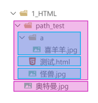

# HTML4

## 一、前序知识

### 1. 认识两位先驱


### 2. 计算机基础知识

1. 计算机俗称电脑，是现代一种用于高速计算的电子计算机器，可以进行数值计算、逻辑计算，还具有存储记忆功能。
2. 计算机由`硬件 + 软件`组成：
   硬件：看得见摸得着的物理部件。
   软件：可以指挥硬件工作的指令。
3. 软件的分类：
   1. 系统软件：Windows、Linux、Android、Harmony 等。
   2. 应用软件：微信、QQ、王者荣耀、PhotoShop 等。
4. 整体图示：  
   

### 3. C/S架构与B/S架构

1. 上面提到的应用软件，又分为两大类：
   * C/S架构，特点：需要安装、偶尔更新、不跨平台、开发更具针对性。
   * B/S架构，特点：无需安装、无需更新、可跨平台、开发更具通用性。
   
   > 名词解释：C => client（客户端）、B => browser（浏览器）、S => server（服务器）。
   > 
   > 服务器：为软件提供数据的设备（在背后默默的付出）。

2. 前端工程师，主要负责编写 B/S架构中的网页（呈现界面、实现交互）。
   > 备注：大前端时代，我们可以用前端的技术栈，做出一个C/S架构的应用、甚至搭建一个服务器😎。

### 4. 浏览器相关知识

浏览器是网页运行的平台，常见的浏览器有：`谷歌(Chrome)`、`Safari`、`IE`、`火狐(Firefox)`、`欧朋(Opera)`等，以上这些是常用的五大浏览器。

1. 各大浏览器市场份额：


2. 常见浏览器的内核：


### 5. 网页相关概念

1. 网址：我们在浏览器中输入的地址。
2. 网页：浏览器所呈现的每一个页面。
3. 网站：多个网页构成了一个网站。
4. 网页标准：


## 二、HTML 简介

### 1. 什么是 HTML？

全称：HyperText Markup Language（超文本标记语言）。

> 超文本：暂且简单理解为“超级的文本”，和普通文本比，内容更丰富。
> 
> 标 记：文本要变成超文本，就需要用到各种标记符号。
> 
> 语 言：每一个标记的写法、读音、使用规则，组成了一个标记语言。

### 2. 相关国际组织

1. IETF  
   全称：Internet Engineering Task Force（国际互联网工程任务组），成立于1985年底，是一个权威的互联网技术标准化组织，主要负责互联网相关技术规范的研发和制定，当前绝大多数国际互联网技术标准均出自IETF。官网：https://www.ietf.org
2. W3C  
   全称：World Wide Web Consortium（万维网联盟），创建于1994年，是目前Web技术领域，最具影响力的技术标准机构。共计发布了200多项技术标准和实施指南，对互联网技术的发展和应用起到了基础性和根本性的支撑作用，官网：https://www.w3.org
3. WHATWF  
   全称：Web Hypertext Application Technology Working Group（网页超文本应用技术工作小组）成立于2004年，是一个以推动网络HTML 5 标准为目的而成立的组织。由Opera、Mozilla基金会、苹果等这些浏览器厂商组成。官网：https://whatwg.org

### 3. HTML 发展历史

从 HTML 1.0 开始发展，期间经历了很多版本，目前HTML的最新标准是：HMTL 5，具体发展史如图


## 三、准备工作

### 1. 常用电脑设置

1. 查看文件夹内容的几种布局。
2. 展示文件扩展名（文件后缀）。
3. 使用指定程序打开文件。
4. 配置文件的默认打开方式。

### 2. 安装Chrome浏览器

1. 下载地址：https://www.google.cn/chrome。
2. 若上述地址打不开，或无法安装，请使用资料中的离线安装包。
3. 详细步骤请参考视频。

## 四、HTML 入门

### 1. HTML 初体验

1. 第一步：鼠标右键 => 新建 => 文本文档 => 输入以下内容，并保存。
   ```html
   <marquee>尚硅谷，让天下没有难学的技术！</marquee>
   ```
2. 第二步：修改后缀为`.html`，然后双击打开即可。
   > 这里的后缀名，使用`.htm`也可以，但推荐使用更标准的`.html`。
3. 程序员写的叫源代码，要交给浏览器进行渲染。
4. 借助浏览器看网页的源代码，具体操作：  
   在网页空白处：鼠标右键 ==> 查看网页源代码

### 2. HTML 标签

1. 标签又称元素，是HTML的基本组成单位。
2. 标签分为：双标签与单标签（绝大多数都是双标签）。
3. 标签名不区分大小写，但推荐小写，因为小写更规范。
4. 双标签：


示例代码：

```html
<marquee>尚硅谷，让天下没有难学的技术！</marquee>
```

5. 单标签：


示例代码：

```html
<input>
```

6. 标签之间的关系：并列关系、嵌套关系，可以使用`tab`键进行缩进：

```html
<marquee>
    尚硅谷，让天下没有难学的技术！
    <input>
</marquee>
<input>
```

### 3. HTML 标签属性

1. 用于给标签提供附加信息。
2. 可以写在：起始标签或单标签中，形式如下：


例如：

```html
<marquee loop="1" bgcolor="orange">尚硅谷，让天下没有难学的技术！</marquee>
<input type="password">
```

3. 有些特殊的属性，没有属性名，只有属性值，例如：

```html
<input disabled>
```

4. 注意点：
   1. 不同的标签，有不同的属性；也有一些通用属性（在任何标签内都能写，后面会详细总结）。
   2. 属性名、属性值不能乱写，都是W3C规定好的。
   3. 属性名、属性值，都不区分大小写，但推荐小写。
   4. 双引号，也可以写成单引号，甚至不写都行，但还是推荐写双引号。
   5. 标签中不要出现同名属性，否则后写的会失效，例如：
      ```html
      <input type="text" type="password">
      ```

### 4. HTML 基本结构

1. 在网页中，如何查看某段结构的具体代码？—— 点击鼠标右键，选择“检查”。
2. 【检查】和【查看网页源代码】的区别：
   > 【查看网页源代码】看到的是：程序员编写的源代码。
   > 
   > 【检查】看到的是：经过浏览器“处理”后的源代码。
   > 
   > 备注：日常开发中，【检查】用的最多。
3. 网页的基本结构如下：
   1. 想要呈现在网页中的内容写在`body`标签中。
   2. `head`标签中的内容不会出现在网页中。
   3. `head`标签中的`title`标签可以指定网页的标题。
   4. 图示：  
      
   5. 代码：
      ```html
      <html>
      <head>
          <title>网页标题</title>
      </head>
      <body>
      ......
      </body>
      </html>
      ```

### 5. 安装 VSCode

1. 安装中文语言包。
2. 使用 VSCode打开文件夹的两种方式。
3. 调整字体大小。
4. 设置主题。
5. 安装图标主题：vscode-icons。

> 备注：详细安装步骤请参考视频。

### 6. 安装 Live Server 插件

1. 可以更加方便的打开网页。
2. 打开网页的方式更贴近项目上线。
3. 代码出现改动后，可以自动刷新。
4. 根据自己的情况，去配置一下 VSCode 的自动保存。

> 注意1：务必使用VSCode打开的是文件夹，否则 Live Server 插件无法正常工作！
> 
> 注意2：打开的网页必须是标准的HTML结构，否则无法自动刷新！

### 7. HTML 注释

1. 特点：注释的内容会被浏览器所忽略，不会呈现到页面中，但源代码中依然可见。
2. 作用：对代码进行解释和说明。
3. 写法：
   ```html
   <!-- 下面的文字只能滚动一次 -->
   <marquee loop="1">尚硅谷</marquee>
   <!-- 下面的文字可以无限滚动 -->
   <marquee>尚硅谷123</marquee>
   ```
4. 注释不可以嵌套，以下这么写是错的（反例）。
   ```html
   <!--
   我是一段注释
   <!-- 我是一段注释 -->
   -->
   ```

### 8. HTML 文档声明

1. 作用：告诉浏览器当前网页的版本。
2. 写法：
   * 旧写法：要依网页所用的HTML版本而定，写法有很多。
     > 具体有哪些写法请参考：[W3C官网-文档声明](https://www.w3.org/QA/2002/04/valid-dtd-list.html)
   * 新写法：一切都变得简单了！W3C 推荐使用 HTML 5 的写法。
     ```html
     <!DOCTYPE html>
     或
     <!DOCTYPE HTML>
     或
     <!doctype html>
     ```
3. 注意：文档声明，必须在网页的第一行，且在`html`标签的外侧。

### 9. HTML 字符编码

1. 计算机对数据的操作：  
   存储时，对数据进行：编码。  
   读取时，对数据进行：解码。
2. 编码、解码，会遵循一定的规范 —— 字符集。
3. 字符集有很多中，常见的有（了解）：
   1. `ASCII`：大写字母、小写字母、数字、一些符号，共计128个。
   2. `ISO 8859-1`：在 ASCII 基础上，扩充了一些希腊字符等，共计是256个。
   3. `GB2312`：继续扩充，收录了6763个常用汉字、682个字符。
   4. `GBK`：收录了的汉字和符号达到20000+，支持繁体中文。
   5. `UTF-8`：包含世界上所有语言的：所有文字与符号。—— 很常用。
4. 使用原则是怎样的？
   * 原则1：存储时，务必采用合适的字符编码。否则：无法存储，数据会丢失！
   * 原则2：存储时采用哪种方式编码，读取时就采用哪种方式解码。否则：数据错乱（乱码）！
5. 总结：
   * 平时编写代码时，统一采用`UTF-8`编码（最稳妥）。
   * 为了让浏览器在渲染`html`文件时，不犯错误，可以通过`meta`标签配合`charset`属性指定字符编码。
     ```html
     <head>
        <meta charset="UTF-8"/>
     </head>
     ```

### 10. HTML 设置语言

1. 主要作用：
   * 让浏览器显示对应的翻译提示。
   * 有利于搜索引擎优化。
2. 具体写法：
   ```html
   <html lang="zh-CN">
   ```
3. 扩展知识：`lang`属性的编写规则（作为一个课外扩展知识，了解即可）。
   1. 第一种写法（语言-国家/地区），例如：
      * `zh-CN`：中文-中国大陆（简体中文）
      * `zh-TW`：中文-中国台湾（繁体中文）
      * `zh`：中文
      * `en-US`：英语-美国
      * `en-GB`：英语-英国
   2. 第二种写法（ 语言—具体种类）已不推荐使用，例如：
      * `zh-Hans`：中文—简体
      * `zh-Hant`：中文—繁体
   3. W3School 上的说明：[《语言代码参考手册》](https://www.w3school.com.cn/tags/html_ref_language_codes.asp)、[《国家/地区代码参考手册》](https://www.w3school.com.cn/tags/html_ref_country_codes.asp)
   4. W3C官网上的说明：[《Language tags in HTML》](https://www.w3.org/International/articles/language-tags/)

### 11. HTML标准结构

1. HTML标准结构如下：
   ```html
   <!DOCTYPE html>
   <html lang="zh-CN">
   <head>
       <meta charset="UTF-8">
       <title>我是一个标题</title>
   </head>
   <body>
   </body>
   </html>
   ```
2. 输入`!`，随后回车即可快速生成标准结构。
   > 生成的结构中，有两个meta标签，我们暂时用不到，可以先删掉。
3. 配置`VScode`的内置插件`emmet`，可以对生成结构的属性进行定制。
4. 在存放代码的文件夹中，存放一个`favicon.ico`图片，可配置网站图标。

## 五、HTML 基础

### 1. 开发者文档

* W3C官网：https://www.w3c.org
* W3School：https://www.w3school.com.cn
* MDN：https://developer.mozilla.org —— 平时用的最多。

### 2. 排版标签

| 标签名     | 标签含义                    | 单/双 标签 |
|---------|-------------------------|--------|
| h1 ~ h6 | 标题                      | 双      |
| p       | 段落                      | 双      |
| div     | 没有任何含义，用于整体布局（生活中的包装袋）。 | 双      |

1. `h1`最好写一个，`h2~h6`能适当多写。
2. `h1~h6`不能互相嵌套，例如：`h1`标签中最好不要写`h2`标签了。
3. `p`标签很特殊！它里面不能有：`h1~h6`、`p`、`div`标签（暂时先这样记，后面会说规律）。

### 3. 语义化标签

* 概念：用特定的标签，去表达特定的含义。
* 原则：标签的默认效果不重要（后期可以通过`CSS`随便控制效果），语义最重要！
* 举例：对于`h1`标签，效果是文字很大（不重要），语义是网页主要内容（很重要）。
* 优势：
  - 代码结构清晰可读性强。
  - 有利于 SEO（搜索引擎优化）。
  - 方便设备解析（如屏幕阅读器、盲人阅读器等）。

### 4. 块级元素 与 行内元素

1. 块级元素：独占一行（排版标签都是块级元素）。
2. 行内元素：不独占一行（目前只学了：`input`，稍后会学习更多）。
3. 使用原则：
   1. 块级元素 中能写行内元素和块级元素（简单记：块级元素中几乎什么都能写）。
   2. 行内元素 中能写行内元素，但不能写块级元素。
   3. 一些特殊的规则：
      * `h1~h6`不能互相嵌套。
      * `p`中不要写块级元素。

### 5. 文本标签_常用的

1. 用于包裹：词汇、短语等。
2. 通常写在排版标签里面。
3. 排版标签更宏观（大段的文字），文本标签更微观（词汇、短语）。
4. 文本标签通常都是行内元素。

| 标签名    | 标签含义             | 单/双 标签 |
|--------|------------------|--------|
| em     | 要着重阅读的内容         | 双      |
| strong | 十分重要的内容（语气比em要强） | 双      |
| span   | 没有语义，用于包裹短语的通用容器 | 双      |

> 生活中的例子：`div`是大包装袋，`span`是小包装袋。

### 6. 文本标签_不常用的

| 标签名        | 标签含义                                      | 单/双 标签 |
|------------|-------------------------------------------|--------|
| cite       | 作品标题（书籍、歌曲、电影、电视节目、绘画、雕塑）                 | 双      |
| dfn        | 特殊术语，或专属名词                                | 双      |
| del 与 ins  | 删除的文本【与】插入的文本                             | 双      |
| sub 与 sup  | 下标文字【与】上标文字                               | 双      |
| code       | 一段代码                                      | 双      |
| samp       | 从正常的上下文中，将某些内容提取出来，例如：标识设备输出              | 双      |
| kbd        | 键盘文本，表示文本是通过键盘输入的，经常用在与计算机相关的手册中          | 双      |
| abbr       | 缩写，最好配合上 title 属性                         | 双      |
| bdo        | 更改文本方向，要配合 dir 属性，可选值: ltr（默认值）、rtl       | 双      |
| var        | 标记变量，可以与 code 标签一起使用                      | 双      |
| small      | 附属细则，例如：包括版权、法律文本。—— 很少使用                 | 双      |
| b          | 摘要中的关键字、评论中的产品名称。—— 很少使用                  | 双      |
| i          | 本意是：人物的思想活动、所说的话等等。现在多用于：呈现字体图标（后面要讲的内容）。 | 双      |
| u          | 与正常内容有反差文本，例如：错的单词、不合适的描述等。—— 很少使用        | 双      |
| q          | 短引用 —— 很少使用                               | 双      |
| blockquote | 长引用 —— 很少使用                               | 双      |
| address    | 地址信息                                      | 双      |

备注：
1. 这些不常用的文本标签，编码时不用过于纠结（酌情而定，不用也没毛病）。
2. `blockquote`与`address`是块级元素，其他的文本标签，都是行内元素。
3. 有些语义感不强的标签，我们很少使用，例如：`small`、`b`、`u`、`q`、`blockquote`
4. HTML标签太多了！记住那些：重要的、语义感强的标签即可；截止目前，有这些：`h1~h6`、`p`、`div`、`em`、`strong`、`span`

### 7. 图片标签

#### 7.1 基本使用

| 标签名 | 标签语义 | 常用属性                                                                                                                           | 单/双 标签 |
|-----|------|--------------------------------------------------------------------------------------------------------------------------------|--------|
| img | 图片   | `src`：图片路径（又称：图片地址）—— 图片的具体位置<br/>`alt`：图片描述<br/>`width`：图片宽度，单位是像素，例如：`200px`或`200`<br/>`height`：图片高度， 单位是像素，例如：`200px`或`200` | 单      |

总结：
1. 像素（`px`）是一种单位，学到`CSS`时，我们会详细讲解。
2. 尽量不同时修改图片的宽和高，可能会造成比例失调。
3. 暂且认为`img`是行内元素（学到`CSS`时，会认识一个新的元素分类，目前咱们只知道：块、行内）。
4. `alt`属性的作用：
   * 搜索引擎通过`alt`属性，得知图片的内容。—— 最主要的作用。
   * 当图片无法展示时候，有些浏览器会呈现`alt`属性的值。
   * 盲人阅读器会朗读`alt`属性的值。

相关代码：[图片标签](../../src/HTML4/图片标签.html)

#### 7.2 路径的分类

1. 相对路径：以当前位置作为参考点，去建立路径。

<table>
    <thead>
        <tr>
            <th>已有结构</th>
            <th>符号</th>
            <th>含义</th>
            <th>举例</th>
        </tr>
    </thead>
    <tbody>
        <tr>
            <td rowspan="3"></td>
            <td>./</td>
            <td>同级</td>
            <td>引入【怪兽.jpg】：&#60;img src="./怪兽.jpg"></td>
        </tr>
        <tr>
            <td>/</td>
            <td>下一级</td>
            <td>引入【喜羊羊.jpg】：&#60;img src="./a/喜羊羊.jpg"></td>
        </tr>
        <tr>
            <td>../</td>
            <td>上一级</td>
            <td>引入【奥特曼.jpg】：&#60;img src="../奥特曼.jpg"></td>
        </tr>
    </tbody>
</table>

注意点：
* 相对路径中的 ./ 可以省略不写。
* 相对路径依赖的是当前位置，后期若调整了文件位置，那么文件中的路径也要修改。

2. 绝对路径：以根位置作为参考点，去建立路径。
    1. 本地绝对路径：E:/a/b/c/奥特曼.jpg。（很少使用）
    2. 网络绝对路径：http://www.atguigu.com/images/index_new/logo.png 。

注意点：
* 使用本地绝对路径，一旦更换设备，路径处理起来比较麻烦，所以很少使用。
* 使用网络绝对路径，确实方便，但要注意：若服务器开启了防盗链，会造成图片引入失败。

#### 7.3 常见图片格式

1. `jpg`格式：

概述：扩展名为`.jpg`或`.jpeg`，是一种有损的压缩格式（把肉眼不容易观察出来的细节丢弃了）。

主要特点：支持的颜色丰富、占用空间较小、不支持透明背景、不支持动态图。

使用场景：对图片细节没有极高要求的场景，例如：网站的产品宣传图等 。—— 该格式网页中很常见。

2. `png`格式：

概述：扩展名为`.png`，是一种无损的压缩格式，能够更高质量的保存图片。

主要特点：支持的颜色丰富、占用空间略大、支持透明背景、不支持动态图。

使用场景：①想让图片有透明背景；②想更高质量的呈现图片；例如 ：公司logo图、重要配图等。

3. `bmp`格式：

概述：扩展名为`.bmp`，不进行压缩的一种格式，在最大程度上保留图片更多的细节。

主要特点：支持的颜色丰富、保留的细节更多、占用空间极大、不支持透明背景、不支持动态图。

使用场景：对图片细节要求极高的场景，例如：一些大型游戏中的图片 。（网页中很少使用）

4. `gif`格式：

概述：扩展名为`.gif`，仅支持256种颜色，色彩呈现不是很完整。

主要特点：支持的颜色较少、支持简单透明背景、支持动态图。

使用场景：网页中的动态图片。

5. `webp`格式：

概述：扩展名为`.webp`，谷歌推出的一种格式，专门用来在网页中呈现图片。

主要特点：具备上述几种格式的优点，但兼容性不太好，一旦使用务必要解决兼容性问题。

使用场景：网页中的各种图片。

6. `base64`格式
   1. 本质：一串特殊的文本，要通过浏览器打开，传统看图应用通常无法打开。
   2. 原理：把图片进行`base64`编码，形成一串文本。
   3. 如何生成：靠一些工具或网站。
   4. 如何使用：直接作为`img`标签的`src`属性的值即可，并且不受文件位置的影响。
   5. 使用场景：一些较小的图片，或者需要和网页一起加载的图片。

### 8. 超链接

主要作用：从当前页面进行跳转。
可以实现：①跳转到指定页面、②跳转到指定文件（也可触发下载）、③跳转到锚点位置、④唤起指定应用。

| 标签名 | 标签语义 | 常用属性                                                                                                                                                    | 单/双 标签 |
|-----|------|---------------------------------------------------------------------------------------------------------------------------------------------------------|--------|
| a   | 超链接  | `href`：指定要跳转到的具体目标。<br/>`target`：控制跳转时如何打开页面，常用值如下:<br/>_self ：在本窗口打开。<br/>_blank ：在新窗口打开。<br/>`id`：元素的唯一 标识，可用于设置锚点。<br/>`name`：元素的名字，写在 a 标签中，也能设置锚点。 | 双      |

#### 8.1 跳转到页面

```html
<!-- 跳转其他网页 -->
<a href="https://www.jd.com/" target="_blank">去京东</a>
<!-- 跳转本地网页 -->
<a href="./10_HTML排版标签.html" target="_self">去看排版标签</a>
```

注意点：
1. 代码中的多个空格、多个回车，都会被浏览器解析成一个空格！
2. 虽然 a 是行内元素，但 a 元素可以包裹除它自身外的任何元素！
   
想展示多个回车或空格，怎么办呢？ —— 后面会讲。

#### 8.2 跳转到文件

```html
<!-- 浏览器能直接打开的文件 -->
<a href="./resource/自拍.jpg">看自拍</a>
<a href="./resource/小电影.mp4">看小电影</a>
<a href="./resource/小姐姐.gif">看小姐姐</a>
<a href="./resource/如何一夜暴富.pdf">点我一夜暴富</a>

<!-- 浏览器不能打开的文件，会自动触发下载 -->
<a href="./resource/内部资源.zip">内部资源</a>

<!-- 强制触发下载 -->
<a href="./resource/小电影.mp4" download="电影片段.mp4">下载电影</a>
```

注意1：若浏览器无法打开文件，则会引导用户下载。

注意2：若想强制触发下载，请使用`download`属性，属性值即为下载文件的名称。

相关代码：[超链接_跳转文件](../../src/HTML4/超链接_跳转文件.html)

#### 8.3 跳转到锚点

什么是锚点？—— 网页中的一个标记点。

具体使用方式：

第一步：设置锚点

```html
<!-- 第一种方式：a标签配合name属性 -->
<a name="test1"></a>

<!-- 第二种方式：其他标签配合id属性 -->
<h2 id="test2">我是一个位置</h2>
```

注意点：
1. 具有`href`属性的`a`标签是超链接，具有`name`属性的`a`标签是锚点。
2. `name`和`id`都是区分大小写的，且`id`最好别是数字开头。

第二步：跳转锚点

```html
<!-- 跳转到test1锚点-->
<a href="#test1">去test1锚点</a>

<!-- 跳到本页面顶部 -->
<a href="#">回到顶部</a>

<!-- 跳转到其他页面锚点 -->
<a href="demo.html#test1">去demo.html页面的test1锚点</a>

<!-- 刷新本页面 -->
<a href="">刷新本页面</a>

<!-- 执行一段js,如果还不知道执行什么，可以留空，javascript:; -->
<a href="javascript:alert(1);">点我弹窗</a>
```

相关代码：[超链接_跳转锚点](../../src/HTML4/超链接_跳转锚点.html)

#### 8.4  唤起指定应用

通过`a`标签，可以唤起设备应用程序。

```html
<!-- 唤起设备拨号 -->
<a href="tel:10010">电话联系</a>

<!-- 唤起设备发送邮件 -->
<a href="mailto:10010@qq.com">邮件联系</a>

<!-- 唤起设备发送短信 -->
<a href="sms:10086">短信联系</a>
```

### 9. 列表

1. 有序列表

概念：有顺序或侧重顺序的列表。

```html
<h2>要把大象放冰箱总共分几步</h2>
<ol>
    <li>把冰箱门打开</li>
    <li>把大象放进去</li>
    <li>把冰箱门关上</li>
</ol>
```

2. 无序列表

概念：无顺序或不侧重顺序的列表。

```html
<h2>我想去的几个城市</h2>
<ul>
    <li>成都</li>
    <li>上海</li>
    <li>西安</li>
    <li>武汉</li>
</ul>
```

3. 列表嵌套

概念：列表中的某项内容，又包含一个列表（注意：嵌套时，请务必把解构写完整）。

```html
<h2>我想去的几个城市</h2>
<ul>
    <li>成都</li>
    <li>
        <span>上海</span>
        <ul>
            <li>外滩</li>
            <li>杜莎夫人蜡像馆</li>
            <li>
                <a href="https://www.opg.cn/">东方明珠</a>
            </li>
            <li>迪士尼乐园</li>
        </ul>
    </li>
    <li>西安</li>
    <li>武汉</li>
</ul>
```

注意：`li`标签最好写在`ul`或`ol`中，不要单独使用。

4. 自定义列表
   1. 概念：所谓自定义列表，就是一个包含术语名称以及术语描述的列表。
   2. 一个`dl`就是一个自定义列表，一个`dt`就是一个术语名称，一个`dd`就是术语描述（可以有多个）。

```html
<h2>如何高效的学习？</h2>
<dl>
    <dt>做好笔记</dt>
    <dd>笔记是我们以后复习的一个抓手</dd>
    <dd>笔记可以是电子版，也可以是纸质版</dd>
    <dt>多加练习</dt>
    <dd>只有敲出来的代码，才是自己的</dd>
    <dt>别怕出错</dt>
    <dd>错很正常，改正后并记住，就是经验</dd>
</dl>
```


