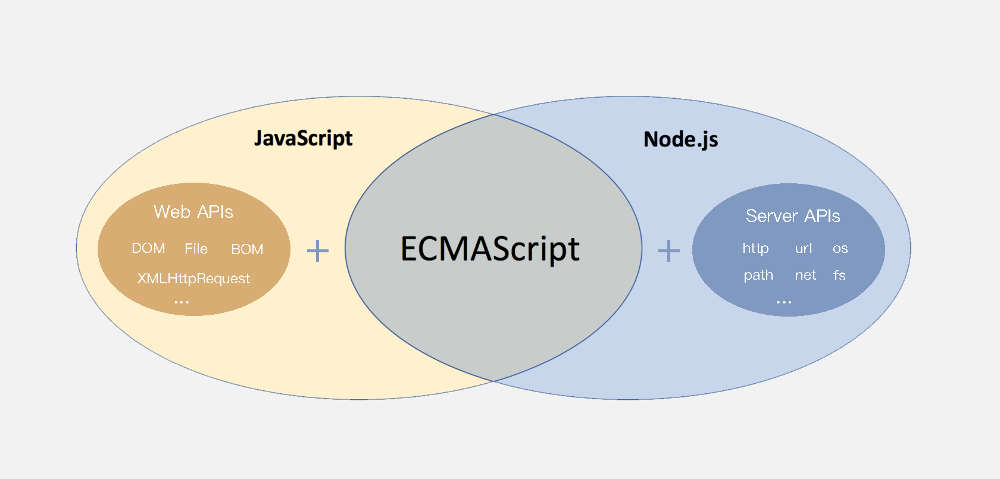

# API篇

## 1 介绍

> 知道 ECMAScript 与 JavaScript 的关系，Web APIs 是浏览器扩展的功能。

严格意义上讲，我们在 JavaScript 阶段学习的知识绝大部分属于 ECMAScript 的知识体系，ECMAScript 简称 ES 它提供了一套语言标准规范，如变量、数据类型、表达式、语句、函数等语法规则都是由 ECMAScript 规定的。浏览器将 ECMAScript 大部分的规范加以实现，并且在此基础上又扩展一些实用的功能，这些被扩展出来的内容我们称为 Web APIs。



ECMAScript 运行在浏览器中然后再结合 Web APIs 才是真正的 JavaScript，Web APIs 的核心是 DOM 和 BOM。

扩展阅读：ECMAScript 规范在不断的更新中，存在多个不同的版本，早期的版本号采用数字顺序编号如 ECMAScript3、ECMAScript5，后来由于更新速度较快便采用年份做为版本号，如 ECMAScript2017、ECMAScript2018 这种格式，ECMAScript6 是 2015 年发布的，常叫做 EMCAScript2015。

关于 JavaScript 历史的[扩展阅读](https://javascript.ruanyifeng.com/introduction/history.html)。

> 知道 DOM 相关的概念，建立对 DOM 的初步认识，学习 DOM 的基本操作，体会 DOM 的作用

DOM（Document Object Model）是将整个 HTML 文档的每一个标签元素视为一个对象，这个对象下包含了许多的属性和方法，通过操作这些属性或者调用这些方法实现对 HTML 的动态更新，为实现网页特效以及用户交互提供技术支撑。

简言之 DOM 是用来动态修改 HTML 的，其目的是开发网页特效及用户交互。

观察一个小例子：


上述的例子中当用户分分别点击【开始】或【结束】按钮后，通过右侧调试窗口可以观察到 html 标签的内容在不断的发生改变，这便是通过 DOM 实现的。

### 1.1 概念

#### 1.1.1 DOM 树

```html
<!DOCTYPE html>
<html lang="en">
<head>
    <meta charset="UTF-8">
    <meta name="viewport" content="width=device-width, initial-scale=1.0">
    <title>标题</title>
</head>
<body>
    文本
    <a href="">链接名</a>
    <div id="" class="">文本</div>
</body>
</html>
```

如下图所示，将 HTML 文档以树状结构直观的表现出来，我们称之为文档树或 DOM 树，**文档树直观的体现了标签与标签之间的关系。**


#### 1.1.2 DOM 节点

节点是文档树的组成部分，**每一个节点都是一个 DOM 对象**，主要分为元素节点、属性节点、文本节点等。

1. 【元素节点】其实就是 HTML 标签，如上图中 `head`、`div`、`body` 等都属于元素节点。
2. 【属性节点】是指 HTML 标签中的属性，如上图中 `a` 标签的 `href` 属性、`div` 标签的 `class` 属性。
3. 【文本节点】是指 HTML 标签的文字内容，如 `title` 标签中的文字。
4. 【根节点】特指 `html` 标签。
5. 其它...

#### 1.1.3 document

`document` 是 JavaScript 内置的专门用于 DOM 的对象，该对象包含了若干的属性和方法，`document` 是学习 DOM 的核心。

```javascript
// document 是内置的对象
// console.log(typeof document);

// 1. 通过 document 获取根节点
console.log(document.documentElement); // 对应 html 标签

// 2. 通过 document 节取 body 节点
console.log(document.body); // 对应 body 标签

// 3. 通过 document.write 方法向网页输出内容
document.write('Hello World!');
```

上述列举了 `document` 对象的部分属性和方法，我们先对 `document` 有一个整体的认识。

## 2 获取DOM对象

1. querySelector：满足条件的第一个元素
2. querySelectorAll：满足条件的元素集合 返回伪数组
3. 了解其他方式
    1. getElementById
    2. getElementsByTagName

```html
<!DOCTYPE html>
<html lang="en">
<head>
    <meta charset="UTF-8">
    <meta name="viewport" content="width=device-width, initial-scale=1.0">
    <title>DOM - 查找节点</title>
</head>
<body>
    <h3>查找元素类型节点</h3>
    <p>从整个 DOM 树中查找 DOM 节点是学习 DOM 的第一个步骤。</p>
    <ul>
        <li>元素</li>
        <li>元素</li>
        <li>元素</li>
        <li>元素</li>
    </ul>
    <script>
        const p = document.querySelector('p')  // 获取第一个p元素
        const lis = document.querySelectorAll('li')  // 获取第一个p元素
    </script>
</body>
</html>
```

总结：

- document.getElementById 专门获取元素类型节点，根据标签的 `id`  属性查找
- 任意 DOM 对象都包含 nodeType 属性，用来检检测节点类型

## 3 操作元素内容

通过修改 DOM 的文本内容，动态改变网页的内容。

1. `innerText` 将文本内容添加/更新到任意标签位置，**文本中包含的标签不会被解析。**

```javascript
// innerText 将文本内容添加/更新到任意标签位置
const intro = document.querySelector('.intro')
// intro.innerText = '嗨~ 我叫李雷！'
// intro.innerText = '<h4>嗨~ 我叫李雷！</h4>'
```

2. `innerHTML` 将文本内容添加/更新到任意标签位置，**文本中包含的标签会被解析。**

```javascript
// innerHTML 将文本内容添加/更新到任意标签位置
const intro = document.querySelector('.intro')
intro.innerHTML = '嗨~ 我叫韩梅梅！'
intro.innerHTML = '<h4>嗨~ 我叫韩梅梅！</h4>'
```

总结：如果文本内容中包含 `html` 标签时推荐使用 `innerHTML`，否则建议使用 `innerText` 属性。

### 3.1 常用属性修改

1. 直接能过属性名修改，最简洁的语法

```javascript
// 1. 获取 img 对应的 DOM 元素
const pic = document.querySelector('.pic')
// 2. 修改属性
pic.src = './images/lion.webp'
pic.width = 400;
pic.alt = '图片不见了...'
```

### 3.2 控制样式属性

1. 应用【修改样式】，通过修改行内样式 `style` 属性，实现对样式的动态修改。

通过元素节点获得的 `style` 属性本身的数据类型也是对象，如 `box.style.color`、`box.style.width` 分别用来获取元素节点 CSS 样式的 `color` 和 `width` 的值。

```html
<!DOCTYPE html>
<html lang="en">
<head>
    <meta charset="UTF-8">
    <meta name="viewport" content="width=device-width, initial-scale=1.0">
    <title>练习 - 修改样式</title>
</head>
<body>
    <div class="box">随便一些文本内容</div>
    <script>
        // 获取 DOM 节点
        const box = document.querySelector('.intro')
        box.style.color = 'red'
        box.style.width = '300px'
        // css 属性的 - 连接符与 JavaScript 的 减运算符
        // 冲突，所以要改成驼峰法
        box.style.backgroundColor = 'pink'
    </script>
</body>
</html>
```

任何标签都有 `style` 属性，通过 `style` 属性可以动态更改网页标签的样式，如要遇到 `css` 属性中包含字符 `-` 时，要将 `-` 去掉并将其后面的字母改成大写，如 `background-color` 要写成 `box.style.backgroundColor`

2. 操作类名(className) 操作CSS

如果修改的样式比较多，直接通过style属性修改比较繁琐，我们可以通过借助于css类名的形式。

```html
<!DOCTYPE html>
<html lang="en">
<head>
    <meta charset="UTF-8">
    <meta name="viewport" content="width=device-width, initial-scale=1.0">
    <title>练习 - 修改样式</title>
    <style>
        .pink {
            background: pink;
            color: hotpink;
        }
    </style>
</head>
<body>
    <div class="box">随便一些文本内容</div>
    <script>
        // 获取 DOM 节点
        const box = document.querySelector('.intro')
        box.className = 'pink'
    </script>
</body>
</html>
```

> 注意：
> 1. 由于class是关键字，所以使用className去代替
> 2. className是使用新值换旧值，如果需要添加一个类，需要保留之前的类名

3. 通过 classList 操作类控制CSS

为了解决className 容易覆盖以前的类名，我们可以通过classList方式追加和删除类名

```html
<!DOCTYPE html>
<html lang="en">
<head>
    <meta charset="UTF-8">
    <meta http-equiv="X-UA-Compatible" content="IE=edge">
    <meta name="viewport" content="width=device-width, initial-scale=1.0">
    <title>Document</title>
    <style>
        div {
            width: 200px;
            height: 200px;
            background-color: pink;
        }

        .active {
            width: 300px;
            height: 300px;
            background-color: hotpink;
            margin-left: 100px;
        }
    </style>
</head>
<body>
    <div class="one"></div>
    <script>
        // 1.获取元素
        // let box = document.querySelector('css选择器')
        let box = document.querySelector('div')
        // add是个方法 添加  追加
        // box.classList.add('active')
        // remove() 移除 类
        // box.classList.remove('one')
        // 切换类
        box.classList.toggle('one')
    </script>
</body>
</html>
```

### 3.3 操作表单元素属性

表单很多情况，也需要修改属性，比如点击眼睛，可以看到密码，本质是把表单类型转换为文本框

正常的有属性有取值的跟其他的标签属性没有任何区别

获取：DOM对象.属性名

设置：DOM对象.属性名 = 新值

```html
<!DOCTYPE html>
<html lang="en">
<head>
    <meta charset="UTF-8">
    <meta http-equiv="X-UA-Compatible" content="IE=edge">
    <meta name="viewport" content="width=device-width, initial-scale=1.0">
    <title>Document</title>
</head>
<body>
    <input type="text" value="请输入">
    <button disabled>按钮</button>
    <input type="checkbox" name="" id="" class="agree">
    <script>
        // 1. 获取元素
        let input = document.querySelector('input')
        // 2. 取值或者设置值  得到input里面的值可以用 value
        // console.log(input.value)
        input.value = '小米手机'
        input.type = 'password'

        // 2. 启用按钮
        let btn = document.querySelector('button')
        // disabled 不可用   =  false  这样可以让按钮启用
        btn.disabled = false
        // 3. 勾选复选框
        let checkbox = document.querySelector('.agree')
        checkbox.checked = false
    </script>
</body>
</html>
```

### 3.4 自定义属性

标准属性: 标签天生自带的属性 比如class id title等，可以直接使用点语法操作比如：disabled、checked、selected

自定义属性：

在html5中推出来了专门的data-自定义属性

在标签上一律以data-开头

在DOM对象上一律以dataset对象方式获取

```html
<!DOCTYPE html>
<html lang="en">
<head>
    <meta charset="UTF-8">
    <meta http-equiv="X-UA-Compatible" content="IE=edge">
    <meta name="viewport" content="width=device-width, initial-scale=1.0">
    <title>Document</title>
</head>
<body>
    <div data-id="1"> 自定义属性</div>
    <script>
        // 1. 获取元素
        let div = document.querySelector('div')
        // 2. 获取自定义属性值
        console.log(div.dataset.id)
    </script>
</body>
</html>
```

## 4 间歇函数

> 知道间歇函数的作用，利用间歇函数创建定时任务。

`setInterval` 是 JavaScript 中内置的函数，它的作用是间隔固定的时间自动重复执行另一个函数，也叫定时器函数。

```javascript
// 1. 定义一个普通函数
function repeat() {
    console.log('不知疲倦的执行下去....')
}

// 2. 使用 setInterval 调用 repeat 函数
// 间隔 1000 毫秒，重复调用 repeat
setInterval(repeat, 1000)
```

## 事件

事件是编程语言中的术语，它是用来描述程序的行为或状态的，**一旦行为或状态发生改变，便立即调用一个函数。**

例如：用户使用【鼠标点击】网页中的一个按钮、用户使用【鼠标拖拽】网页中的一张图片

###  事件监听

结合 DOM 使用事件时，需要为 DOM 对象添加事件监听，等待事件发生（触发）时，便立即调用一个函数。

`addEventListener` 是 DOM 对象专门用来添加事件监听的方法，它的两个参数分别为【事件类型】和【事件回调】。

```html
<!DOCTYPE html>
<html lang="en">
<head>
  <meta charset="UTF-8">
  <meta name="viewport" content="width=device-width, initial-scale=1.0">
  <title>事件监听</title>
</head>
<body>
  <h3>事件监听</h3>
  <p id="text">为 DOM 元素添加事件监听，等待事件发生，便立即执行一个函数。</p>
  <button id="btn">点击改变文字颜色</button>
  <script>
    // 1. 获取 button 对应的 DOM 对象
    const btn = document.querySelector('#btn')

    // 2. 添加事件监听
    btn.addEventListener('click', function () {
      console.log('等待事件被触发...')
      // 改变 p 标签的文字颜色
      let text = document.getElementById('text')
      text.style.color = 'red'
    })

    // 3. 只要用户点击了按钮，事件便触发了！！！
  </script>
</body>
</html>
```

完成事件监听分成3个步骤：

1. 获取 DOM 元素
2. 通过 `addEventListener` 方法为 DOM 节点添加事件监听
3. 等待事件触发，如用户点击了某个按钮时便会触发 `click` 事件类型
4. 事件触发后，相对应的回调函数会被执行

大白话描述：所谓的事件无非就是找个机会（事件触发）调用一个函数（回调函数）。

### 事件类型

`click` 译成中文是【点击】的意思，它的含义是监听（等着）用户鼠标的单击操作，除了【单击】还有【双击】`dblclick`

```html
<script>
  // 双击事件类型
  btn.addEventListener('dblclick', function () {
    console.log('等待事件被触发...');
    // 改变 p 标签的文字颜色
    const text = document.querySelector('.text')
    text.style.color = 'red'
  })

  // 只要用户双击击了按钮，事件便触发了！！！
</script>
```

结论：【事件类型】决定了事件被触发的方式，如 `click` 代表鼠标单击，`dblclick` 代表鼠标双击。

### 事件处理程序

`addEventListener` 的第2个参数是函数，这个函数会在事件被触发时立即被调用，在这个函数中可以编写任意逻辑的代码，如改变 DOM 文本颜色、文本内容等。

```html
<script>
  // 双击事件类型
  btn.addEventListener('dblclick', function () {
    console.log('等待事件被触发...')
    
    const text = document.querySelector('.text')
    // 改变 p 标签的文字颜色
    text.style.color = 'red'
    // 改变 p 标签的文本内容
    text.style.fontSize = '20px'
  })
</script>
```

结论：【事件处理程序】决定了事件触发后应该执行的逻辑。

## 6 事件类型

将众多的事件类型分类可分为：鼠标事件、键盘事件、表单事件、焦点事件等，我们逐一展开学习。

### 6.1 鼠标事件

鼠标事件是指跟鼠标操作相关的事件，如单击、双击、移动等。

1. `mouseenter 监听鼠标是否移入 DOM 元素

```html
<body>
  <h3>鼠标事件</h3>
  <p>监听与鼠标相关的操作</p>
  <hr>
  <div class="box"></div>
  <script>
    // 需要事件监听的 DOM 元素
    const box = document.querySelector('.box');

    // 监听鼠标是移入当前 DOM 元素
    box.addEventListener('mouseenter', function () {
      // 修改文本内容
      this.innerText = '鼠标移入了...';
      // 修改光标的风格
      this.style.cursor = 'move';
    })
  </script>
</body>
```

1. `mouseleave 监听鼠标是否移出 DOM 元素

```html
<body>
  <h3>鼠标事件</h3>
  <p>监听与鼠标相关的操作</p>
  <hr>
  <div class="box"></div>
  <script>
    // 需要事件监听的 DOM 元素
    const box = document.querySelector('.box');

    // 监听鼠标是移出当前 DOM 元素
    box.addEventListener('mouseleave', function () {
      // 修改文本内容
      this.innerText = '鼠标移出了...';
    })
  </script>
</body>
```

### 6.2 键盘事件

keydown   键盘按下触发
keyup   键盘抬起触发

### 6.3 焦点事件

focus  获得焦点

blur 失去焦点

### 6.4 文本框输入事件

input

## 7 事件对象

任意事件类型被触发时与事件相关的信息会被以对象的形式记录下来，我们称这个对象为事件对象。

```html
<body>
  <h3>事件对象</h3>
  <p>任意事件类型被触发时与事件相关的信息会被以对象的形式记录下来，我们称这个对象为事件对象。</p>
  <hr>
  <div class="box"></div>
  <script>
    // 获取 .box 元素
    const box = document.querySelector('.box')

    // 添加事件监听
    box.addEventListener('click', function (e) {
      console.log('任意事件类型被触发后，相关信息会以对象形式被记录下来...');

      // 事件回调函数的第1个参数即所谓的事件对象
      console.log(e)
    })
  </script>
</body>
```

事件回调函数的【第1个参数】即所谓的事件对象，通常习惯性的将这个对数命名为 `event`、`ev` 、`ev` 。

接下来简单看一下事件对象中包含了哪些有用的信息：

1. `ev.type` 当前事件的类型
2. `ev.clientX/Y` 光标相对浏览器窗口的位置
3. `ev.offsetX/Y` 光标相于当前 DOM 元素的位置

注：在事件回调函数内部通过 window.event 同样可以获取事件对象。

## 8 环境对象

> 能够分析判断函数运行在不同环境中 this 所指代的对象。

环境对象指的是函数内部特殊的变量 `this` ，它代表着当前函数运行时所处的环境。

```html
<script>
  // 声明函数
  function sayHi() {
    // this 是一个变量
    console.log(this);
  }

  // 声明一个对象
  let user = {
    name: '张三',
    sayHi: sayHi // 此处把 sayHi 函数，赋值给 sayHi 属性
  }
  
  let person = {
    name: '李四',
    sayHi: sayHi
  }

  // 直接调用
  sayHi() // window
  window.sayHi() // window

  // 做为对象方法调用
  user.sayHi()// user
	person.sayHi()// person
</script>
```

结论：

1. `this` 本质上是一个变量，数据类型为对象
2. 函数的调用方式不同 `this` 变量的值也不同
3. 【谁调用 `this` 就是谁】是判断 `this` 值的粗略规则
4. 函数直接调用时实际上 `window.sayHi()` 所以 `this` 的值为 `window`
## 9 回调函数

如果将函数 A 做为参数传递给函数 B 时，我们称函数 A 为回调函数。

```html
<script>
  // 声明 foo 函数
  function foo(arg) {
    console.log(arg);
  }

  // 普通的值做为参数
  foo(10);
  foo('hello world!');
  foo(['html', 'css', 'javascript']);

  function bar() {
    console.log('函数也能当参数...');
  }
  // 函数也可以做为参数！！！！
  foo(bar);
</script>
```

函数 `bar` 做参数传给了 `foo` 函数，`bar` 就是所谓的回调函数了！！！

我们回顾一下间歇函数 `setInterval`

```html
<script>
	function fn() {
    console.log('我是回调函数...');
  }
  // 调用定时器
  setInterval(fn, 1000);
</script>
```

`fn` 函数做为参数传给了 `setInterval` ，这便是回调函数的实际应用了，结合刚刚学习的函数表达式上述代码还有另一种更常见写法。

```html
<script>
  // 调用定时器，匿名函数做为参数
  setInterval(function () {
    console.log('我是回调函数...');
  }, 1000);
</script>
```

结论：

1. 回调函数本质还是函数，只不过把它当成参数使用
2. 使用匿名函数做为回调函数比较常见


