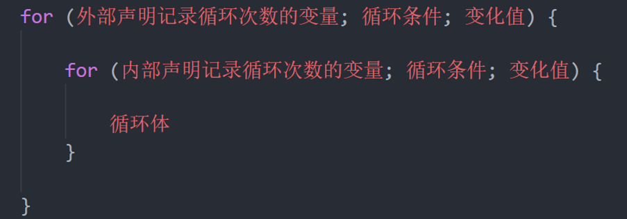
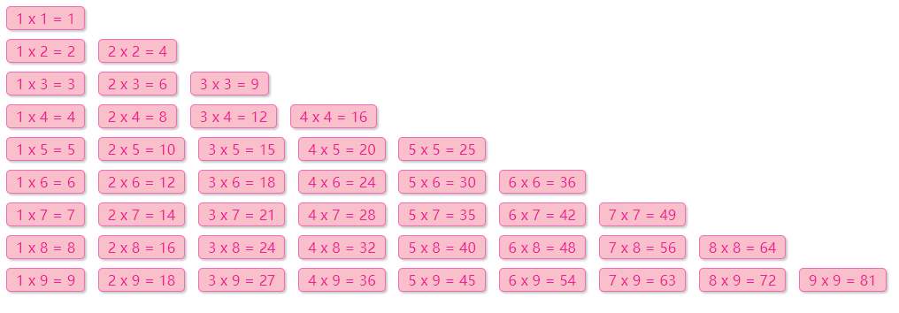

# 基础篇

## 1 介绍

> 掌握 JavaScript 的引入方式，初步认识 JavaScript 的作用

### 1.1 引入方式

JavaScript 程序不能独立运行，它需要被嵌入 HTML 中，然后浏览器才能执行 JavaScript 代码。通过`script`标签将 JavaScript 代码引入到 HTML 中，有两种方式：

#### 1.1.1 内部方式

通过 `script` 标签包裹 JavaScript 代码

```html
<!DOCTYPE html>
<html lang="en">
<head>
    <meta charset="UTF-8">
    <title>JavaScript 基础 - 引入方式</title>
</head>
<body>
    <!-- 内联形式：通过 script 标签包裹 JavaScript 代码 -->
    <script>
        alert('嗨，欢迎来传智播学习前端技术！')
    </script>
</body>
</html>
```

#### 1.1.2 外部形式

一般将 JavaScript 代码写在独立的以 .js 结尾的文件中，然后通过 `script` 标签的 `src` 属性引入

```javascript
// demo.js
document.write('嗨，欢迎来传智播学习前端技术！')
```

```html
<!DOCTYPE html>
<html lang="en">
<head>
    <meta charset="UTF-8">
    <title>JavaScript 基础 - 引入方式</title>
</head>
<body>
    <!-- 外部形式：通过 script 的 src 属性引入独立的 .js 文件 -->
    <script src="demo.js"></script>
</body>
</html>
```

如果 script 标签使用 src 属性引入了某 .js 文件，那么标签的代码会被忽略！！！如下代码所示：

```html
<!DOCTYPE html>
<html lang="en">
<head>
    <meta charset="UTF-8">
    <title>JavaScript 基础 - 引入方式</title>
</head>
<body>
    <!-- 外部形式：通过 script 的 src 属性引入独立的 .js 文件 -->
    <script src="demo.js">
        // 此处的代码会被忽略掉！！！！
        alert(666);
    </script>
</body>
</html>
```

### 1.2 注释和结束符

通过注释可以屏蔽代码被执行或者添加备注信息，JavaScript 支持两种形式注释语法：

#### 1.2.1 单行注释

使用 `// ` 注释单行代码

```javascript
// 这种是单行注释的语法
// 一次只能注释一行
// 可以重复注释
document.write('嗨，欢迎来传智播学习前端技术！');
```

#### 1.2.2 多行注释

使用 `/* */` 注释多行代码

```javascript
/* 这种的是多行注释的语法 */
/*
    更常见的多行注释是这种写法
    在些可以任意换行
    多少行都可以
  */
document.write('嗨，欢迎来传智播学习前端技术！')
```

**注：编辑器中单行注释的快捷键为 `ctrl + /`**

### 1.3 结束符

在 JavaScript 中`;`代表一段代码的结束，多数情况下可以省略`;`使用回车（enter）替代。

```javascript
alert(1);
alert(2);
alert(1)
alert(2)
```

实际开发中有许多人主张书写 JavaScript 代码时省略结束符`;`

### 1.4 输入和输出

输出和输入也可理解为人和计算机的交互，用户通过键盘、鼠标等向计算机输入信息，计算机处理后再展示结果给用户，这便是一次输入和输出的过程。

举例说明：如按键盘上的方向键，向上/下键可以滚动页面，按向上/下键这个动作叫作输入，页面发生了滚动了这便叫输出。

#### 1.4.1 输出

JavaScript 可以接收用户的输入，然后再将输入的结果输出：

`alert()`、`document.wirte()`

以数字为例，向 `alert()` 或 `document.write()`输入任意数字，他都会以弹窗形式展示（输出）给用户。

```javascript
document.write('要输出的内容')
alert('要输出的内容');
```

#### 1.4.2 输入

向 `prompt()` 输入任意内容会以弹窗形式出现在浏览器中，一般提示用户输入一些内容。

```javascript
// 以弹窗形式提示用户输入姓名，注意这里的文字使用英文的引号
prompt('请输入您的姓名:')
```

## 2 变量

> 理解变量是计算机存储数据的“容器”，掌握变量的声明方式

变量是计算机中用来存储数据的“容器”，它可以让计算机变得有记忆，通俗的理解变量就是使用【某个符号】来代表【某个具体的数值】（数据）

```javascript
// x 符号代表了 5 这个数值
x = 5
// y 符号代表了 6 这个数值
y = 6

//举例： 在 JavaScript 中使用变量可以将某个数据（数值）记录下来！

// 将用户输入的内容保存在 num 这个变量（容器）中
num = prompt('请输入一数字!')

// 通过 num 变量（容器）将用户输入的内容输出出来
alert(num)
document.write(num)
```

### 2.1 声明

声明(定义)变量有两部分构成：声明关键字、变量名（标识）

```javascript
// let 变量名
// 声明(定义)变量有两部分构成：声明关键字、变量名（标识）
// let 即关键字，所谓关键字是系统提供的专门用来声明（定义）变量的词语
// age 即变量的名称，也叫标识符
let age
```

关键字是 JavaScript 中内置的一些英文词汇（单词或缩写），它们代表某些特定的含义，如`let`的含义是声明变量的，看到`let`后就可想到这行代码的意思是在声明变量，如`let age;`

`let`和`var`都是 JavaScript 中的声明变量的关键字，推荐使用`let`声明变量！！！

### 2.2 赋值

声明（定义）变量相当于创造了一个空的“容器”，通过赋值向这个容器中添加数据。

```javascript
// 声明(定义)变量有两部分构成：声明关键字、变量名（标识）
// let 即关键字，所谓关键字是系统提供的专门用来声明（定义）变量的词语
// age 即变量的名称，也叫标识符
let age
// 赋值，将 18 这个数据存入了 age 这个“容器”中
age = 18
// 这样 age 的值就成了 18
document.write(age)

// 也可以声明和赋值同时进行
let str = 'hello world!'
alert(str);
```

### 2.3 关键字

JavaScript 使用专门的关键字 `let` 和 `var` 来声明（定义）变量，在使用时需要注意一些细节：

以下是使用 `let` 时的注意事项：

1. 允许声明和赋值同时进行
2. 不允许重复声明
3. 允许同时声明多个变量并赋值
4. JavaScript 中内置的一些关键字不能被当做变量名

以下是使用 `var` 时的注意事项：

1. 允许声明和赋值同时进行
2. 允许重复声明
3. 允许同时声明多个变量并赋值

大部分情况使用 `let` 和 `var` 区别不大，但是 `let` 相较 `var` 更严谨，因此推荐使用 `let`，后期会更进一步介绍二者间的区别。

### 2.4 变量名命名规则

关于变量的名称（标识符）有一系列的规则需要遵守：

1. 只能是字母、数字、下划线、$，且不能以数字开头
2. 字母区分大小写，如 Age 和 age 是不同的变量
3. JavaScript 内部已占用于单词（关键字或保留字）不允许使用
4. 尽量保证变量具有一定的语义，见字知义

注：所谓关键字是指 JavaScript 内部使用的词语，如 `let` 和`var`，保留字是指 JavaScript 内部目前没有使用的词语，但是将来可能会使用词语。

```javascript
let age = 18 // 正确
let age1 = 18 // 正确
let _age = 18 // 正确

// let 1age = 18; // 错误，不可以数字开头
let $age = 18 // 正确
let Age = 24 // 正确，它与小写的 age 是不同的变量
// let let = 18; // 错误，let 是关键字
let int = 123 // 不推荐，int 是保留字
```

## 3 常量

概念：使用 const 声明的变量称为“常量”。

使用场景：当某个变量永远不会改变的时候，就可以使用 const 来声明，而不是let。

命名规范：和变量一致

```javascript
const PI = 3.14
```

> 注意：常量不允许重新赋值，声明的时候必须赋值（初始化）

## 4 数据类型

> 计算机世界中的万事成物都是数据。

计算机程序可以处理大量的数据，为了方便数据的管理，将数据分成了不同的类型：

注：可以通过 typeof 关键字检测数据类型

```javascript
// 检测 1 是什么类型数据，结果为 number
document.write(typeof 1)
```

### 4.1 数值类型

即我们数学中学习到的数字，可以是整数、小数、正数、负数

```javascript
let score = 100 // 正整数
let price = 12.345 // 小数
let temperature = -40 // 负数

document.write(typeof score) // 结果为 number
document.write(typeof price) // 结果为 number
document.write(typeof temperature) // 结果为 number
```

JavaScript 中的数值类型与数学中的数字是一样的，分为正数、负数、小数等。

### 4.2 字符串类型

通过单引号（`''`）、双引号（`""`）或反引号包裹的数据都叫字符串，单引号和双引号没有本质上的区别，推荐使用单引号。

注意事项：

1. 无论单引号或是双引号必须成对使用
2. 单引号/双引号可以互相嵌套，但是不以自已嵌套自已
3. 必要时可以使用转义符：\，输出单引号或双引号

```javascript
let user_name = '小明' // 使用单引号
let gender = "男" // 使用双引号
let str = '123' // 看上去是数字，但是用引号包裹了就成了字符串了
let str1 = '' // 这种情况叫空字符串

documeent.write(typeof user_name) // 结果为 string
documeent.write(typeof gender) // 结果为 string
documeent.write(typeof str) // 结果为 string
```

### 4.3 布尔类型

表示肯定或否定时在计算机中对应的是布尔类型数据，它有两个固定的值`true` 和`false`，表示肯定的数据用`true`，表示否定的数据用`false`。

```javascript
//  pink老师帅不帅？回答 是 或 否
let isCool = true // 是的，摔死了！
isCool = false // 不，套马杆的汉子！

document.write(typeof isCool) // 结果为 boolean
```

### 4.4 undefined

未定义是比较特殊的类型，只有一个值 undefined，只声明变量，不赋值的情况下，变量的默认值为 undefined，一般很少【直接】为某个变量赋值为 undefined。

```javascript
// 只声明了变量，并末赋值
let tmp;
document.write(typeof tmp) // 结果为 undefined
```

**注：JavaScript 中变量的值决定了变量的数据类型。**

## 5 类型转换

> 理解弱类型语言的特征，掌握显式类型转换的方法

在 JavaScript 中数据被分成了不同的类型，如数值、字符串、布尔值、undefined，在实际编程的过程中，不同数据类型之间存在着转换的关系。

### 5.1 隐式转换

某些运算符被执行时，系统内部自动将数据类型进行转换，这种转换称为隐式转换。

```javascript
let num = 13 // 数值
let num2 = '2' // 字符串

// 结果为 132
// 原因是将数值 num 转换成了字符串，相当于 '13'
// 然后 + 将两个字符串拼接到了一起
console.log(num + num2)

// 结果为 11
// 原因是将字符串 num2 转换成了数值，相当于 2
// 然后数值 13 减去 数值 2
console.log(num - num2)

let a = prompt('请输入一个数字')
let b = prompt('请再输入一个数字')

alert(a + b);
```

注：数据类型的隐式转换是 JavaScript 的特征，后续学习中还会遇到，目前先需要理解什么是隐式转换。

### 5.2 显式转换

编写程序时过度依靠系统内部的隐式转换是不严禁的，因为隐式转换规律并不清晰，大多是靠经验总结的规律。为了避免因隐式转换带来的问题，通常根逻辑需要对数据进行显示转换。

#### 5.2.1 Number

通过 `Number` 显示转换成数值类型，当转换失败时结果为 `NaN`（Not a Number）即不是一个数字。

```javascript
let t = '12'
let f = 8

// 显式将字符串 12 转换成数值 12
t = Number(t)

// 检测转换后的类型
// console.log(typeof t);
console.log(t + f) // 结果为 20

// 并不是所有的值都可以被转成数值类型
let str = 'hello'
// 将 hello 转成数值是不现实的，当无法转换成
// 数值时，得到的结果为 NaN （Not a Number）
console.log(Number(str))
```

## 6 运算符

### 6.1 算术运算符

数字是用来计算的，比如：乘法`*`、除法`/`、加法`+`、减法`-`等等，所以经常和算术运算符一起。

算术运算符：也叫数学运算符，主要包括加、减、乘、除、取余（求模）等。

| 运算符 | 作用                         |
|-----|----------------------------|
| +   | 求和                         |
| -   | 求差                         |
| *   | 求积                         |
| /   | 求商                         |
| %   | 取模（取余数），开发中经常用于作为某个数字是否被整除 |

> 注意：在计算失败时，显示的结果是 NaN （not a number）

```javascript
// 算术运算符
console.log(1 + 2 * 3 / 2) //  4 
let num = 10
console.log(num + 10)  // 20
console.log(num + num)  // 20

// 1. 取模(取余数)  使用场景：  用来判断某个数是否能够被整除
console.log(4 % 2) //  0  
console.log(6 % 3) //  0
console.log(5 % 3) //  2
console.log(3 % 5) //  3

// 2. 注意事项 : 如果我们计算失败，则返回的结果是 NaN (not a number)
console.log('pink老师' - 2)
console.log('pink老师' * 2)
console.log('pink老师' + 2)   // pink老师2
```

### 6.2 赋值运算符

赋值运算符：对变量进行赋值的运算符

=：将等号右边的值赋予给左边，要求左边必须是一个容器

| 运算符 | 作用   |
|-----|------|
| +=  | 加法赋值 |
| -+  | 减法赋值 |
| *=  | 乘法赋值 |
| /=  | 除法赋值 |
| %=  | 取余赋值 |

```javascript
let num = 1
// num = num + 1
// 采取赋值运算符
// num += 1
num += 3
console.log(num)
```

### 6.3 自增/自减运算符

| 符号 | 作用 | 说明               |
|----|----|------------------|
| ++ | 自增 | 变量自身的值加1，例如: x++ |
| -- | 自减 | 变量自身的值减1，例如: x-- |

1. ++在前和++在后在单独使用时二者并没有差别，而且一般开发中我们都是独立使用
2. ++在后（后缀式）我们会使用更多

注意：
1. 只有变量能够使用自增和自减运算符
2. ++、--可以在变量前面也可以在变量后面，比如: `x++`或者`++x`

```javascript
// let num = 10
// num = num + 1
// num += 1
// // 1. 前置自增
// let i = 1
// ++i
// console.log(i)

// let i = 1
// console.log(++i + 1)
// 2. 后置自增
// let i = 1
// i++
// console.log(i)
// let i = 1
// console.log(i++ + 1)

// 了解 
let i = 1
console.log(i++ + ++i + i)
```

### 6.4 比较运算符

使用场景：比较两个数据大小、是否相等，根据比较结果返回一个布尔值（true / false）

| 运算符 | 作用                    |
|-----|-----------------------|
| \>  | 左边是否大于右边              |
| <   | 左边是否小于右边              |
| \>= | 左边是否大于或等于右边           |
| <=  | 左边是否小于或等于右边           |
| === | 左右两边是否`类型`和`值`都相等（重点） |
| ==  | 左右两边`值`是否相等           |
| !=  | 左右值不相等                |
| !== | 左右两边是否不全等             |

```javascript
console.log(3 > 5)
console.log(3 >= 3)
console.log(2 == 2)
// 比较运算符有隐式转换 把'2' 转换为 2  双等号 只判断值
console.log(2 == '2')  // true
// console.log(undefined === null)
// === 全等 判断 值 和 数据类型都一样才行
// 以后判断是否相等 请用 ===  
console.log(2 === '2')
console.log(NaN === NaN) // NaN 不等于任何人，包括他自己
console.log(2 !== '2')  // true  
console.log(2 != '2') // false 
console.log('-------------------------')
console.log('a' < 'b') // true
console.log('aa' < 'ab') // true
console.log('aa' < 'aac') // true
console.log('-------------------------')
```

### 6.5 逻辑运算符

使用场景：可以把多个布尔值放到一起运算，最终返回一个布尔值

| 符号   | 名称  | 日常读法 | 特点                     | 口诀      |
|------|-----|------|------------------------|---------|
| &&   | 逻辑与 | 并且   | 符号两边有一个假的结果为假          | 一假则假    |
| \|\| | 逻辑或 | 或者   | 符号两边有一个真的结果为真          | 一真则真    |
| !    | 逻辑非 | 取反   | true变false  false变true | 真变假，假变真 |

| A     | B     | A && B | A \|\| B | !A    |
|-------|-------|--------|----------|-------|
| false | false | false  | false    | true  |
| false | true  | false  | true     | true  |
| true  | false | false  | true     | false |
| true  | true  | true   | true     | false |

```javascript
// 逻辑与 一假则假
console.log(true && true)
console.log(false && true)
console.log(3 < 5 && 3 > 2)
console.log(3 < 5 && 3 < 2)
console.log('-----------------')
// 逻辑或 一真则真
console.log(true || true)
console.log(false || true)
console.log(false || false)
console.log('-----------------')
// 逻辑非  取反
console.log(!true)
console.log(!false)

console.log('-----------------')

let num = 6
console.log(num > 5 && num < 10)
console.log('-----------------')
```

### 6.6 运算符优先级

| 优先级 | 运算符   | 顺序                    |
|-----|-------|-----------------------|
| 1   | 小括号   | ()                    |
| 2   | 一元运算符 | ++、--、!               |
| 3   | 算数运算符 | 先`*`、`/`、`%`、后`+`、`-` |
| 4   | 关系运算符 | \>、\>=、<、<=           |
| 5   | 相等运算符 | ==、!=、===、!==         |
| 6   | 逻辑运算符 | 先`&&`后`\|\|`          |
| 7   | 赋值运算符 | =                     |
| 8   | 逗号运算符 | ,                     |

注意：
1. 一元运算符里面的逻辑非优先级很高
2. 逻辑与比逻辑或优先级高

## 7 语句

### 7.1 表达式和语句


### 7.2 分支语句

分支语句可以根据条件判定真假，来选择性的执行想要的代码

分支语句包含：

1. if分支语句（重点）
2. 三元运算符
3. switch语句

#### 7.2.1 if 分支语句

语法：

```javascript
if (条件表达式) {
    // 满足条件要执行的语句
}
```

小括号内的条件结果是布尔值，为 true 时，进入大括号里执行代码；为false，则不执行大括号里面代码

小括号内的结果若不是布尔类型时，会发生类型转换为布尔值，类似Boolean()

如果大括号只有一个语句，大括号可以省略，但是，不提倡这么做

```javascript
// 单分支语句
// if (false) {
//   console.log('执行语句')
// }
// if (3 > 5) {
//   console.log('执行语句')
// }
// if (2 === '2') {
//   console.log('执行语句')
// }
//  1. 除了0 所有的数字都为真
//   if (0) {
//     console.log('执行语句')
//   }
// 2.除了 '' 所有的字符串都为真 true
// if ('pink老师') {
//   console.log('执行语句')
// }
// if ('') {
//   console.log('执行语句')
// }
// // if ('') console.log('执行语句')

// 1. 用户输入
let score = +prompt('请输入成绩')
// 2. 进行判断输出
if (score >= 700) {
    alert('恭喜考入黑马程序员')
}
console.log('-----------------')
```

#### 7.2.2 if双分支语句

如果有两个条件的时候，可以使用 if else 双分支语句

```javascript
if (条件表达式) {
    // 满足条件要执行的语句
} else {
    // 不满足条件要执行的语句
}
```

例如：

```javascript
// 1. 用户输入
let uname = prompt('请输入用户名:')
let pwd = prompt('请输入密码:')
// 2. 判断输出
if (uname === 'pink' && pwd === '123456') {
    alert('恭喜登录成功')
} else {
    alert('用户名或者密码错误')
}
```

#### 7.2.3 if 多分支语句

使用场景：适合于有多个条件的时候

```javascript
// 1. 用户输入
let score = +prompt('请输入成绩：')
// 2. 判断输出
if (score >= 90) {
    alert('成绩优秀，宝贝，你是我的骄傲')
} else if (score >= 70) {
    alert('成绩良好，宝贝，你要加油哦~~')
} else if (score >= 60) {
    alert('成绩及格，宝贝，你很危险~')
} else {
    alert('成绩不及格，宝贝，我不想和你说话，我只想用鞭子和你说话~')
}
```

#### 7.2.4 三元运算符（三元表达式）

**使用场景**：一些简单的双分支，可以使用三元运算符（三元表达式），写起来比 if  else 双分支更简单

**符号**：? 与 : 配合使用

语法：

```javascript
条件 ? 表达式1 : 表达式2
```

例如：

```javascript
// 三元运算符（三元表达式）
// 1. 语法格式
// 条件 ? 表达式1 : 表达式2 

// 2. 执行过程 
// 2.1 如果条件为真，则执行表达式1
// 2.2 如果条件为假，则执行表达式2

// 3. 验证
// 5 > 3 ? '真的' : '假的'
console.log(5 < 3 ? '真的' : '假的')

// let age = 18 
// age = age + 1
//  age++

// 1. 用户输入 
let num = prompt('请您输入一个数字:')
// 2. 判断输出- 小于10才补0
// num = num < 10 ? 0 + num : num
num = num >= 10 ? num : 0 + num
alert(num)
```

#### 7.2.5 switch语句

使用场景：适合于有多个条件的时候，也属于分支语句，大部分情况下和 if 多分支语句功能相同

注意：

1. switch case语句一般用于等值判断，if适合于区间判断
2. switch case一般需要配合break关键字使用 没有break会造成case穿透
3. if 多分支语句开发要比switch更重要，使用也更多

例如：

```javascript
// switch分支语句
// 1. 语法
// switch (表达式) {
//   case 值1:
//     代码1
//     break

//   case 值2:
//     代码2
//     break
//   ...
//   default:
//     代码n
// }
switch (2) {
    case 1:
        console.log('您选择的是1')
        break  // 退出switch
    case 2:
        console.log('您选择的是2')
        break  // 退出switch
    case 3:
        console.log('您选择的是3')
        break  // 退出switch
    default:
        console.log('没有符合条件的')
}
```

#### 7.2.6 断点调试

**作用**：学习时可以帮助更好的理解代码运行，工作时可以更快找到bug

浏览器打开调试界面

1. 按F12打开开发者工具
2. 点到源代码一栏（sources）
3. 选择代码文件

**断点**：在某句代码上加的标记就叫断点，当程序执行到这句有标记的代码时会暂停下来

### 7.3 循环语句

使用场景：重复执行 指定的一段代码，比如我们想要输出10次`'我学的很棒'`

学习路径：

1. while 循环

2. for 循环（重点）

#### 7.3.1 while循环

while：在满足条件期间，重复执行某些代码。

**语法**：

```javascript
while (条件表达式) {
    // 循环体    
}
```

例如：

```javascript
// while循环: 重复执行代码

// 1. 需求: 利用循环重复打印3次 '月薪过万不是梦，毕业时候见英雄'
let i = 1
while (i <= 3) {
    document.write('月薪过万不是梦，毕业时候见英雄~<br>')
    i++   // 这里千万不要忘了变量自增否则造成死循环
}
```

循环三要素：

1. 初始值（经常用变量）

2. 终止条件

3. 变量的变化量

例如：

```javascript
// // 1. 变量的起始值
// let i = 1
// // 2. 终止条件
// while (i <= 3) {
//   document.write('我要循环三次 <br>')
//   // 3. 变量的变化量
//   i++
// }
// 1. 变量的起始值
let end = +prompt('请输入次数:')
let i = 1
// 2. 终止条件
while (i <= end) {
    document.write('我要循环三次 <br>')
    // 3. 变量的变化量
    i++
}
```

#### 7.3.2 中止循环

`break`：中止整个循环，一般用于结果已经得到，后续的循环不需要的时候可以使用（提高效率）

`continue`：中止本次循环，一般用于排除或者跳过某一个选项的时候

```javascript
// let i = 1
// while (i <= 5) {
//   console.log(i)
//   if (i === 3) {
//     break  // 退出循环
//   }
//   i++

// }


let i = 1
while (i <= 5) {
    if (i === 3) {
        i++
        continue
    }
    console.log(i)
    i++
}
```

#### 7.3.3 无限循环

1. while (true) 来构造“无限”循环，需要使用break退出循环。（常用）

2. for (;;) 也可以来构造“无限”循环，同样需要使用break退出循环。

```javascript
// 无限循环  
// 需求： 页面会一直弹窗询问你爱我吗？
// (1). 如果用户输入的是 '爱'，则退出弹窗
// (2). 否则一直弹窗询问

// 1. while(true) 无限循环
// while (true) {
//   let love = prompt('你爱我吗?')
//   if (love === '爱') {
//     break
//   }
// }

// 2. for(;;) 无限循环
for (; ;) {
    let love = prompt('你爱我吗?')
    if (love === '爱') {
        break
    }
}
```

## 8 综合案例-ATM存取款机


分析：

①：提示输入框写到循环里面（无限循环）

②：用户输入4则退出循环 break

③：提前准备一个金额预先存储一个数额 money

④：根据输入不同的值，做不同的操作

⑤：取钱则是减法操作， 存钱则是加法操作，查看余额则是直接显示金额

⑥：可以使用 if else if 多分支来执行不同的操作

完整代码：

```javascript
// 1. 开始循环 输入框写到 循环里面
// 3. 准备一个总的金额
let money = 100
while (true) {
    let re = +prompt(`
    请您选择操作：
    1.存钱
    2.取钱
    3.查看余额
    4.退出
    `)
    // 2. 如果用户输入的 4 则退出循环， break  写到if 里面，没有写到switch里面， 因为4需要break退出循环
    if (re === 4) {
        break
    }
    // 4. 根据输入执行操作
    switch (re) {
        case 1:
            // 存钱
            let cun = +prompt('请输入存款金额')
            money = money + cun
            break
        case 2:
            // 存钱
            let qu = +prompt('请输入取款金额')
            money = money - qu
            break
        case 3:
            // 存钱
            alert(`您的银行卡余额是${money}`)
            break
    }
}
```

if 多分支语句和 switch 的区别：

1. 共同点
   - 都能实现多分支选择
   - 大部分情况下可以互换
2. 区别：
   - switch ... case语句通常处理case为比较**确定值**的情况，而if ... else ... 语句更加灵活，通常用于**范围判断**（大于，等于某个范围）
   - switch语句进行判断后直接执行到程序的语句，效率更高，而if ... else语句有几种判断条件，就得判断多少次
   - switch一定要注意 必须是 ===  全等，一定注意 数据类型，同时注意break否则会有穿透效果
   - 结论：
     - 当分支比较少时，if ... else语句执行效率高
     - 当分支比较多时，switch语句执行效率高，而且结构更清晰

## 9 for 语句

> 掌握 for 循环语句，让程序具备重复执行能力

`for`是 JavaScript 提供的另一种循环控制的话句，它和 `while` 只是语法上存在差异。

### 9.1 for 语句的基本使用

1. 实现循环的 3 要素

```javascript
// 1. 语法格式
// for(起始值; 终止条件; 变化量) {
//   // 要重复执行的代码
// }

// 2. 示例：在网页中输入标题标签
// 起始值为 1
// 变化量 i++
// 终止条件 i <= 6
for (let i = 1; i <= 6; i++) {
    document.write(`<h${i}>循环控制，即重复执行<h${i}>`)
}
```

2. 变化量和死循环，`for` 循环和 `while` 一样，如果不合理设置增量和终止条件，便会产生死循环。

3. 跳出和终止循环

```javascript
// 1. continue 
for (let i = 1; i <= 5; i++) {
    if (i === 3) {
        continue  // 结束本次循环，继续下一次循环
    }
    console.log(i)
}

// 2. break
for (let i = 1; i <= 5; i++) {
    if (i === 3) {
        break  // 退出结束整个循环
    }
    console.log(i)
}
```

结论：

- `JavaScript` 提供了多种语句来实现循环控制，但无论使用哪种语句都离不开循环的3个特征，即起始值、变化量、终止条件，做为初学者应着重体会这3个特征，不必过多纠结三种语句的区别。
- 起始值、变化量、终止条件，由开发者根据逻辑需要进行设计，规避死循环的发生。
- 当如果明确了循环的次数的时候推荐使用`for`循环，当不明确循环的次数的时候推荐使用`while`循环

> 注意：`for`的语法结构更简洁，故`for`循环的使用频次会更多。

### 9.2 循环嵌套

利用循环的知识来对比一个简单的天文知识，我们知道地球在自转的同时也在围绕太阳公转，如果把自转和公转都看成是循环的话，就相当于是循环中又嵌套了另一个循环。


实际上 JavaScript 中任何一种循环语句都支持循环的嵌套，如下代码所示：



```javascript
// 1. 外面的循环 记录第n天 
for (let i = 1; i < 4; i++) {
    document.write(`第${i}天 <br>`)
    // 2. 里层的循环记录 几个单词
    for (let j = 1; j < 6; j++) {
        document.write(`记住第${j}个单词<br>`)
    }
}
```

记住，外层循环循环一次，里层循环循环全部

#### 9.2.1 倒三角

```javascript
 // 外层打印几行
for (let i = 1; i <= 5; i++) {
    // 里层打印几个星星
    for (let j = 1; j <= i; j++) {
        document.write('★')
    }
    document.write('<br>')
}
```


#### 9.2.2 九九乘法表

样式css

```css
span {
    display: inline-block;
    width: 100px;
    padding: 5px 10px;
    border: 1px solid pink;
    margin: 2px;
    border-radius: 5px;
    box-shadow: 2px 2px 2px rgba(255, 192, 203, .4);
    background-color: rgba(255, 192, 203, .1);
    text-align: center;
    color: hotpink;
}
```

javascript

```javascript
 // 外层打印几行
for (let i = 1; i <= 9; i++) {
    // 里层打印几个星星
    for (let j = 1; j <= i; j++) {
        // 只需要吧 ★ 换成  1 x 1 = 1   
        document.write(`
		<div> ${j} x ${i} = ${j * i} </div>
     `)
    }
    document.write('<br>')
}
```



## 10 数组

> 知道什么是数组及其应用的场景，掌握数组声明及访问的语法。

### 10.1 数组是什么？

**数组**：(Array)是一种可以按顺序保存数据的数据类型

**使用场景**：如果有多个数据可以用数组保存起来，然后放到一个变量中，管理非常方便

### 10.2 数组的基本使用

#### 10.2.1 定义数组和数组单元

```javascript
// 1. 语法，使用 [] 来定义一个空数组
// 定义一个空数组，然后赋值给变量 classes
// let classes = [];

// 2. 定义非空数组
let classes = ['小明', '小刚', '小红', '小丽', '小米']
```

通过`[]`定义数组，数据中可以存放真正的数据，如小明、小刚、小红等这些都是数组中的数据，我们这些数据称为数组单元，数组单元之间使用英文逗号分隔。

#### 10.2.2 访问数组和数组索引

使用数组存放数据并不是最终目的，关键是能够随时的访问到数组中的数据（单元）。其实 JavaScript 为数组中的每一个数据单元都编了号，通过数据单元在数组中的编号便可以轻松访问到数组中的数据单元了。

我们将数据单元在数组中的编号称为索引值，也有人称其为下标。

索引值实际是按着数据单元在数组中的位置依次排列的，注意是从`0`开始的，如下图所示：


观察上图可以数据单元【小明】对应的索引值为【0】，数据单元【小红】对应的索引值为【2】

```javascript
let classes = ['小明', '小刚', '小红', '小丽', '小米']

// 1. 访问数组，语法格式为：变量名[索引值]
document.write(classes[0]) // 结果为：小明
document.write(classes[1]) // 结果为：小刚
document.write(classes[4]) // 结果为：小米

// 2. 通过索引值还可以为数组单重新赋值
document.write(classes[3]) // 结果为：小丽
// 重新为索引值为 3 的单元赋值
classes[3] = '小小丽'
document.wirte(classes[3]); // 结果为： 小小丽
```

#### 10.2.3 数据单元值类型

数组做为数据的集合，它的单元值可以是任意数据类型

```javascript
// 6. 数组单值类型可以是任意数据类型

// a) 数组单元值的类型为字符类型
let list = ['HTML', 'CSS', 'JavaScript']
// b) 数组单元值的类型为数值类型
let scores = [78, 84, 70, 62, 75]
// c) 混合多种类型
let mixin = [true, 1, false, 'hello']
```

#### 10.2.4 数组长度属性

重申一次，数组在 JavaScript 中并不是新的数据类型，它属于对象类型。

```javascript
// 定义一个数组
let arr = ['html', 'css', 'javascript']
// 数组对应着一个 length 属性，它的含义是获取数组的长度
console.log(arr.length) // 3
```

### 10.3 操作数组

数组做为对象数据类型，不但有 `length` 属性可以使用，还提供了许多方法：

1. push 动态向数组的尾部添加一个单元
2. unshift 动态向数组头部添加一个单元
3. pop 删除最后一个单元
4. shift 删除第一个单元
5. splice 动态删除任意单元

使用以上4个方法时，都是直接在原数组上进行操作，即成功调任何一个方法，原数组都跟着发生相应的改变。并且在添加或删除单元时 `length` 并不会发生错乱。

```html
<script>
  // 定义一个数组
  let arr = ['html', 'css', 'javascript']

  // 1. push 动态向数组的尾部添加一个单元
  arr.push('Nodejs')
  console.log(arr)
  arr.push('Vue')

  // 2. unshit 动态向数组头部添加一个单元
  arr.unshift('VS Code')
  console.log(arr)

  // 3. splice 动态删除任意单元
  arr.splice(2, 1) // 从索引值为2的位置开始删除1个单元
  console.log(arr)

  // 4. pop 删除最后一个单元
  arr.pop()
  console.log(arr)

  // 5. shift 删除第一个单元
  arr.shift()
  console.log(arr)
</script>
```
