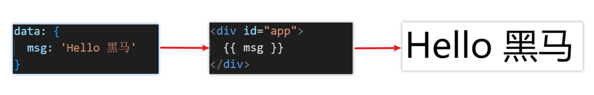
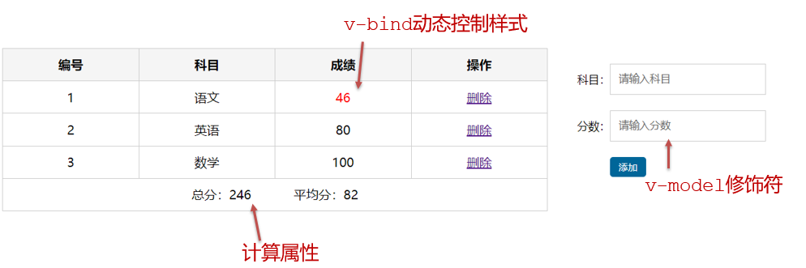
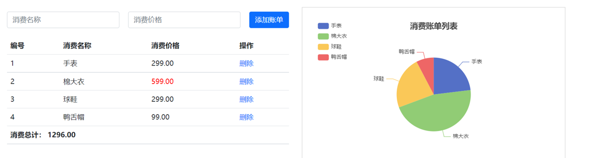
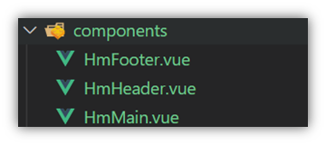
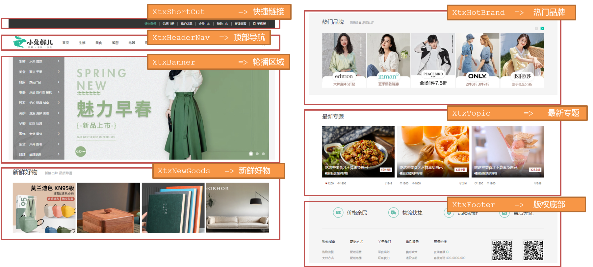
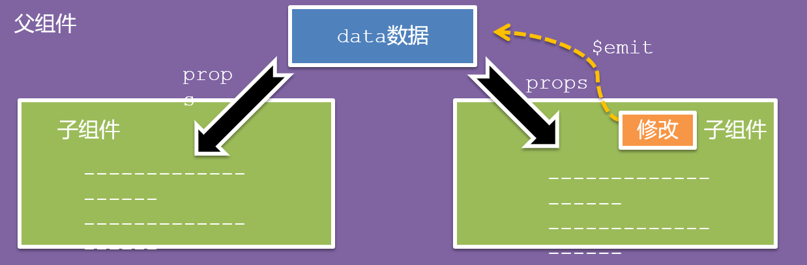

# Vue2

## 一、为什么要学习Vue

1. 前端必备技能
2. 岗位多，绝大互联网公司都在使用Vue
3. 提高开发效率
4. 高薪必备技能（Vue2+Vue3）

## 二、什么是Vue

概念：Vue (读音 /vjuː/，类似于 view) 是一套 **构建用户界面** 的 **渐进式** **框架**

Vue2官网：<https://v2.cn.vuejs.org/>

### 1.什么是构建用户界面

**基于数据**渲染出用户可以看到的**界面**


### 2.什么是渐进式

所谓渐进式就是循序渐进，不一定非得把Vue中的所有API都学完才能开发Vue，可以学一点开发一点

#### Vue的两种开发方式：

1. Vue核心包开发

   场景：局部模块改造

2. Vue核心包&Vue插件&工程化

   场景：整站开发

### 3.什么是框架

所谓框架：就是一套完整的解决方案

**举个栗子**

如果把一个完整的项目比喻为一个装修好的房子，那么框架就是一个毛坯房。

我们只需要在“毛坯房”的基础上，增加功能代码即可。

提到框架，不得不提一下库。

- 库，类似工具箱，是一堆方法的集合，比如 axios、lodash、echarts等
- 框架，是一套完整的解决方案，实现了大部分功能，我们只需要按照一定的规则去编码即可。

下图是 库 和 框架 的对比。


框架的特点：有一套必须让开发者遵守的**规则**或者**约束**

咱们学框架就是学习的这些规则 [官网](https://v2.cn.vuejs.org/)

## 三、创建Vue实例

我们已经知道了Vue框架可以 基于数据帮助我们渲染出用户界面，那应该怎么做呢？


比如就上面这个数据，基于提供好的msg 怎么渲染后右侧可展示的数据呢？

**核心步骤（4步）：**

1. 准备容器
2. 引包（官网） — 开发版本/生产版本
3. 创建Vue实例：new Vue()
4. 指定配置项，渲染数据
    1. el：指定挂载点
    2. data：提供数据


## 四、插值表达式 {{}}

插值表达式是一种Vue的模板语法

我们可以用插值表达式渲染出Vue提供的数据



### 1.作用：利用表达式进行插值，渲染到页面中

表达式：是可以被求值的代码，JS引擎会讲其计算出一个结果

以下的情况都是表达式：

```js
money + 100
money - 100
money * 10
money / 10 
price >= 100 ? '真贵':'还行'
obj.name
arr[0]
fn()
obj.fn()
```

### 2.语法

插值表达式语法：`{{ 表达式 }}`

```vue
<h3>{{title}}</h3>

<p>{{nickName.toUpperCase()}}</p>

<p>{{age >= 18 ? '成年':'未成年'}}</p>

<p>{{obj.name}}</p>

<p>{{fn()}}</p>
```

### 3.错误用法

```vue
1.在插值表达式中使用的数据 必须在data中进行了提供
<p>{{hobby}}</p>  //如果在data中不存在 则会报错

2.支持的是表达式，而非语句，比如：if   for ...
<p>{{if}}</p>

3.不能在标签属性中使用 {{  }} 插值 (插值表达式只能标签中间使用)
<p title="{{username}}">我是P标签</p>
```

## 五、响应式特性

### 1.什么是响应式？

简单理解就是数据变，视图对应变。

### 2.如何访问 和 修改 data中的数据（响应式演示）

data中的数据，最终会被添加到实例上

① 访问数据："实例.属性名"

② 修改数据："实例.属性名" = "值"


## 六、Vue开发者工具安装

1. 通过谷歌应用商店安装（国外网站）
2. 极简插件下载（推荐） <https://chrome.zzzmh.cn/index>

安装步骤：


安装之后可以F12后看到多一个Vue的调试面板


## 七、Vue中的常用指令

**概念：** 指令（Directives）是 Vue 提供的带有 **v-前缀** 的 特殊 标签**属性**。

为啥要学：提高程序员操作 DOM 的效率。

vue 中的指令按照不同的用途可以分为如下 6 大类：

-  内容渲染指令（v-html、v-text）
-  条件渲染指令（v-show、v-if、v-else、v-else-if）
-  事件绑定指令（v-on）
-  属性绑定指令（v-bind）
-  双向绑定指令（v-model）
-  列表渲染指令（v-for）

指令是 vue 开发中最基础、最常用、最简单的知识点。

## 八、内容渲染指令

内容渲染指令用来辅助开发者渲染 DOM 元素的文本内容。常用的内容渲染指令有如下2 个：

- v-text（类似innerText）
  - 使用语法：`<p v-text="uname">hello</p>`，意思是将 uame 值渲染到 p 标签中
  - 类似 innerText，使用该语法，会覆盖 p 标签原有内容
- v-html（类似 innerHTML）
  - 使用语法：`<p v-html="intro">hello</p>`，意思是将 intro 值渲染到 p 标签中
  - 类似 innerHTML，使用该语法，会覆盖 p 标签原有内容
  - 类似 innerHTML，使用该语法，能够将HTML标签的样式呈现出来。

代码演示：

```vue
<div id="app">
    <h2>个人信息</h2>
    // 既然指令是vue提供的特殊的html属性，所以咱们写的时候就当成属性来用即可
    <p v-text="uname">姓名：</p>
    <p v-html="intro">简介：</p>
</div>

<script>
    const app = new Vue({
        el: '#app',
        data: {
            uname: '张三',
            intro: '<h2>这是一个<strong>非常优秀</strong>的boy<h2>'
        }
    })
</script>
```

## 九、条件渲染指令

条件判断指令，用来辅助开发者按需控制 DOM 的显示与隐藏。条件渲染指令有如下两个，分别是：

1. v-show
    1. 作用：控制元素显示隐藏
    2. 语法：v-show = "表达式"，表达式值为 true 显示，false 隐藏
    3. 原理：切换 display:none 控制显示隐藏
    4. 场景：频繁切换显示隐藏的场景

   

2. v-if
    1. 作用：控制元素显示隐藏（条件渲染）
    2. 语法：v-if= "表达式"，表达式值 true 显示，false 隐藏
    3. 原理：基于条件判断，是否创建 或 移除元素节点
    4. 场景：要么显示，要么隐藏，不频繁切换的场景

   

   示例代码：

   ```vue
   <div id="app">
       <div class="box">我是v-show控制的盒子</div>
       <div class="box">我是v-if控制的盒子</div>
   </div>
   
   <script>
       const app = new Vue({
           el: '#app',
           data: {
               flag: false
           }
       })
   </script>
   ```

3. v-else 和 v-else-if
    1. 作用：辅助v-if进行判断渲染
    2. 语法：v-else  v-else-if="表达式"
    3. 需要紧接着v-if使用

```vue
<div id="app">
    <div class="box">我是v-show控制的盒子</div>
    <div class="box">我是v-if控制的盒子</div>
</div>

<script>
    const app = new Vue({
        el: '#app',
        data: {
            flag: false
        }
    })
</script>
```
   
示例代码：

```vue
<div id="app">
    <p>性别：♂ 男</p>
    <p>性别：♀ 女</p>
    <hr>
    <p>成绩评定A：奖励电脑一台</p>
    <p>成绩评定B：奖励周末郊游</p>
    <p>成绩评定C：奖励零食礼包</p>
    <p>成绩评定D：惩罚一周不能玩手机</p>
</div>

<script>
    const app = new Vue({
        el: '#app',
        data: {
            gender: 2,
            score: 95
        }
    })
</script>
```

## 十、事件绑定指令

使用Vue时，如需为DOM注册事件，及其的简单，语法如下：

- \<button v-on:事件名="内联语句">按钮\</button>
- \<button v-on:事件名="处理函数">按钮\</button>
- \<button v-on:事件名="处理函数(实参)">按钮\</button>
- `v-on:` 简写为 **@**

1. 内联语句

```vue
<div id="app">
    <button @click="count--">-</button>
    <span>{{ count }}</span>
    <button v-on:click="count++">+</button>
</div>

<script>
    const app = new Vue({
        el: '#app',
        data: {
            count: 100
        }
    })
</script>
```

2. 事件处理函数

   注意：
    - 事件处理函数应该写到一个跟data同级的配置项（methods）中
    - methods中的函数内部的this都指向Vue实例

```vue
<div id="app">
    <button @click="change">切换显示隐藏</button>
    <h1 v-show="isShow">黑马程序员</h1>
</div>

<script>
    const app = new Vue({
        el: '#app',
        data: {
            isShow: true
        },
        methods: {
            change() {
                this.isShow = !this.isShow
            }
        }
    })
</script>
```

3. 给事件处理函数传参

- 如果不传递任何参数，则方法无需加小括号；methods方法中可以直接使用 e 当做事件对象
- 如果传递了参数，则实参 `$event` 表示事件对象，固定用法。

```vue
<style>
    .box {
        border: 3px solid #000000;
        border-radius: 10px;
        padding: 20px;
        margin: 20px;
        width: 200px;
    }

    h3 {
        margin: 10px 0 20px 0;
    }

    p {
        margin: 20px;
    }
</style>

<div id="app">
    <div class="box">
        <h3>小黑自动售货机</h3>
        <button @click="buy(5, $event)">可乐5元</button>
        <button @click="buy(10, $event)">咖啡10元</button>
        <button @click="buy(8, $event)">牛奶8元</button>
    </div>
    <p>银行卡余额：{{ money }}元</p>
</div>

<script>
    const app = new Vue({
        el: '#app',
        data: {
            money: 1000
        },
        methods: {
            buy(n, $event) {
                this.money -= n
                console.log($event)
            }
        }
    })
</script>
```

## 十一、属性绑定指令

1. 作用：动态设置html的标签属性 比如：src、url、title
2. 语法：v-bind:属性名=“表达式”
3. v-bind：可以简写成 => :

比如，有一个图片，它的 `src` 属性值，是一个图片地址。这个地址在数据 data 中存储。

则可以这样设置属性值：
- ``
- ``（v-bind可以省略）

```vue
<div id="app">
    
    
</div>

<script>
    const app = new Vue({
        el: '#app',
        data: {
            imgUrl: './imgs/10-02.png',
            msg: 'hello 波仔'
        }
    })
</script>
```

## 十二、小案例-波仔的学习之旅

需求：默认展示数组中的第一张图片，点击上一页下一页来回切换数组中的图片

实现思路：
1. 数组存储图片路径 ['url1','url2','url3'，...]
2. 可以准备个下标index 去数组中取图片地址。
3. 通过v-bind给src绑定当前的图片地址
4. 点击上一页下一页只需要修改下标的值即可
5. 当展示第一张的时候，上一页按钮应该隐藏。展示最后一张的时候，下一页按钮应该隐藏

```vue

<div id="app">
    <button @click="changeIndex(-1)" v-show="index > 0">上一页</button>
    <div>
        
    </div>
    <button @click="changeIndex(1)" v-show="index < list.length - 1">下一页</button>
</div>

<script>
    const app = new Vue({
        el: '#app',
        data: {
            list: [
                './imgs/11-00.gif',
                './imgs/11-01.gif',
                './imgs/11-02.gif',
                './imgs/11-03.gif',
                './imgs/11-04.png',
                './imgs/11-05.png',
            ],
            index: 0
        },
        methods: {
            changeIndex(n) {
                this.index += n
            },
            getImageSrc() {
                return this.list[this.index]
            }
        }
    })
</script>
```

## 十三、列表渲染指令

Vue 提供了 v-for 列表渲染指令，用来辅助开发者基于一个数组来循环渲染一个列表结构。

v-for 指令需要使用 `(item, index) in arr` 形式的特殊语法，其中：

- item 是数组中的每一项
- index 是每一项的索引，不需要可以省略
- arr 是被遍历的数组

此语法也可以遍历**对象和数字**

```vue
//遍历对象
<div v-for="(value, key, index) in object">{{value}}</div>
value:对象中的值
key:对象中的键
index:遍历索引从0开始

//遍历数字
<p v-for="item in 10">{{item}}</p>
item从1 开始
```

```vue
<div id="app">
    <h3>小黑水果店</h3>
    <ul>
        <li v-for="(item, index) in list">
            {{ item }} - {{ index }}
        </li>
    </ul>
</div>

<script>
    const app = new Vue({
        el: '#app',
        data: {
            list: [
                '西瓜',
                '苹果',
                '鸭梨',
                '榴莲'
            ]
        }
    })
</script>
```

## 十四、小案例-小黑的书架

需求：

1. 根据左侧数据渲染出右侧列表（v-for）
2. 点击删除按钮时，应该把当前行从列表中删除（获取当前行的id，利用filter进行过滤）


准备代码：

```vue
    <div id="app">
    <h3>小黑的书架</h3>
    <ul>
        <li v-for="(item, index) in booksList" :key="item.id">
            <span>{{ item.name }}</span>
            <span>{{ item.author }}</span>
            <button @click="del(item.id)">删除</button>
        </li>
    </ul>
</div>

<script>
    const app = new Vue({
        el: '#app',
        data: {
            booksList: [
                {id: 1, name: '《红楼梦》', author: '曹雪芹'},
                {id: 2, name: '《西游记》', author: '吴承恩'},
                {id: 3, name: '《水浒传》', author: '施耐庵'},
                {id: 4, name: '《三国演义》', author: '罗贯中'}
            ]
        },
        methods: {
            del(id) {
                this.booksList = this.booksList.filter(e => e.id !== id)
            }
        }
    })
</script>
```

## 十五、v-for中的key

**语法**：key="唯一值"

**作用**：给列表项添加的**唯一标识**。便于Vue进行列表项的**正确排序复用**。

**为什么加key**：Vue 的默认行为会尝试原地修改元素（**就地复用**）

实例代码：

```vue
<ul>
    <li v-for="(item, index) in booksList" :key="item.id">
        <span>{{ item.name }}</span>
        <span>{{ item.author }}</span>
        <button @click="del(item.id)">删除</button>
    </li>
</ul>
```

注意：
1. key 的值只能是字符串或数字类型
2. key 的值必须具有唯一性
3. 推荐使用 id 作为 key（唯一），不推荐使用 index 作为 key（会变化，不对应）

## 十六、双向绑定指令

所谓双向绑定就是：
1. 数据改变后，呈现的页面结果会更新
2. 页面结果更新后，数据也会随之而变

**作用**： 给**表单元素**（input、radio、select）使用，双向绑定数据，可以快速 **获取** 或 **设置** 表单元素内容

**语法**：v-model="变量"

**需求**：使用双向绑定实现以下需求

1. 点击登录按钮获取表单中的内容
2. 点击重置按钮清空表单中的内容


```vue
<div id="app">
    账户：<input type="text"> <br><br>
    密码：<input type="password"> <br><br>
    <button>登录</button>
    <button>重置</button>
</div>

<script>
    const app = new Vue({
        el: '#app',
        data: {
            username: '',
            password: ''
        }
    })
</script>
```

## 十七、综合案例-小黑记事本


**功能需求：**

1. 列表渲染
2. 删除功能
3. 添加功能
4. 底部统计 和 清空

## 十八、指令修饰符

### 1.什么是指令修饰符？

所谓指令修饰符就是通过“.”指明一些指令**后缀**不同的**后缀**封装了不同的处理操作 —> 简化代码

### 2.按键修饰符

- @keyup.enter  —>当点击enter键的时候才触发

代码演示：

```vue
<div id="app">
    <h3>@keyup.enter → 监听键盘回车事件</h3>
    <input v-model="username" type="text">
</div>

<script>
    const app = new Vue({
        el: '#app',
        data: {
            username: ''
        },
        methods: {}
    })
</script>
```

### 3.v-model修饰符

- v-model.trim —> 去除首位空格
- v-model.number —> 转数字

### 4.事件修饰符

- @事件名.stop —> 阻止冒泡
- @事件名.prevent  —>阻止默认行为
- @事件名.stop.prevent —>可以连用 即阻止事件冒泡也阻止默认行为

```vue
<style>
    .father {
        width: 200px;
        height: 200px;
        background-color: pink;
        margin-top: 20px;
    }

    .son {
        width: 100px;
        height: 100px;
        background-color: skyblue;
    }
</style>

<div id="app">
    <h3>v-model修饰符 .trim .number</h3>
    姓名：<input v-model="username" type="text"><br>
    年纪：<input v-model="age" type="text"><br>


    <h3>@事件名.stop → 阻止冒泡</h3>
    <div @click="fatherFn" class="father">
        <div @click.stop="sonFn" class="son">儿子</div>
    </div>

    <h3>@事件名.prevent → 阻止默认行为</h3>
    <a @click.prevent href="http://www.baidu.com">阻止默认行为</a>
</div>

<script>
    const app = new Vue({
        el: '#app',
        data: {
            username: '',
            age: '',
        },
        methods: {
            fatherFn() {
                alert('老父亲被点击了')
            },
            sonFn(e) {
                // e.stopPropagation()
                alert('儿子被点击了')
            }
        }
    })
</script>
```

## 十九、v-bind对样式控制的增强-操作class

为了方便开发者进行样式控制，Vue 扩展了 v-bind 的语法，可以针对 **class 类名** 和 **style 行内样式** 进行控制。

### 1.语法

```html
<div :class="对象/数组">这是一个div</div>
```

### 2.对象语法

当class动态绑定的是**对象**时，**键就是类名，值就是布尔值**，如果值是**true**，就有这个类，否则没有这个类

```html
<div class="box" :class="{ 类名1: 布尔值, 类名2: 布尔值 }"></div>
```

适用场景：一个类名，来回切换

### 3.数组语法

当class动态绑定的是**数组**时 → 数组中所有的类，都会添加到盒子上，本质就是一个 class 列表

```html
<div class="box" :class="[ 类名1, 类名2, 类名3 ]"></div>
```

使用场景：批量添加或删除类

### 4.代码练习

```vue
<style>
    .box {
        width: 200px;
        height: 200px;
        border: 3px solid #000;
        font-size: 30px;
        margin-top: 10px;
    }

    .pink {
        background-color: pink;
    }

    .big {
        width: 300px;
        height: 300px;
    }
</style>


<div id="app">
    <!--绑定对象-->
    <div class="box" :class="{pink: true, big: true}">黑马程序员</div>
    <!--绑定数组-->
    <div class="box" :class="['pink', 'big']">黑马程序员</div>
</div>

<script>
    const app = new Vue({
        el: '#app',
        data: {}
    })
</script>
```

## 二十、京东秒杀-tab栏切换导航高亮

### 1.需求

当我们点击哪个tab页签时，哪个tab页签就高亮

### 2.准备代码

```vue
<style>
    * {
        margin: 0;
        padding: 0;
    }

    ul {
        display: flex;
        border-bottom: 2px solid #e01222;
        padding: 0 10px;
    }

    li {
        width: 100px;
        height: 50px;
        line-height: 50px;
        list-style: none;
        text-align: center;
    }

    li a {
        display: block;
        text-decoration: none;
        font-weight: bold;
        color: #333333;
    }

    li a.active {
        background-color: #e01222;
        color: #fff;
    }

</style>

<div id="app">
    <ul>
        <li v-for="(item, index) in list" :key="item.id">
            <a href="#" :class="getActiveClass(index)" @click="change(index)">{{ item.name }}</a>
        </li>
    </ul>
</div>

<script>
    const app = new Vue({
        el: '#app',
        data: {
            list: [
                {id: 1, name: '京东秒杀'},
                {id: 2, name: '每日特价'},
                {id: 3, name: '品类秒杀'}
            ],
            activeIndex: 0
        },
        methods: {
            change(index) {
                this.activeIndex = index
            },
            getActiveClass(index) {
                return this.activeIndex === index ? 'active' : null
            }
        }
    })
</script>
```

### 3.思路

1. 基于数据，动态渲染tab（v-for）
2. 准备一个下标 记录高亮的是哪一个 tab
3. 基于下标动态切换class的类名

## 二一、v-bind对有样式控制的增强-操作style

### 1.语法

```html
<div class="box" :style="{ CSS属性名1: CSS属性值, CSS属性名2: CSS属性值 }"></div>
```

### 2.代码练习

```vue
<style>
    .box {
        width: 200px;
        height: 200px;
        background-color: rgb(187, 150, 156);
    }
</style>
<div id="app">
    <div class="box" :style="{ width: '400px', height: '400px', 'background-color': 'red' }"></div>
</div>

<script>
    const app = new Vue({
        el: '#app',
        data: {}
    })
</script>
```

### 3.进度条案例

```vue
<style>
    .progress {
        height: 25px;
        width: 400px;
        border-radius: 15px;
        background-color: #272425;
        border: 3px solid #272425;
        box-sizing: border-box;
        margin-bottom: 30px;
    }

    .inner {
        width: 50%;
        height: 20px;
        border-radius: 10px;
        text-align: right;
        position: relative;
        background-color: #409eff;
        background-size: 20px 20px;
        box-sizing: border-box;
        transition: all 1s;
    }

    .inner span {
        position: absolute;
        right: -20px;
        bottom: -25px;
    }
</style>

<div id="app">
    <div class="progress">
        <div class="inner" :style="{ width: percentage + '%' }">
            <span>{{ percentage }}%</span>
        </div>
    </div>
    <button @click="setting(25)">设置25%</button>
    <button @click="setting(50)">设置50%</button>
    <button @click="setting(75)">设置75%</button>
    <button @click="setting(100)">设置100%</button>
</div>

<script>
    const app = new Vue({
        el: '#app',
        data: {
            percentage: 50
        },
        methods: {
            setting(num) {
                this.percentage = num
            }
        }
    })
</script>
```

## 二二、v-model在其他表单元素的使用

### 1.讲解内容

常见的表单元素都可以用 v-model 绑定关联  →  快速 **获取** 或 **设置** 表单元素的值

它会根据**控件类型**自动选取**正确的方法**来更新元素

```text
输入框   input:text     ——> value
文本域   textarea	   ——> value
复选框   input:checkbox ——> checked
单选框   input:radio    ——> checked
下拉菜单 select         ——> value
...
```

### 2.代码准备

```vue
<style>
    textarea {
        display: block;
        width: 240px;
        height: 100px;
        margin: 10px 0;
    }
</style>
<div id="app">
    <h3>小黑学习网</h3>
    姓名：
    <input type="text" v-model="name">
    <br><br>
    是否单身：
    <input type="checkbox" v-model="isSingle">
    <br><br>
    <!--
      前置理解：
        1. name:  给单选框加上 name 属性 可以分组 → 同一组互相会互斥
        2. value: 给单选框加上 value 属性，用于提交给后台的数据
      结合 Vue 使用 → v-model
    -->
    性别:
    <input type="radio" name="gender" value="1" v-model="gender">男
    <input type="radio" name="gender" value="2" v-model="gender">女
    <br><br>
    <!--
      前置理解：
        1. option 需要设置 value 值，提交给后台
        2. select 的 value 值，关联了选中的 option 的 value 值
      结合 Vue 使用 → v-model
    -->
    所在城市:
    <select v-model="city">
        <option value="BeiJing">北京</option>
        <option value="ShangHai">上海</option>
        <option value="ChengDu">成都</option>
        <option value="NanJing">南京</option>
    </select>
    <br><br>
    自我描述：
    <textarea v-model="describe"></textarea>
    <button @click="log">立即注册</button>
</div>

<script>
    const app = new Vue({
        el: '#app',
        data: {
            name: '',
            isSingle: false,
            gender: 1,
            city: 'BeiJing',
            describe: ''
        },
        methods: {
            log() {
                console.log(this.name, this.isSingle, this.gender, this.city, this.describe)
            }
        }
    })
</script>
```

## 二三、computed计算属性

### 1.概念

基于**现有的数据**，计算出来的**新属性**。**依赖**的数据变化，**自动**重新计算。

### 2.语法

1. 声明在 **computed 配置项**中，一个计算属性对应一个函数
2. 使用起来和普通属性一样使用 {{ 计算属性名 }}

### 3.注意

1. computed配置项和data配置项是**同级**的
2. computed中的计算属性**虽然是函数的写法**，但他**依然是个属性**
3. computed中的计算属性**不能**和data中的属性**同名**
4. 使用computed中的计算属性和使用data中的属性是一样的用法
5. computed中计算属性内部的**this**依然**指向的是Vue实例**

### 4.案例

比如我们可以使用计算属性实现下面这个业务场景


### 5.代码准备

```vue
<style>
    table {
        border: 1px solid #000;
        text-align: center;
        width: 240px;
    }

    th, td {
        border: 1px solid #000;
    }

    h3 {
        position: relative;
    }
</style>

<div id="app">
    <h3>小黑的礼物清单</h3>
    <table>
        <tr>
            <th>名字</th>
            <th>数量</th>
        </tr>
        <tr v-for="(item, index) in list" :key="item.id">
            <td>{{ item.name }}</td>
            <td>{{ item.num }}个</td>
        </tr>
    </table>

    <!-- 目标：统计求和，求得礼物总数 -->
    <p>礼物总数：{{ totalCount }} 个</p>
</div>

<script>
    const app = new Vue({
        el: '#app',
        data: {
            // 现有的数据
            list: [
                {id: 1, name: '篮球', num: 1},
                {id: 2, name: '玩具', num: 2},
                {id: 3, name: '铅笔', num: 5},
            ]
        },
        computed: {
            totalCount() {
                return this.list.reduce((p, c) => p + c.num, 0)
            }
        }
    })
</script>
```

## 二四、computed计算属性 VS methods方法

### 1.computed计算属性

作用：封装了一段对于**数据**的处理，求得一个**结果**

语法：

1. 写在computed配置项中
2. 作为属性，直接使用
   - js中使用计算属性： this.计算属性
   - 模板中使用计算属性：{{计算属性}}

### 2.methods计算属性

作用：给Vue实例提供一个**方法**，调用以**处理业务逻辑**。

语法：
1. 写在methods配置项中
2. 作为方法调用
    - js中调用：this.方法名()
    - 模板中调用 {{方法名()}} 或者 @事件名=“方法名”

### 3.计算属性的优势

1. 缓存特性（提升性能）

   计算属性会对计算出来的结果缓存，再次使用直接读取缓存，

   依赖项变化了，会自动重新计算 → 并再次缓存

2. methods没有缓存特性

3. 通过代码比较

```vue
<style>
    table {
        border: 1px solid #000;
        text-align: center;
        width: 300px;
    }

    th, td {
        border: 1px solid #000;
    }

    h3 {
        position: relative;
    }

    span {
        position: absolute;
        left: 145px;
        top: -4px;
        width: 16px;
        height: 16px;
        color: white;
        font-size: 12px;
        text-align: center;
        border-radius: 50%;
        background-color: #e63f32;
    }
</style>

<div id="app">
    <h3>小黑的礼物清单🛒<span>{{ totalCount }}}</span></h3>
    <h3>小黑的礼物清单🛒<span>{{ totalCount }}}</span></h3>
    <h3>小黑的礼物清单🛒<span>{{ totalCount }}}</span></h3>
    <h3>小黑的礼物清单🛒<span>{{ totalCount }}}</span></h3>
    <h3>小黑的礼物清单🛒<span>{{ totalCount }}}</span></h3>
    <table>
        <tr>
            <th>名字</th>
            <th>数量</th>
        </tr>
        <tr v-for="(item, index) in list" :key="item.id">
            <td>{{ item.name }}</td>
            <td>{{ item.num }}个</td>
        </tr>
    </table>

    <p>礼物总数：{{ totalCount }} 个</p>
</div>

<script>
    const app = new Vue({
        el: '#app',
        data: {
            // 现有的数据
            list: [
                {id: 1, name: '篮球', num: 3},
                {id: 2, name: '玩具', num: 2},
                {id: 3, name: '铅笔', num: 5},
            ]
        },
        computed: {
            totalCount() {
                let total = this.list.reduce((sum, item) => sum + item.num, 0)
                console.log(total)
                return total
            }
        }
    })
</script>
```

### 4.总结

1. computed**有缓存特性**，methods**没有缓存**
2. 当一个结果依赖其他多个值时，推荐使用计算属性
3. 当处理业务逻辑时，推荐使用methods方法，比如事件的处理函数

## 二五、计算属性的完整写法

**既然计算属性也是属性，能访问，应该也能修改了？**

1. 计算属性默认的简写，只能读取访问，不能 "修改"
2. 如果要 "修改" → 需要写计算属性的完整写法


完整写法代码演示

```vue
<div id="app">
    姓：<input type="text" v-model="firstName"> +
    名：<input type="text" v-model="lastName"> =
    <span>{{ fullName }}</span><br><br>
    <button @click="changeName">改名卡</button>
</div>

<script>
    const app = new Vue({
        el: '#app',
        data: {
            firstName: '刘',
            lastName: '备'
        },
        computed: {
            fullName: {
                get() {
                    return this.firstName + this.lastName
                },
                set(name) {
                    this.firstName = name.slice(0, 1)
                    this.lastName = name.slice(1)
                }
            }
        },
        methods: {
            changeName() {
                this.fullName = '吕布'
            }
        }
    })
</script>
```

## 二六、综合案例-成绩案例



功能描述：
1. 渲染功能
2. 删除功能
3. 添加功能
4. 统计总分，求平均分

思路分析：
1. 渲染功能：v-for :key v-bind: 动态绑定class的样式
2. 删除功能：v-on绑定事件，阻止a标签的默认行为
3. v-model的修饰符 .trim、.number、判断数据是否为空后 再添加、添加后清空文本框的数据
4. 使用计算属性 computed 计算总分和平均分的值

## 二七、watch侦听器（监视器）

### 1.作用：

**监视数据变化**，执行一些业务逻辑或异步操作

### 2.语法：

1. watch同样声明在跟data同级的配置项中
2. 简单写法：简单类型数据直接监视
3. 完整写法：添加额外配置项

   ```vue
   data: {
       words: '苹果',
       obj: {
           words: '苹果'
       }
   },
   
   watch: {
       // 该方法会在数据变化时，触发执行
       数据属性名(newValue, oldValue) {
           // ...
       },
       '对象.属性名'(newValue, oldValue) {
           // ...
       }
   }
   ```

### 3.翻译案例

```vue
<style>
    * {
        margin: 0;
        padding: 0;
        box-sizing: border-box;
        font-size: 18px;
    }

    #app {
        padding: 10px 20px;
    }

    .query {
        margin: 10px 0;
    }

    .box {
        display: flex;
    }

    textarea {
        width: 300px;
        height: 160px;
        font-size: 18px;
        border: 1px solid #dedede;
        outline: none;
        resize: none;
        padding: 10px;
    }

    textarea:hover {
        border: 1px solid #1589f5;
    }

    .transbox {
        width: 300px;
        height: 160px;
        background-color: #f0f0f0;
        padding: 10px;
        border: none;
    }

    .tip-box {
        width: 300px;
        height: 25px;
        line-height: 25px;
        display: flex;
    }

    .tip-box span {
        flex: 1;
        text-align: center;
    }

    .query span {
        font-size: 18px;
    }

    .input-wrap {
        position: relative;
    }

    .input-wrap span {
        position: absolute;
        right: 15px;
        bottom: 15px;
        font-size: 12px;
    }

    .input-wrap i {
        font-size: 20px;
        font-style: normal;
    }
</style>

<div id="app">
    <!-- 条件选择框 -->
    <div class="query">
        <span>翻译成的语言：</span>
        <select>
            <option value="italy">意大利</option>
            <option value="english">英语</option>
            <option value="german">德语</option>
        </select>
    </div>

    <!-- 翻译框 -->
    <div class="box">
        <div class="input-wrap">
            <textarea v-model="words"></textarea>
            <span><i>⌨️</i>文档翻译</span>
        </div>
        <div class="output-wrap">
            <div class="transbox">{{ result }}</div>
        </div>
    </div>
</div>

<script>

    const app = new Vue({
        el: '#app',
        data: {
            words: '',
            timer: null,
            result: ''
        },
        watch: {
            words(newValue) {
                if (this.timer) {
                    clearTimeout(this.timer)
                }
                this.timer = setTimeout(async () => {
                    const res = await axios({
                        url: 'https://applet-base-api-t.itheima.net/api/translate',
                        params: {
                            words: newValue
                        }
                    })

                    this.result = res.data.data
                }, 300)
            }
        }
    })
</script>
```

## 二八、watch侦听器

### 1.语法

完整写法 —> 添加额外的配置项

1. deep: true 对复杂类型进行深度监听
2. immdiate: true 初始化时立刻执行一次

```vue
data: {
    obj: {
        words: '苹果',
        lang: 'italy'
    },
},

watch: { // watch 完整写法
    对象: {
        deep: true, // 深度监视
        immediate: true, //立即执行handler函数
        handler (newValue) {
            console.log(newValue)
        }
    }
}
```

### 2. 需求


- 当文本框输入的时候 右侧翻译内容要时时变化
- 当下拉框中的语言发生变化的时候 右侧翻译的内容依然要时时变化
- 如果文本框中有默认值的话要立即翻译

### 3.代码实现

```vue
<style>
    * {
        margin: 0;
        padding: 0;
        box-sizing: border-box;
        font-size: 18px;
    }

    #app {
        padding: 10px 20px;
    }

    .query {
        margin: 10px 0;
    }

    .box {
        display: flex;
    }

    textarea {
        width: 300px;
        height: 160px;
        font-size: 18px;
        border: 1px solid #dedede;
        outline: none;
        resize: none;
        padding: 10px;
    }

    textarea:hover {
        border: 1px solid #1589f5;
    }

    .transbox {
        width: 300px;
        height: 160px;
        background-color: #f0f0f0;
        padding: 10px;
        border: none;
    }

    .tip-box {
        width: 300px;
        height: 25px;
        line-height: 25px;
        display: flex;
    }

    .tip-box span {
        flex: 1;
        text-align: center;
    }

    .query span {
        font-size: 18px;
    }

    .input-wrap {
        position: relative;
    }

    .input-wrap span {
        position: absolute;
        right: 15px;
        bottom: 15px;
        font-size: 12px;
    }

    .input-wrap i {
        font-size: 20px;
        font-style: normal;
    }
</style>

<div id="app">
    <!-- 条件选择框 -->
    <div class="query">
        <span>翻译成的语言：</span>
        <select v-model="item.lang">
            <option value="italy">意大利</option>
            <option value="english">英语</option>
            <option value="german">德语</option>
        </select>
    </div>

    <!-- 翻译框 -->
    <div class="box">
        <div class="input-wrap">
            <textarea v-model="item.words"></textarea>
            <span><i>⌨️</i>文档翻译</span>
        </div>
        <div class="output-wrap">
            <div class="transbox">{{ result }}</div>
        </div>
    </div>
</div>

<script>

    const app = new Vue({
        el: '#app',
        data: {
            item: {
                words: '',
                lang: 'italy'
            },
            timer: null,
            result: '',

        },
        watch: {
            item: {
                handler(newValue) {
                    if (this.timer) {
                        clearTimeout(this.timer)
                    }
                    this.timer = setTimeout(async () => {
                        const res = await axios({
                            url: 'https://applet-base-api-t.itheima.net/api/translate',
                            params: {
                                words: newValue
                            }
                        })

                        this.result = res.data.data
                    }, 300)
                },
                deep: true
            },
        }
    })
</script>
```

### 4.总结

watch侦听器的写法有几种？

1. 简单写法

```vue
watch: {
    数据属性名 (newValue, oldValue) {
        // ...
    },
    '对象.属性名' (newValue, oldValue) {
        // ...
    }
}
```

2. 完整写法

```vue
watch: {// watch 完整写法
    数据属性名: {
        deep: true, // 深度监视(针对复杂类型)
        immediate: true, // 是否立刻执行一次handler
        handler(newValue) {
            console.log(newValue)
        }
    }
}
```

## 二九、综合案例

购物车案例


需求说明：
1. 渲染功能
2. 删除功能
3. 修改个数
4. 全选反选
5. 统计 选中的 总价 和 总数量
6. 持久化到本地

实现思路：
1. 基本渲染：v-for遍历、:class动态绑定样式
2. 删除功能：v-on 绑定事件，获取当前行的id
3. 修改个数：v-on绑定事件，获取当前行的id，进行筛选出对应的项然后增加或减少
4. 全选反选
   1. 必须所有的小选框都选中，全选按钮才选中 → every
   2. 如果全选按钮选中，则所有小选框都选中
   3. 如果全选取消，则所有小选框都取消选中
   4. 声明计算属性，判断数组中的每一个checked属性的值，看是否需要全部选
5. 统计选中的总价和总数量：通过计算属性来计算**选中的**总价和总数量
6. 持久化到本地：在数据变化时都要更新下本地存储 watch

## 三十、Vue生命周期

思考：什么时候可以发送初始化渲染请求？（越早越好）什么时候可以开始操作dom？（至少dom得渲染出来）

Vue生命周期：就是一个Vue实例从创建到销毁的整个过程。

生命周期四个阶段：① 创建 ② 挂载 ③ 更新 ④ 销毁

1. 创建阶段：创建响应式数据
2. 挂载阶段：渲染模板
3. 更新阶段：修改数据，更新视图
4. 销毁阶段：销毁Vue实例


## 三一、Vue生命周期钩子

Vue生命周期过程中，会**自动运行一些函数**，被称为【**生命周期钩子**】→  让开发者可以在【**特定阶段**】运行**自己的代码**


```vue
<div id="app">
    <h3>{{ title }}</h3>
    <div>
        <button @click="count--">-</button>
        <span>{{ count }}</span>
        <button @click="count++">+</button>
    </div>
</div>

<script>
    const app = new Vue({
        el: '#app',
        data: {
            count: 100,
            title: '计数器'
        },
        // 1. 创建阶段（准备数据）
        beforeCreate() {
            console.log('beforeCreate')
        },
        created() {
            console.log('created')
        },
        // 2. 挂载阶段（渲染模板）
        beforeMount() {
            console.log('beforeMount')
        },
        mounted() {
            console.log('mounted')
        },
        // 3. 更新阶段(修改数据 → 更新视图)
        beforeUpdate() {
            console.log('beforeUpdate')
        },
        updated() {
            console.log('updated')
        },
        // 4. 卸载阶段
        beforeDestroy() {
            console.log('beforeDestroy')
        },
        destroyed() {
            console.log('destroyed')
        }
    })
</script>
```

## 三二、生命周期钩子小案例

### 1.在created中发送数据

```vue
<style>
    * {
        margin: 0;
        padding: 0;
        list-style: none;
    }

    .news {
        display: flex;
        height: 120px;
        width: 600px;
        margin: 0 auto;
        padding: 20px 0;
        cursor: pointer;
    }

    .news .left {
        flex: 1;
        display: flex;
        flex-direction: column;
        justify-content: space-between;
        padding-right: 10px;
    }

    .news .left .title {
        font-size: 20px;
    }

    .news .left .info {
        color: #999999;
    }

    .news .left .info span {
        margin-right: 20px;
    }

    .news .right {
        width: 160px;
        height: 120px;
    }

    .news .right img {
        width: 100%;
        height: 100%;
        object-fit: cover;
    }
</style>

<div id="app">
    <ul>
        <li class="news" v-for="(item, index) in list" :key="item.id">
            <div class="left">
                <div class="title">{{ item.title }}</div>
                <div class="info">
                    <span>{{ item.source }}</span>
                    <span>{{ item.time }}</span>
                </div>
            </div>
            <div class="right">
                
            </div>
        </li>
    </ul>
</div>

<script>
    // 接口地址：http://hmajax.itheima.net/api/news
    // 请求方式：get
    const app = new Vue({
        el: '#app',
        data: {
            list: []
        },
        async created() {
            const res = await axios.get('http://hmajax.itheima.net/api/news')
            this.list = res.data.data
            console.log(this.list)
        }
    })
</script>
```

### 2.在mounted中获取焦点

```vue
<style>
    html,
    body {
        height: 100%;
    }

    .search-container {
        position: absolute;
        top: 30%;
        left: 50%;
        transform: translate(-50%, -50%);
        text-align: center;
    }

    .search-container .search-box {
        display: flex;
    }

    .search-container img {
        margin-bottom: 30px;
    }

    .search-container .search-box input {
        width: 512px;
        height: 16px;
        padding: 12px 16px;
        font-size: 16px;
        margin: 0;
        vertical-align: top;
        outline: 0;
        box-shadow: none;
        border-radius: 10px 0 0 10px;
        border: 2px solid #c4c7ce;
        background: #fff;
        color: #222;
        overflow: hidden;
        box-sizing: content-box;
        -webkit-tap-highlight-color: transparent;
    }

    .search-container .search-box button {
        cursor: pointer;
        width: 112px;
        height: 44px;
        line-height: 41px;
        line-height: 42px;
        background-color: #ad2a27;
        border-radius: 0 10px 10px 0;
        font-size: 17px;
        box-shadow: none;
        font-weight: 400;
        border: 0;
        outline: 0;
        letter-spacing: normal;
        color: white;
    }

    body {
        background: no-repeat center /cover;
        background-color: #edf0f5;
    }
</style>

<div class="container" id="app">
    <div class="search-container">
        
        <div class="search-box">
            <input type="text" v-model="words" id="inp">
            <button>搜索一下</button>
        </div>
    </div>
</div>

<script src="../../js/vue.js"></script>
<script>
    const app = new Vue({
        el: '#app',
        data: {
            words: ''
        },
        mounted() {
            document.querySelector('#inp').focus()
        }
    })
</script>
```

## 三三、案例-小黑记账清单

### 1.需求图示：



### 2.需求分析

1. 基本渲染
2. 添加功能
3. 删除功能
4. 饼图渲染

### 3.思路分析

1. 基本渲染
   - 立刻发送请求获取数据 created
   - 拿到数据，存到data的响应式数据中
   - 结合数据，进行渲染 v-for
   - 消费统计  —> 计算属性
2. 添加功能
   - 收集表单数据 v-model，使用指令修饰符处理数据
   - 给添加按钮注册点击事件，对输入的内容做非空判断，发送请求
   - 请求成功后，对文本框内容进行清空
   - 重新渲染列表
3. 删除功能
   - 注册点击事件，获取当前行的id
   - 根据id发送删除请求
   - 需要重新渲染
4. 饼图渲染
   - 初始化一个饼图 echarts.init(dom)    mounted钩子中渲染
   - 根据数据试试更新饼图 echarts.setOptions({...})

### 4.代码准备

```vue
<div id="app">
    <div class="contain">
        <!-- 左侧列表 -->
        <div class="list-box">

            <!-- 添加资产 -->
            <form class="my-form">
                <input type="text" class="form-control" placeholder="消费名称" v-model.trim="name"/>
                <input type="text" class="form-control" placeholder="消费价格" v-model.number="price"/>
                <button type="button" class="btn btn-primary" @click="add">添加账单</button>
            </form>

            <table class="table table-hover">
                <thead>
                    <tr>
                        <th>编号</th>
                        <th>消费名称</th>
                        <th>消费价格</th>
                        <th>操作</th>
                    </tr>
                </thead>
                <tbody>
                    <tr v-for="(item, index) in list" :key="item.id">
                        <td>{{ index + 1 }}</td>
                        <td>{{ item.name }}</td>
                        <td :class="{ red: item.price > 500 }">{{ item.price.toFixed(2) }}</td>
                        <td><a href="javascript:;" @click="del(item.id)">删除</a></td>
                    </tr>
                </tbody>
                <tfoot>
                    <tr>
                        <td colspan="4">消费总计：{{ totalPrice.toFixed(2) }}</td>
                    </tr>
                </tfoot>
            </table>
        </div>

        <!-- 右侧图表 -->
        <div class="echarts-box" id="main"></div>
    </div>
</div>

<script>
    /**
     * 接口文档地址：
     * https://www.apifox.cn/apidoc/shared-24459455-ebb1-4fdc-8df8-0aff8dc317a8/api-53371058
     *
     * 功能需求：
     * 1. 基本渲染
     * 2. 添加功能
     * 3. 删除功能
     * 4. 饼图渲染
     */
    const app = new Vue({
        el: '#app',
        data: {
            list: [],
            name: '',
            price: null
        },
        computed: {
            totalPrice() {
                return this.list.reduce((p, c) => p + c.price, 0)
            }
        },
        async created() {
            await this.getList()
        },
        methods: {
            async getList() {
                const res = await axios.get('https://applet-base-api-t.itheima.net/bill', {
                    params: {
                        creator: '小黑'
                    }
                })
                this.list = res.data.data

                this.myCharts.setOption({
                    series: [
                        {
                            data: this.list.map(ie => ({name: ie.name, value: ie.price}))
                        }
                    ]
                })
            },
            async add() {
                if (!this.name) {
                    return alert('请输入消费名称')
                }

                if (typeof this.price !== 'number') {
                    return alert('请输入正确的消费名称')
                }

                await axios.post('https://applet-base-api-t.itheima.net/bill', {
                    creator: '小黑',
                    name: this.name,
                    price: this.price
                })

                this.getList()
                this.name = ''
                this.price = null
            },
            async del(id) {
                await axios.delete(`https://applet-base-api-t.itheima.net/bill/${id}`)

                this.getList()
            }
        },
        async mounted() {
            this.myCharts = echarts.init(document.querySelector('#main'))

            this.myCharts.setOption({
                title: {
                    text: '消费账单列表',
                    left: 'center'
                },
                tooltip: {
                    trigger: 'item'
                },
                legend: {
                    orient: 'vertical',
                    left: 'left'
                },
                series: [
                    {
                        name: '消费账单',
                        type: 'pie',
                        radius: '50%',
                        data: [],
                        emphasis: {
                            itemStyle: {
                                shadowBlur: 10,
                                shadowOffsetX: 0,
                                shadowColor: 'rgba(0, 0, 0, 0.5)'
                            }
                        }
                    }
                ]
            })
        }
    })
</script>
```

## 三四、工程化开发和脚手架

### 1.开发Vue的两种方式

- 核心包传统开发模式：基于html / css / js 文件，直接引入核心包，开发 Vue。
- **工程化开发模式：基于构建工具（例如：webpack）的环境中开发Vue。**


工程化开发模式优点：

提高编码效率，比如使用JS新语法、Less/Sass、Typescript等通过webpack都可以编译成浏览器识别的ES3/ES5/CSS等

工程化开发模式问题：

- webpack配置**不简单**
- **雷同**的基础配置
- 缺乏**统一的标准**

为了解决以上问题，所以我们需要一个工具，生成标准化的配置

### 2.脚手架Vue CLI

#### 2.1 基本介绍

Vue CLI 是Vue官方提供的一个**全局命令工具**

可以帮助我们**快速创建**一个开发Vue项目的**标准化基础架子**。【集成了webpack配置】

#### 2.2 好处

1. 开箱即用，零配置
2. 内置babel等工具
3. 标准化的webpack配置

#### 2.3 使用步骤：

1. 全局安装（只需安装一次即可）`yarn global add @vue/cli`或者`npm i @vue/cli -g`
2. 查看vue/cli版本：`vue --version`
3. 创建项目架子：**vue create project-name**(项目名不能使用中文)
4. 启动项目：**yarn serve** 或者 **npm run serve**(命令不固定，找package.json)

## 三五、项目目录介绍和运行流程

### 1.项目目录介绍


虽然脚手架中的文件有很多，目前咱们只需认识三个文件即可

1. main.js：入口文件
2. App.vue：App根组件
3. index.html：模板文件

### 2.运行流程


## 三六、组件化开发

组件化：一个页面可以拆分成一个个组件，每个组件有着自己独立的结构、样式、行为。

好处：便于维护，利于复用 → 提升开发效率。

组件分类：普通组件、根组件。

比如：下面这个页面，可以把所有的代码都写在一个页面中，但是这样显得代码比较混乱，难易维护。咱们可以按模块进行组件划分


## 三七、根组件 App.vue

### 1.根组件介绍

整个应用最上层的组件，包裹所有普通小组件


### 2.组件是由三部分构成

- 语法高亮插件  
  
- 三部分构成
    - template：结构 （有且只能一个根元素）
    - script: js逻辑
    - style：样式 (可支持less，需要装包)
- 让组件支持less
  1. style标签，lang="less" 开启less功能
  2. 装包: yarn add less less-loader -D 或者npm i less less-loader -D

## 三八、普通组件的注册使用-局部注册

### 1.特点：

只能在注册的组件内使用

### 2.步骤：

1. 创建.vue文件（三个组成部分）
2. 在使用的组件内先导入再注册，最后使用

### 3.使用方式：

当成html标签使用即可  <组件名></组件名>

### 4.注意：

组件名规范 —> 大驼峰命名法，如：HmHeader

### 5.语法：



```js
// 导入需要注册的组件
import 组件对象 from '.vue文件路径'
import HmHeader from './components/HmHeader'

export default {  // 局部注册
    components: {
        '组件名': 组件对象,
        HmHeader: HmHeaer,
        HmHeader
    }
}
```

### 6.练习

在App组件中，完成以下练习。在App.vue中使用组件的方式完成下面布局


```vue
<template>
    <div class="hm-header">
        我是hm-header
    </div>
</template>

<script>
    export default {}
</script>

<style>
    .hm-header {
        height: 100px;
        line-height: 100px;
        text-align: center;
        font-size: 30px;
        background-color: #8064a2;
        color: white;
    }
</style>
```

```vue
<template>
    <div class="hm-main">
        我是hm-main
    </div>
</template>

<script>
    export default {}
</script>

<style>
    .hm-main {
        height: 400px;
        line-height: 400px;
        text-align: center;
        font-size: 30px;
        background-color: #f79646;
        color: white;
        margin: 20px 0;
    }
</style>
```

```vue
<template>
    <div class="hm-footer">
        我是hm-footer
    </div>
</template>

<script>
    export default {}
</script>

<style>
    .hm-footer {
        height: 100px;
        line-height: 100px;
        text-align: center;
        font-size: 30px;
        background-color: #4f81bd;
        color: white;
    }
</style>
```

## 三九、普通组件的注册使用-全局注册

### 1.特点：

全局注册的组件，在项目的**任何组件**中都能使用

### 2.步骤

1. 创建.vue组件（三个组成部分）
2. **main.js**中进行全局注册

### 3.使用方式

当成HTML标签直接使用

> <组件名></组件名>

### 4.注意

组件名规范 —> 大驼峰命名法，如 HmHeader

### 5.语法

Vue.component('组件名', 组件对象)

例：

```js
// 导入需要全局注册的组件
import HmButton from './components/HmButton'
Vue.component('HmButton', HmButton)
```

### 6.练习

在以下3个局部组件中是展示一个通用按钮


```vue
<template>
    <button class="hm-button">通用按钮</button>
</template>

<script>
    export default {}
</script>

<style>
    .hm-button {
        height: 50px;
        line-height: 50px;
        padding: 0 20px;
        background-color: #3bae56;
        border-radius: 5px;
        color: white;
        border: none;
        vertical-align: middle;
        cursor: pointer;
    }
</style>
```

```js
import HmButton from "@/components/HmButton.vue";

Vue.component('HmButton', HmButton)
```

## 四十、综合案例

### 1.小兔仙首页启动项目演示

### 2.小兔仙组件拆分示意图



### 3.开发思路

1. 分析页面，按模块拆分组件，搭架子  (局部或全局注册)
2. 根据设计图，编写组件 html 结构 css 样式 (已准备好)
3. 拆分封装通用小组件  (局部或全局注册)  
   将来 → 通过 js 动态渲染，实现功能

## 四一、scoped解决样式冲突

### **1.默认情况**

写在组件中的样式会 **全局生效** → 因此很容易造成多个组件之间的样式冲突问题。

1. **全局样式**: 默认组件中的样式会作用到全局，任何一个组件中都会受到此样式的影响
2. **局部样式**: 可以给组件加上**scoped** 属性,可以**让样式只作用于当前组件**

### 2.代码演示

BaseOne.vue

```vue
<template>
    <div class="base-one">
        BaseOne
    </div>
</template>

<script>
    export default {}
</script>
<style scoped>
</style>
```

BaseTwo.vue

```vue
<template>
    <div class="base-one">
        BaseTwo
    </div>
</template>

<script>
    export default {}
</script>

<style scoped>
</style>
```

App.vue

```vue
<template>
    <div id="app">
        <BaseOne/>
        <BaseTwo/>
    </div>
</template>

<script>
    import BaseOne from '@/components/BaseOne'
    import BaseTwo from '@/components/BaseTwo'

    export default {
        name: 'App',
        components: {
            BaseOne,
            BaseTwo
        }
    }
</script>
```

### 3.scoped原理

1. 当前组件内标签都被添加**data-v-hash值**的属性
2. css选择器都被添加 [**data-v-hash值**] 的属性选择器

最终效果: **必须是当前组件的元素**，才会有这个自定义属性，才会被这个样式作用到


## 四二、data必须是一个函数

### 1、data为什么要写成函数

一个组件的 **data** 选项必须**是一个函数**。目的是为了：保证每个组件实例，维护**独立**的一份**数据**对象。

每次创建新的组件实例，都会新**执行一次data 函数**，得到一个新对象。


### 2.代码演示

BaseCount.vue

```vue
<template>
    <div class="base-count">
        <button @click="count--">-</button>
        <span>{{ count }}</span>
        <button @click="count++">+</button>
    </div>
</template>

<script>
    export default {
        data: function () {
            return {
                count: 100,
            }
        },
    }
</script>

<style>
    .base-count {
        margin: 20px;
    }
</style>
```

App.vue

```vue
<template>
    <div class="app">
        <BaseCount/>
    </div>
</template>

<script>
    import BaseCount from '@/components/BaseCount'

    export default {
        components: {
            BaseCount,
        },
    }
</script>

<style>
</style>
```

## 四三、组件通信

### 1.什么是组件通信？

组件通信，就是指**组件与组件**之间的**数据传递**

- 组件的数据是独立的，无法直接访问其他组件的数据。
- 想使用其他组件的数据，就需要组件通信

### 2.组件之间如何通信


思考：
1. 组件之间有哪些关系？
2. 对应的组件通信方案有哪几类？

### 3.组件关系分类

1. 父子关系
2. 非父子关系


### 4.通信解决方案


### 5.父子通信流程

1. 父组件通过 **props** 将数据传递给子组件
2. 子组件利用 **$emit** 通知父组件修改更新


### 6.父向子通信代码示例

父组件通过**props**将数据传递给子组件

父组件App.vue

```vue
<template>
    <div class="app" style="border: 3px solid #000; margin: 10px">
        我是APP组件
        <Son :title="myTitle"/>
    </div>
</template>

<script>
    import Son from './components/Son.vue'

    export default {
        name: 'App',
        data() {
            return {
                myTitle: '学前端，就来黑马程序员',
            }
        },
        components: {
            Son,
        }
    }
</script>

<style>
</style>
```

子组件Son.vue

```vue
<template>
    <div class="son" style="border:3px solid #000;margin:10px">
        我是Son组件 {{ title }}
    </div>
</template>

<script>
    export default {
        name: 'Son-Child',
        props: ['title']
    }
</script>

<style>
</style>
```


父向子传值步骤：
1. 给子组件以添加属性的方式传值
2. 子组件内部通过props接收
3. 模板中直接使用 props接收的值

### 7.子向父通信代码示例

子组件利用 **$emit** 通知父组件，进行修改更新


子向父传值步骤
1. $emit触发事件，给父组件发送消息通知
2. 父组件监听$emit触发的事件
3. 提供处理函数，在函数的性参中获取传过来的参数

```vue
<template>
    <div class="app" style="border: 3px solid #000; margin: 10px">
        我是APP组件
        <Son :title="myTitle" @changeTitle="receiveChange"/>
    </div>
</template>

<script>
    import Son from './components/Son.vue'

    export default {
        name: 'App',
        data() {
            return {
                myTitle: '学前端，就来黑马程序员',
            }
        },
        components: {
            Son,
        },
        methods: {
            receiveChange(data) {
                this.myTitle = data
            }
        }
    }
</script>

<style>
</style>
```

子组件Son.vue

```vue
<template>
    <div class="son" style="border:3px solid #000;margin:10px">
        我是Son组件 {{ title }}
        <button @click="changeFn">修改title</button>
    </div>
</template>

<script>
    export default {
        name: 'Son-Child',
        props: ['title'],
        methods: {
            changeFn() {
                this.$emit('changeTitle', +new Date())
            }
        }
    }
</script>

<style>
</style>
```

## 四四、什么是props

### 1.Props 定义

组件上注册的一些自定义属性

### 2.Props 作用

向子组件传递数据

### 3.特点

1. 可以传递**任意数量**的prop
2. 可以传递**任意类型**的prop


### 4.代码演示

父组件App.vue

```vue
<template>
    <div class="app">
        <UserInfo
            :username="username"
            :age="age"
            :isSingle="isSingle"
            :car="car"
            :hobby="hobby"
        ></UserInfo>
    </div>
</template>

<script>
    import UserInfo from './components/UserInfo.vue'

    export default {
        data() {
            return {
                username: '小帅',
                age: 28,
                isSingle: true,
                car: {
                    brand: '宝马',
                },
                hobby: ['篮球', '足球', '羽毛球'],
            }
        },
        components: {
            UserInfo,
        },
    }
</script>

<style>
</style>
```

子组件UserInfo.vue

```vue
<template>
    <div class="userinfo">
        <h3>我是个人信息组件</h3>
        <div>姓名：{{ username }}</div>
        <div>年龄：{{ age }}</div>
        <div>是否单身：{{ isSingle }}</div>
        <div>座驾：{{ car.brand }}</div>
        <div>兴趣爱好：{{ hobby.join('、') }}</div>
    </div>
</template>

<script>
    export default {
        props: ['username', 'age', 'isSingle', 'car', 'hobby']
    }
</script>

<style>
    .userinfo {
        width: 300px;
        border: 3px solid #000;
        padding: 20px;
    }

    .userinfo > div {
        margin: 20px 10px;
    }
</style>
```

## 四五、props校验

### 1.思考

组件的props可以乱传吗

### 2.作用

为组件的 prop 指定**验证要求**，不符合要求，控制台就会有**错误提示** → 帮助开发者，快速发现错误

### 3.语法

- **类型校验**
- 非空校验
- 默认值
- 自定义校验


### 4.代码演示

App.vue

```vue
<template>
    <div class="app">
        <BaseProgress :w="width"></BaseProgress>
    </div>
</template>

<script>
    import BaseProgress from './components/BaseProgress.vue'

    export default {
        data() {
            return {
                width: 30,
            }
        },
        components: {
            BaseProgress,
        },
    }
</script>

<style>
</style>
```

BaseProgress.vue

```vue
<template>
    <div class="base-progress">
        <div class="inner" :style="{ width: w + '%' }">
            <span>{{ w }}%</span>
        </div>
    </div>
</template>

<script>
    export default {
        props: {
            w: Number
        }
    }
</script>

<style scoped>
    .base-progress {
        height: 26px;
        width: 400px;
        border-radius: 15px;
        background-color: #272425;
        border: 3px solid #272425;
        box-sizing: border-box;
        margin-bottom: 30px;
    }

    .inner {
        position: relative;
        background: #379bff;
        border-radius: 15px;
        height: 25px;
        box-sizing: border-box;
        left: -3px;
        top: -2px;
    }

    .inner span {
        position: absolute;
        right: 0;
        top: 26px;
    }
</style>
```

## 四六、props校验完整写法

### 1.语法

```vue
props: {
    校验的属性名: {
        type: 类型, // Number String Boolean ...
        required: true, // 是否必填
        default: 默认值, // 默认值
        validator(value) {
            // 自定义校验逻辑
            return 是否通过校验
        }
    }
}
```

### 2.代码实例

```vue
<script>
    export default {
        // 完整写法（类型、默认值、非空、自定义校验）
        props: {
            w: {
                type: Number,
                //required: true,
                default: 0,
                validator(val) {
                    // console.log(val)
                    if (val >= 100 || val <= 0) {
                        console.error('传入的范围必须是0-100之间')
                        return false
                    } else {
                        return true
                    }
                }
            }
        }
    }
</script>
```

### 3.注意

1. default和required一般不同时写（因为当时必填项时，肯定是有值的）
2. default后面如果是简单类型的值，可以直接写默认。如果是复杂类型的值，则需要以函数的形式return一个默认值

## 四七、props&data、单向数据流

### 1.共同点

都可以给组件提供数据

### 2.区别

- data 的数据是**自己**的 → 随便改
- prop 的数据是**外部**的 → 不能直接改，要遵循 **单向数据流**

### 3.单向数据流：

父级 props 的数据更新，会向下流动，影响子组件。这个数据流动是单向的

### 4.代码演示

App.vue

```vue
<template>
    <div class="app">
        <BaseCount :giveCount="666"></BaseCount>
    </div>
</template>

<script>
    import BaseCount from './components/BaseCount.vue'

    export default {
        components: {
            BaseCount
        }
    }
</script>

<style>
</style>
```

BaseCount.vue

```vue
<template>
    <div class="base-count">
        <button @click="count--">-</button>
        <span>{{ count }}</span>
        <button @click="count++">+</button>
        <button @click="call(3)">touch</button>
    </div>
</template>

<script>
    export default {
        // 1.自己的数据随便修改  （谁的数据 谁负责）
        data() {
            return {
                count: 0,
            }
        },
        // 2.外部传过来的数据 不能随便修改
        props: {
            giveCount: {
                type: Number,
            }
        },
        mounted() {
            this.count = this.giveCount
        }
    }
</script>

<style>
    .base-count {
        margin: 20px;
    }
</style>
```



## 四八、综合案例-小黑记事本

### 1. 综合案例-组件拆分

#### 1.1 需求说明

- 拆分基础组件
- 渲染待办任务
- 添加任务
- 删除任务
- 底部合计 和 清空功能
- 持久化存储

#### 1.2 拆分基础组件

咱们可以把小黑记事本原有的结构拆成三部分内容：头部（TodoHeader）、列表(TodoMain)、底部(TodoFooter)


### 2. 综合案例-列表渲染

思路分析：
1. 提供数据：提供在公共的父组件 App.vue
2. 通过父传子，将数据传递给TodoMain
3. 利用v-for进行渲染

### 3. 综合案例-添加功能

思路分析：
1. 收集表单数据  v-model
2. 监听时间 （回车+点击 都要进行添加）
3. 子传父，将任务名称传递给父组件App.vue
4. 父组件接受到数据后 进行添加 **unshift**(自己的数据自己负责)

### 4. 综合案例-删除功能

思路分析：
1. 监听时间（监听删除的点击）携带id
2. 子传父，将删除的id传递给父组件App.vue
3. 进行删除 **filter**  (自己的数据自己负责)

### 5. 综合案例-底部功能及持久化存储

思路分析：
1. 底部合计：父组件传递list到底部组件  —>展示合计
2. 清空功能：监听事件 —> **子组件**通知父组件 —>父组件清空
3. 持久化存储：watch监听数据变化，持久化到本地

## 四九、非父子通信-event bus 事件总线

### 1.作用

非父子组件之间，进行简易消息传递。（复杂场景 → Vuex）

### 2.步骤

1. 创建一个都能访问的事件总线 （空Vue实例）

   ```js
   import Vue from 'vue'
   
   const Bus = new Vue()
   export default Bus
   ```

2. A组件（接受方），监听Bus的 $on 事件

   ```js
   created() {
       Bus.$on('sendMsg', (msg) => {
           this.msg = msg
       })
   }
   ```

3. B组件（发送方），触发Bus的$emit事件

   ```js
   Bus.$emit('sendMsg', '这是一个消息')
   ```

   

### 3.代码示例

EventBus.js

```js
import Vue from 'vue'

const Bus = new Vue()
export default Bus
```

BaseA.vue(接受方)

```vue
<template>
    <div class="base-a">
        我是A组件（接收方）
        <p>{{msg}}</p>
    </div>
</template>

<script>
    import Bus from '../utils/EventBus'

    export default {
        data() {
            return {
                msg: '',
            }
        },
        created() {
            Bus.$on('sendMessage', msg => this.msg = msg)
        }
    }
</script>

<style scoped>
    .base-a {
        width: 200px;
        height: 200px;
        border: 3px solid #000;
        border-radius: 3px;
        margin: 10px;
    }
</style>
```

BaseB.vue(发送方)

```vue
<template>
    <div class="base-b">
        <div>我是B组件（发布方）</div>
        <button @click="clickSend">发送消息</button>
    </div>
</template>

<script>
    import Bus from '../utils/EventBus'

    export default {
        methods: {
            clickSend() {
                Bus.$emit('sendMessage', '今日晴天，适合郊游')
            }
        }
    }
</script>

<style scoped>
    .base-b {
        width: 200px;
        height: 200px;
        border: 3px solid #000;
        border-radius: 3px;
        margin: 10px;
    }
</style>
```

App.vue

```vue
<template>
    <div class="app">
        <BaseA></BaseA>
        <BaseB></BaseB>
    </div>
</template>

<script>
    import BaseA from './components/BaseA.vue'
    import BaseB from './components/BaseB.vue'

    export default {
        components: {
            BaseA,
            BaseB
        }
    }
</script>

<style>

</style>
```

## 五十、非父子通信-provide&inject

### 1.作用

跨层级共享数据

### 2.场景


### 3.语法

1. 父组件 provide提供数据

```js
export default {
    provide() {
        return {
            // 普通类型【非响应式】
            color: this.color,
            // 复杂类型【响应式】
            userInfo: this.userInfo,
        }
    }
}
```

2. 子/孙组件 inject获取数据

```js
export default {
    inject: ['color', 'userInfo'],
    created() {
        console.log(this.color, this.userInfo)
    }
}
```

### 4.注意

- provide提供的简单类型的数据不是响应式的，复杂类型数据是响应式。（推荐提供复杂类型数据）
- 子/孙组件通过inject获取的数据，不能在自身组件内修改

## 五一、v-model原理

### 1.原理：

v-model本质上是一个语法糖。例如应用在输入框上，就是value属性 和 input事件 的合写

```vue
<template>
    <div id="app">
        <input v-model="msg" type="text">

        <input :value="msg" @input="msg = $event.target.value" type="text">
    </div>
</template>
```

### 2.作用：

提供数据的双向绑定

- 数据变，视图跟着变 :value
- 视图变，数据跟着变 @input

### 3.注意

**$event** 用于在模板中，获取事件的形参

### 4.代码示例

```vue
<template>
  <div class="app">
    <input type="text"/>
    <br/> 
    <input type="text"/>
  </div>
</template>

<script>
export default {
  data() {
    return {
      msg1: '',
      msg2: '',
    }
  },
}
</script> 
<style>
</style>
```

### 5.v-model使用在其他表单元素上的原理

不同的表单元素， v-model在底层的处理机制是不一样的。比如给checkbox使用v-model

底层处理的是 checked属性和change事件。

**不过咱们只需要掌握应用在文本框上的原理即可**


## 五二、表单类组件封装

### 1.需求目标

实现子组件和父组件数据的双向绑定 （实现App.vue中的selectId和子组件选中的数据进行双向绑定）

### 2.代码演示

App.vue

```vue
<template>
  <div class="app">
    <BaseSelect></BaseSelect>
  </div>
</template>

<script>
import BaseSelect from './components/BaseSelect.vue'
export default {
  data() {
    return {
      selectId: '102',
    }
  },
  components: {
    BaseSelect,
  },
}
</script>

<style>
</style>
```

BaseSelect.vue

```vue
<template>
  <div>
    <select>
      <option value="101">北京</option>
      <option value="102">上海</option>
      <option value="103">武汉</option>
      <option value="104">广州</option>
      <option value="105">深圳</option>
    </select>
  </div>
</template>

<script>
export default {
}
</script>

<style>
</style>
```


## 五三、v-model简化代码

### 1.目标：

父组件通过v-model **简化代码**，实现子组件和父组件数据 **双向绑定**

### 2.如何简化：

v-model其实就是 :value和@input事件的简写

- 子组件：props通过value接收数据，事件触发 input
- 父组件：v-model直接绑定数据

### 3.代码示例

子组件

```vue
<select :value="value" @change="handleChange">...</select>
props: {
 value: String
},
methods: {
 handleChange (e) {
  this.$emit('input', e.target.value)
 }
}
```

父组件

```vue
<BaseSelect v-model="selectId"></BaseSelect>
```


## 五四、.sync修饰符

### 1.作用

可以实现 **子组件** 与 **父组件数据** 的 **双向绑定**，简化代码

简单理解：**子组件可以修改父组件传过来的props值**

### 2.场景

封装弹框类的基础组件， visible属性 true显示 false隐藏

### 3.本质

.sync修饰符 就是 **:属性名** 和 **@update:属性名** 合写

### 4.语法

父组件

```vue
//.sync写法
<BaseDialog :visible.sync="isShow" />
--------------------------------------
//完整写法
<BaseDialog 
  :visible="isShow" 
  @update:visible="isShow = $event" 
/>
```

子组件

```vue
props: {
 visible: Boolean
},

this.$emit('update:visible', false)
```

### 5.代码示例

App.vue

```vue
<template>
  <div class="app">
    <button @click="openDialog">退出按钮</button>
    <BaseDialog :isShow="isShow"></BaseDialog>
  </div>
</template>

<script>
import BaseDialog from './components/BaseDialog.vue'
export default {
  data() {
    return {
      isShow: false,
    }
  },
  components: {
    BaseDialog,
  },
}
</script>

<style>
</style>
```

BaseDialog.vue

```vue
<template>
  <div class="base-dialog-wrap" v-show="isShow">
    <div class="base-dialog">
      <div class="title">
        <h3>温馨提示：</h3>
        <button class="close">x</button>
      </div>
      <div class="content">
        <p>你确认要退出本系统么？</p>
      </div>
      <div class="footer">
        <button>确认</button>
        <button>取消</button>
      </div>
    </div>
  </div>
</template>

<script>
export default {
  props: {
    isShow: Boolean,
  }
}
</script>

<style scoped>
.base-dialog-wrap {
  width: 300px;
  height: 200px;
  box-shadow: 2px 2px 2px 2px #ccc;
  position: fixed;
  left: 50%;
  top: 50%;
  transform: translate(-50%, -50%);
  padding: 0 10px;
}
.base-dialog .title {
  display: flex;
  justify-content: space-between;
  align-items: center;
  border-bottom: 2px solid #000;
}
.base-dialog .content {
  margin-top: 38px;
}
.base-dialog .title .close {
  width: 20px;
  height: 20px;
  cursor: pointer;
  line-height: 10px;
}
.footer {
  display: flex;
  justify-content: flex-end;
  margin-top: 26px;
}
.footer button {
  width: 80px;
  height: 40px;
}
.footer button:nth-child(1) {
  margin-right: 10px;
  cursor: pointer;
}
</style>
```


### 6.总结

1.父组件如果想让子组件修改传过去的值 必须加什么修饰符？

2.子组件要修改父组件的props值 必须使用什么语法？


## 五五、ref和$refs

### 1.作用

利用ref 和 $refs 可以用于 获取 dom 元素 或 组件实例

### 2.特点：

查找范围 →  当前组件内(更精确稳定)

### 3.语法

1.给要获取的盒子添加ref属性

```html
<div ref="chartRef">我是渲染图表的容器</div>
```

2.获取时通过 $refs获取  this.\$refs.chartRef 获取

```html
mounted () {
 console.log(this.$refs.chartRef)
}
```

### 4.注意

之前只用document.querySelect('.box') 获取的是整个页面中的盒子


### 5.代码示例

App.vue

```vue
<template>
  <div class="app">
    <BaseChart></BaseChart>
  </div>
</template>

<script>
import BaseChart from './components/BaseChart.vue'
export default {
  components:{
    BaseChart
  }
}
</script>

<style>
</style>
```

BaseChart.vue

```vue
<template>
  <div class="base-chart-box" ref="baseChartBox">子组件</div>
</template>

<script>
// yarn add echarts 或者 npm i echarts
import * as echarts from 'echarts'

export default {
  mounted() {
    // 基于准备好的dom，初始化echarts实例
    var myChart = echarts.init(document.querySelect('.base-chart-box'))
    // 绘制图表
    myChart.setOption({
      title: {
        text: 'ECharts 入门示例',
      },
      tooltip: {},
      xAxis: {
        data: ['衬衫', '羊毛衫', '雪纺衫', '裤子', '高跟鞋', '袜子'],
      },
      yAxis: {},
      series: [
        {
          name: '销量',
          type: 'bar',
          data: [5, 20, 36, 10, 10, 20],
        },
      ],
    })
  },
}
</script>

<style scoped>
.base-chart-box {
  width: 400px;
  height: 300px;
  border: 3px solid #000;
  border-radius: 6px;
}
</style>
```


## 五六、异步更新 & $nextTick

### 1.需求

编辑标题,  编辑框自动聚焦

1. 点击编辑，显示编辑框
2. 让编辑框，立刻获取焦点


### 2.代码实现

```vue
<template>
  <div class="app">
    <div v-if="isShowEdit">
      <input type="text" v-model="editValue" ref="inp" />
      <button>确认</button>
    </div>
    <div v-else>
      <span>{{ title }}</span>
      <button @click="editFn">编辑</button>
    </div>
  </div>
</template>

<script>
export default {
  data() {
    return {
      title: '大标题',
      isShowEdit: false,
      editValue: '',
    }
  },
  methods: {
    editFn() {
        // 显示输入框
        this.isShowEdit = true  
        // 获取焦点
        this.$refs.inp.focus() 
    }  },
}
</script> 
```


### 3.问题

"显示之后"，立刻获取焦点是不能成功的！

原因：Vue 是异步更新DOM  (提升性能)


### 4.解决方案

$nextTick：**等 DOM更新后**,才会触发执行此方法里的函数体

**语法:** this.$nextTick(函数体)

```js
this.$nextTick(() => {
 this.$refs.inp.focus()
})
```

**注意：**$nextTick 内的函数体 一定是**箭头函数**，这样才能让函数内部的this指向Vue实例