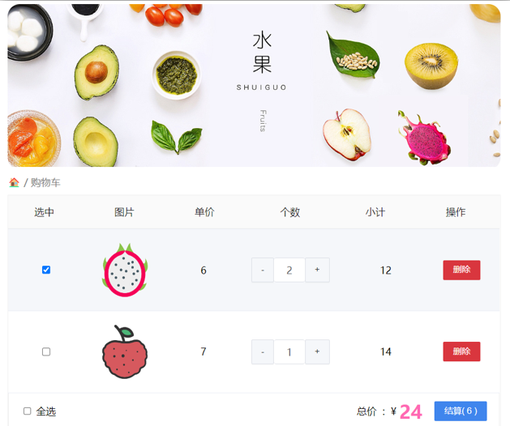
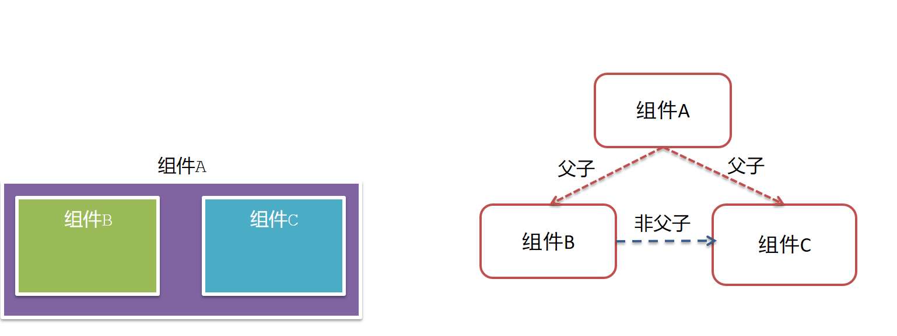
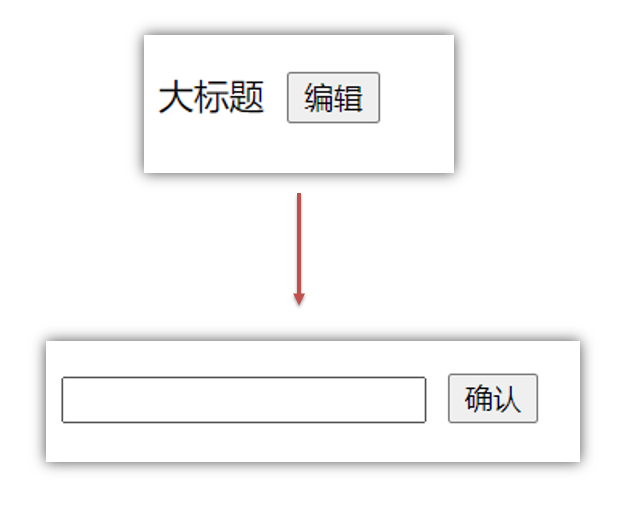
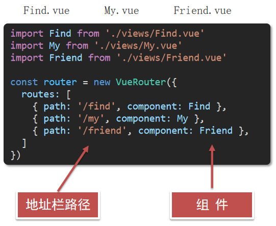
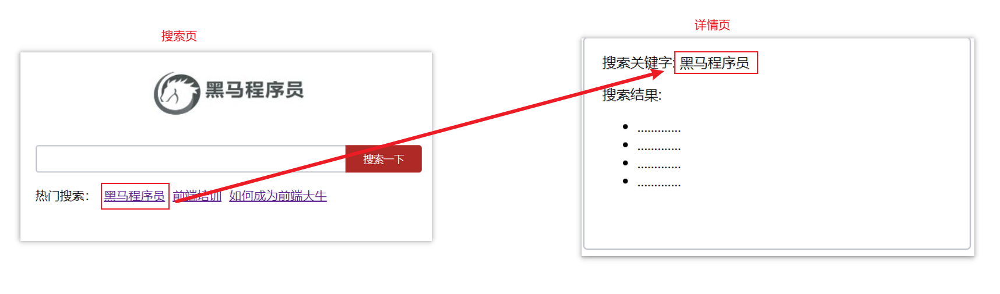
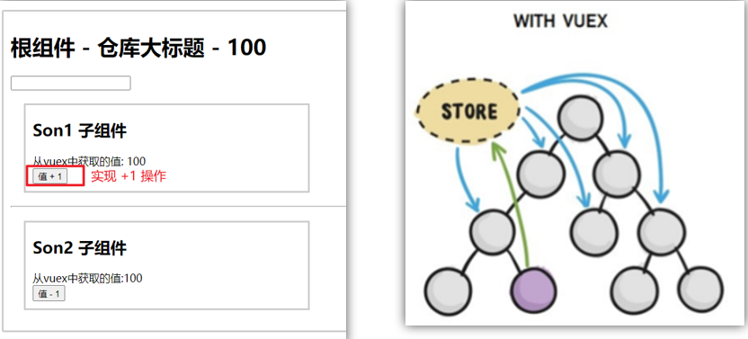
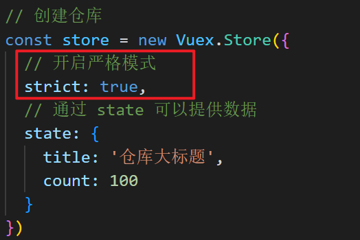
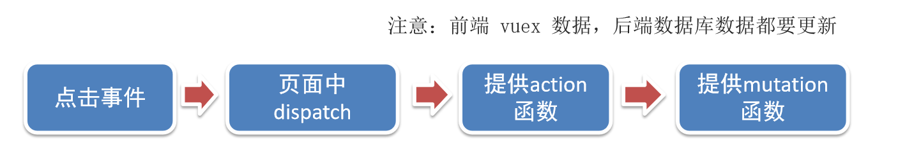

# Vue2

## 一、为什么要学习Vue

1. 前端必备技能
2. 岗位多，绝大互联网公司都在使用Vue
3. 提高开发效率
4. 高薪必备技能（Vue2+Vue3）

## 二、什么是Vue

概念：Vue (读音 /vjuː/，类似于 view) 是一套 **构建用户界面** 的 **渐进式** **框架**

Vue2官网：<https://v2.cn.vuejs.org/>

### 1.什么是构建用户界面

**基于数据**渲染出用户可以看到的**界面**


### 2.什么是渐进式

所谓渐进式就是循序渐进，不一定非得把Vue中的所有API都学完才能开发Vue，可以学一点开发一点

#### Vue的两种开发方式：

1. Vue核心包开发

   场景：局部模块改造

2. Vue核心包&Vue插件&工程化

   场景：整站开发

### 3.什么是框架

所谓框架：就是一套完整的解决方案

**举个栗子**

如果把一个完整的项目比喻为一个装修好的房子，那么框架就是一个毛坯房。

我们只需要在“毛坯房”的基础上，增加功能代码即可。

提到框架，不得不提一下库。

- 库，类似工具箱，是一堆方法的集合，比如 axios、lodash、echarts等
- 框架，是一套完整的解决方案，实现了大部分功能，我们只需要按照一定的规则去编码即可。

下图是 库 和 框架 的对比。


框架的特点：有一套必须让开发者遵守的**规则**或者**约束**

咱们学框架就是学习的这些规则 [官网](https://v2.cn.vuejs.org/)

## 三、创建Vue实例

我们已经知道了Vue框架可以 基于数据帮助我们渲染出用户界面，那应该怎么做呢？


比如就上面这个数据，基于提供好的msg 怎么渲染后右侧可展示的数据呢？

**核心步骤（4步）：**

1. 准备容器
2. 引包（官网） — 开发版本/生产版本
3. 创建Vue实例：new Vue()
4. 指定配置项，渲染数据
    1. el：指定挂载点
    2. data：提供数据


## 四、插值表达式 {{}}

插值表达式是一种Vue的模板语法

我们可以用插值表达式渲染出Vue提供的数据


### 1.作用：利用表达式进行插值，渲染到页面中

表达式：是可以被求值的代码，JS引擎会讲其计算出一个结果

以下的情况都是表达式：

```js
money + 100
money - 100
money * 10
money / 10 
price >= 100 ? '真贵':'还行'
obj.name
arr[0]
fn()
obj.fn()
```

### 2.语法

插值表达式语法：`{{ 表达式 }}`

```vue
<h3>{{title}}</h3>

<p>{{nickName.toUpperCase()}}</p>

<p>{{age >= 18 ? '成年':'未成年'}}</p>

<p>{{obj.name}}</p>

<p>{{fn()}}</p>
```

### 3.错误用法

```vue
1.在插值表达式中使用的数据 必须在data中进行了提供
<p>{{hobby}}</p>  //如果在data中不存在 则会报错

2.支持的是表达式，而非语句，比如：if   for ...
<p>{{if}}</p>

3.不能在标签属性中使用 {{  }} 插值 (插值表达式只能标签中间使用)
<p title="{{username}}">我是P标签</p>
```

## 五、响应式特性

### 1.什么是响应式？

简单理解就是数据变，视图对应变。

### 2.如何访问 和 修改 data中的数据（响应式演示）

data中的数据，最终会被添加到实例上

① 访问数据："实例.属性名"

② 修改数据："实例.属性名" = "值"


## 六、Vue开发者工具安装

1. 通过谷歌应用商店安装（国外网站）
2. 极简插件下载（推荐） <https://chrome.zzzmh.cn/index>

安装步骤：


安装之后可以F12后看到多一个Vue的调试面板


## 七、Vue中的常用指令

**概念：** 指令（Directives）是 Vue 提供的带有 **v-前缀** 的 特殊 标签**属性**。

为啥要学：提高程序员操作 DOM 的效率。

vue 中的指令按照不同的用途可以分为如下 6 大类：

-  内容渲染指令（v-html、v-text）
-  条件渲染指令（v-show、v-if、v-else、v-else-if）
-  事件绑定指令（v-on）
-  属性绑定指令（v-bind）
-  双向绑定指令（v-model）
-  列表渲染指令（v-for）

指令是 vue 开发中最基础、最常用、最简单的知识点。

## 八、内容渲染指令

内容渲染指令用来辅助开发者渲染 DOM 元素的文本内容。常用的内容渲染指令有如下2 个：

- v-text（类似innerText）
  - 使用语法：`<p v-text="uname">hello</p>`，意思是将 uame 值渲染到 p 标签中
  - 类似 innerText，使用该语法，会覆盖 p 标签原有内容
- v-html（类似 innerHTML）
  - 使用语法：`<p v-html="intro">hello</p>`，意思是将 intro 值渲染到 p 标签中
  - 类似 innerHTML，使用该语法，会覆盖 p 标签原有内容
  - 类似 innerHTML，使用该语法，能够将HTML标签的样式呈现出来。

代码演示：

```vue
<div id="app">
    <h2>个人信息</h2>
    // 既然指令是vue提供的特殊的html属性，所以咱们写的时候就当成属性来用即可
    <p v-text="uname">姓名：</p>
    <p v-html="intro">简介：</p>
</div>

<script>
    const app = new Vue({
        el: '#app',
        data: {
            uname: '张三',
            intro: '<h2>这是一个<strong>非常优秀</strong>的boy<h2>'
        }
    })
</script>
```

## 九、条件渲染指令

条件判断指令，用来辅助开发者按需控制 DOM 的显示与隐藏。条件渲染指令有如下两个，分别是：

1. v-show
    1. 作用：控制元素显示隐藏
    2. 语法：v-show = "表达式"，表达式值为 true 显示，false 隐藏
    3. 原理：切换 display:none 控制显示隐藏
    4. 场景：频繁切换显示隐藏的场景

   

2. v-if
    1. 作用：控制元素显示隐藏（条件渲染）
    2. 语法：v-if= "表达式"，表达式值 true 显示，false 隐藏
    3. 原理：基于条件判断，是否创建 或 移除元素节点
    4. 场景：要么显示，要么隐藏，不频繁切换的场景

   

   示例代码：

   ```vue
   <div id="app">
       <div class="box">我是v-show控制的盒子</div>
       <div class="box">我是v-if控制的盒子</div>
   </div>
   
   <script>
       const app = new Vue({
           el: '#app',
           data: {
               flag: false
           }
       })
   </script>
   ```

3. v-else 和 v-else-if
    1. 作用：辅助v-if进行判断渲染
    2. 语法：v-else  v-else-if="表达式"
    3. 需要紧接着v-if使用

```vue
<div id="app">
    <div class="box">我是v-show控制的盒子</div>
    <div class="box">我是v-if控制的盒子</div>
</div>

<script>
    const app = new Vue({
        el: '#app',
        data: {
            flag: false
        }
    })
</script>
```
   
示例代码：

```vue
<div id="app">
    <p>性别：♂ 男</p>
    <p>性别：♀ 女</p>
    <hr>
    <p>成绩评定A：奖励电脑一台</p>
    <p>成绩评定B：奖励周末郊游</p>
    <p>成绩评定C：奖励零食礼包</p>
    <p>成绩评定D：惩罚一周不能玩手机</p>
</div>

<script>
    const app = new Vue({
        el: '#app',
        data: {
            gender: 2,
            score: 95
        }
    })
</script>
```

## 十、事件绑定指令

使用Vue时，如需为DOM注册事件，及其的简单，语法如下：

- \<button v-on:事件名="内联语句">按钮\</button>
- \<button v-on:事件名="处理函数">按钮\</button>
- \<button v-on:事件名="处理函数(实参)">按钮\</button>
- `v-on:` 简写为 **@**

1. 内联语句

```vue
<div id="app">
    <button @click="count--">-</button>
    <span>{{ count }}</span>
    <button v-on:click="count++">+</button>
</div>

<script>
    const app = new Vue({
        el: '#app',
        data: {
            count: 100
        }
    })
</script>
```

2. 事件处理函数

   注意：
    - 事件处理函数应该写到一个跟data同级的配置项（methods）中
    - methods中的函数内部的this都指向Vue实例

```vue
<div id="app">
    <button @click="change">切换显示隐藏</button>
    <h1 v-show="isShow">黑马程序员</h1>
</div>

<script>
    const app = new Vue({
        el: '#app',
        data: {
            isShow: true
        },
        methods: {
            change() {
                this.isShow = !this.isShow
            }
        }
    })
</script>
```

3. 给事件处理函数传参

- 如果不传递任何参数，则方法无需加小括号；methods方法中可以直接使用 e 当做事件对象
- 如果传递了参数，则实参 `$event` 表示事件对象，固定用法。

```vue
<style>
    .box {
        border: 3px solid #000000;
        border-radius: 10px;
        padding: 20px;
        margin: 20px;
        width: 200px;
    }

    h3 {
        margin: 10px 0 20px 0;
    }

    p {
        margin: 20px;
    }
</style>

<div id="app">
    <div class="box">
        <h3>小黑自动售货机</h3>
        <button @click="buy(5, $event)">可乐5元</button>
        <button @click="buy(10, $event)">咖啡10元</button>
        <button @click="buy(8, $event)">牛奶8元</button>
    </div>
    <p>银行卡余额：{{ money }}元</p>
</div>

<script>
    const app = new Vue({
        el: '#app',
        data: {
            money: 1000
        },
        methods: {
            buy(n, $event) {
                this.money -= n
                console.log($event)
            }
        }
    })
</script>
```

## 十一、属性绑定指令

1. 作用：动态设置html的标签属性 比如：src、url、title
2. 语法：v-bind:属性名=“表达式”
3. v-bind：可以简写成 => :

比如，有一个图片，它的 `src` 属性值，是一个图片地址。这个地址在数据 data 中存储。

则可以这样设置属性值：
- ``
- ``（v-bind可以省略）

```vue
<div id="app">
    
    
</div>

<script>
    const app = new Vue({
        el: '#app',
        data: {
            imgUrl: './imgs/10-02.png',
            msg: 'hello 波仔'
        }
    })
</script>
```

## 十二、小案例-波仔的学习之旅

需求：默认展示数组中的第一张图片，点击上一页下一页来回切换数组中的图片

实现思路：
1. 数组存储图片路径 ['url1','url2','url3'，...]
2. 可以准备个下标index 去数组中取图片地址。
3. 通过v-bind给src绑定当前的图片地址
4. 点击上一页下一页只需要修改下标的值即可
5. 当展示第一张的时候，上一页按钮应该隐藏。展示最后一张的时候，下一页按钮应该隐藏

```vue

<div id="app">
    <button @click="changeIndex(-1)" v-show="index > 0">上一页</button>
    <div>
        
    </div>
    <button @click="changeIndex(1)" v-show="index < list.length - 1">下一页</button>
</div>

<script>
    const app = new Vue({
        el: '#app',
        data: {
            list: [
                './imgs/11-00.gif',
                './imgs/11-01.gif',
                './imgs/11-02.gif',
                './imgs/11-03.gif',
                './imgs/11-04.png',
                './imgs/11-05.png',
            ],
            index: 0
        },
        methods: {
            changeIndex(n) {
                this.index += n
            },
            getImageSrc() {
                return this.list[this.index]
            }
        }
    })
</script>
```

## 十三、列表渲染指令

Vue 提供了 v-for 列表渲染指令，用来辅助开发者基于一个数组来循环渲染一个列表结构。

v-for 指令需要使用 `(item, index) in arr` 形式的特殊语法，其中：

- item 是数组中的每一项
- index 是每一项的索引，不需要可以省略
- arr 是被遍历的数组

此语法也可以遍历**对象和数字**

```vue
//遍历对象
<div v-for="(value, key, index) in object">{{value}}</div>
value:对象中的值
key:对象中的键
index:遍历索引从0开始

//遍历数字
<p v-for="item in 10">{{item}}</p>
item从1 开始
```

```vue
<div id="app">
    <h3>小黑水果店</h3>
    <ul>
        <li v-for="(item, index) in list">
            {{ item }} - {{ index }}
        </li>
    </ul>
</div>

<script>
    const app = new Vue({
        el: '#app',
        data: {
            list: [
                '西瓜',
                '苹果',
                '鸭梨',
                '榴莲'
            ]
        }
    })
</script>
```

## 十四、小案例-小黑的书架

需求：

1. 根据左侧数据渲染出右侧列表（v-for）
2. 点击删除按钮时，应该把当前行从列表中删除（获取当前行的id，利用filter进行过滤）


准备代码：

```vue
    <div id="app">
    <h3>小黑的书架</h3>
    <ul>
        <li v-for="(item, index) in booksList" :key="item.id">
            <span>{{ item.name }}</span>
            <span>{{ item.author }}</span>
            <button @click="del(item.id)">删除</button>
        </li>
    </ul>
</div>

<script>
    const app = new Vue({
        el: '#app',
        data: {
            booksList: [
                {id: 1, name: '《红楼梦》', author: '曹雪芹'},
                {id: 2, name: '《西游记》', author: '吴承恩'},
                {id: 3, name: '《水浒传》', author: '施耐庵'},
                {id: 4, name: '《三国演义》', author: '罗贯中'}
            ]
        },
        methods: {
            del(id) {
                this.booksList = this.booksList.filter(e => e.id !== id)
            }
        }
    })
</script>
```

## 十五、v-for中的key

**语法**：key="唯一值"

**作用**：给列表项添加的**唯一标识**。便于Vue进行列表项的**正确排序复用**。

**为什么加key**：Vue 的默认行为会尝试原地修改元素（**就地复用**）

实例代码：

```vue
<ul>
    <li v-for="(item, index) in booksList" :key="item.id">
        <span>{{ item.name }}</span>
        <span>{{ item.author }}</span>
        <button @click="del(item.id)">删除</button>
    </li>
</ul>
```

注意：
1. key 的值只能是字符串或数字类型
2. key 的值必须具有唯一性
3. 推荐使用 id 作为 key（唯一），不推荐使用 index 作为 key（会变化，不对应）

## 十六、双向绑定指令

所谓双向绑定就是：
1. 数据改变后，呈现的页面结果会更新
2. 页面结果更新后，数据也会随之而变

**作用**： 给**表单元素**（input、radio、select）使用，双向绑定数据，可以快速 **获取** 或 **设置** 表单元素内容

**语法**：v-model="变量"

**需求**：使用双向绑定实现以下需求

1. 点击登录按钮获取表单中的内容
2. 点击重置按钮清空表单中的内容


```vue
<div id="app">
    账户：<input type="text"> <br><br>
    密码：<input type="password"> <br><br>
    <button>登录</button>
    <button>重置</button>
</div>

<script>
    const app = new Vue({
        el: '#app',
        data: {
            username: '',
            password: ''
        }
    })
</script>
```

## 十七、综合案例-小黑记事本


**功能需求：**

1. 列表渲染
2. 删除功能
3. 添加功能
4. 底部统计 和 清空

## 十八、指令修饰符

### 1.什么是指令修饰符？

所谓指令修饰符就是通过“.”指明一些指令**后缀**不同的**后缀**封装了不同的处理操作 —> 简化代码

### 2.按键修饰符

- @keyup.enter  —>当点击enter键的时候才触发

代码演示：

```vue
<div id="app">
    <h3>@keyup.enter → 监听键盘回车事件</h3>
    <input v-model="username" type="text">
</div>

<script>
    const app = new Vue({
        el: '#app',
        data: {
            username: ''
        },
        methods: {}
    })
</script>
```

### 3.v-model修饰符

- v-model.trim —> 去除首位空格
- v-model.number —> 转数字

### 4.事件修饰符

- @事件名.stop —> 阻止冒泡
- @事件名.prevent  —>阻止默认行为
- @事件名.stop.prevent —>可以连用 即阻止事件冒泡也阻止默认行为

```vue
<style>
    .father {
        width: 200px;
        height: 200px;
        background-color: pink;
        margin-top: 20px;
    }

    .son {
        width: 100px;
        height: 100px;
        background-color: skyblue;
    }
</style>

<div id="app">
    <h3>v-model修饰符 .trim .number</h3>
    姓名：<input v-model="username" type="text"><br>
    年纪：<input v-model="age" type="text"><br>


    <h3>@事件名.stop → 阻止冒泡</h3>
    <div @click="fatherFn" class="father">
        <div @click.stop="sonFn" class="son">儿子</div>
    </div>

    <h3>@事件名.prevent → 阻止默认行为</h3>
    <a @click.prevent href="http://www.baidu.com">阻止默认行为</a>
</div>

<script>
    const app = new Vue({
        el: '#app',
        data: {
            username: '',
            age: '',
        },
        methods: {
            fatherFn() {
                alert('老父亲被点击了')
            },
            sonFn(e) {
                // e.stopPropagation()
                alert('儿子被点击了')
            }
        }
    })
</script>
```

## 十九、v-bind对样式控制的增强-操作class

为了方便开发者进行样式控制，Vue 扩展了 v-bind 的语法，可以针对 **class 类名** 和 **style 行内样式** 进行控制。

### 1.语法

```html
<div :class="对象/数组">这是一个div</div>
```

### 2.对象语法

当class动态绑定的是**对象**时，**键就是类名，值就是布尔值**，如果值是**true**，就有这个类，否则没有这个类

```html
<div class="box" :class="{ 类名1: 布尔值, 类名2: 布尔值 }"></div>
```

适用场景：一个类名，来回切换

### 3.数组语法

当class动态绑定的是**数组**时 → 数组中所有的类，都会添加到盒子上，本质就是一个 class 列表

```html
<div class="box" :class="[ 类名1, 类名2, 类名3 ]"></div>
```

使用场景：批量添加或删除类

### 4.代码练习

```vue
<style>
    .box {
        width: 200px;
        height: 200px;
        border: 3px solid #000;
        font-size: 30px;
        margin-top: 10px;
    }

    .pink {
        background-color: pink;
    }

    .big {
        width: 300px;
        height: 300px;
    }
</style>


<div id="app">
    <!--绑定对象-->
    <div class="box" :class="{pink: true, big: true}">黑马程序员</div>
    <!--绑定数组-->
    <div class="box" :class="['pink', 'big']">黑马程序员</div>
</div>

<script>
    const app = new Vue({
        el: '#app',
        data: {}
    })
</script>
```

## 二十、京东秒杀-tab栏切换导航高亮

### 1.需求

当我们点击哪个tab页签时，哪个tab页签就高亮

### 2.准备代码

```vue
<style>
    * {
        margin: 0;
        padding: 0;
    }

    ul {
        display: flex;
        border-bottom: 2px solid #e01222;
        padding: 0 10px;
    }

    li {
        width: 100px;
        height: 50px;
        line-height: 50px;
        list-style: none;
        text-align: center;
    }

    li a {
        display: block;
        text-decoration: none;
        font-weight: bold;
        color: #333333;
    }

    li a.active {
        background-color: #e01222;
        color: #fff;
    }

</style>

<div id="app">
    <ul>
        <li v-for="(item, index) in list" :key="item.id">
            <a href="#" :class="getActiveClass(index)" @click="change(index)">{{ item.name }}</a>
        </li>
    </ul>
</div>

<script>
    const app = new Vue({
        el: '#app',
        data: {
            list: [
                {id: 1, name: '京东秒杀'},
                {id: 2, name: '每日特价'},
                {id: 3, name: '品类秒杀'}
            ],
            activeIndex: 0
        },
        methods: {
            change(index) {
                this.activeIndex = index
            },
            getActiveClass(index) {
                return this.activeIndex === index ? 'active' : null
            }
        }
    })
</script>
```

### 3.思路

1. 基于数据，动态渲染tab（v-for）
2. 准备一个下标 记录高亮的是哪一个 tab
3. 基于下标动态切换class的类名

## 二一、v-bind对有样式控制的增强-操作style

### 1.语法

```html
<div class="box" :style="{ CSS属性名1: CSS属性值, CSS属性名2: CSS属性值 }"></div>
```

### 2.代码练习

```vue
<style>
    .box {
        width: 200px;
        height: 200px;
        background-color: rgb(187, 150, 156);
    }
</style>
<div id="app">
    <div class="box" :style="{ width: '400px', height: '400px', 'background-color': 'red' }"></div>
</div>

<script>
    const app = new Vue({
        el: '#app',
        data: {}
    })
</script>
```

### 3.进度条案例

```vue
<style>
    .progress {
        height: 25px;
        width: 400px;
        border-radius: 15px;
        background-color: #272425;
        border: 3px solid #272425;
        box-sizing: border-box;
        margin-bottom: 30px;
    }

    .inner {
        width: 50%;
        height: 20px;
        border-radius: 10px;
        text-align: right;
        position: relative;
        background-color: #409eff;
        background-size: 20px 20px;
        box-sizing: border-box;
        transition: all 1s;
    }

    .inner span {
        position: absolute;
        right: -20px;
        bottom: -25px;
    }
</style>

<div id="app">
    <div class="progress">
        <div class="inner" :style="{ width: percentage + '%' }">
            <span>{{ percentage }}%</span>
        </div>
    </div>
    <button @click="setting(25)">设置25%</button>
    <button @click="setting(50)">设置50%</button>
    <button @click="setting(75)">设置75%</button>
    <button @click="setting(100)">设置100%</button>
</div>

<script>
    const app = new Vue({
        el: '#app',
        data: {
            percentage: 50
        },
        methods: {
            setting(num) {
                this.percentage = num
            }
        }
    })
</script>
```

## 二二、v-model在其他表单元素的使用

### 1.讲解内容

常见的表单元素都可以用 v-model 绑定关联  →  快速 **获取** 或 **设置** 表单元素的值

它会根据**控件类型**自动选取**正确的方法**来更新元素

```text
输入框   input:text     ——> value
文本域   textarea	   ——> value
复选框   input:checkbox ——> checked
单选框   input:radio    ——> checked
下拉菜单 select         ——> value
...
```

### 2.代码准备

```vue
<style>
    textarea {
        display: block;
        width: 240px;
        height: 100px;
        margin: 10px 0;
    }
</style>
<div id="app">
    <h3>小黑学习网</h3>
    姓名：
    <input type="text" v-model="name">
    <br><br>
    是否单身：
    <input type="checkbox" v-model="isSingle">
    <br><br>
    <!--
      前置理解：
        1. name:  给单选框加上 name 属性 可以分组 → 同一组互相会互斥
        2. value: 给单选框加上 value 属性，用于提交给后台的数据
      结合 Vue 使用 → v-model
    -->
    性别:
    <input type="radio" name="gender" value="1" v-model="gender">男
    <input type="radio" name="gender" value="2" v-model="gender">女
    <br><br>
    <!--
      前置理解：
        1. option 需要设置 value 值，提交给后台
        2. select 的 value 值，关联了选中的 option 的 value 值
      结合 Vue 使用 → v-model
    -->
    所在城市:
    <select v-model="city">
        <option value="BeiJing">北京</option>
        <option value="ShangHai">上海</option>
        <option value="ChengDu">成都</option>
        <option value="NanJing">南京</option>
    </select>
    <br><br>
    自我描述：
    <textarea v-model="describe"></textarea>
    <button @click="log">立即注册</button>
</div>

<script>
    const app = new Vue({
        el: '#app',
        data: {
            name: '',
            isSingle: false,
            gender: 1,
            city: 'BeiJing',
            describe: ''
        },
        methods: {
            log() {
                console.log(this.name, this.isSingle, this.gender, this.city, this.describe)
            }
        }
    })
</script>
```

## 二三、computed计算属性

### 1.概念

基于**现有的数据**，计算出来的**新属性**。**依赖**的数据变化，**自动**重新计算。

### 2.语法

1. 声明在 **computed 配置项**中，一个计算属性对应一个函数
2. 使用起来和普通属性一样使用 {{ 计算属性名 }}

### 3.注意

1. computed配置项和data配置项是**同级**的
2. computed中的计算属性**虽然是函数的写法**，但他**依然是个属性**
3. computed中的计算属性**不能**和data中的属性**同名**
4. 使用computed中的计算属性和使用data中的属性是一样的用法
5. computed中计算属性内部的**this**依然**指向的是Vue实例**

### 4.案例

比如我们可以使用计算属性实现下面这个业务场景


### 5.代码准备

```vue
<style>
    table {
        border: 1px solid #000;
        text-align: center;
        width: 240px;
    }

    th, td {
        border: 1px solid #000;
    }

    h3 {
        position: relative;
    }
</style>

<div id="app">
    <h3>小黑的礼物清单</h3>
    <table>
        <tr>
            <th>名字</th>
            <th>数量</th>
        </tr>
        <tr v-for="(item, index) in list" :key="item.id">
            <td>{{ item.name }}</td>
            <td>{{ item.num }}个</td>
        </tr>
    </table>

    <!-- 目标：统计求和，求得礼物总数 -->
    <p>礼物总数：{{ totalCount }} 个</p>
</div>

<script>
    const app = new Vue({
        el: '#app',
        data: {
            // 现有的数据
            list: [
                {id: 1, name: '篮球', num: 1},
                {id: 2, name: '玩具', num: 2},
                {id: 3, name: '铅笔', num: 5},
            ]
        },
        computed: {
            totalCount() {
                return this.list.reduce((p, c) => p + c.num, 0)
            }
        }
    })
</script>
```

## 二四、computed计算属性 VS methods方法

### 1.computed计算属性

作用：封装了一段对于**数据**的处理，求得一个**结果**

语法：

1. 写在computed配置项中
2. 作为属性，直接使用
   - js中使用计算属性： this.计算属性
   - 模板中使用计算属性：{{计算属性}}

### 2.methods计算属性

作用：给Vue实例提供一个**方法**，调用以**处理业务逻辑**。

语法：
1. 写在methods配置项中
2. 作为方法调用
    - js中调用：this.方法名()
    - 模板中调用 {{方法名()}} 或者 @事件名=“方法名”

### 3.计算属性的优势

1. 缓存特性（提升性能）

   计算属性会对计算出来的结果缓存，再次使用直接读取缓存，

   依赖项变化了，会自动重新计算 → 并再次缓存

2. methods没有缓存特性

3. 通过代码比较

```vue
<style>
    table {
        border: 1px solid #000;
        text-align: center;
        width: 300px;
    }

    th, td {
        border: 1px solid #000;
    }

    h3 {
        position: relative;
    }

    span {
        position: absolute;
        left: 145px;
        top: -4px;
        width: 16px;
        height: 16px;
        color: white;
        font-size: 12px;
        text-align: center;
        border-radius: 50%;
        background-color: #e63f32;
    }
</style>

<div id="app">
    <h3>小黑的礼物清单🛒<span>{{ totalCount }}}</span></h3>
    <h3>小黑的礼物清单🛒<span>{{ totalCount }}}</span></h3>
    <h3>小黑的礼物清单🛒<span>{{ totalCount }}}</span></h3>
    <h3>小黑的礼物清单🛒<span>{{ totalCount }}}</span></h3>
    <h3>小黑的礼物清单🛒<span>{{ totalCount }}}</span></h3>
    <table>
        <tr>
            <th>名字</th>
            <th>数量</th>
        </tr>
        <tr v-for="(item, index) in list" :key="item.id">
            <td>{{ item.name }}</td>
            <td>{{ item.num }}个</td>
        </tr>
    </table>

    <p>礼物总数：{{ totalCount }} 个</p>
</div>

<script>
    const app = new Vue({
        el: '#app',
        data: {
            // 现有的数据
            list: [
                {id: 1, name: '篮球', num: 3},
                {id: 2, name: '玩具', num: 2},
                {id: 3, name: '铅笔', num: 5},
            ]
        },
        computed: {
            totalCount() {
                let total = this.list.reduce((sum, item) => sum + item.num, 0)
                console.log(total)
                return total
            }
        }
    })
</script>
```

### 4.总结

1. computed**有缓存特性**，methods**没有缓存**
2. 当一个结果依赖其他多个值时，推荐使用计算属性
3. 当处理业务逻辑时，推荐使用methods方法，比如事件的处理函数

## 二五、计算属性的完整写法

**既然计算属性也是属性，能访问，应该也能修改了？**

1. 计算属性默认的简写，只能读取访问，不能 "修改"
2. 如果要 "修改" → 需要写计算属性的完整写法


完整写法代码演示

```vue
<div id="app">
    姓：<input type="text" v-model="firstName"> +
    名：<input type="text" v-model="lastName"> =
    <span>{{ fullName }}</span><br><br>
    <button @click="changeName">改名卡</button>
</div>

<script>
    const app = new Vue({
        el: '#app',
        data: {
            firstName: '刘',
            lastName: '备'
        },
        computed: {
            fullName: {
                get() {
                    return this.firstName + this.lastName
                },
                set(name) {
                    this.firstName = name.slice(0, 1)
                    this.lastName = name.slice(1)
                }
            }
        },
        methods: {
            changeName() {
                this.fullName = '吕布'
            }
        }
    })
</script>
```

## 二六、综合案例-成绩案例


功能描述：
1. 渲染功能
2. 删除功能
3. 添加功能
4. 统计总分，求平均分

思路分析：
1. 渲染功能：v-for :key v-bind: 动态绑定class的样式
2. 删除功能：v-on绑定事件，阻止a标签的默认行为
3. v-model的修饰符 .trim、.number、判断数据是否为空后 再添加、添加后清空文本框的数据
4. 使用计算属性 computed 计算总分和平均分的值

## 二七、watch侦听器（监视器）

### 1.作用：

**监视数据变化**，执行一些业务逻辑或异步操作

### 2.语法：

1. watch同样声明在跟data同级的配置项中
2. 简单写法：简单类型数据直接监视
3. 完整写法：添加额外配置项

   ```vue
   data: {
       words: '苹果',
       obj: {
           words: '苹果'
       }
   },
   
   watch: {
       // 该方法会在数据变化时，触发执行
       数据属性名(newValue, oldValue) {
           // ...
       },
       '对象.属性名'(newValue, oldValue) {
           // ...
       }
   }
   ```

### 3.翻译案例

```vue
<style>
    * {
        margin: 0;
        padding: 0;
        box-sizing: border-box;
        font-size: 18px;
    }

    #app {
        padding: 10px 20px;
    }

    .query {
        margin: 10px 0;
    }

    .box {
        display: flex;
    }

    textarea {
        width: 300px;
        height: 160px;
        font-size: 18px;
        border: 1px solid #dedede;
        outline: none;
        resize: none;
        padding: 10px;
    }

    textarea:hover {
        border: 1px solid #1589f5;
    }

    .transbox {
        width: 300px;
        height: 160px;
        background-color: #f0f0f0;
        padding: 10px;
        border: none;
    }

    .tip-box {
        width: 300px;
        height: 25px;
        line-height: 25px;
        display: flex;
    }

    .tip-box span {
        flex: 1;
        text-align: center;
    }

    .query span {
        font-size: 18px;
    }

    .input-wrap {
        position: relative;
    }

    .input-wrap span {
        position: absolute;
        right: 15px;
        bottom: 15px;
        font-size: 12px;
    }

    .input-wrap i {
        font-size: 20px;
        font-style: normal;
    }
</style>

<div id="app">
    <!-- 条件选择框 -->
    <div class="query">
        <span>翻译成的语言：</span>
        <select>
            <option value="italy">意大利</option>
            <option value="english">英语</option>
            <option value="german">德语</option>
        </select>
    </div>

    <!-- 翻译框 -->
    <div class="box">
        <div class="input-wrap">
            <textarea v-model="words"></textarea>
            <span><i>⌨️</i>文档翻译</span>
        </div>
        <div class="output-wrap">
            <div class="transbox">{{ result }}</div>
        </div>
    </div>
</div>

<script>

    const app = new Vue({
        el: '#app',
        data: {
            words: '',
            timer: null,
            result: ''
        },
        watch: {
            words(newValue) {
                if (this.timer) {
                    clearTimeout(this.timer)
                }
                this.timer = setTimeout(async () => {
                    const res = await axios({
                        url: 'https://applet-base-api-t.itheima.net/api/translate',
                        params: {
                            words: newValue
                        }
                    })

                    this.result = res.data.data
                }, 300)
            }
        }
    })
</script>
```

## 二八、watch侦听器

### 1.语法

完整写法 —> 添加额外的配置项

1. deep: true 对复杂类型进行深度监听
2. immdiate: true 初始化时立刻执行一次

```vue
data: {
    obj: {
        words: '苹果',
        lang: 'italy'
    },
},

watch: { // watch 完整写法
    对象: {
        deep: true, // 深度监视
        immediate: true, //立即执行handler函数
        handler (newValue) {
            console.log(newValue)
        }
    }
}
```

### 2. 需求


- 当文本框输入的时候 右侧翻译内容要时时变化
- 当下拉框中的语言发生变化的时候 右侧翻译的内容依然要时时变化
- 如果文本框中有默认值的话要立即翻译

### 3.代码实现

```vue
<style>
    * {
        margin: 0;
        padding: 0;
        box-sizing: border-box;
        font-size: 18px;
    }

    #app {
        padding: 10px 20px;
    }

    .query {
        margin: 10px 0;
    }

    .box {
        display: flex;
    }

    textarea {
        width: 300px;
        height: 160px;
        font-size: 18px;
        border: 1px solid #dedede;
        outline: none;
        resize: none;
        padding: 10px;
    }

    textarea:hover {
        border: 1px solid #1589f5;
    }

    .transbox {
        width: 300px;
        height: 160px;
        background-color: #f0f0f0;
        padding: 10px;
        border: none;
    }

    .tip-box {
        width: 300px;
        height: 25px;
        line-height: 25px;
        display: flex;
    }

    .tip-box span {
        flex: 1;
        text-align: center;
    }

    .query span {
        font-size: 18px;
    }

    .input-wrap {
        position: relative;
    }

    .input-wrap span {
        position: absolute;
        right: 15px;
        bottom: 15px;
        font-size: 12px;
    }

    .input-wrap i {
        font-size: 20px;
        font-style: normal;
    }
</style>

<div id="app">
    <!-- 条件选择框 -->
    <div class="query">
        <span>翻译成的语言：</span>
        <select v-model="item.lang">
            <option value="italy">意大利</option>
            <option value="english">英语</option>
            <option value="german">德语</option>
        </select>
    </div>

    <!-- 翻译框 -->
    <div class="box">
        <div class="input-wrap">
            <textarea v-model="item.words"></textarea>
            <span><i>⌨️</i>文档翻译</span>
        </div>
        <div class="output-wrap">
            <div class="transbox">{{ result }}</div>
        </div>
    </div>
</div>

<script>

    const app = new Vue({
        el: '#app',
        data: {
            item: {
                words: '',
                lang: 'italy'
            },
            timer: null,
            result: '',

        },
        watch: {
            item: {
                handler(newValue) {
                    if (this.timer) {
                        clearTimeout(this.timer)
                    }
                    this.timer = setTimeout(async () => {
                        const res = await axios({
                            url: 'https://applet-base-api-t.itheima.net/api/translate',
                            params: {
                                words: newValue
                            }
                        })

                        this.result = res.data.data
                    }, 300)
                },
                deep: true
            },
        }
    })
</script>
```

### 4.总结

watch侦听器的写法有几种？

1. 简单写法

```vue
watch: {
    数据属性名 (newValue, oldValue) {
        // ...
    },
    '对象.属性名' (newValue, oldValue) {
        // ...
    }
}
```

2. 完整写法

```vue
watch: {// watch 完整写法
    数据属性名: {
        deep: true, // 深度监视(针对复杂类型)
        immediate: true, // 是否立刻执行一次handler
        handler(newValue) {
            console.log(newValue)
        }
    }
}
```

## 二九、综合案例

购物车案例



需求说明：
1. 渲染功能
2. 删除功能
3. 修改个数
4. 全选反选
5. 统计 选中的 总价 和 总数量
6. 持久化到本地

实现思路：
1. 基本渲染：v-for遍历、:class动态绑定样式
2. 删除功能：v-on 绑定事件，获取当前行的id
3. 修改个数：v-on绑定事件，获取当前行的id，进行筛选出对应的项然后增加或减少
4. 全选反选
   1. 必须所有的小选框都选中，全选按钮才选中 → every
   2. 如果全选按钮选中，则所有小选框都选中
   3. 如果全选取消，则所有小选框都取消选中
   4. 声明计算属性，判断数组中的每一个checked属性的值，看是否需要全部选
5. 统计选中的总价和总数量：通过计算属性来计算**选中的**总价和总数量
6. 持久化到本地：在数据变化时都要更新下本地存储 watch

## 三十、Vue生命周期

思考：什么时候可以发送初始化渲染请求？（越早越好）什么时候可以开始操作dom？（至少dom得渲染出来）

Vue生命周期：就是一个Vue实例从创建到销毁的整个过程。

生命周期四个阶段：① 创建 ② 挂载 ③ 更新 ④ 销毁

1. 创建阶段：创建响应式数据
2. 挂载阶段：渲染模板
3. 更新阶段：修改数据，更新视图
4. 销毁阶段：销毁Vue实例


## 三一、Vue生命周期钩子

Vue生命周期过程中，会**自动运行一些函数**，被称为【**生命周期钩子**】→  让开发者可以在【**特定阶段**】运行**自己的代码**


```vue
<div id="app">
    <h3>{{ title }}</h3>
    <div>
        <button @click="count--">-</button>
        <span>{{ count }}</span>
        <button @click="count++">+</button>
    </div>
</div>

<script>
    const app = new Vue({
        el: '#app',
        data: {
            count: 100,
            title: '计数器'
        },
        // 1. 创建阶段（准备数据）
        beforeCreate() {
            console.log('beforeCreate')
        },
        created() {
            console.log('created')
        },
        // 2. 挂载阶段（渲染模板）
        beforeMount() {
            console.log('beforeMount')
        },
        mounted() {
            console.log('mounted')
        },
        // 3. 更新阶段(修改数据 → 更新视图)
        beforeUpdate() {
            console.log('beforeUpdate')
        },
        updated() {
            console.log('updated')
        },
        // 4. 卸载阶段
        beforeDestroy() {
            console.log('beforeDestroy')
        },
        destroyed() {
            console.log('destroyed')
        }
    })
</script>
```

## 三二、生命周期钩子小案例

### 1.在created中发送数据

```vue
<style>
    * {
        margin: 0;
        padding: 0;
        list-style: none;
    }

    .news {
        display: flex;
        height: 120px;
        width: 600px;
        margin: 0 auto;
        padding: 20px 0;
        cursor: pointer;
    }

    .news .left {
        flex: 1;
        display: flex;
        flex-direction: column;
        justify-content: space-between;
        padding-right: 10px;
    }

    .news .left .title {
        font-size: 20px;
    }

    .news .left .info {
        color: #999999;
    }

    .news .left .info span {
        margin-right: 20px;
    }

    .news .right {
        width: 160px;
        height: 120px;
    }

    .news .right img {
        width: 100%;
        height: 100%;
        object-fit: cover;
    }
</style>

<div id="app">
    <ul>
        <li class="news" v-for="(item, index) in list" :key="item.id">
            <div class="left">
                <div class="title">{{ item.title }}</div>
                <div class="info">
                    <span>{{ item.source }}</span>
                    <span>{{ item.time }}</span>
                </div>
            </div>
            <div class="right">
                
            </div>
        </li>
    </ul>
</div>

<script>
    // 接口地址：http://hmajax.itheima.net/api/news
    // 请求方式：get
    const app = new Vue({
        el: '#app',
        data: {
            list: []
        },
        async created() {
            const res = await axios.get('http://hmajax.itheima.net/api/news')
            this.list = res.data.data
            console.log(this.list)
        }
    })
</script>
```

### 2.在mounted中获取焦点

```vue
<style>
    html,
    body {
        height: 100%;
    }

    .search-container {
        position: absolute;
        top: 30%;
        left: 50%;
        transform: translate(-50%, -50%);
        text-align: center;
    }

    .search-container .search-box {
        display: flex;
    }

    .search-container img {
        margin-bottom: 30px;
    }

    .search-container .search-box input {
        width: 512px;
        height: 16px;
        padding: 12px 16px;
        font-size: 16px;
        margin: 0;
        vertical-align: top;
        outline: 0;
        box-shadow: none;
        border-radius: 10px 0 0 10px;
        border: 2px solid #c4c7ce;
        background: #fff;
        color: #222;
        overflow: hidden;
        box-sizing: content-box;
        -webkit-tap-highlight-color: transparent;
    }

    .search-container .search-box button {
        cursor: pointer;
        width: 112px;
        height: 44px;
        line-height: 41px;
        line-height: 42px;
        background-color: #ad2a27;
        border-radius: 0 10px 10px 0;
        font-size: 17px;
        box-shadow: none;
        font-weight: 400;
        border: 0;
        outline: 0;
        letter-spacing: normal;
        color: white;
    }

    body {
        background: no-repeat center /cover;
        background-color: #edf0f5;
    }
</style>

<div class="container" id="app">
    <div class="search-container">
        
        <div class="search-box">
            <input type="text" v-model="words" id="inp">
            <button>搜索一下</button>
        </div>
    </div>
</div>

<script src="../../js/vue.js"></script>
<script>
    const app = new Vue({
        el: '#app',
        data: {
            words: ''
        },
        mounted() {
            document.querySelector('#inp').focus()
        }
    })
</script>
```

## 三三、案例-小黑记账清单

### 1.需求图示：


### 2.需求分析

1. 基本渲染
2. 添加功能
3. 删除功能
4. 饼图渲染

### 3.思路分析

1. 基本渲染
   - 立刻发送请求获取数据 created
   - 拿到数据，存到data的响应式数据中
   - 结合数据，进行渲染 v-for
   - 消费统计  —> 计算属性
2. 添加功能
   - 收集表单数据 v-model，使用指令修饰符处理数据
   - 给添加按钮注册点击事件，对输入的内容做非空判断，发送请求
   - 请求成功后，对文本框内容进行清空
   - 重新渲染列表
3. 删除功能
   - 注册点击事件，获取当前行的id
   - 根据id发送删除请求
   - 需要重新渲染
4. 饼图渲染
   - 初始化一个饼图 echarts.init(dom)    mounted钩子中渲染
   - 根据数据试试更新饼图 echarts.setOptions({...})

### 4.代码准备

```vue
<div id="app">
    <div class="contain">
        <!-- 左侧列表 -->
        <div class="list-box">

            <!-- 添加资产 -->
            <form class="my-form">
                <input type="text" class="form-control" placeholder="消费名称" v-model.trim="name"/>
                <input type="text" class="form-control" placeholder="消费价格" v-model.number="price"/>
                <button type="button" class="btn btn-primary" @click="add">添加账单</button>
            </form>

            <table class="table table-hover">
                <thead>
                    <tr>
                        <th>编号</th>
                        <th>消费名称</th>
                        <th>消费价格</th>
                        <th>操作</th>
                    </tr>
                </thead>
                <tbody>
                    <tr v-for="(item, index) in list" :key="item.id">
                        <td>{{ index + 1 }}</td>
                        <td>{{ item.name }}</td>
                        <td :class="{ red: item.price > 500 }">{{ item.price.toFixed(2) }}</td>
                        <td><a href="javascript:;" @click="del(item.id)">删除</a></td>
                    </tr>
                </tbody>
                <tfoot>
                    <tr>
                        <td colspan="4">消费总计：{{ totalPrice.toFixed(2) }}</td>
                    </tr>
                </tfoot>
            </table>
        </div>

        <!-- 右侧图表 -->
        <div class="echarts-box" id="main"></div>
    </div>
</div>

<script>
    /**
     * 接口文档地址：
     * https://www.apifox.cn/apidoc/shared-24459455-ebb1-4fdc-8df8-0aff8dc317a8/api-53371058
     *
     * 功能需求：
     * 1. 基本渲染
     * 2. 添加功能
     * 3. 删除功能
     * 4. 饼图渲染
     */
    const app = new Vue({
        el: '#app',
        data: {
            list: [],
            name: '',
            price: null
        },
        computed: {
            totalPrice() {
                return this.list.reduce((p, c) => p + c.price, 0)
            }
        },
        async created() {
            await this.getList()
        },
        methods: {
            async getList() {
                const res = await axios.get('https://applet-base-api-t.itheima.net/bill', {
                    params: {
                        creator: '小黑'
                    }
                })
                this.list = res.data.data

                this.myCharts.setOption({
                    series: [
                        {
                            data: this.list.map(ie => ({name: ie.name, value: ie.price}))
                        }
                    ]
                })
            },
            async add() {
                if (!this.name) {
                    return alert('请输入消费名称')
                }

                if (typeof this.price !== 'number') {
                    return alert('请输入正确的消费名称')
                }

                await axios.post('https://applet-base-api-t.itheima.net/bill', {
                    creator: '小黑',
                    name: this.name,
                    price: this.price
                })

                this.getList()
                this.name = ''
                this.price = null
            },
            async del(id) {
                await axios.delete(`https://applet-base-api-t.itheima.net/bill/${id}`)

                this.getList()
            }
        },
        async mounted() {
            this.myCharts = echarts.init(document.querySelector('#main'))

            this.myCharts.setOption({
                title: {
                    text: '消费账单列表',
                    left: 'center'
                },
                tooltip: {
                    trigger: 'item'
                },
                legend: {
                    orient: 'vertical',
                    left: 'left'
                },
                series: [
                    {
                        name: '消费账单',
                        type: 'pie',
                        radius: '50%',
                        data: [],
                        emphasis: {
                            itemStyle: {
                                shadowBlur: 10,
                                shadowOffsetX: 0,
                                shadowColor: 'rgba(0, 0, 0, 0.5)'
                            }
                        }
                    }
                ]
            })
        }
    })
</script>
```

## 三四、工程化开发和脚手架

### 1.开发Vue的两种方式

- 核心包传统开发模式：基于html / css / js 文件，直接引入核心包，开发 Vue。
- **工程化开发模式：基于构建工具（例如：webpack）的环境中开发Vue。**


工程化开发模式优点：

提高编码效率，比如使用JS新语法、Less/Sass、Typescript等通过webpack都可以编译成浏览器识别的ES3/ES5/CSS等

工程化开发模式问题：

- webpack配置**不简单**
- **雷同**的基础配置
- 缺乏**统一的标准**

为了解决以上问题，所以我们需要一个工具，生成标准化的配置

### 2.脚手架Vue CLI

#### 2.1 基本介绍

Vue CLI 是Vue官方提供的一个**全局命令工具**

可以帮助我们**快速创建**一个开发Vue项目的**标准化基础架子**。【集成了webpack配置】

#### 2.2 好处

1. 开箱即用，零配置
2. 内置babel等工具
3. 标准化的webpack配置

#### 2.3 使用步骤：

1. 全局安装（只需安装一次即可）`yarn global add @vue/cli`或者`npm i @vue/cli -g`
2. 查看vue/cli版本：`vue --version`
3. 创建项目架子：**vue create project-name**(项目名不能使用中文)
4. 启动项目：**yarn serve** 或者 **npm run serve**(命令不固定，找package.json)

## 三五、项目目录介绍和运行流程

### 1.项目目录介绍


虽然脚手架中的文件有很多，目前咱们只需认识三个文件即可

1. main.js：入口文件
2. App.vue：App根组件
3. index.html：模板文件

### 2.运行流程


## 三六、组件化开发

组件化：一个页面可以拆分成一个个组件，每个组件有着自己独立的结构、样式、行为。

好处：便于维护，利于复用 → 提升开发效率。

组件分类：普通组件、根组件。

比如：下面这个页面，可以把所有的代码都写在一个页面中，但是这样显得代码比较混乱，难易维护。咱们可以按模块进行组件划分


## 三七、根组件 App.vue

### 1.根组件介绍

整个应用最上层的组件，包裹所有普通小组件


### 2.组件是由三部分构成

- 语法高亮插件  
  
- 三部分构成
    - template：结构 （有且只能一个根元素）
    - script: js逻辑
    - style：样式 (可支持less，需要装包)
- 让组件支持less
  1. style标签，lang="less" 开启less功能
  2. 装包: yarn add less less-loader -D 或者npm i less less-loader -D

## 三八、普通组件的注册使用-局部注册

### 1.特点：

只能在注册的组件内使用

### 2.步骤：

1. 创建.vue文件（三个组成部分）
2. 在使用的组件内先导入再注册，最后使用

### 3.使用方式：

当成html标签使用即可  <组件名></组件名>

### 4.注意：

组件名规范 —> 大驼峰命名法，如：HmHeader

### 5.语法：


```vue
// 导入需要注册的组件
import 组件对象 from '.vue文件路径'
import HmHeader from './components/HmHeader'

export default {  // 局部注册
    components: {
        '组件名': 组件对象,
        HmHeader: HmHeaer,
        HmHeader
    }
}
```

### 6.练习

在App组件中，完成以下练习。在App.vue中使用组件的方式完成下面布局


```vue
<template>
    <div class="hm-header">
        我是hm-header
    </div>
</template>

<script>
    export default {}
</script>

<style>
    .hm-header {
        height: 100px;
        line-height: 100px;
        text-align: center;
        font-size: 30px;
        background-color: #8064a2;
        color: white;
    }
</style>
```

```vue
<template>
    <div class="hm-main">
        我是hm-main
    </div>
</template>

<script>
    export default {}
</script>

<style>
    .hm-main {
        height: 400px;
        line-height: 400px;
        text-align: center;
        font-size: 30px;
        background-color: #f79646;
        color: white;
        margin: 20px 0;
    }
</style>
```

```vue
<template>
    <div class="hm-footer">
        我是hm-footer
    </div>
</template>

<script>
    export default {}
</script>

<style>
    .hm-footer {
        height: 100px;
        line-height: 100px;
        text-align: center;
        font-size: 30px;
        background-color: #4f81bd;
        color: white;
    }
</style>
```

## 三九、普通组件的注册使用-全局注册

### 1.特点：

全局注册的组件，在项目的**任何组件**中都能使用

### 2.步骤

1. 创建.vue组件（三个组成部分）
2. **main.js**中进行全局注册

### 3.使用方式

当成HTML标签直接使用

> <组件名></组件名>

### 4.注意

组件名规范 —> 大驼峰命名法，如 HmHeader

### 5.语法

Vue.component('组件名', 组件对象)

例：

```js
// 导入需要全局注册的组件
import HmButton from './components/HmButton'
Vue.component('HmButton', HmButton)
```

### 6.练习

在以下3个局部组件中是展示一个通用按钮


```vue
<template>
    <button class="hm-button">通用按钮</button>
</template>

<script>
    export default {}
</script>

<style>
    .hm-button {
        height: 50px;
        line-height: 50px;
        padding: 0 20px;
        background-color: #3bae56;
        border-radius: 5px;
        color: white;
        border: none;
        vertical-align: middle;
        cursor: pointer;
    }
</style>
```

```js
import HmButton from "@/components/HmButton.vue";

Vue.component('HmButton', HmButton)
```

## 四十、综合案例

### 1.小兔仙组件拆分示意图


### 2.开发思路

1. 分析页面，按模块拆分组件，搭架子  (局部或全局注册)
2. 根据设计图，编写组件 html 结构 css 样式 (已准备好)
3. 拆分封装通用小组件  (局部或全局注册)  
   将来 → 通过 js 动态渲染，实现功能

## 四一、scoped解决样式冲突

### **1.默认情况**

写在组件中的样式会 **全局生效** → 因此很容易造成多个组件之间的样式冲突问题。

1. **全局样式**: 默认组件中的样式会作用到全局，任何一个组件中都会受到此样式的影响
2. **局部样式**: 可以给组件加上**scoped** 属性,可以**让样式只作用于当前组件**

### 2.代码演示

BaseOne.vue

```vue
<template>
    <div class="base-one">
        BaseOne
    </div>
</template>

<script>
    export default {}
</script>
<style scoped>
</style>
```

BaseTwo.vue

```vue
<template>
    <div class="base-one">
        BaseTwo
    </div>
</template>

<script>
    export default {}
</script>

<style scoped>
</style>
```

App.vue

```vue
<template>
    <div id="app">
        <BaseOne/>
        <BaseTwo/>
    </div>
</template>

<script>
    import BaseOne from '@/components/BaseOne'
    import BaseTwo from '@/components/BaseTwo'

    export default {
        name: 'App',
        components: {
            BaseOne,
            BaseTwo
        }
    }
</script>
```

### 3.scoped原理

1. 当前组件内标签都被添加**data-v-hash值**的属性
2. css选择器都被添加 [**data-v-hash值**] 的属性选择器

最终效果: **必须是当前组件的元素**，才会有这个自定义属性，才会被这个样式作用到


## 四二、data必须是一个函数

### 1、data为什么要写成函数

一个组件的 **data** 选项必须**是一个函数**。目的是为了：保证每个组件实例，维护**独立**的一份**数据**对象。

每次创建新的组件实例，都会新**执行一次data 函数**，得到一个新对象。


### 2.代码演示

BaseCount.vue

```vue
<template>
    <div class="base-count">
        <button @click="count--">-</button>
        <span>{{ count }}</span>
        <button @click="count++">+</button>
    </div>
</template>

<script>
    export default {
        data: function () {
            return {
                count: 100,
            }
        },
    }
</script>

<style>
    .base-count {
        margin: 20px;
    }
</style>
```

App.vue

```vue
<template>
    <div class="app">
        <BaseCount/>
    </div>
</template>

<script>
    import BaseCount from '@/components/BaseCount'

    export default {
        components: {
            BaseCount,
        },
    }
</script>

<style>
</style>
```

## 四三、组件通信

### 1.什么是组件通信？

组件通信，就是指**组件与组件**之间的**数据传递**

- 组件的数据是独立的，无法直接访问其他组件的数据。
- 想使用其他组件的数据，就需要组件通信

### 2.组件之间如何通信


思考：
1. 组件之间有哪些关系？
2. 对应的组件通信方案有哪几类？

### 3.组件关系分类

1. 父子关系
2. 非父子关系



### 4.通信解决方案


### 5.父子通信流程

1. 父组件通过 **props** 将数据传递给子组件
2. 子组件利用 **$emit** 通知父组件修改更新


### 6.父向子通信代码示例

父组件通过**props**将数据传递给子组件

父组件App.vue

```vue
<template>
    <div class="app" style="border: 3px solid #000; margin: 10px">
        我是APP组件
        <Son :title="myTitle"/>
    </div>
</template>

<script>
    import Son from './components/Son.vue'

    export default {
        name: 'App',
        data() {
            return {
                myTitle: '学前端，就来黑马程序员',
            }
        },
        components: {
            Son,
        }
    }
</script>

<style>
</style>
```

子组件Son.vue

```vue
<template>
    <div class="son" style="border:3px solid #000;margin:10px">
        我是Son组件 {{ title }}
    </div>
</template>

<script>
    export default {
        name: 'Son-Child',
        props: ['title']
    }
</script>

<style>
</style>
```


父向子传值步骤：
1. 给子组件以添加属性的方式传值
2. 子组件内部通过props接收
3. 模板中直接使用 props接收的值

### 7.子向父通信代码示例

子组件利用 **$emit** 通知父组件，进行修改更新


子向父传值步骤
1. $emit触发事件，给父组件发送消息通知
2. 父组件监听$emit触发的事件
3. 提供处理函数，在函数的性参中获取传过来的参数

```vue
<template>
    <div class="app" style="border: 3px solid #000; margin: 10px">
        我是APP组件
        <Son :title="myTitle" @changeTitle="receiveChange"/>
    </div>
</template>

<script>
    import Son from './components/Son.vue'

    export default {
        name: 'App',
        data() {
            return {
                myTitle: '学前端，就来黑马程序员',
            }
        },
        components: {
            Son,
        },
        methods: {
            receiveChange(data) {
                this.myTitle = data
            }
        }
    }
</script>

<style>
</style>
```

子组件Son.vue

```vue
<template>
    <div class="son" style="border:3px solid #000;margin:10px">
        我是Son组件 {{ title }}
        <button @click="changeFn">修改title</button>
    </div>
</template>

<script>
    export default {
        name: 'Son-Child',
        props: ['title'],
        methods: {
            changeFn() {
                this.$emit('changeTitle', +new Date())
            }
        }
    }
</script>

<style>
</style>
```

## 四四、什么是props

### 1.Props 定义

组件上注册的一些自定义属性

### 2.Props 作用

向子组件传递数据

### 3.特点

1. 可以传递**任意数量**的prop
2. 可以传递**任意类型**的prop


### 4.代码演示

父组件App.vue

```vue
<template>
    <div class="app">
        <UserInfo
            :username="username"
            :age="age"
            :isSingle="isSingle"
            :car="car"
            :hobby="hobby"
        ></UserInfo>
    </div>
</template>

<script>
    import UserInfo from './components/UserInfo.vue'

    export default {
        data() {
            return {
                username: '小帅',
                age: 28,
                isSingle: true,
                car: {
                    brand: '宝马',
                },
                hobby: ['篮球', '足球', '羽毛球'],
            }
        },
        components: {
            UserInfo,
        },
    }
</script>

<style>
</style>
```

子组件UserInfo.vue

```vue
<template>
    <div class="userinfo">
        <h3>我是个人信息组件</h3>
        <div>姓名：{{ username }}</div>
        <div>年龄：{{ age }}</div>
        <div>是否单身：{{ isSingle }}</div>
        <div>座驾：{{ car.brand }}</div>
        <div>兴趣爱好：{{ hobby.join('、') }}</div>
    </div>
</template>

<script>
    export default {
        props: ['username', 'age', 'isSingle', 'car', 'hobby']
    }
</script>

<style>
    .userinfo {
        width: 300px;
        border: 3px solid #000;
        padding: 20px;
    }

    .userinfo > div {
        margin: 20px 10px;
    }
</style>
```

## 四五、props校验

### 1.思考

组件的props可以乱传吗

### 2.作用

为组件的 prop 指定**验证要求**，不符合要求，控制台就会有**错误提示** → 帮助开发者，快速发现错误

### 3.语法

- **类型校验**
- 非空校验
- 默认值
- 自定义校验


### 4.代码演示

App.vue

```vue
<template>
    <div class="app">
        <BaseProgress :w="width"></BaseProgress>
    </div>
</template>

<script>
    import BaseProgress from './components/BaseProgress.vue'

    export default {
        data() {
            return {
                width: 30,
            }
        },
        components: {
            BaseProgress,
        },
    }
</script>

<style>
</style>
```

BaseProgress.vue

```vue
<template>
    <div class="base-progress">
        <div class="inner" :style="{ width: w + '%' }">
            <span>{{ w }}%</span>
        </div>
    </div>
</template>

<script>
    export default {
        props: {
            w: Number
        }
    }
</script>

<style scoped>
    .base-progress {
        height: 26px;
        width: 400px;
        border-radius: 15px;
        background-color: #272425;
        border: 3px solid #272425;
        box-sizing: border-box;
        margin-bottom: 30px;
    }

    .inner {
        position: relative;
        background: #379bff;
        border-radius: 15px;
        height: 25px;
        box-sizing: border-box;
        left: -3px;
        top: -2px;
    }

    .inner span {
        position: absolute;
        right: 0;
        top: 26px;
    }
</style>
```

## 四六、props校验完整写法

### 1.语法

```vue
props: {
    校验的属性名: {
        type: 类型, // Number String Boolean ...
        required: true, // 是否必填
        default: 默认值, // 默认值
        validator(value) {
            // 自定义校验逻辑
            return 是否通过校验
        }
    }
}
```

### 2.代码实例

```vue
<script>
    export default {
        // 完整写法（类型、默认值、非空、自定义校验）
        props: {
            w: {
                type: Number,
                //required: true,
                default: 0,
                validator(val) {
                    // console.log(val)
                    if (val >= 100 || val <= 0) {
                        console.error('传入的范围必须是0-100之间')
                        return false
                    } else {
                        return true
                    }
                }
            }
        }
    }
</script>
```

### 3.注意

1. default和required一般不同时写（因为当时必填项时，肯定是有值的）
2. default后面如果是简单类型的值，可以直接写默认。如果是复杂类型的值，则需要以函数的形式return一个默认值

## 四七、props&data、单向数据流

### 1.共同点

都可以给组件提供数据

### 2.区别

- data 的数据是**自己**的 → 随便改
- prop 的数据是**外部**的 → 不能直接改，要遵循 **单向数据流**

### 3.单向数据流：

父级 props 的数据更新，会向下流动，影响子组件。这个数据流动是单向的

### 4.代码演示

App.vue

```vue
<template>
    <div class="app">
        <BaseCount :giveCount="666"></BaseCount>
    </div>
</template>

<script>
    import BaseCount from './components/BaseCount.vue'

    export default {
        components: {
            BaseCount
        }
    }
</script>

<style>
</style>
```

BaseCount.vue

```vue
<template>
    <div class="base-count">
        <button @click="count--">-</button>
        <span>{{ count }}</span>
        <button @click="count++">+</button>
        <button @click="call(3)">touch</button>
    </div>
</template>

<script>
    export default {
        // 1.自己的数据随便修改  （谁的数据 谁负责）
        data() {
            return {
                count: 0,
            }
        },
        // 2.外部传过来的数据 不能随便修改
        props: {
            giveCount: {
                type: Number,
            }
        },
        mounted() {
            this.count = this.giveCount
        }
    }
</script>

<style>
    .base-count {
        margin: 20px;
    }
</style>
```


## 四八、综合案例-小黑记事本

### 1. 综合案例-组件拆分

#### 1.1 需求说明

- 拆分基础组件
- 渲染待办任务
- 添加任务
- 删除任务
- 底部合计 和 清空功能
- 持久化存储

#### 1.2 拆分基础组件

咱们可以把小黑记事本原有的结构拆成三部分内容：头部（TodoHeader）、列表(TodoMain)、底部(TodoFooter)


### 2. 综合案例-列表渲染

思路分析：
1. 提供数据：提供在公共的父组件 App.vue
2. 通过父传子，将数据传递给TodoMain
3. 利用v-for进行渲染

### 3. 综合案例-添加功能

思路分析：
1. 收集表单数据  v-model
2. 监听时间 （回车+点击 都要进行添加）
3. 子传父，将任务名称传递给父组件App.vue
4. 父组件接受到数据后 进行添加 **unshift**(自己的数据自己负责)

### 4. 综合案例-删除功能

思路分析：
1. 监听时间（监听删除的点击）携带id
2. 子传父，将删除的id传递给父组件App.vue
3. 进行删除 **filter**  (自己的数据自己负责)

### 5. 综合案例-底部功能及持久化存储

思路分析：
1. 底部合计：父组件传递list到底部组件  —>展示合计
2. 清空功能：监听事件 —> **子组件**通知父组件 —>父组件清空
3. 持久化存储：watch监听数据变化，持久化到本地

## 四九、非父子通信-event bus 事件总线

### 1.作用

非父子组件之间，进行简易消息传递。（复杂场景 → Vuex）

### 2.步骤

1. 创建一个都能访问的事件总线 （空Vue实例）

   ```js
   import Vue from 'vue'
   
   const Bus = new Vue()
   export default Bus
   ```

2. A组件（接受方），监听Bus的 $on 事件

   ```vue
   created() {
       Bus.$on('sendMsg', (msg) => {
           this.msg = msg
       })
   }
   ```

3. B组件（发送方），触发Bus的$emit事件

   ```js
   Bus.$emit('sendMsg', '这是一个消息')
   ```

   

### 3.代码示例

EventBus.js

```js
import Vue from 'vue'

const Bus = new Vue()
export default Bus
```

BaseA.vue(接受方)

```vue
<template>
    <div class="base-a">
        我是A组件（接收方）
        <p>{{ msg }}</p>
    </div>
</template>

<script>
    import Bus from '../utils/EventBus'

    export default {
        data() {
            return {
                msg: '',
            }
        },
        created() {
            Bus.$on('sendMessage', msg => this.msg = msg)
        }
    }
</script>

<style scoped>
    .base-a {
        width: 200px;
        height: 200px;
        border: 3px solid #000;
        border-radius: 3px;
        margin: 10px;
    }
</style>
```

BaseB.vue(发送方)

```vue
<template>
    <div class="base-b">
        <div>我是B组件（发布方）</div>
        <button @click="clickSend">发送消息</button>
    </div>
</template>

<script>
    import Bus from '../utils/EventBus'

    export default {
        methods: {
            clickSend() {
                Bus.$emit('sendMessage', '今日晴天，适合郊游')
            }
        }
    }
</script>

<style scoped>
    .base-b {
        width: 200px;
        height: 200px;
        border: 3px solid #000;
        border-radius: 3px;
        margin: 10px;
    }
</style>
```

App.vue

```vue
<template>
    <div class="app">
        <BaseA></BaseA>
        <BaseB></BaseB>
    </div>
</template>

<script>
    import BaseA from './components/BaseA.vue'
    import BaseB from './components/BaseB.vue'

    export default {
        components: {
            BaseA,
            BaseB
        }
    }
</script>

<style>

</style>
```

## 五十、非父子通信-provide&inject

### 1.作用

跨层级共享数据

### 2.场景


### 3.语法

1. 父组件 provide提供数据

```js
export default {
    provide() {
        return {
            // 普通类型【非响应式】
            color: this.color,
            // 复杂类型【响应式】
            userInfo: this.userInfo,
        }
    }
}
```

2. 子/孙组件 inject获取数据

```js
export default {
    inject: ['color', 'userInfo'],
    created() {
        console.log(this.color, this.userInfo)
    }
}
```

### 4.注意

- provide提供的简单类型的数据不是响应式的，复杂类型数据是响应式。（推荐提供复杂类型数据）
- 子/孙组件通过inject获取的数据，不能在自身组件内修改

## 五一、v-model原理

### 1.原理：

v-model本质上是一个语法糖。例如应用在输入框上，就是 value 属性和 input 事件的合写

```vue
<template>
    <div id="app">
        <input v-model="msg" type="text">

        <input :value="msg" @input="msg = $event.target.value" type="text">
    </div>
</template>
```

### 2.作用：

提供数据的双向绑定

- 数据变，视图跟着变 :value
- 视图变，数据跟着变 @input

### 3.注意

**$event** 用于在模板中，获取事件的形参

### 4.代码示例

```vue
<template>
    <div class="app">
        <input type="text" v-model="msg1"/>
        <br/>
        <input type="text" :value="msg2" @input="msg2 = $event.target.value"/>
    </div>
</template>

<script>
    export default {
        data() {
            return {
                msg1: '',
                msg2: '',
            }
        },
        watch: {
            msg1(v) {
                console.log(v)
            },
            msg2(v) {
                console.log(v)
            }
        }
    }
</script>
<style>
</style>
```

### 5.v-model使用在其他表单元素上的原理

不同的表单元素，v-model在底层的处理机制是不一样的。比如给checkbox使用v-model

底层处理的是 checked属性和change事件。

**不过咱们只需要掌握应用在文本框上的原理即可**

## 五二、表单类组件封装

### 1.需求目标

实现子组件和父组件数据的双向绑定 （实现App.vue中的selectId和子组件选中的数据进行双向绑定）

### 2.代码演示

App.vue

```vue
<template>
    <div class="app">
        <BaseSelect :cityId="selectId" @changeId="selectId = $event"/>
    </div>
</template>

<script>
    import BaseSelect from './components/BaseSelect.vue'

    export default {
        data() {
            return {
                selectId: '102',
            }
        },
        components: {
            BaseSelect,
        },
        watch: {
            selectId(v) {
                console.log(v)
            }
        }
    }
</script>

<style>
</style>
```

BaseSelect.vue

```vue
<template>
    <div>
        <select :value="cityId" @change="handlerChange">
            <option value="101">北京</option>
            <option value="102">上海</option>
            <option value="103">武汉</option>
            <option value="104">广州</option>
            <option value="105">深圳</option>
        </select>
    </div>
</template>

<script>
    export default {
        props: {
            cityId: {
                type: String,
                required: true,
                default: '101'
            }
        },
        methods: {
            handlerChange(e) {
                this.$emit('changeId', e.target.value)
            }
        }
    }
</script>

<style>
</style>
```

## 五三、v-model简化代码

### 1.目标：

父组件通过v-model **简化代码**，实现子组件和父组件数据 **双向绑定**

### 2.如何简化：

v-model其实就是 :value和@input事件的简写

- 子组件：props通过value接收数据，事件触发 input
- 父组件：v-model直接绑定数据

### 3.代码示例

子组件

```vue
<template>
    <div>
        <select :value="value" @change="handlerChange">
            <option value="101">北京</option>
            <option value="102">上海</option>
            <option value="103">武汉</option>
            <option value="104">广州</option>
            <option value="105">深圳</option>
        </select>
    </div>
</template>

<script>
    export default {
        props: {
            value: {
                type: String,
                required: true,
                default: '101'
            }
        },
        methods: {
            handlerChange(e) {
                this.$emit('input', e.target.value)
            }
        }
    }
</script>

<style>
</style>
```

父组件

```vue
<template>
    <div class="app">
        <BaseSelect v-model="selectId"/>
    </div>
</template>

<script>
    import BaseSelect from './components/BaseSelect.vue'

    export default {
        data() {
            return {
                selectId: '102',
            }
        },
        components: {
            BaseSelect,
        },
        watch: {
            selectId(v) {
                console.log(v)
            }
        }
    }
</script>

<style>
</style>
```

## 五四、.sync修饰符

### 1.作用

可以实现 **子组件** 与 **父组件数据** 的 **双向绑定**，简化代码

简单理解：**子组件可以修改父组件传过来的props值**

### 2.场景

封装弹框类的基础组件， visible属性 true显示 false隐藏

### 3.本质

.sync修饰符 就是 **:属性名** 和 **@update:属性名** 合写

### 4.语法

父组件

```vue
<template>
    //.sync写法
    <BaseDialog :visible.sync="isShow"/>
    --------------------------------------
    //完整写法
    <BaseDialog
        :visible="isShow"
        @update:visible="isShow = $event"
    />
</template>
```

子组件

```vue
props: {
    isShow: Boolean
},
methods: {
    change(){
        this.$emit('update:isShow', false)    
    }
}
```

### 5.代码示例

App.vue

```vue
<template>
    <div class="app">
        <button @click="openDialog">退出按钮</button>
        <BaseDialog :isShow.sync="isShow"></BaseDialog>
    </div>
</template>

<script>
    import BaseDialog from './components/BaseDialog.vue'
    export default {
        data() {
            return {
                isShow: false,
            }
        },
        components: {
            BaseDialog,
        },
        methods: {
            openDialog() {
                this.isShow = !this.isShow
            }
        }
    }
</script>

<style>
</style>
```

BaseDialog.vue

```vue
<template>
    <div class="base-dialog-wrap" v-show="isShow">
        <div class="base-dialog">
            <div class="title">
                <h3>温馨提示：</h3>
                <button class="close">x</button>
            </div>
            <div class="content">
                <p>你确认要退出本系统么？</p>
            </div>
            <div class="footer">
                <button @click="confirm">确认</button>
                <button @click="confirm">取消</button>
            </div>
        </div>
    </div>
</template>

<script>
    export default {
        props: {
            isShow: Boolean,
        },
        methods: {
            confirm() {
                this.$emit('update:isShow', false)
            }
        }
    }
</script>

<style scoped>
    .base-dialog-wrap {
        width: 300px;
        height: 200px;
        box-shadow: 2px 2px 2px 2px #ccc;
        position: fixed;
        left: 50%;
        top: 50%;
        transform: translate(-50%, -50%);
        padding: 0 10px;
    }

    .base-dialog .title {
        display: flex;
        justify-content: space-between;
        align-items: center;
        border-bottom: 2px solid #000;
    }

    .base-dialog .content {
        margin-top: 38px;
    }

    .base-dialog .title .close {
        width: 20px;
        height: 20px;
        cursor: pointer;
        line-height: 10px;
    }

    .footer {
        display: flex;
        justify-content: flex-end;
        margin-top: 26px;
    }

    .footer button {
        width: 80px;
        height: 40px;
    }

    .footer button:nth-child(1) {
        margin-right: 10px;
        cursor: pointer;
    }
</style>
```

## 五五、ref和$refs

### 1.作用

利用 ref 和 $refs 可以用于获取 dom 元素或组件实例

### 2.特点

查找范围 → 当前组件内（更精确稳定）

### 3.语法

1. 给要获取的盒子添加ref属性

```html
<div ref="chartRef">我是渲染图表的容器</div>
```

2. 获取时通过 $refs 获取：`this.$refs.chartRef`

```vue
mounted () {
    console.log(this.$refs.chartRef)
}
```

### 4.注意

之前只用document.querySelect('.box') 获取的是整个页面中的盒子

### 5.代码示例

App.vue

```vue
<template>
    <div class="app">
        <BaseChart></BaseChart>
    </div>
</template>

<script>
    import BaseChart from './components/BaseChart.vue'

    export default {
        components: {
            BaseChart
        }
    }
</script>

<style>
</style>
```

BaseChart.vue

```vue
<template>
    <div class="base-chart-box" ref="baseChartBox">子组件</div>
</template>

<script>
    import * as echarts from 'echarts/core';
    import {GridComponent} from 'echarts/components';
    import {BarChart} from 'echarts/charts';
    import {CanvasRenderer} from 'echarts/renderers';

    echarts.use([GridComponent, BarChart, CanvasRenderer]);

    export default {
        mounted() {
            // 基于准备好的dom，初始化echarts实例
            const myChart = echarts.init(this.$refs.baseChartBox)
            // 绘制图表
            myChart.setOption({
                title: {
                    text: 'ECharts 入门示例',
                },
                tooltip: {},

                xAxis: {
                    data: ['衬衫', '羊毛衫', '雪纺衫', '裤子', '高跟鞋', '袜子'],
                },
                yAxis: {},
                series: [
                    {
                        name: '销量',
                        type: 'bar',
                        data: [5, 20, 36, 10, 10, 20],
                    },
                ],
            })
        },
    }
</script>

<style scoped>
    .base-chart-box {
        width: 400px;
        height: 300px;
        border: 3px solid #000;
        border-radius: 6px;
    }
</style>
```

## 五六、异步更新 & $nextTick

### 1.需求

编辑标题，编辑框自动聚焦

1. 点击编辑，显示编辑框
2. 让编辑框，立刻获取焦点



### 2.代码实现

```vue
<template>
    <div class="app">
        <div v-if="isShowEdit">
            <input type="text" v-model="editValue" ref="inp"/>
            <button>确认</button>
        </div>
        <div v-else>
            <span>{{ title }}</span>
            <button @click="editFn">编辑</button>
        </div>
    </div>
</template>

<script>
    export default {
        data() {
            return {
                title: '大标题',
                isShowEdit: false,
                editValue: '',
            }
        },
        methods: {
            editFn() {
                // 显示输入框
                this.isShowEdit = true
                // 获取焦点
                this.$nextTick(() => this.$refs.inp.focus())
            }
        },
    }
</script>
```

### 3.问题

"显示之后"，立刻获取焦点是不能成功的！

原因：Vue 是异步更新DOM （提升性能）

### 4.解决方案

$nextTick：**等 DOM更新后**，才会触发执行此方法里的函数体

**语法:** this.$nextTick(函数体)

```js
this.$nextTick(() => {
    this.$refs.inp.focus()
})
```

**注意：**$nextTick 内的函数体 一定是**箭头函数**，这样才能让函数内部的this指向Vue实例

## 五七、自定义指令

### 1.指令介绍

- 内置指令：**v-html、v-if、v-bind、v-on**... 这都是Vue给咱们内置的一些指令，可以直接使用

- 自定义指令：同时Vue也支持让开发者，自己注册一些指令。这些指令被称为**自定义指令**

  每个指令都有自己各自独立的功能

### 2.自定义指令

概念：自己定义的指令，可以**封装一些DOM操作**，扩展额外的功能

### 3.自定义指令语法

- 全局注册
  ```js
  //在main.js中
  Vue.directive('指令名', {
      inserted(el) {
          // 可以对 el 标签，扩展额外功能
          el.focus()
      }
  })
  ```

- 局部注册
  ```vue
  //在Vue组件的配置项中
  directives: {
      "指令名": {
          inserted(el) {
              // 可以对 el 标签，扩展额外功能
              el.focus()
          }
      }
  }
  ```

- 使用指令

  注意：在使用指令的时候，一定要**先注册**，**再使用**，否则会报错  
  使用指令语法： v-指令名。如：\<input type="text"  v-focus/>

  **注册**指令时**不用**加**v-前缀**，但**使用时**一定要**加v-前缀**

### 4.指令中的配置项介绍

inserted：被绑定元素插入父节点时调用的钩子函数

el：使用指令的那个DOM元素

### 5.代码示例

需求：当页面加载时，让元素获取焦点（**autofocus在safari浏览器有兼容性**）

App.vue

```vue
<div>
    <h1>自定义指令</h1>
    <input v-focus ref="inp" type="text">
</div>
```

## 五八、自定义指令-指令的值

### 1.需求

实现一个 color 指令 - 传入不同的颜色，给标签设置文字颜色

### 2.语法

1. 在绑定指令时，可以通过“等号”的形式为指令 绑定 具体的参数值

```html
<div v-color="color">我是内容</div>
```

2. 通过 binding.value 可以拿到指令值，**指令值修改会 触发 update 函数**

```vue
directives: {
    color: {
        inserted(el, binding) {
            el.style.color = binding.value
        },
        update(el, binding) {
            el.style.color = binding.value
        }
    }
}
```

### 3.代码示例

App.vue

```vue
<template>
    <div>
        <h2 v-color="color">content 1</h2>
        <h2 v-color="color">content 2</h2>
        <button @click="color = 'orange'">push</button>
    </div>
</template>

<script>
    export default {
        data() {
            return {
                color: 'red'
            }
        },
        directives: {
            color: {
                inserted(el, bind) {
                    el.style.color = bind.value
                },
                update(el, bind) {
                    el.style.color = bind.value
                }
            }
        }
    }
</script>
```

## 五九、自定义指令-v-loading指令的封装

### 1.场景

实际开发过程中，发送请求需要时间，在请求的数据未回来时，页面会处于**空白状态**  =>  用户体验不好

### 2.需求

封装一个 v-loading 指令，实现加载中的效果

### 3.分析

1. 本质 loading效果就是一个蒙层，盖在了盒子上
2. 数据请求中，开启loading状态，添加蒙层
3. 数据请求完毕，关闭loading状态，移除蒙层

### 4.实现

1. 准备一个 loading类，通过伪元素定位，设置宽高，实现蒙层
2. 开启关闭 loading状态（添加移除蒙层），本质只需要添加移除类即可
3. 结合自定义指令的语法进行封装复用

```css
.loading:before {
    content: "";
    position: absolute;
    left: 0;
    top: 0;
    width: 100%;
    height: 100%;
    background: #fff url("./loading.gif") no-repeat center;
}
```

### 5.准备代码

```html
<template>
    <div class="main">
        <div class="box" v-loading="isLoading">
            <ul>
                <li v-for="item in list" :key="item.id" class="news">
                    <div class="left">
                        <div class="title">{{ item.title }}</div>
                        <div class="info">
                            <span>{{ item.source }}</span>
                            <span>{{ item.time }}</span>
                        </div>
                    </div>
                    <div class="right">
                        
                    </div>
                </li>
            </ul>
        </div>
    </div>
</template>

<script>
    // 安装axios =>  yarn add axios || npm i axios
    import axios from 'axios'

    // 接口地址：http://hmajax.itheima.net/api/news
    // 请求方式：get
    export default {
        data() {
            return {
                list: [],
                isLoading: true
            }
        },
        async created() {
            // 1. 发送请求获取数据
            const res = await axios.get('http://hmajax.itheima.net/api/news')

            setTimeout(() => {
                // 2. 更新到 list 中，用于页面渲染 v-for
                this.list = res.data.data
                this.isLoading = false
            }, 2000)
        },
        directives: {
            loading: {
                inserted(el, binding) {
                    if (binding.value) {
                        el.classList.add('loading')
                    }
                },
                update(el, binding) {
                    if (binding.value) {
                        el.classList.add('loading')
                    } else {
                        el.classList.remove('loading')
                    }
                }
            }
        }
    }
</script>

<style>
    .loading:before {
        content: '';
        position: absolute;
        left: 0;
        top: 0;
        width: 100%;
        height: 100%;
        background: #fff url('./loading.gif') no-repeat center;
    }

    .box2 {
        width: 400px;
        height: 400px;
        border: 2px solid #000;
        position: relative;
    }


    .box {
        width: 800px;
        min-height: 500px;
        border: 3px solid orange;
        border-radius: 5px;
        position: relative;
    }

    .news {
        display: flex;
        height: 120px;
        width: 600px;
        margin: 0 auto;
        padding: 20px 0;
        cursor: pointer;
    }

    .news .left {
        flex: 1;
        display: flex;
        flex-direction: column;
        justify-content: space-between;
        padding-right: 10px;
    }

    .news .left .title {
        font-size: 20px;
    }

    .news .left .info {
        color: #999999;
    }

    .news .left .info span {
        margin-right: 20px;
    }

    .news .right {
        width: 160px;
        height: 120px;
    }

    .news .right img {
        width: 100%;
        height: 100%;
        object-fit: cover;
    }
</style>
```

## 六十、插槽-默认插槽

### 1.作用

让组件内部的一些 **结构** 支持 **自定义**


### 2.需求

将需要多次显示的对话框，封装成一个组件

### 3.问题

组件的内容部分，**不希望写死**，希望能使用的时候**自定义**。怎么办

### 4.插槽的基本语法

1. 组件内需要定制的结构部分，改用**\<slot>\</slot>**占位
2. 使用组件时，**\<MyDialog>\</MyDialog>**标签内部, 传入结构替换slot
3. 给插槽传入内容时，可以传入**纯文本、html标签、组件**


### 5.代码示例

MyDialog.vue

```vue
<template>
    <div class="dialog">
        <div class="dialog-header">
            <h3>友情提示</h3>
            <span class="close">✖️</span>
        </div>

        <div class="dialog-content">
            <slot></slot>
        </div>
        <div class="dialog-footer">
            <button>取消</button>
            <button>确认</button>
        </div>
    </div>
</template>

<script>
    export default {
        data() {
            return {}
        }
    }
</script>

<style scoped>
    * {
        margin: 0;
        padding: 0;
    }

    .dialog {
        width: 470px;
        height: 230px;
        padding: 0 25px;
        background-color: #ffffff;
        margin: 40px auto;
        border-radius: 5px;
    }

    .dialog-header {
        height: 70px;
        line-height: 70px;
        font-size: 20px;
        border-bottom: 1px solid #ccc;
        position: relative;
    }

    .dialog-header .close {
        position: absolute;
        right: 0px;
        top: 0px;
        cursor: pointer;
    }

    .dialog-content {
        height: 80px;
        font-size: 18px;
        padding: 15px 0;
    }

    .dialog-footer {
        display: flex;
        justify-content: flex-end;
    }

    .dialog-footer button {
        width: 65px;
        height: 35px;
        background-color: #ffffff;
        border: 1px solid #e1e3e9;
        cursor: pointer;
        outline: none;
        margin-left: 10px;
        border-radius: 3px;
    }

    .dialog-footer button:last-child {
        background-color: #007acc;
        color: #fff;
    }
</style>
```

App.vue

```vue
<template>
    <div>
        <MyDialog>
            你确认要删除吗？
        </MyDialog>
        <MyDialog>
            你确认要退出吗？
        </MyDialog>
    </div>
</template>

<script>
    import MyDialog from './components/MyDialog.vue'

    export default {
        data() {
            return {}
        },
        components: {
            MyDialog
        }
    }
</script>

<style>
    body {
        background-color: #b3b3b3;
    }
</style>
```

## 六一、插槽-后备内容（默认值）

### 1.问题

通过插槽完成了内容的定制，传什么显示什么，但是如果不传，则是空白


能否给插槽设置默认显示内容呢？

### 2.插槽的后备内容

封装组件时，可以为预留的 `<slot>` 插槽提供后备内容（默认内容）。

### 3.语法

在 <slot> 标签内，放置内容，作为默认显示内容


### 4.效果

- 外部使用组件时，不传东西，则slot会显示后备内容

  

- 外部使用组件时，传东西了，则slot整体会被换掉

  

### 5.代码示例

MyDialog.vue

```vue
<template>
    <div class="dialog">
        <div class="dialog-header">
            <h3>友情提示</h3>
            <span class="close">✖️</span>
        </div>

        <div class="dialog-content">
            <slot>默认提示信息</slot>
        </div>
        <div class="dialog-footer">
            <button>取消</button>
            <button>确认</button>
        </div>
    </div>
</template>

<script>
    export default {
        data() {
            return {}
        }
    }
</script>

<style scoped>
    * {
        margin: 0;
        padding: 0;
    }

    .dialog {
        width: 470px;
        height: 230px;
        padding: 0 25px;
        background-color: #ffffff;
        margin: 40px auto;
        border-radius: 5px;
    }

    .dialog-header {
        height: 70px;
        line-height: 70px;
        font-size: 20px;
        border-bottom: 1px solid #ccc;
        position: relative;
    }

    .dialog-header .close {
        position: absolute;
        right: 0px;
        top: 0px;
        cursor: pointer;
    }

    .dialog-content {
        height: 80px;
        font-size: 18px;
        padding: 15px 0;
    }

    .dialog-footer {
        display: flex;
        justify-content: flex-end;
    }

    .dialog-footer button {
        width: 65px;
        height: 35px;
        background-color: #ffffff;
        border: 1px solid #e1e3e9;
        cursor: pointer;
        outline: none;
        margin-left: 10px;
        border-radius: 3px;
    }

    .dialog-footer button:last-child {
        background-color: #007acc;
        color: #fff;
    }
</style>
```

## 六二、插槽-具名插槽

### 1.需求

一个组件内有多处结构，需要外部传入标签，进行定制 

上面的弹框中有**三处不同**，但是**默认插槽**只能**定制一个位置**，这时候怎么办呢？

### 2.具名插槽语法

- 多个slot使用name属性区分名字

  

- template配合v-slot:名字来分发对应标签

  

### 3.v-slot的简写

v-slot写起来太长，vue给我们提供一个简单写法 **v-slot —> #**

### 4. 代码示例

App.vue

```vue
<template>
    <div>
        <MyDialog>
            <template v-slot:head>
                <div>这是标题</div>
            </template>
            <template v-slot:content>
                <div>这是内容</div>
            </template>
            <template #footer>
                <div>
                    <button>关闭</button>
                    <button>确认</button>
                </div>
            </template>
        </MyDialog>
    </div>
</template>

<script>
import MyDialog from './components/MyDialog.vue'

export default {
    data() {
        return {}
    },
    components: {
        MyDialog
    }
}
</script>

<style>
body {
    background-color: #b3b3b3;
}
</style>
```

MyDialog.vue

```vue
<template>
    <div class="dialog">
        <div class="dialog-header">
            <slot name="head"></slot>
        </div>

        <div class="dialog-content">
            <slot name="content"></slot>
        </div>
        <div class="dialog-footer">
            <slot name="footer"></slot>
        </div>
    </div>
</template>

<script>
export default {
    data() {
        return {}
    },
}
</script>

<style scoped>
* {
    margin: 0;
    padding: 0;
}

.dialog {
    width: 470px;
    height: 230px;
    padding: 0 25px;
    background-color: #ffffff;
    margin: 40px auto;
    border-radius: 5px;
}

.dialog-header {
    height: 70px;
    line-height: 70px;
    font-size: 20px;
    border-bottom: 1px solid #ccc;
    position: relative;
}

.dialog-header .close {
    position: absolute;
    right: 0px;
    top: 0px;
    cursor: pointer;
}

.dialog-content {
    height: 80px;
    font-size: 18px;
    padding: 15px 0;
}

.dialog-footer {
    display: flex;
    justify-content: flex-end;
}

.dialog-footer button {
    width: 65px;
    height: 35px;
    background-color: #ffffff;
    border: 1px solid #e1e3e9;
    cursor: pointer;
    outline: none;
    margin-left: 10px;
    border-radius: 3px;
}

.dialog-footer button:last-child {
    background-color: #007acc;
    color: #fff;
}
</style>
```

## 六三、作用域插槽

### 1.插槽分类

- 默认插槽

- 具名插槽

  插槽只有两种，作用域插槽不属于插槽的一种分类

### 2.作用

定义slot 插槽的同时, 是可以**传值**的。给 **插槽** 上可以 **绑定数据**，将来 **使用组件时可以用**

### 3.场景

封装表格组件


### 4.使用步骤

1. 给 slot 标签，以添加属性的方式传值

   ```vue
   <slot :id="item.id" msg="测试文本"></slot>
   ```

2. 所有添加的属性，都会被收集到一个对象中

   ```vue
   { id: 3, msg: '测试文本' }
   ```

3. 在template中，通过`#插槽名= "obj"`接收，默认插槽名为 default

   ```vue
   <MyTable :list="list">
       <template #default="obj">
           <button @click="del(obj.id)">删除</button>
       </template>
   </MyTable>

   ```

### 5.代码示例

MyTable.vue

```vue
<template>
    <table class="my-table">
        <thead>
            <tr>
                <th>序号</th>
                <th>姓名</th>
                <th>年纪</th>
                <th>操作</th>
            </tr>
        </thead>
        <tbody>
            <tr v-for="(item, index) in data" :key="item.id">
                <td>{{ index + 1 }}</td>
                <td>{{ item.name }}</td>
                <td>{{ item.age }}</td>
                <td>
                    <slot :row="item" msg="test"></slot>
                </td>
            </tr>
        </tbody>
    </table>
</template>

<script>
export default {
    props: {
        data: {
            type: Array,
            required: true
        }
    }
}
</script>

<style scoped>
.my-table {
    width: 450px;
    text-align: center;
    border: 1px solid #ccc;
    font-size: 24px;
    margin: 30px auto;
}

.my-table thead {
    background-color: #1f74ff;
    color: #fff;
}

.my-table thead th {
    font-weight: normal;
}

.my-table thead tr {
    line-height: 40px;
}

.my-table th,
.my-table td {
    border-bottom: 1px solid #ccc;
    border-right: 1px solid #ccc;
}

.my-table td:last-child {
    border-right: none;
}

.my-table tr:last-child td {
    border-bottom: none;
}

.my-table button {
    width: 65px;
    height: 35px;
    font-size: 18px;
    border: 1px solid #ccc;
    outline: none;
    border-radius: 3px;
    cursor: pointer;
    background-color: #ffffff;
    margin-left: 5px;
}
</style>
```

App.vue

```vue
<template>
    <div>
        <MyTable :data="list">
            <template #default="obj">
                <button @click="del(obj.row.id)">删除</button>
            </template>
        </MyTable>
        <MyTable :data="list2">
            <template #default="obj">
                <button @click="show(obj)">查看</button>
            </template>
        </MyTable>
    </div>
</template>

<script>
import MyTable from './components/MyTable.vue'

export default {
    data() {
        return {
            list: [
                {id: 1, name: '张小花', age: 18},
                {id: 2, name: '孙大明', age: 19},
                {id: 3, name: '刘德忠', age: 17},
            ],
            list2: [
                {id: 1, name: '赵小云', age: 18},
                {id: 2, name: '刘蓓蓓', age: 19},
                {id: 3, name: '姜肖泰', age: 17},
            ]
        }
    },
    components: {
        MyTable
    },
    methods: {
        del(id) {
            this.list = this.list.filter(ie => ie.id !== id)
        },
        show(obj) {
            console.log(`message is ${obj.msg}, id is ${obj.row.id}, name is ${obj.row.name}, age is ${obj.row.age}`)
        }
    }
}
</script>
```

## 六四、综合案例 - 商品列表-MyTag组件抽离


### 1.需求说明

1. **my-tag 标签组件封装**
   * 双击显示输入框，输入框获取焦点
   * 失去焦点，隐藏输入框
   * 回显标签信息
   * 内容修改，回车 → 修改标签信息
2. **my-table 表格组件封装**
   1. 动态传递表格数据渲染
   2. 表头支持用户自定义
   3. 主体支持用户自定义

## 六五、单页应用程序介绍

### 1.概念

单页应用程序：SPA【Single Page Application】是指所有的功能都在**一个html页面**上实现

### 2.具体示例

单页应用网站：网易云音乐 https://music.163.com/

多页应用网站：京东 https://jd.com/

### 3.单页应用 VS 多页面应用


单页应用类网站：系统类网站 / 内部网站 / 文档类网站 / 移动端站点

多页应用类网站：公司官网 / 电商类网站

## 六六、路由介绍

### 1.思考

单页面应用程序，之所以开发效率高，性能好，用户体验好

最大的原因就是：**页面按需更新**


比如当点击【发现音乐】和【关注】时，**只是更新下面部分内容**，对于头部是不更新的

要按需更新，首先就需要明确：**访问路径**和 **组件**的对应关系！

访问路径 和 组件的对应关系如何确定呢？ **路由**

### 2.路由的介绍

生活中的路由：设备和ip的映射关系


Vue中的路由：**路径和组件**的**映射**关系


## 六七、路由的基本使用

### 1.目标

认识插件 VueRouter，掌握 VueRouter 的基本使用步骤

### 2.作用

**修改**地址栏路径时，**切换显示**匹配的**组件**

### 3.说明

Vue 官方的一个路由插件，是一个第三方包

### 4.官网

https://v3.router.vuejs.org/zh/

### 5.VueRouter的使用（5+2）

固定5个固定的步骤（不用死背，熟能生巧）

1. 下载 VueRouter 模块到当前工程，版本3.6.5

   ```bash
   npm i vue-router@3.6.5
   ```

2. 在main.js中引入VueRouter

   ```js
   import VueRouter from 'vue-router'
   ```

3. 在main.js中安装注册

   ```js
   Vue.use(VueRouter)
   ```

4. 在main.js中创建路由对象

   ```js
   const router = new VueRouter()
   ```

5. 在main.js中注入，将路由对象注入到new Vue实例中，建立关联

   ```js
   new Vue({
       render: h => h(App),
       router
   }).$mount('#app')
   ```

当我们配置完以上5步之后 就可以看到浏览器地址栏中的路由 变成了 /#/的形式。表示项目的路由已经被Vue-Router管理了


### 6.代码示例

main.js

```js
// 路由的使用步骤 5 + 2
// 5个基础步骤
// 1. 下载 v3.6.5
// yarn add vue-router@3.6.5
// 2. 引入
// 3. 安装注册 Vue.use(Vue插件)
// 4. 创建路由对象
// 5. 注入到new Vue中，建立关联

import VueRouter from 'vue-router'
Vue.use(VueRouter) // VueRouter插件初始化

const router = new VueRouter()

new Vue({
  render: h => h(App),
  router
}).$mount('#app')
```

### 7.两个核心步骤

1. 创建需要的组件 (views目录)，配置路由规则

   

2. 配置导航，配置路由出口(路径匹配的组件显示的位置)

App.vue

```vue
<div class="footer_wrap">
    <a href="#/find">发现音乐</a>
    <a href="#/my">我的音乐</a>
    <a href="#/friend">朋友</a>
</div>
<div class="top">
    <router-view></router-view>
</div>
```

## 六八、组件的存放目录问题

注意：**.vue文件** 本质无区别

### 1.组件分类

.vue文件分为2类，都是 **.vue文件（本质无区别）**

- 页面组件（配置路由规则时使用的组件）
- 复用组件（多个组件中都使用到的组件）


### 2.存放目录

分类开来的目的就是为了**更易维护**

1. src/views文件夹

   页面组件 - 页面展示 - 配合路由用

2. src/components文件夹

   复用组件 - 展示数据 - 常用于复用

## 六九、路由的封装抽离

问题：所有的路由配置都在main.js中合适吗？

目标：将路由模块抽离出来。好处：**拆分模块，利于维护**


路径简写：

**脚手架环境下** @指代src目录，可以用于快速引入组件

## 七十、声明式导航-两个类名

当我们使用<router-link></router-link>跳转时，自动给当前导航加了**两个类名**


### 1.router-link-active

**模糊匹配（用的多）**

to="/my" 可以匹配 /my、/my/a、/my/b....

只要是以/my开头的路径 都可以和 to="/my"匹配到

### 2.router-link-exact-active

**精确匹配**

to="/my" 仅可以匹配 /my

### 3.在地址栏中输入二级路由查看类名的添加

## 七一、声明式导航-自定义类名（了解）

### 1.问题

router-link的**两个高亮类名 太长了**，我们希望能定制怎么办


### 2.解决方案

我们可以在创建路由对象时，额外配置两个配置项即可。`linkActiveClass`和`linkExactActiveClass`

```js
const router = new VueRouter({
    routes: [...],
    linkActiveClass: "类名1",
    linkExactActiveClass: "类名2"
})
```


### 3.代码演示

```js
// 创建了一个路由对象
const router = new VueRouter({
    routes: [
        ...
    ],
    linkActiveClass: 'active', // 配置模糊匹配的类名
    linkExactActiveClass: 'exact-active' // 配置精确匹配的类名
})
```

## 七二、声明式导航-查询参数传参

### 1.目标

在跳转路由时，进行传参



比如：现在我们在搜索页点击了热门搜索链接，跳转到详情页，**需要把点击的内容带到详情页**，改怎么办呢？

### 2.跳转传参

我们可以通过两种方式，在跳转的时候把所需要的参数传到其他页面中

- 查询参数传参
- 动态路由传参

### 3.查询参数传参

- 如何传参？

  <router-link to="/path?参数名=值"></router-link>

- 如何接受参数

  固定用法：$router.query.参数名

### 4.代码演示

App.vue

```vue
<template>
    <div id="app">
        <div class="link">
            <router-link to="/home">首页</router-link>
            <router-link to="/search">搜索页</router-link>
        </div>

        <router-view></router-view>
    </div>
</template>

<script>
    export default {};
</script>

<style scoped>
    .link {
        height: 50px;
        line-height: 50px;
        background-color: #495150;
        display: flex;
        margin: -8px -8px 50px;
    }

    .link a {
        display: block;
        text-decoration: none;
        background-color: #ad2a26;
        width: 100px;
        text-align: center;
        margin-right: 5px;
        color: #fff;
        border-radius: 5px;
    }
</style>
```

Home.vue

```vue
<template>
    <div class="home">
        <div class="logo-box"></div>
        <div class="search-box">
            <input type="text">
            <button>搜索一下</button>
        </div>
        <div class="hot-link">
            热门搜索：
            <router-link to="/search?key=黑马程序员">黑马程序员</router-link>
            <router-link to="/search?key=前端培训">前端培训</router-link>
            <router-link to="/search?key=如何成为前端大牛">如何成为前端大牛</router-link>
        </div>
    </div>
</template>

<script>
    export default {
        name: 'FindMusic'
    }
</script>

<style>
    .logo-box {
        height: 150px;
        background: url('@/assets/logo.jpeg') no-repeat center;
    }

    .search-box {
        display: flex;
        justify-content: center;
    }

    .search-box input {
        width: 400px;
        height: 30px;
        line-height: 30px;
        border: 2px solid #c4c7ce;
        border-radius: 4px 0 0 4px;
        outline: none;
    }

    .search-box input:focus {
        border: 2px solid #ad2a26;
    }

    .search-box button {
        width: 100px;
        height: 36px;
        border: none;
        background-color: #ad2a26;
        color: #fff;
        position: relative;
        left: -2px;
        border-radius: 0 4px 4px 0;
    }

    .hot-link {
        width: 508px;
        height: 60px;
        line-height: 60px;
        margin: 0 auto;
    }

    .hot-link a {
        margin: 0 5px;
    }
</style>
```

Search.vue

```vue
<template>
    <div class="search">
        <p>搜索关键字: {{ info }}</p>
        <p>搜索结果: </p>
        <ul>
            <li>.............</li>
            <li>.............</li>
            <li>.............</li>
            <li>.............</li>
        </ul>
    </div>
</template>

<script>
    export default {
        name: 'MyFriend',
        data() {
            return {
                info: ''
            }
        },
        created() {
            this.info = this.$route.query.key
            // 在created中，获取路由参数
        }
    }
</script>

<style>
    .search {
        width: 400px;
        height: 240px;
        padding: 0 20px;
        margin: 0 auto;
        border: 2px solid #c4c7ce;
        border-radius: 5px;
    }
</style>
```

router/index.js

```js
import Home from '@/views/Home'
import Search from '@/views/Search'
import Vue from 'vue'
import VueRouter from 'vue-router'

Vue.use(VueRouter) // VueRouter插件初始化

// 创建了一个路由对象
const router = new VueRouter({
    routes: [
        {path: '/home', component: Home},
        {path: '/search', component: Search}
    ]
})

export default router
```

main.js

```js
import Vue from 'vue'
import App from './App.vue'

import router from "@/router";

Vue.config.productionTip = false

new Vue({
    render: h => h(App),
    router
}).$mount('#app')
```

## 七三、声明式导航-动态路由传参

### 1.动态路由传参方式

- 配置动态路由

  > 动态路由后面的参数可以随便起名，但要有语义

  ```js
  const router = new VueRouter({
      routes: [
          {
              path: '/search/:words',
              component:
              Search
          }
      ]
  })
  ```

- 配置导航链接

  to="/path/参数值"

- 对应页面组件**接受参数**

  $route.**params**.参数名

  > params后面的参数名要和动态路由配置的参数保持一致
  
### 2.查询参数传参 VS 动态路由传参

1. 查询参数传参（比较适合传**多个参数**）
   1. 跳转：to="/path?参数名=值&参数名2=值"
   2. 获取：$route.query.参数名
2. 动态路由传参（**优雅简洁**，传单个参数比较方便）
   1. 配置动态路由：path: "/path/:参数名"
   2. 跳转：to="/path/参数值"
   3. 获取：$route.params.参数名

   注意：动态路由也可以传多个参数，但一般只传一个

### 3. 代码演示

App.vue

```vue
<template>
    <div id="app">
        <div class="link">
            <router-link to="/home">首页</router-link>
            <router-link to="/search">搜索页</router-link>
        </div>

        <router-view></router-view>
    </div>
</template>

<script>
    export default {};
</script>

<style scoped>
    .link {
        height: 50px;
        line-height: 50px;
        background-color: #495150;
        display: flex;
        margin: -8px -8px 50px;
    }

    .link a {
        display: block;
        text-decoration: none;
        background-color: #ad2a26;
        width: 100px;
        text-align: center;
        margin-right: 5px;
        color: #fff;
        border-radius: 5px;
    }
</style>
```

Home.vue

```vue
<template>
    <div class="home">
        <div class="logo-box"></div>
        <div class="search-box">
            <input type="text">
            <button>搜索一下</button>
        </div>
        <div class="hot-link">
            热门搜索：
            <router-link to="/search/黑马程序员">黑马程序员</router-link>
            <router-link to="/search/前端培训">前端培训</router-link>
            <router-link to="/search/如何成为前端大牛">如何成为前端大牛</router-link>
        </div>
    </div>
</template>

<script>
    export default {
        name: 'FindMusic'
    }
</script>

<style>
    .logo-box {
        height: 150px;
        background: url('@/assets/logo.jpeg') no-repeat center;
    }

    .search-box {
        display: flex;
        justify-content: center;
    }

    .search-box input {
        width: 400px;
        height: 30px;
        line-height: 30px;
        border: 2px solid #c4c7ce;
        border-radius: 4px 0 0 4px;
        outline: none;
    }

    .search-box input:focus {
        border: 2px solid #ad2a26;
    }

    .search-box button {
        width: 100px;
        height: 36px;
        border: none;
        background-color: #ad2a26;
        color: #fff;
        position: relative;
        left: -2px;
        border-radius: 0 4px 4px 0;
    }

    .hot-link {
        width: 508px;
        height: 60px;
        line-height: 60px;
        margin: 0 auto;
    }

    .hot-link a {
        margin: 0 5px;
    }
</style>
```

Search.vue

```vue
<template>
    <div class="search">
        <p>搜索关键字: {{ info }}</p>
        <p>搜索结果: </p>
        <ul>
            <li>.............</li>
            <li>.............</li>
            <li>.............</li>
            <li>.............</li>
        </ul>
    </div>
</template>

<script>
    export default {
        name: 'MyFriend',
        data() {
            return {
                info: ''
            }
        },
        created() {
            this.info = this.$route.params.words
            // 在created中，获取路由参数
        }
    }
</script>

<style>
    .search {
        width: 400px;
        height: 240px;
        padding: 0 20px;
        margin: 0 auto;
        border: 2px solid #c4c7ce;
        border-radius: 5px;
    }
</style>
```

router/index.js

```js
import Home from '@/views/Home'
import Search from '@/views/Search'
import Vue from 'vue'
import VueRouter from 'vue-router'

Vue.use(VueRouter) // VueRouter插件初始化

// 创建了一个路由对象
const router = new VueRouter({
    routes: [
        {path: '/home', component: Home},
        {path: '/search/:words', component: Search}
    ]
})

export default router
```

main.js

```js
import Vue from 'vue'
import App from './App.vue'

import router from "@/router";

Vue.config.productionTip = false

new Vue({
    render: h => h(App),
    router
}).$mount('#app')
```

## 七四、动态路由参数的可选符(了解)

### 1.问题

配了路由 path:"/search/:words" 为什么按下面步骤操作，会未匹配到组件，显示空白？


### 2.原因

/search/:words 表示，**必须要传参数**。如果不传参数，也希望匹配，可以加个可选符"？"

```js
const router = new VueRouter({
    routes: [
        {path: '/search/:words?', component: Search}
    ]
})
```

## 七五、Vue路由-重定向

### 1.问题

网页打开时，url 默认是 / 路径，未匹配到组件时，会出现空白


### 2.解决方案

**重定向** → 匹配 / 后, 强制跳转 /home 路径

### 3.语法

```js
{ path: 匹配路径, redirect: 重定向到的路径 },
// 比如：
{ path:'/' , redirect:'/home' }
```

### 4.代码演示

```js
const router = new VueRouter({
    routes: [
        {path: '/', redirect: '/home'}
    ]
})
```

## 七六、Vue路由-404

### 1.作用

当路径找不到匹配时，给个提示页面

### 2.位置

404的路由，虽然配置在任何一个位置都可以，但一般都**配置在其他路由规则的最后面**

### 3.语法

path: "*" (任意路径) – 前面不匹配就命中最后这个

```js
import NotFound from '@/views/NotFound'

const router = new VueRouter({
    routes: [
        {path: '*', component: NotFound} //最后一个
    ]
})
```

### 4.代码示例

NotFound.vue

```vue
<template>
    <div>
        <h1>404 Not Found</h1>
    </div>
</template>

<script>
    export default {}
</script>

<style>

</style>
```

router/index.js

```js
import NotFound from '@/views/NotFound'

// 创建了一个路由对象
const router = new VueRouter({
    routes: [
        {path: '*', component: NotFound}
    ]
})

export default router
```

## 七七、Vue路由-模式设置

### 1.问题

路由的路径看起来不自然，有#，能否切成真正路径形式？

- hash路由(默认)：例如：http://localhost:8080/#/home
- history路由(常用)：例如：http://localhost:8080/home   (以后上线需要服务器端支持，开发环境webpack给规避掉了history模式的问题)

### 2.语法

```js
const router = new VueRouter({
    mode:'histroy', //默认是hash
    routes:[]
})
```

## 七八、编程式导航-两种路由跳转方式

### 1.问题

点击按钮跳转如何实现？


### 2.方案

编程式导航：用JS代码来进行跳转

### 3.语法

两种语法：
- path 路径跳转（简易方便）
- name 命名路由跳转（适合 path 路径长的场景）

### 4.path路径跳转语法

特点：简易方便

```js
//简单写法
this.$router.push('路由路径')

//完整写法
this.$router.push({
    path: '路由路径'
})
```

### 5.代码演示 path跳转方式

```vue
<script>
export default {
    methods: {
        goSearch() {
            this.$router.push({
                path: '/search'
            })
        }
    }
}
</script>
```

### 6.name命名路由跳转

特点：适合 path 路径长的场景

语法：

- 路由规则，必须配置name配置项

  ```js
  { name: '路由名', path: '/path/xxx', component: XXX },
  ```

- 通过name来进行跳转

  ```js
  this.$router.push({
      name: '路由名'
  })
  ```

### 7.代码演示通过name命名路由跳转

```vue
<script>
export default {
    methods: {
        goSearch() {
            this.$router.push({
                name: 'se'
            })
        }
    }
}
</script>
```

## 七九、编程式导航-path路径跳转传参

### 1.问题

点击搜索按钮，跳转需要把文本框中输入的内容传到下一个页面如何实现？


### 2.两种传参方式

1. 查询参数
2. 动态路由传参

### 3.传参

两种跳转方式，对于两种传参方式都支持：

① path 路径跳转传参

② name 命名路由跳转传参

### 4.path路径跳转传参（query传参）

```js
//简单写法
this.$router.push('/路径?参数名1=参数值1&参数2=参数值2')
//完整写法
this.$router.push({
    path: '/路径',
    query: {
        参数名1: '参数值1',
        参数名2: '参数值2'
    }
})
```

接受参数的方式依然是：$route.query.参数名

### 5.path路径跳转传参（动态路由传参）

```js
//简单写法
this.$router.push('/路径/参数值')
//完整写法
this.$router.push({
    path: '/路径/参数值'
})
```

接受参数的方式依然是：$route.params.参数值

**注意：** path不能配合params使用

## 八十、编程式导航-name命名路由传参

### 1.name 命名路由跳转传参 (query传参)

```js
this.$router.push({
    name: '路由名字',
    query: {
        参数名1: '参数值1',
        参数名2: '参数值2'
    }
})
```

### 2.name 命名路由跳转传参 (动态路由传参)

```js
this.$router.push({
    name: '路由名字',
    params: {
        参数名: '参数值',
    }
})
```

### 3.总结

编程式导航，如何跳转传参？

1. path路径跳转
   - query传参
   
     ```js
     this.$router.push('/路径?参数名1=参数值1&参数2=参数值2')
     this.$router.push({
         path: '/路径',
         query: {
             参数名1: '参数值1',
             参数名2: '参数值2'
         }
     })
     ```
   
   - 动态路由传参
   
     ```js
     this.$router.push('/路径/参数值')
     this.$router.push({
         path: '/路径/参数值'
     })
     ```
2. name命名路由跳转
   - query传参
   
     ```js
     this.$router.push({
         name: '路由名字',
         query: {
             参数名1: '参数值1',
             参数名2: '参数值2'
         }
     })
     ```
   
   - 动态路由传参 (需要配动态路由)
   
     ```js
     this.$router.push({
         name: '路由名字',
         params: {
             参数名: '参数值',
         }
     })
     ```

## 八一、面经基础版-案例效果分析

### 1.面经效果演示

### 2.功能分析

- 通过演示效果发现，主要的功能页面有两个，一个是**列表页**，一个是**详情页**，并且在列表页点击时可以跳转到详情页
- 底部导航可以来回切换，并且切换时，只有上面的主题内容在动态渲染


### 3.实现思路分析：配置路由+功能实现

1. 配置路由
   - 首页和面经详情页，两个一级路由
   - 首页内嵌套4个可切换的页面（嵌套二级路由）
2. 实现功能
   - 首页请求渲染
   - **跳转传参** 到 详情页，详情页动态渲染
   - 组件缓存，性能优化


## 八二、面经基础版-一级路由配置

1. 把文档中准备的素材拷贝到项目中

2. 针对router/index.js文件 进行一级路由配置

```js
import Layout from '@/views/Layout.vue'
import ArticleDetail from '@/views/ArticleDetail.vue'

const router = new VueRouter({
    routes: [
        {
            path: '/',
            component: Layout
        },
        {
            path: '/detail',
            component: ArticleDetail
        }
    ]
})
```

## 八三、面经基础版-二级路由配置

二级路由也叫嵌套路由，当然也可以嵌套三级、四级...

### 1.使用场景

当在页面中点击链接跳转，只是部分内容切换时，我们可以使用嵌套路由

### 2.语法

- 在一级路由下，配置children属性即可
- 配置二级路由的出口

1. 在一级路由下，配置children属性

**注意**：一级的路由path 需要加`/`，二级路由的path不需要加 `/`

```js
const router = new VueRouter({
    routes: [
        {
            path: '/',
            component: Layout,
            children: [
                //children中的配置项 跟一级路由中的配置项一模一样 
                {path: 'xxxx', component: xxxx.vue},
                {path: 'xxxx', component: xxxx.vue},
            ]
        }
    ]
})
```

技巧：二级路由应该配置到哪个一级路由下呢？

**这些二级路由对应的组件渲染到哪个一级路由下，children就配置到哪个路由下边**

2. 配置二级路由的出口 <router-view></router-view>

**注意：** 配置了嵌套路由，一定配置对应的路由出口，否则不会渲染出对应的组件

Layout.vue

```vue
<template>
    <div class="h5-wrapper">
        <div class="content">
            <router-view></router-view>
        </div>
    </div>
</template>
```

### 3.代码实现

router/index.js

```js
import Article from '@/views/Article.vue'
import Collect from '@/views/Collect.vue'
import Like from '@/views/Like.vue'
import User from '@/views/User.vue'

const router = new VueRouter({
    routes: [
        {
            path: '/',
            component: Layout,
            redirect: '/article',
            children: [
                {
                    path: '/article',
                    component: Article
                },
                {
                    path: '/collect',
                    component: Collect
                },
                {
                    path: '/like',
                    component: Like
                },
                {
                    path: '/user',
                    component: User
                }
            ]
        }
    ]
})
```

Layout.vue

```vue
<template>
    <div class="h5-wrapper">
        <div class="content">
            <!-- 内容部分 -->
            <router-view></router-view>
        </div>
        <nav class="tabbar">
            <a href="#/article">面经</a>
            <a href="#/collect">收藏</a>
            <a href="#/like">喜欢</a>
            <a href="#/user">我的</a>
        </nav>
    </div>
</template>
```

## 八四、面经基础版-二级导航高亮

### 1.实现思路

- 将a标签替换成 <router-link></router-link>组件，配置to属性，不用加 #
- 结合高亮类名实现高亮效果 (推荐模糊匹配：router-link-active)

### 2.代码实现

Layout.vue

```vue
<template>
    <nav class="tabbar">
        <router-link to="/article">面经</router-link>
        <router-link to="/collect">收藏</router-link>
        <router-link to="/like">喜欢</router-link>
        <router-link to="/user">我的</router-link>
    </nav>
</template>

<style>
    a.router-link-active {
        color: orange;
    }
</style>
```

## 八五、面经基础版-首页请求渲染

### 1.步骤分析

1. 安装axios
2. 看接口文档，确认请求方式，请求地址，请求参数
3. created中发送请求，获取数据，存储到data中
4. 页面动态渲染

### 2.代码实现

1. 安装axios

`yarn add axios` or `npm i axios`

2. 接口文档

```vue
请求地址：https://mock.boxuegu.com/mock/3083/articles
请求方式：get
```

3. created中发送请求，获取数据，存储到data中

```vue
data() {
    return {
        articelList: [],
    }
},
async created() {
    const {data: {result: {rows}}} = await axios.get('https://mock.boxuegu.com/mock/3083/articles')
    this.articelList = rows
},
```

4. 页面动态渲染

```vue
<template>
    <div class="article-page">
        <div class="article-item" v-for="item in articelList" :key="item.id">
            <div class="head">
                
                <div class="con">
                    <p class="title">{{ item.stem }}</p>
                    <p class="other">{{ item.creatorName }} | {{ item.createdAt }}</p>
                </div>
            </div>
            <div class="body">
                {{item.content}}
            </div>
            <div class="foot">点赞 {{item.likeCount}} | 浏览 {{item.views}}</div>
        </div>
    </div>
</template>
```

## 八六、面经基础版-查询参数传参

### 1.说明

跳转详情页需要把当前点击的文章id传给详情页，获取数据

- 查询参数传参：this.$router.push('/detail?参数1=参数值&参数2=参数值')
- 动态路由传参：先改造路由再传参：this.$router.push('/detail/参数值')

### 2.查询参数传参实现

Article.vue

```vue

<template>
    <div class="article-page">
        <div class="article-item"
             v-for="item in articelList" :key="item.id"
             @click="$router.push(`/detail?id=${item.id}`)">
            ...
        </div>
    </div>
</template>
```

ArticleDetail.vue

```vue
created(){
    console.log(this.$route.query.id)
}
```

## 八七、面经基础版-动态路由传参

### 1.实现步骤

- 改造路由
- 动态传参
- 在详情页获取参数

### 2.代码实现

改造路由

router/index.js

```js
{
    path: '/detail/:id',
    component: ArticleDetail
}
```

Article.vue

```vue
<div class="article-item"
     v-for="item in articelList" :key="item.id"
     @click="$router.push(`/detail/${item.id}`)">
</div>
```

ArticleDetail.vue

```vue
created(){
    console.log(this.$route.params.id)
}
```

### 3.额外优化功能点-点击回退跳转到上一页

ArticleDetail.vue

```vue
<template>
    <div class="article-detail-page">
        <nav class="nav"><span class="back" @click="$router.back()">&lt;</span> 面经详情</nav>
        ....
    </div>
</template>
```

## 八八、面经基础版-详情页渲染

### 1.实现步骤分析

- 导入axios
- 查看接口文档
- 在created中发送请求
- 页面动态渲染

### 2.代码实现

接口文档

```vue
 请求地址：https://mock.boxuegu.com/mock/3083/articles/:id
 请求方式：get
```

在created中发送请求

```js
data() {
    return {
        articleDetail: {}
    }
},
async created() {
    const id = this.$route.params.id
    const {data: {result}} = await axios.get(
        `https://mock.boxuegu.com/mock/3083/articles/${id}`
    )
    this.articleDetail = result
},
```

页面动态渲染

```vue
<template>
    <div class="article-detail-page">
        <nav class="nav">
            <span class="back" @click="$router.back()">&lt;</span> 面经详情
        </nav>
        <header class="header">
            <h1>{{articleDetail.stem}}</h1>
            <p>{{articleDetail.createAt}} | {{articleDetail.views}} 浏览量 | {{articleDetail.likeCount}} 点赞数</p>
            <p>
                
                <span>{{articleDetail.creatorName}}</span>
            </p>
        </header>
        <main class="body">
            {{articleDetail.content}}
        </main>
    </div>
</template>
```

## 八九、面经基础版-缓存组件

### 1.问题

从面经列表点到详情页，又点返回，数据重新加载了 →  **希望回到原来的位置**


### 2.原因

当路由被**跳转**后，原来所看到的组件就**被销毁**了（会执行组件内的beforeDestroy和destroyed生命周期钩子），**重新返回**后组件又被**重新创建**了（会执行组件内的beforeCreate,created,beforeMount,Mounted生命周期钩子），**所以数据被加载了**

### 3.解决方案

利用keep-alive把原来的组件给缓存下来

### 4.什么是keep-alive

keep-alive 是 Vue 的内置组件，当它包裹动态组件时，**会缓存不活动的组件实例，而不是销毁**它们。

keep-alive 是一个抽象组件：它自身不会渲染成一个 DOM 元素，也不会出现在父组件中。

**优点：**

在组件切换过程中把切换出去的组件保留在内存中，防止重复渲染DOM，

减少加载时间及性能消耗，提高用户体验性。

App.vue

```vue
<template>
    <div class="h5-wrapper">
        <keep-alive>
            <router-view></router-view>
        </keep-alive>
    </div>
</template>
```

**问题：**

缓存了所有被切换的组件，但有些组件不想被缓存，例如ArticleDetail

### 5.keep-alive的三个属性

1. include：组件名数组，只有匹配的组件**会被缓存**
2. exclude：组件名数组，任何匹配的组件都**不会被缓存**
3. max：最多可以**缓存多少**组件实例

App.vue

```vue
<template>
    <div class="h5-wrapper">
        <keep-alive :include="['LayoutPage']">
            <router-view></router-view>
        </keep-alive>
    </div>
</template>
```

### 6.额外的两个生命周期钩子

**keep-alive的使用会触发两个生命周期函数**

**activated** 当组件被激活（使用）的时候触发 → 进入这个页面的时候触发

**deactivated** 当组件不被使用的时候触发 → 离开这个页面的时候触发

组件**缓存后**就**不会执行**组件的**created, mounted, destroyed** 等钩子了

所以其提供了**actived 和deactived**钩子，帮我们实现业务需求。

## 九十、VueCli 自定义创建项目

1. 安装脚手架 (已安装)

```shell
npm i @vue/cli -g
```

2. 创建项目

```shell
vue create hm-exp-mobile
```

+ 选项

```log
Vue CLI v5.0.8
? Please pick a preset:
  Default ([Vue 3] babel, eslint)
  Default ([Vue 2] babel, eslint)
> Manually select features     选自定义
```

+ 手动选择功能


+ 选择vue的版本

```log
  3.x
> 2.x
```

+ 是否使用history模式


+ 选择css预处理


+ 选择eslint的风格 （eslint 代码规范的检验工具，检验代码是否符合规范）
+ 比如：const age = 18;   =>  报错！多加了分号！后面有工具，一保存，全部格式化成最规范的样子


+ 选择校验的时机 （直接回车）


+ 选择配置文件的生成方式 （直接回车）


- 是否保存预设，下次直接使用？  =>   不保存，输入 N


+ 等待安装，项目初始化完成


+ 启动项目

```shell
npm run serve
```

## 九一、ESlint代码规范及手动修复

代码规范：一套写代码的约定规则。例如：赋值符号的左右是否需要空格？一句结束是否是要加`;`？...

>  没有规矩不成方圆

ESLint是一个代码检查工具，用来检查你的代码是否符合指定的规则(你和你的团队可以自行约定一套规则)。在创建项目时，我们使用的是 [JavaScript Standard Style](https://standardjs.com/readme-zhcn.html) 代码风格的规则。

#### 1.JavaScript Standard Style 规范说明

建议把：https://standardjs.com/rules-zhcn.html 看一遍，然后在写的时候,  遇到错误就查询解决。

下面是这份规则中的一小部分：

- *字符串使用单引号* – 需要转义的地方除外
- *无分号* – [这](http://blog.izs.me/post/2353458699/an-open-letter-to-javascript-leaders-regarding)[没什么不好。](http://inimino.org/~inimino/blog/javascript_semicolons)[不骗你！](https://www.youtube.com/watch?v=gsfbh17Ax9I)
- *关键字后加空格* `if (condition) { ... }`
- *函数名后加空格* `function name (arg) { ... }`
- 坚持使用全等 `===` 摒弃 `==` 一但在需要检查 `null || undefined` 时可以使用 `obj == null`
- ......

#### 2.代码规范错误

如果你的代码不符合standard的要求，eslint会跳出来刀子嘴，豆腐心地提示你。

下面我们在main.js中随意做一些改动：添加一些空行，空格。

```js
import Vue from 'vue'
import App from './App.vue'

import './styles/index.less'
import router from './router'

Vue.config.productionTip = false

new Vue({
    render: h => h(App),
    router
}).$mount('#app')
```

按下保存代码之后：

你将会看在控制台中输出如下错误：


> eslint 是来帮助你的。心态要好，有错，就改。

#### 3.手动修正

根据错误提示来一项一项手动修正。

如果你不认识命令行中的语法报错是什么意思，你可以根据错误代码（func-call-spacing, space-in-parens,.....）去 ESLint 规则列表中查找其具体含义。

打开 [ESLint 规则表](https://zh-hans.eslint.org/docs/latest/rules/)，使用页面搜索（Ctrl + F）这个代码，查找对该规则的一个释义。


## 九二、通过eslint插件来实现自动修正

> 1. eslint会自动高亮错误显示
> 2. 通过配置，eslint会自动帮助我们修复错误

+ 如何安装


+ 如何配置

```
// 当保存的时候，eslint自动帮我们修复错误
"editor.codeActionsOnSave": {
    "source.fixAll": true
},
// 保存代码，不自动格式化
"editor.formatOnSave": false
```

+ 注意：eslint的配置文件必须在根目录下，这个插件才能才能生效。打开项目必须以根目录打开，一次打开一个项目
+ 注意：使用了eslint校验之后，把vscode带的那些格式化工具全禁用了 Beatify

settings.json 参考

```json
{
    "window.zoomLevel": 2,
    "workbench.iconTheme": "vscode-icons",
    "editor.tabSize": 2,
    "emmet.triggerExpansionOnTab": true,
    // 当保存的时候，eslint自动帮我们修复错误
    "editor.codeActionsOnSave": {
        "source.fixAll": true
    },
    // 保存代码，不自动格式化
    "editor.formatOnSave": false
}
```

## 九三、[Vuex](https://vuex.vuejs.org/zh/) 概述

### 1.是什么

Vuex 是一个 Vue 的 状态管理工具，状态就是数据。

大白话：Vuex 是一个插件，可以帮我们管理 Vue 通用的数据 (多组件共享的数据)。例如：购物车数据、个人信息数

### 2.使用场景

- 某个状态 在 很多个组件 来使用 (个人信息)
- 多个组件 共同维护 一份数据 (购物车)


### 3.优势

- 共同维护一份数据，**数据集中化管理**
-  **响应式变化**
- 操作简洁 (vuex提供了一些辅助函数)


### 4.注意：

官方原文：

- 不是所有的场景都适用于vuex，只有在必要的时候才使用vuex
- 使用了vuex之后，会附加更多的框架中的概念进来，增加了项目的复杂度（数据的操作更便捷，数据的流动更清晰）

Vuex就像《近视眼镜》, 你自然会知道什么时候需要用它~

## 九四、需求：多组件共享数据

目标：基于脚手架创建项目，构建 vuex 多组件数据共享环境


效果是三个组件共享一份数据：

- 任意一个组件都可以修改数据
- 三个组件的数据是同步的

### 1.创建项目

```shell
vue create vuex-demo
```

### 2.创建三个组件，目录如下

```
|-components
|--Son1.vue
|--Son2.vue
|-App.vue
```

### 3.源代码如下

`App.vue`在入口组件中引入 Son1 和 Son2 这两个子组件

```html
<template>
    <div id="app">
        <h1>根组件</h1>
        <input type="text">
        <Son1></Son1>
        <hr>
        <Son2></Son2>
    </div>
</template>

<script>
    import Son1 from './components/Son1.vue'
    import Son2 from './components/Son2.vue'

    export default {
        name: 'app',
        data: function () {
            return {}
        },
        components: {
            Son1,
            Son2
        }
    }
</script>

<style>
    #app {
        width: 600px;
        margin: 20px auto;
        border: 3px solid #ccc;
        border-radius: 3px;
        padding: 10px;
    }
</style>
```

`main.js`

```js
import Vue from 'vue'
import App from './App.vue'

Vue.config.productionTip = false

new Vue({
    render: h => h(App)
}).$mount('#app')
```

`Son1.vue`

```html
<template>
    <div class="box">
        <h2>Son1 子组件</h2>
        从vuex中获取的值: <label></label>
        <br>
        <button>值 + 1</button>
    </div>
</template>

<script>
    export default {
        name: 'Son1Com'
    }
</script>

<style lang="css" scoped>
    .box {
        border: 3px solid #ccc;
        width: 400px;
        padding: 10px;
        margin: 20px;
    }

    h2 {
        margin-top: 10px;
    }
</style>
```

`Son2.vue`

```html
<template>
    <div class="box">
        <h2>Son2 子组件</h2>
        从vuex中获取的值:<label></label>
        <br/>
        <button>值 - 1</button>
    </div>
</template>

<script>
    export default {
        name: 'Son2Com'
    }
</script>

<style lang="css" scoped>
    .box {
        border: 3px solid #ccc;
        width: 400px;
        padding: 10px;
        margin: 20px;
    }

    h2 {
        margin-top: 10px;
    }
</style>
```

## 九五、vuex 的使用 - 创建仓库


### 1.安装 vuex

安装vuex与vue-router类似，vuex是一个独立存在的插件，如果脚手架初始化没有选 vuex，就需要额外安装。

```shell
yarn add vuex@3 或者 npm i vuex@3
```

### 2.新建 `store/index.js` 专门存放 vuex

为了维护项目目录的整洁，在src目录下新建一个store目录其下放置一个index.js文件。 (和 `router/index.js` 类似)


### 3.创建仓库 `store/index.js`

```jsx
// 导入 vue
import Vue from 'vue'
// 导入 vuex
import Vuex from 'vuex'
// vuex也是vue的插件, 需要use一下, 进行插件的安装初始化
Vue.use(Vuex)

// 创建仓库 store
const store = new Vuex.Store()

// 导出仓库
export default store
```

### 4 在 main.js 中导入挂载到 Vue 实例上

```js
import Vue from 'vue'
import App from './App.vue'
import store from './store'

Vue.config.productionTip = false

new Vue({
    render: h => h(App),
    store
}).$mount('#app')
```

此刻起, 就成功创建了一个 **空仓库!!**

### 5.测试打印Vuex

App.vue

```vue
created() {
  console.log(this.$store)
}
```

## 九六、核心概念 - state 状态

### 1.目标

明确如何给仓库提供数据，如何使用仓库的数据

### 2.提供数据

State提供唯一的公共数据源，所有共享的数据都要统一放到Store中的State中存储。

打开项目中的store.js文件，在state对象中可以添加我们要共享的数据。

```javascript
// 创建仓库 store
const store = new Vuex.Store({
    // state 状态, 即数据, 类似于vue组件中的data,
    // 区别：
    // 1.data 是组件自己的数据, 
    // 2.state 中的数据整个vue项目的组件都能访问到
    state: {
        count: 101
    }
})
```

### 3.访问Vuex中的数据

问题: 如何在组件中获取count?

1. 通过$store直接访问  —>  {{  $store.state.count  }}
2. 通过辅助函数mapState 映射计算属性  —>  {{ count  }}

### 4.通过$store访问的语法

```vue
获取 store：
1. Vue模板中获取 this.$store
2. js文件中获取 import 导入 store

模板中：     {{ $store.state.xxx }}
组件逻辑中：  this.$store.state.xxx
JS模块中：   store.state.xxx
```

### 5.代码实现

#### 5.1模板中使用

组件中可以使用 **$store** 获取到vuex中的store对象实例，可通过**state**属性属性获取**count**， 如下

```vue
<h1>state的数据 - {{ $store.state.count }}</h1>
```

#### 5.2组件逻辑中使用

将state属性定义在计算属性中 https://vuex.vuejs.org/zh/guide/state.html

```vue
<h1>state的数据 - {{ count }}</h1>

// 把state中数据，定义在组件内的计算属性中
  computed: {
    count() {
      return this.$store.state.count
    }
  }
```

#### 5.3 js文件中使用

```js
//main.js

import store from "@/store"

console.log(store.state.count)
```

每次都像这样一个个的提供计算属性，太麻烦了，我们有没有简单的语法帮我们获取state中的值呢？

## 九七、通过辅助函数  - mapState获取 state中的数据

>mapState是辅助函数，帮助我们把store中的数据映射到 组件的计算属性中, 它属于一种方便的用法

用法 ：


### 1.第一步：导入mapState (mapState是vuex中的一个函数)

```js
import { mapState } from 'vuex'
```

### 2.第二步：采用数组形式引入state属性

```js
mapState(['count']) 
```

> 上面代码的最终得到的是 **类似于**

```vue
count() {
    return this.$store.state.count
}
```

### 3.第三步：利用**展开运算符**将导出的状态映射给计算属性

```vue
computed: {
  ...mapState(['count'])
}
```

```vue
 <div> state的数据：{{ count }}</div>
```

## 九八、开启严格模式及Vuex的单项数据流

### 1.目标

明确 vuex 同样遵循单向数据流，组件中不能直接修改仓库的数据

### 2.直接在组件中修改Vuex中state的值



Son1.vue

```vue
<button @click="handleAdd">值 + 1</button>


methods: {
	 handleAdd (n) {
      // 错误代码(vue默认不会监测，监测需要成本)
       this.$store.state.count++
      // console.log(this.$store.state.count) 
    },
}
```

### 3.开启严格模式

通过 `strict: true` 可以开启严格模式，开启严格模式后，直接修改state中的值会报错

> **state数据的修改只能通过mutations，并且mutations必须是同步的**



## 九九、核心概念-mutations

### 1.定义mutations

```js
const store = new Vuex.Store({
    state: {
        count: 0
    },
    // 定义mutations
    mutations: {}
})
```

### 2.格式说明

mutations是一个对象，对象中存放修改state的方法

```vue
mutations: {
    // 方法里参数 第一个参数是当前store的state属性
    // payload 载荷 运输参数 调用mutaiions的时候 可以传递参数 传递载荷
    addCount(state) {
        state.count += 1
    }
}
```

### 3.组件中提交 mutations

```jsx
this.$store.commit('addCount')
```

## 一百、带参数的 mutations

### 1.目标：

掌握 mutations 传参语法

### 2.语法

看下面这个案例，每次点击不同的按钮，加的值都不同，每次都要定义不同的mutations处理吗？


提交 mutation 是可以传递参数的：`this.$store.commit('xxx',  参数)`

#### 2.1 提供mutation函数（带参数）

```vue
mutations: {
    addCount(state, count) {
        state.count = count
    }
}
```

#### 2.2 提交mutation

```vue
handle() {
    this.$store.commit('addCount', 10)
}
```

**小tips: 提交的参数只能是一个, 如果有多个参数要传, 可以传递一个对象**

```jsx
this.$store.commit('addCount', {
  count: 10
})
```

## 一零一、练习-mutations的减法功能


### 1.步骤


### 2.代码实现

Son2.vue

```vue
<template>
    <button @click="subCount(1)">值 - 1</button>
    <button @click="subCount(5)">值 - 5</button>
    <button @click="subCount(10)">值 - 10</button>
</template>

<script>
export default {
    methods: {
        subCount(n) {
            this.$store.commit('addCount', n)
        },
    }
}
</script>
```

store/index.js

```js
mutations:{
    subCount (state, n) {
      state.count -= n
    },
}
```

## 一零二、练习-Vuex中的值和组件中的input双向绑定

### 1.目标

实时输入，实时更新，巩固 mutations 传参语法


### 2.实现步骤


### 3.代码实现

App.vue

```vue
<template>
    <input :value="count" @input="handleInput" type="text">
</template>

<script>
export default {
    methods: {
        handleInput(e) {
            // 1. 实时获取输入框的值
            const num = +e.target.value
            // 2. 提交mutation，调用mutation函数
            this.$store.commit('changeCount', num)
        }
    }
}
</script>
```

store/index.js

```vue
mutations: { 
    changeCount (state, newCount) {
        state.count = newCount
    }
},
```

## 一零三、辅助函数- mapMutations

> mapMutations和mapState很像，它把位于mutations中的方法提取了出来，我们可以将它导入

```vue
import { mapMutations } from 'vuex'
methods: {
    ...mapMutations(['addCount'])
}
```

> 上面代码的含义是将mutations的方法导入了methods中，等价于

```js
methods: {
    // commit(方法名, 载荷参数)
    addCount() {
        this.$store.commit('addCount')
    }
 }
```

此时，就可以直接通过this.addCount调用了

```vue
<button @click="addCount">值 + 1</button>
```

但是请注意：Vuex中mutations中要求不能写异步代码，如果有异步的ajax请求，应该放置在actions中

## 一零四、核心概念 - actions

> state是存放数据的，mutations是同步更新数据 (便于监测数据的变化, 更新视图等, 方便于调试工具查看变化)，
>
> actions则负责进行异步操作

**说明：mutations必须是同步的**

**需求: 一秒钟之后, 要给一个数 去修改state**


### **1.定义actions**

```vue
mutations: {
    changeCount(state, newCount) {
        state.count = newCount
    }
},
actions: {
    setAsyncCount(context, num) {
        // 一秒后, 给一个数, 去修改 num
        setTimeout(() => {
            context.commit('changeCount', num)
        }, 1000)
    }
}
```

### **2.组件中通过dispatch调用**

```vue
setAsyncCount() {
    this.$store.dispatch('setAsyncCount', 666)
}
```


## 一零五、辅助函数 - mapActions

1. 目标：掌握辅助函数 mapActions，映射方法

> mapActions 是把位于 actions中的方法提取了出来，映射到组件methods中

Son2.vue

```vue
import { mapActions } from 'vuex'
methods: {
   ...mapActions(['changeCountAction'])
}

//mapActions映射的代码 本质上是以下代码的写法
//methods: {
// changeCountAction(n) {
//  this.$store.dispatch('changeCountAction', n)
// },
//}
```

直接通过 this.方法 就可以调用

```vue
<button @click="changeCountAction(200)">+异步</button>
```

## 一零六、核心概念 - getters

> 除了state之外，有时我们还需要从state中**筛选出符合条件的一些数据**，这些数据是依赖state的，此时会用到getters

例如，state中定义了list，为1-10的数组，

```js
state: {
    list: [1, 2, 3, 4, 5, 6, 7, 8, 9, 10]
}
```

组件中，需要显示所有大于5的数据，正常的方式，是需要list在组件中进行再一步的处理，但是getters可以帮助我们实现它

### 1.定义getters

```vue
getters: {
  // getters函数的第一个参数是 state
  // 必须要有返回值
   filterList: state => state.list.filter(item => item > 5)
}
```

### 2.使用getters

#### 2.1原始方式-$store

```vue
<div>{{ $store.getters.filterList }}</div>
```

#### 2.2辅助函数 - mapGetters

```vue
computed: {
    ...mapGetters(['filterList'])
}
```

```vue
 <div>{{ filterList }}</div>
```

## 一零七、使用小结


## 一零八、核心概念 - module

### 1.目标

掌握核心概念 module 模块的创建

### 2.问题

由于使用**单一状态树**，应用的所有状态**会集中到一个比较大的对象**。当应用变得非常复杂时，store 对象就有可能变得相当臃肿。

这句话的意思是，如果把所有的状态都放在state中，当项目变得越来越大的时候，Vuex会变得越来越难以维护

由此，又有了Vuex的模块化


### **3.模块定义** - 准备 state

定义两个模块：**user**和**setting**

user中管理用户的信息状态userInfo`modules/user.js`

```js
const state = {
    userInfo: {
        name: 'zs',
        age: 18
    }
}

const mutations = {}

const actions = {}

const getters = {}

export default {
    state,
    mutations,
    actions,
    getters
}
```

setting中管理项目应用的主题色 theme，描述 desc，`modules/setting.js`

```js
const state = {
    theme: 'dark',
    desc: '描述真呀真不错'
}

const mutations = {}

const actions = {}

const getters = {}

export default {
    state,
    mutations,
    actions,
    getters
}
```

在`store/index.js`文件中的modules配置项中，注册这两个模块

```js
import user from './modules/user'
import setting from './modules/setting'

const store = new Vuex.Store({
    modules:{
        user,
        setting
    }
})
```

使用模块中的数据，可以直接通过模块名访问`$store.state.模块名.xxx`  =>  `$store.state.setting.desc`

也可以通过 mapState 映射

## 一零九、获取模块内的state数据

### 1.目标：

掌握模块中 state 的访问语法

尽管已经分模块了，但其实子模块的状态，还是会挂到根级别的 state 中，属性名就是模块名


### 2.使用模块中的数据

1. 直接通过模块名访问 $store.state.模块名.xxx
2. 通过 mapState 映射：
   1. 默认根级别的映射：mapState([ 'xxx' ])
   2. 子模块的映射：mapState('模块名', ['xxx'])  -  需要开启命名空间 **namespaced:true**

`modules/user.js`

```js
const state = {
    userInfo: {
        name: 'zs',
        age: 18
    },
    myMsg: '我的数据'
}

const mutations = {
    updateMsg(state, msg) {
        state.myMsg = msg
    }
}

const actions = {}

const getters = {}

export default {
    namespaced: true,
    state,
    mutations,
    actions,
    getters
}
```

### 3.代码示例

$store直接访问

```js
$store.state.user.userInfo.name
```

mapState辅助函数访问

```js
...mapState('user', ['userInfo']),
...mapState('setting', ['theme', 'desc']),
```

## 一一零、获取模块内的getters数据

### 1.目标：

掌握模块中 getters 的访问语

### 2.语法：

使用模块中 getters 中的数据：

1. 直接通过模块名访问` $store.getters['模块名/xxx ']`
2. 通过 mapGetters 映射
   1. 默认根级别的映射  `mapGetters([ 'xxx' ]) `
   2. 子模块的映射  `mapGetters('模块名', ['xxx'])` -  需要开启命名空间

### 3.代码演示

`modules/user.js`

```js
const getters = {
    // 分模块后，state指代子模块的state
    UpperCaseName(state) {
        return state.userInfo.name.toUpperCase()
    }
}
```

Son1.vue 直接访问getters

```vue
<!-- 测试访问模块中的getters - 原生 -->
<div>{{ $store.getters['user/UpperCaseName'] }}</div>
```

Son2.vue 通过命名空间访问

```vue
computed:{
    ...mapGetters('user', ['UpperCaseName'])
}
```

## 十九、获取模块内的mutations方法

### 1.目标：

掌握模块中 mutation 的调用语法

### 2.注意：

默认模块中的 mutation 和 actions 会被挂载到全局，**需要开启命名空间**，才会挂载到子模块。

### 3.调用方式：

1. 直接通过 store 调用   $store.commit('模块名/xxx ',  额外参数)
2. 通过 mapMutations 映射
   1. 默认根级别的映射  mapMutations([ 'xxx' ])
   2. 子模块的映射 mapMutations('模块名', ['xxx'])  -  需要开启命名空间

### 4.代码实现

`modules/user.js`

```js
const mutations = {
    setUser(state, newUserInfo) {
        state.userInfo = newUserInfo
    }
}
```

`modules/setting.js`

```js
const mutations = {
    setTheme(state, newTheme) {
        state.theme = newTheme
    }
}
```

Son1.vue

```vue
<template>
    <button @click="updateUser">更新个人信息</button>
    <button @click="updateTheme">更新主题色</button>
</template>

<script>
export default {
    methods: {
        updateUser() {
            // $store.commit('模块名/mutation名', 额外传参)
            this.$store.commit('user/setUser', {
                name: 'xiaowang',
                age: 25
            })
        },
        updateTheme() {
            this.$store.commit('setting/setTheme', 'pink')
        }
    }
}
</script>
```

Son2.vue

```vue
<template>
    <button @click="setUser({ name: 'xiaoli', age: 80 })">更新个人信息</button>
    <button @click="setTheme('skyblue')">更新主题</button>
</template>

<script>
export default {
    methods: {
        // 分模块的映射
        ...mapMutations('setting', ['setTheme']),
        ...mapMutations('user', ['setUser']),
    }
}
</script>
```

## 二十、获取模块内的actions方法

### 1.目标：

掌握模块中 action 的调用语法 (同理 - 直接类比 mutation 即可)

### 2.注意：

默认模块中的 mutation 和 actions 会被挂载到全局，**需要开启命名空间**，才会挂载到子模块。

### 3.调用语法：

1. 直接通过 store 调用   $store.dispatch('模块名/xxx ',  额外参数)
2. 通过 mapActions 映射
    1.  默认根级别的映射  mapActions([ 'xxx' ])
    2. 子模块的映射 mapActions('模块名', ['xxx'])  -  需要开启命名空间

### 4.代码实现

需求：


`modules/user.js`

```js
const actions = {
    setUserSecond(context, newUserInfo) {
        // 将异步在action中进行封装
        setTimeout(() => {
            // 调用mutation   context上下文，默认提交的就是自己模块的action和mutation
            context.commit('setUser', newUserInfo)
        }, 1000)
    }
}
```

Son1.vue  直接通过store调用

```vue
<button @click="updateUser2">一秒后更新信息</button>

methods:{
    updateUser2 () {
      // 调用action dispatch
      this.$store.dispatch('user/setUserSecond', {
        name: 'xiaohong',
        age: 28
      })
    },
}
```

Son2.vue mapActions映射

```vue
<template>
    <button @click="setUserSecond({ name: 'xiaoli', age: 80 })">一秒后更新信息</button>

</template>

<script>
export default {
    methods: {
        ...mapActions('user', ['setUserSecond'])
    }
}
</script>
```

## 二十一、Vuex模块化的使用小结

### 1.直接使用

1. state --> $store.state.**模块名**.数据项名
2. getters --> $store.getters['**模块名**/属性名']
3. mutations --> $store.commit('**模块名**/方法名', 其他参数)
4. actions --> $store.dispatch('**模块名**/方法名', 其他参数)

### 2.借助辅助方法使用

1. import { mapXxxx, mapXxx } from 'vuex'

computed、methods: {

     // **...mapState、...mapGetters放computed中；**

    //  **...mapMutations、...mapActions放methods中；**

    ...mapXxxx(**'模块名'**, ['数据项|方法']),

    ...mapXxxx(**'模块名'**, { 新的名字: 原来的名字 }),

}

2. 组件中直接使用 属性 `{{ age }}` 或 方法 `@click="updateAge(2)"`

## 二十二、综合案例 - 创建项目

1. 脚手架新建项目 (注意：**勾选vuex**)

   版本说明：

   vue2   vue-router3   vuex3

   vue3  vue-router4  vuex4/pinia

```shell
vue create vue-cart-demo
```

2. 将原本src内容清空，替换成教学资料的《vuex-cart-准备代码》


需求：
1. 发请求动态渲染购物车，数据存vuex （存cart模块， 将来还会有user模块，article模块...）
2. 数字框可以修改数据
3. 动态计算总价和总数量

## 二十三、综合案例-构建vuex-cart模块

1. 新建 `store/modules/cart.js`

```jsx
export default {
  namespaced: true,
  state () {
    return {
      list: []
    }
  },
}
```

2. 挂载到 vuex 仓库上 `store/cart.js`

```jsx
import Vuex from 'vuex'
import Vue from 'vue'

import cart from './modules/cart'

Vue.use(Vuex)

const store = new Vuex.Store({
  modules: {
    cart
  }
})

export default store
```


## 二十四、综合案例-准备后端接口服务环境(了解)

1. 安装全局工具 json-server （全局工具仅需要安装一次）

```
yarn global add json-server 或 npm i json-server  -g
```

2. 代码根目录新建一个 db 目录
3. 将资料 index.json 移入 db 目录
4. 进入 db 目录，执行命令，启动后端接口服务 (使用--watch 参数 可以实时监听 json 文件的修改)

```
json-server  --watch  index.json
```


## 二十五、综合案例-请求动态渲染数据

### 1.目标

请求获取数据存入 vuex, 映射渲染


1. 安装 axios

```jsx
yarn add axios
```

2. 准备actions 和 mutations

```jsx
import axios from 'axios'

export default {
  namespaced: true,
  state () {
    return {
      list: []
    }
  },
  mutations: {
    updateList (state, payload) {
      state.list = payload
    }
  },
  actions: {
    async getList (ctx) {
      const res = await axios.get('http://localhost:3000/cart')
      ctx.commit('updateList', res.data)
    }
  }
}
```

3. `App.vue`页面中调用 action,  获取数据

```jsx
import { mapState } from 'vuex'

export default {
  name: 'App',
  components: {
    CartHeader,
    CartFooter,
    CartItem
  },
  created () {
    this.$store.dispatch('cart/getList')
  },
  computed: {
    ...mapState('cart', ['list'])
  }
}
```

4. 动态渲染

```jsx
<!-- 商品 Item 项组件 -->
<cart-item v-for="item in list" :key="item.id" :item="item"></cart-item>
```

`cart-item.vue`

```jsx
<template>
  <div class="goods-container">
    <!-- 左侧图片区域 -->
    <div class="left">
      
    </div>
    <!-- 右侧商品区域 -->
    <div class="right">
      <!-- 标题 -->
      <div class="title">{{item.name}}</div>
      <div class="info">
        <!-- 单价 -->
        <span class="price">￥{{item.price}}</span>
        <div class="btns">
          <!-- 按钮区域 -->
          <button class="btn btn-light">-</button>
          <span class="count">{{item.count}}</span>
          <button class="btn btn-light">+</button>
        </div>
      </div>
    </div>
  </div>
</template>

<script>
export default {
  name: 'CartItem',
  props: {
    item: Object
  },
  methods: {

  }
}
</script>
```


## 二十六、综合案例-修改数量



1. 注册点击事件

```jsx
<!-- 按钮区域 -->
<button class="btn btn-light" @click="onBtnClick(-1)">-</button>
<span class="count">{{item.count}}</span>
<button class="btn btn-light" @click="onBtnClick(1)">+</button>
```

2. 页面中dispatch action

```jsx
onBtnClick (step) {
  const newCount = this.item.count + step
  if (newCount < 1) return

  // 发送修改数量请求
  this.$store.dispatch('cart/updateCount', {
    id: this.item.id,
    count: newCount
  })
}
```

3. 提供action函数

```jsx
async updateCount (ctx, payload) {
  await axios.patch('http://localhost:3000/cart/' + payload.id, {
    count: payload.count
  })
  ctx.commit('updateCount', payload)
}
```

4. 提供mutation处理函数

```jsx
mutations: {
  ...,
  updateCount (state, payload) {
    const goods = state.list.find((item) => item.id === payload.id)
    goods.count = payload.count
  }
},
```


## 二十七、综合案例-底部总价展示

1. 提供getters

```jsx
getters: {
  total(state) {
    return state.list.reduce((p, c) => p + c.count, 0);
  },
  totalPrice (state) {
    return state.list.reduce((p, c) => p + c.count * c.price, 0);
  },
},
```

2. 动态渲染

```jsx
<template>
  <div class="footer-container">
    <!-- 中间的合计 -->
    <div>
      <span>共 {{total}} 件商品，合计：</span>
      <span class="price">￥{{totalPrice}}</span>
    </div>
    <!-- 右侧结算按钮 -->
    <button class="btn btn-success btn-settle">结算</button>
  </div>
</template>

<script>
import { mapGetters } from 'vuex'
export default {
  name: 'CartFooter',
  computed: {
    ...mapGetters('cart', ['total', 'totalPrice'])
  }
}
</script>
```

