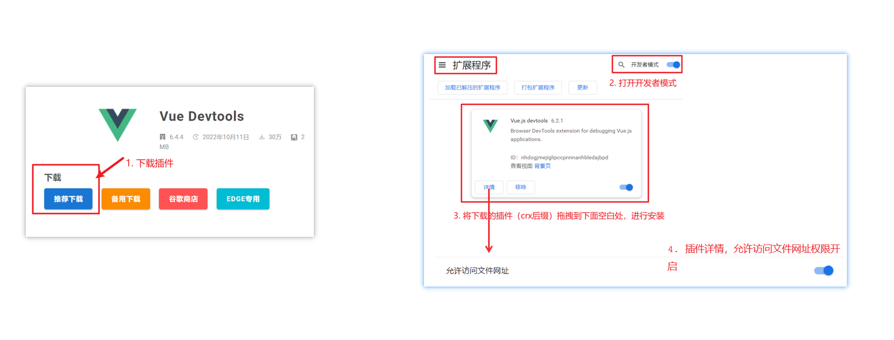
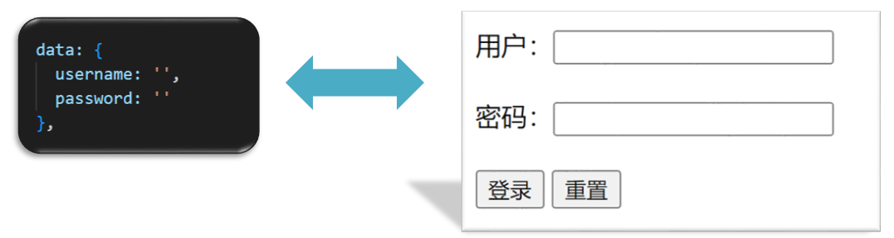
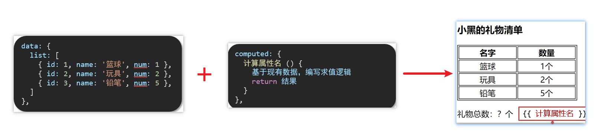

# Vue2

## 一、为什么要学习Vue

1. 前端必备技能
2. 岗位多，绝大互联网公司都在使用Vue
3. 提高开发效率
4. 高薪必备技能（Vue2+Vue3）

## 二、什么是Vue

概念：Vue (读音 /vjuː/，类似于 view) 是一套 **构建用户界面** 的 **渐进式** **框架**

Vue2官网：<https://v2.cn.vuejs.org/>

### 1.什么是构建用户界面

**基于数据**渲染出用户可以看到的**界面**


### 2.什么是渐进式

所谓渐进式就是循序渐进，不一定非得把Vue中的所有API都学完才能开发Vue，可以学一点开发一点

#### Vue的两种开发方式：

1. Vue核心包开发

   场景：局部模块改造

2. Vue核心包&Vue插件&工程化

   场景：整站开发

### 3.什么是框架

所谓框架：就是一套完整的解决方案

**举个栗子**

如果把一个完整的项目比喻为一个装修好的房子，那么框架就是一个毛坯房。

我们只需要在“毛坯房”的基础上，增加功能代码即可。

提到框架，不得不提一下库。

- 库，类似工具箱，是一堆方法的集合，比如 axios、lodash、echarts等
- 框架，是一套完整的解决方案，实现了大部分功能，我们只需要按照一定的规则去编码即可。

下图是 库 和 框架 的对比。


框架的特点：有一套必须让开发者遵守的**规则**或者**约束**

咱们学框架就是学习的这些规则 [官网](https://v2.cn.vuejs.org/)

## 三、创建Vue实例

我们已经知道了Vue框架可以 基于数据帮助我们渲染出用户界面，那应该怎么做呢？


比如就上面这个数据，基于提供好的msg 怎么渲染后右侧可展示的数据呢？

**核心步骤（4步）：**

1. 准备容器
2. 引包（官网） — 开发版本/生产版本
3. 创建Vue实例：new Vue()
4. 指定配置项，渲染数据
    1. el：指定挂载点
    2. data：提供数据


## 四、插值表达式 {{}}

插值表达式是一种Vue的模板语法

我们可以用插值表达式渲染出Vue提供的数据


### 1.作用：利用表达式进行插值，渲染到页面中

表达式：是可以被求值的代码，JS引擎会讲其计算出一个结果

以下的情况都是表达式：

```js
money + 100
money - 100
money * 10
money / 10 
price >= 100 ? '真贵':'还行'
obj.name
arr[0]
fn()
obj.fn()
```

### 2.语法

插值表达式语法：`{{ 表达式 }}`

```vue
<h3>{{title}}</h3>

<p>{{nickName.toUpperCase()}}</p>

<p>{{age >= 18 ? '成年':'未成年'}}</p>

<p>{{obj.name}}</p>

<p>{{fn()}}</p>
```

### 3.错误用法

```vue
1.在插值表达式中使用的数据 必须在data中进行了提供
<p>{{hobby}}</p>  //如果在data中不存在 则会报错

2.支持的是表达式，而非语句，比如：if   for ...
<p>{{if}}</p>

3.不能在标签属性中使用 {{  }} 插值 (插值表达式只能标签中间使用)
<p title="{{username}}">我是P标签</p>
```

## 五、响应式特性

### 1.什么是响应式？

简单理解就是数据变，视图对应变。

### 2.如何访问 和 修改 data中的数据（响应式演示）

data中的数据，最终会被添加到实例上

① 访问数据："实例.属性名"

② 修改数据："实例.属性名" = "值"


## 六、Vue开发者工具安装

1. 通过谷歌应用商店安装（国外网站）
2. 极简插件下载（推荐） <https://chrome.zzzmh.cn/index>

安装步骤：



安装之后可以F12后看到多一个Vue的调试面板


## 七、Vue中的常用指令

**概念：** 指令（Directives）是 Vue 提供的带有 **v-前缀** 的 特殊 标签**属性**。

为啥要学：提高程序员操作 DOM 的效率。

vue 中的指令按照不同的用途可以分为如下 6 大类：

-  内容渲染指令（v-html、v-text）
-  条件渲染指令（v-show、v-if、v-else、v-else-if）
-  事件绑定指令（v-on）
-  属性绑定指令（v-bind）
-  双向绑定指令（v-model）
-  列表渲染指令（v-for）

指令是 vue 开发中最基础、最常用、最简单的知识点。

## 八、内容渲染指令

内容渲染指令用来辅助开发者渲染 DOM 元素的文本内容。常用的内容渲染指令有如下2 个：

- v-text（类似innerText）
  - 使用语法：`<p v-text="uname">hello</p>`，意思是将 uame 值渲染到 p 标签中
  - 类似 innerText，使用该语法，会覆盖 p 标签原有内容
- v-html（类似 innerHTML）
  - 使用语法：`<p v-html="intro">hello</p>`，意思是将 intro 值渲染到 p 标签中
  - 类似 innerHTML，使用该语法，会覆盖 p 标签原有内容
  - 类似 innerHTML，使用该语法，能够将HTML标签的样式呈现出来。

代码演示：

```vue
<div id="app">
    <h2>个人信息</h2>
    // 既然指令是vue提供的特殊的html属性，所以咱们写的时候就当成属性来用即可
    <p v-text="uname">姓名：</p>
    <p v-html="intro">简介：</p>
</div>

<script>
    const app = new Vue({
        el: '#app',
        data: {
            uname: '张三',
            intro: '<h2>这是一个<strong>非常优秀</strong>的boy<h2>'
        }
    })
</script>
```

## 九、条件渲染指令

条件判断指令，用来辅助开发者按需控制 DOM 的显示与隐藏。条件渲染指令有如下两个，分别是：

1. v-show
    1. 作用：控制元素显示隐藏
    2. 语法：v-show = "表达式"，表达式值为 true 显示，false 隐藏
    3. 原理：切换 display:none 控制显示隐藏
    4. 场景：频繁切换显示隐藏的场景

   

2. v-if
    1. 作用：控制元素显示隐藏（条件渲染）
    2. 语法：v-if= "表达式"，表达式值 true 显示，false 隐藏
    3. 原理：基于条件判断，是否创建 或 移除元素节点
    4. 场景：要么显示，要么隐藏，不频繁切换的场景

   

   示例代码：

   ```vue
   <div id="app">
       <div class="box">我是v-show控制的盒子</div>
       <div class="box">我是v-if控制的盒子</div>
   </div>
   
   <script>
       const app = new Vue({
           el: '#app',
           data: {
               flag: false
           }
       })
   </script>
   ```

3. v-else 和 v-else-if
    1. 作用：辅助v-if进行判断渲染
    2. 语法：v-else  v-else-if="表达式"
    3. 需要紧接着v-if使用

```vue
<div id="app">
    <div class="box">我是v-show控制的盒子</div>
    <div class="box">我是v-if控制的盒子</div>
</div>

<script>
    const app = new Vue({
        el: '#app',
        data: {
            flag: false
        }
    })
</script>
```
   
示例代码：

```vue
<div id="app">
    <p>性别：♂ 男</p>
    <p>性别：♀ 女</p>
    <hr>
    <p>成绩评定A：奖励电脑一台</p>
    <p>成绩评定B：奖励周末郊游</p>
    <p>成绩评定C：奖励零食礼包</p>
    <p>成绩评定D：惩罚一周不能玩手机</p>
</div>

<script>
    const app = new Vue({
        el: '#app',
        data: {
            gender: 2,
            score: 95
        }
    })
</script>
```

## 十、事件绑定指令

使用Vue时，如需为DOM注册事件，及其的简单，语法如下：

- \<button v-on:事件名="内联语句">按钮\</button>
- \<button v-on:事件名="处理函数">按钮\</button>
- \<button v-on:事件名="处理函数(实参)">按钮\</button>
- `v-on:` 简写为 **@**

1. 内联语句

```vue
<div id="app">
    <button @click="count--">-</button>
    <span>{{ count }}</span>
    <button v-on:click="count++">+</button>
</div>

<script>
    const app = new Vue({
        el: '#app',
        data: {
            count: 100
        }
    })
</script>
```

2. 事件处理函数

   注意：
    - 事件处理函数应该写到一个跟data同级的配置项（methods）中
    - methods中的函数内部的this都指向Vue实例

```vue
<div id="app">
    <button @click="change">切换显示隐藏</button>
    <h1 v-show="isShow">黑马程序员</h1>
</div>

<script src="./js/vue.js"></script>

<script>
    const app = new Vue({
        el: '#app',
        data: {
            isShow: true
        },
        methods: {
            change() {
                this.isShow = !this.isShow
            }
        }
    })
</script>
```

3. 给事件处理函数传参

- 如果不传递任何参数，则方法无需加小括号；methods方法中可以直接使用 e 当做事件对象
- 如果传递了参数，则实参 `$event` 表示事件对象，固定用法。

```vue
<style>
    .box {
        border: 3px solid #000000;
        border-radius: 10px;
        padding: 20px;
        margin: 20px;
        width: 200px;
    }

    h3 {
        margin: 10px 0 20px 0;
    }

    p {
        margin: 20px;
    }
</style>

<div id="app">
    <div class="box">
        <h3>小黑自动售货机</h3>
        <button @click="buy(5, $event)">可乐5元</button>
        <button @click="buy(10, $event)">咖啡10元</button>
        <button @click="buy(8, $event)">牛奶8元</button>
    </div>
    <p>银行卡余额：{{ money }}元</p>
</div>

<script>
    const app = new Vue({
        el: '#app',
        data: {
            money: 1000
        },
        methods: {
            buy(n, $event) {
                this.money -= n
                console.log($event)
            }
        }
    })
</script>
```

## 十一、属性绑定指令

1. 作用：动态设置html的标签属性 比如：src、url、title
2. 语法：v-bind:属性名=“表达式”
3. v-bind：可以简写成 => :

比如，有一个图片，它的 `src` 属性值，是一个图片地址。这个地址在数据 data 中存储。

则可以这样设置属性值：
- ``
- ``（v-bind可以省略）

```vue
<div id="app">
    
    
</div>

<script>
    const app = new Vue({
        el: '#app',
        data: {
            imgUrl: './imgs/10-02.png',
            msg: 'hello 波仔'
        }
    })
</script>
```

## 十二、小案例-波仔的学习之旅

需求：默认展示数组中的第一张图片，点击上一页下一页来回切换数组中的图片

实现思路：
1. 数组存储图片路径 ['url1','url2','url3'，...]
2. 可以准备个下标index 去数组中取图片地址。
3. 通过v-bind给src绑定当前的图片地址
4. 点击上一页下一页只需要修改下标的值即可
5. 当展示第一张的时候，上一页按钮应该隐藏。展示最后一张的时候，下一页按钮应该隐藏

```vue

<div id="app">
    <button @click="changeIndex(-1)" v-show="index > 0">上一页</button>
    <div>
        
    </div>
    <button @click="changeIndex(1)" v-show="index < list.length - 1">下一页</button>
</div>

<script>
    const app = new Vue({
        el: '#app',
        data: {
            list: [
                './imgs/11-00.gif',
                './imgs/11-01.gif',
                './imgs/11-02.gif',
                './imgs/11-03.gif',
                './imgs/11-04.png',
                './imgs/11-05.png',
            ],
            index: 0
        },
        methods: {
            changeIndex(n) {
                this.index += n
            },
            getImageSrc() {
                return this.list[this.index]
            }
        }
    })
</script>
```

## 十三、列表渲染指令

Vue 提供了 v-for 列表渲染指令，用来辅助开发者基于一个数组来循环渲染一个列表结构。

v-for 指令需要使用 `(item, index) in arr` 形式的特殊语法，其中：

- item 是数组中的每一项
- index 是每一项的索引，不需要可以省略
- arr 是被遍历的数组

此语法也可以遍历**对象和数字**

```vue
//遍历对象
<div v-for="(value, key, index) in object">{{value}}</div>
value:对象中的值
key:对象中的键
index:遍历索引从0开始

//遍历数字
<p v-for="item in 10">{{item}}</p>
item从1 开始
```

```vue
<div id="app">
    <h3>小黑水果店</h3>
    <ul>
        <li v-for="(item, index) in list">
            {{ item }} - {{ index }}
        </li>
    </ul>
</div>

<script>
    const app = new Vue({
        el: '#app',
        data: {
            list: [
                '西瓜',
                '苹果',
                '鸭梨',
                '榴莲'
            ]
        }
    })
</script>
```

## 十四、小案例-小黑的书架

需求：

1. 根据左侧数据渲染出右侧列表（v-for）
2. 点击删除按钮时，应该把当前行从列表中删除（获取当前行的id，利用filter进行过滤）


准备代码：

```vue
    <div id="app">
    <h3>小黑的书架</h3>
    <ul>
        <li v-for="(item, index) in booksList" :key="item.id">
            <span>{{ item.name }}</span>
            <span>{{ item.author }}</span>
            <button @click="del(item.id)">删除</button>
        </li>
    </ul>
</div>

<script>
    const app = new Vue({
        el: '#app',
        data: {
            booksList: [
                {id: 1, name: '《红楼梦》', author: '曹雪芹'},
                {id: 2, name: '《西游记》', author: '吴承恩'},
                {id: 3, name: '《水浒传》', author: '施耐庵'},
                {id: 4, name: '《三国演义》', author: '罗贯中'}
            ]
        },
        methods: {
            del(id) {
                this.booksList = this.booksList.filter(e => e.id !== id)
            }
        }
    })
</script>
```

## 十五、v-for中的key

**语法**：key="唯一值"

**作用**：给列表项添加的**唯一标识**。便于Vue进行列表项的**正确排序复用**。

**为什么加key**：Vue 的默认行为会尝试原地修改元素（**就地复用**）

实例代码：

```vue
<ul>
    <li v-for="(item, index) in booksList" :key="item.id">
        <span>{{ item.name }}</span>
        <span>{{ item.author }}</span>
        <button @click="del(item.id)">删除</button>
    </li>
</ul>
```

注意：
1. key 的值只能是字符串或数字类型
2. key 的值必须具有唯一性
3. 推荐使用 id 作为 key（唯一），不推荐使用 index 作为 key（会变化，不对应）

## 十六、双向绑定指令

所谓双向绑定就是：
1. 数据改变后，呈现的页面结果会更新
2. 页面结果更新后，数据也会随之而变

**作用**： 给**表单元素**（input、radio、select）使用，双向绑定数据，可以快速 **获取** 或 **设置** 表单元素内容

**语法**：v-model="变量"

**需求**：使用双向绑定实现以下需求

1. 点击登录按钮获取表单中的内容
2. 点击重置按钮清空表单中的内容



```vue
<div id="app">
    账户：<input type="text"> <br><br>
    密码：<input type="password"> <br><br>
    <button>登录</button>
    <button>重置</button>
</div>

<script>
    const app = new Vue({
        el: '#app',
        data: {
            username: '',
            password: ''
        }
    })
</script>
```

## 十七、综合案例-小黑记事本


**功能需求：**

1. 列表渲染
2. 删除功能
3. 添加功能
4. 底部统计 和 清空

## 十八、指令修饰符

### 1.什么是指令修饰符？

所谓指令修饰符就是通过“.”指明一些指令**后缀**不同的**后缀**封装了不同的处理操作 —> 简化代码

### 2.按键修饰符

- @keyup.enter  —>当点击enter键的时候才触发

代码演示：

```vue
<div id="app">
    <h3>@keyup.enter → 监听键盘回车事件</h3>
    <input v-model="username" type="text">
</div>

<script>
    const app = new Vue({
        el: '#app',
        data: {
            username: ''
        },
        methods: {}
    })
</script>
```

### 3.v-model修饰符

- v-model.trim —> 去除首位空格
- v-model.number —> 转数字

### 4.事件修饰符

- @事件名.stop —> 阻止冒泡
- @事件名.prevent  —>阻止默认行为
- @事件名.stop.prevent —>可以连用 即阻止事件冒泡也阻止默认行为

```vue
<style>
    .father {
        width: 200px;
        height: 200px;
        background-color: pink;
        margin-top: 20px;
    }

    .son {
        width: 100px;
        height: 100px;
        background-color: skyblue;
    }
</style>

<div id="app">
    <h3>v-model修饰符 .trim .number</h3>
    姓名：<input v-model="username" type="text"><br>
    年纪：<input v-model="age" type="text"><br>


    <h3>@事件名.stop → 阻止冒泡</h3>
    <div @click="fatherFn" class="father">
        <div @click.stop="sonFn" class="son">儿子</div>
    </div>

    <h3>@事件名.prevent → 阻止默认行为</h3>
    <a @click.prevent href="http://www.baidu.com">阻止默认行为</a>
</div>

<script>
    const app = new Vue({
        el: '#app',
        data: {
            username: '',
            age: '',
        },
        methods: {
            fatherFn() {
                alert('老父亲被点击了')
            },
            sonFn(e) {
                // e.stopPropagation()
                alert('儿子被点击了')
            }
        }
    })
</script>
```

## 十九、v-bind对样式控制的增强-操作class

为了方便开发者进行样式控制，Vue 扩展了 v-bind 的语法，可以针对 **class 类名** 和 **style 行内样式** 进行控制。

### 1.语法

```html
<div :class="对象/数组">这是一个div</div>
```

### 2.对象语法

当class动态绑定的是**对象**时，**键就是类名，值就是布尔值**，如果值是**true**，就有这个类，否则没有这个类

```html
<div class="box" :class="{ 类名1: 布尔值, 类名2: 布尔值 }"></div>
```

适用场景：一个类名，来回切换

### 3.数组语法

当class动态绑定的是**数组**时 → 数组中所有的类，都会添加到盒子上，本质就是一个 class 列表

```html
<div class="box" :class="[ 类名1, 类名2, 类名3 ]"></div>
```

使用场景：批量添加或删除类

### 4.代码练习

```vue
<style>
    .box {
        width: 200px;
        height: 200px;
        border: 3px solid #000;
        font-size: 30px;
        margin-top: 10px;
    }

    .pink {
        background-color: pink;
    }

    .big {
        width: 300px;
        height: 300px;
    }
</style>


<div id="app">
    <!--绑定对象-->
    <div class="box" :class="{pink: true, big: true}">黑马程序员</div>
    <!--绑定数组-->
    <div class="box" :class="['pink', 'big']">黑马程序员</div>
</div>

<script>
    const app = new Vue({
        el: '#app',
        data: {}
    })
</script>
```

## 二十、京东秒杀-tab栏切换导航高亮

### 1.需求

当我们点击哪个tab页签时，哪个tab页签就高亮

### 2.准备代码

```vue
<style>
    * {
        margin: 0;
        padding: 0;
    }

    ul {
        display: flex;
        border-bottom: 2px solid #e01222;
        padding: 0 10px;
    }

    li {
        width: 100px;
        height: 50px;
        line-height: 50px;
        list-style: none;
        text-align: center;
    }

    li a {
        display: block;
        text-decoration: none;
        font-weight: bold;
        color: #333333;
    }

    li a.active {
        background-color: #e01222;
        color: #fff;
    }

</style>

<div id="app">
    <ul>
        <li v-for="(item, index) in list" :key="item.id">
            <a href="#" :class="getActiveClass(index)" @click="change(index)">{{ item.name }}</a>
        </li>
    </ul>
</div>

<script>
    const app = new Vue({
        el: '#app',
        data: {
            list: [
                {id: 1, name: '京东秒杀'},
                {id: 2, name: '每日特价'},
                {id: 3, name: '品类秒杀'}
            ],
            activeIndex: 0
        },
        methods: {
            change(index) {
                this.activeIndex = index
            },
            getActiveClass(index) {
                return this.activeIndex === index ? 'active' : null
            }
        }
    })
</script>
```

### 3.思路

1. 基于数据，动态渲染tab（v-for）
2. 准备一个下标 记录高亮的是哪一个 tab
3. 基于下标动态切换class的类名

## 二一、v-bind对有样式控制的增强-操作style

### 1.语法

```html
<div class="box" :style="{ CSS属性名1: CSS属性值, CSS属性名2: CSS属性值 }"></div>
```

### 2.代码练习

```vue
<style>
    .box {
        width: 200px;
        height: 200px;
        background-color: rgb(187, 150, 156);
    }
</style>
<div id="app">
    <div class="box" :style="{ width: '400px', height: '400px', 'background-color': 'red' }"></div>
</div>

<script>
    const app = new Vue({
        el: '#app',
        data: {}
    })
</script>
```

### 3.进度条案例

```vue
<style>
    .progress {
        height: 25px;
        width: 400px;
        border-radius: 15px;
        background-color: #272425;
        border: 3px solid #272425;
        box-sizing: border-box;
        margin-bottom: 30px;
    }

    .inner {
        width: 50%;
        height: 20px;
        border-radius: 10px;
        text-align: right;
        position: relative;
        background-color: #409eff;
        background-size: 20px 20px;
        box-sizing: border-box;
        transition: all 1s;
    }

    .inner span {
        position: absolute;
        right: -20px;
        bottom: -25px;
    }
</style>

<div id="app">
    <div class="progress">
        <div class="inner" :style="{ width: percentage + '%' }">
            <span>{{ percentage }}%</span>
        </div>
    </div>
    <button @click="setting(25)">设置25%</button>
    <button @click="setting(50)">设置50%</button>
    <button @click="setting(75)">设置75%</button>
    <button @click="setting(100)">设置100%</button>
</div>

<script src="../../js/vue.js"></script>
<script>
    const app = new Vue({
        el: '#app',
        data: {
            percentage: 50
        },
        methods: {
            setting(num) {
                this.percentage = num
            }
        }
    })
</script>
```

## 二二、v-model在其他表单元素的使用

### 1.讲解内容

常见的表单元素都可以用 v-model 绑定关联  →  快速 **获取** 或 **设置** 表单元素的值

它会根据**控件类型**自动选取**正确的方法**来更新元素

```text
输入框   input:text     ——> value
文本域   textarea	   ——> value
复选框   input:checkbox ——> checked
单选框   input:radio    ——> checked
下拉菜单 select         ——> value
...
```

### 2.代码准备

```vue
<style>
    textarea {
        display: block;
        width: 240px;
        height: 100px;
        margin: 10px 0;
    }
</style>
<div id="app">
    <h3>小黑学习网</h3>
    姓名：
    <input type="text" v-model="name">
    <br><br>
    是否单身：
    <input type="checkbox" v-model="isSingle">
    <br><br>
    <!--
      前置理解：
        1. name:  给单选框加上 name 属性 可以分组 → 同一组互相会互斥
        2. value: 给单选框加上 value 属性，用于提交给后台的数据
      结合 Vue 使用 → v-model
    -->
    性别:
    <input type="radio" name="gender" value="1" v-model="gender">男
    <input type="radio" name="gender" value="2" v-model="gender">女
    <br><br>
    <!--
      前置理解：
        1. option 需要设置 value 值，提交给后台
        2. select 的 value 值，关联了选中的 option 的 value 值
      结合 Vue 使用 → v-model
    -->
    所在城市:
    <select v-model="city">
        <option value="BeiJing">北京</option>
        <option value="ShangHai">上海</option>
        <option value="ChengDu">成都</option>
        <option value="NanJing">南京</option>
    </select>
    <br><br>
    自我描述：
    <textarea v-model="describe"></textarea>
    <button @click="log">立即注册</button>
</div>

<script>
    const app = new Vue({
        el: '#app',
        data: {
            name: '',
            isSingle: false,
            gender: 1,
            city: 'BeiJing',
            describe: ''
        },
        methods: {
            log() {
                console.log(this.name, this.isSingle, this.gender, this.city, this.describe)
            }
        }
    })
</script>
```

## 二三、computed计算属性

### 1.概念

基于**现有的数据**，计算出来的**新属性**。**依赖**的数据变化，**自动**重新计算。

### 2.语法

1. 声明在 **computed 配置项**中，一个计算属性对应一个函数
2. 使用起来和普通属性一样使用 {{ 计算属性名 }}

### 3.注意

1. computed配置项和data配置项是**同级**的
2. computed中的计算属性**虽然是函数的写法**，但他**依然是个属性**
3. computed中的计算属性**不能**和data中的属性**同名**
4. 使用computed中的计算属性和使用data中的属性是一样的用法
5. computed中计算属性内部的**this**依然**指向的是Vue实例**

### 4.案例

比如我们可以使用计算属性实现下面这个业务场景



### 5.代码准备

```vue
<style>
    table {
        border: 1px solid #000;
        text-align: center;
        width: 240px;
    }

    th, td {
        border: 1px solid #000;
    }

    h3 {
        position: relative;
    }
</style>

<div id="app">
    <h3>小黑的礼物清单</h3>
    <table>
        <tr>
            <th>名字</th>
            <th>数量</th>
        </tr>
        <tr v-for="(item, index) in list" :key="item.id">
            <td>{{ item.name }}</td>
            <td>{{ item.num }}个</td>
        </tr>
    </table>

    <!-- 目标：统计求和，求得礼物总数 -->
    <p>礼物总数：{{ totalCount }} 个</p>
</div>

<script>
    const app = new Vue({
        el: '#app',
        data: {
            // 现有的数据
            list: [
                {id: 1, name: '篮球', num: 1},
                {id: 2, name: '玩具', num: 2},
                {id: 3, name: '铅笔', num: 5},
            ]
        },
        computed: {
            totalCount() {
                return this.list.reduce((p, c) => p + c.num, 0)
            }
        }
    })
</script>
```

## 二四、computed计算属性 VS methods方法

### 1.computed计算属性

作用：封装了一段对于**数据**的处理，求得一个**结果**

语法：

1. 写在computed配置项中
2. 作为属性，直接使用
   - js中使用计算属性： this.计算属性
   - 模板中使用计算属性：{{计算属性}}

### 2.methods计算属性

作用：给Vue实例提供一个**方法**，调用以**处理业务逻辑**。

语法：
1. 写在methods配置项中
2. 作为方法调用
    - js中调用：this.方法名()
    - 模板中调用 {{方法名()}} 或者 @事件名=“方法名”

### 3.计算属性的优势

1. 缓存特性（提升性能）

   计算属性会对计算出来的结果缓存，再次使用直接读取缓存，

   依赖项变化了，会自动重新计算 → 并再次缓存

2. methods没有缓存特性

3. 通过代码比较

```vue
<style>
    table {
        border: 1px solid #000;
        text-align: center;
        width: 300px;
    }

    th, td {
        border: 1px solid #000;
    }

    h3 {
        position: relative;
    }

    span {
        position: absolute;
        left: 145px;
        top: -4px;
        width: 16px;
        height: 16px;
        color: white;
        font-size: 12px;
        text-align: center;
        border-radius: 50%;
        background-color: #e63f32;
    }
</style>

<div id="app">
    <h3>小黑的礼物清单🛒<span>{{ totalCount }}}</span></h3>
    <h3>小黑的礼物清单🛒<span>{{ totalCount }}}</span></h3>
    <h3>小黑的礼物清单🛒<span>{{ totalCount }}}</span></h3>
    <h3>小黑的礼物清单🛒<span>{{ totalCount }}}</span></h3>
    <h3>小黑的礼物清单🛒<span>{{ totalCount }}}</span></h3>
    <table>
        <tr>
            <th>名字</th>
            <th>数量</th>
        </tr>
        <tr v-for="(item, index) in list" :key="item.id">
            <td>{{ item.name }}</td>
            <td>{{ item.num }}个</td>
        </tr>
    </table>

    <p>礼物总数：{{ totalCount }} 个</p>
</div>

<script>
    const app = new Vue({
        el: '#app',
        data: {
            // 现有的数据
            list: [
                {id: 1, name: '篮球', num: 3},
                {id: 2, name: '玩具', num: 2},
                {id: 3, name: '铅笔', num: 5},
            ]
        },
        computed: {
            totalCount() {
                let total = this.list.reduce((sum, item) => sum + item.num, 0)
                console.log(total)
                return total
            }
        }
    })
</script>
```

### 4.总结

1. computed**有缓存特性**，methods**没有缓存**
2. 当一个结果依赖其他多个值时，推荐使用计算属性
3. 当处理业务逻辑时，推荐使用methods方法，比如事件的处理函数

## 二五、计算属性的完整写法

**既然计算属性也是属性，能访问，应该也能修改了？**

1. 计算属性默认的简写，只能读取访问，不能 "修改"
2. 如果要 "修改" → 需要写计算属性的完整写法


完整写法代码演示

```vue
<div id="app">
    姓：<input type="text" v-model="firstName"> +
    名：<input type="text" v-model="lastName"> =
    <span>{{ fullName }}</span><br><br>
    <button @click="changeName">改名卡</button>
</div>
<script src="../../js/vue.js"></script>
<script>
    const app = new Vue({
        el: '#app',
        data: {
            firstName: '刘',
            lastName: '备'
        },
        computed: {
            fullName: {
                get() {
                    return this.firstName + this.lastName
                },
                set(name) {
                    this.firstName = name.slice(0, 1)
                    this.lastName = name.slice(1)
                }
            }
        },
        methods: {
            changeName() {
                this.fullName = '吕布'
            }
        }
    })
</script>
```

## 二六、综合案例-成绩案例


功能描述：
1. 渲染功能
2. 删除功能
3. 添加功能
4. 统计总分，求平均分

思路分析：
1. 渲染功能：v-for :key v-bind: 动态绑定class的样式
2. 删除功能：v-on绑定事件，阻止a标签的默认行为
3. v-model的修饰符 .trim、.number、判断数据是否为空后 再添加、添加后清空文本框的数据
4. 使用计算属性 computed 计算总分和平均分的值

## 二七、watch侦听器（监视器）

### 1.作用：

**监视数据变化**，执行一些业务逻辑或异步操作

### 2.语法：

1. watch同样声明在跟data同级的配置项中
2. 简单写法：简单类型数据直接监视
3. 完整写法：添加额外配置项

   ```vue
   data: {
       words: '苹果',
       obj: {
           words: '苹果'
       }
   },
   
   watch: {
       // 该方法会在数据变化时，触发执行
       数据属性名(newValue, oldValue) {
           // ...
       },
       '对象.属性名'(newValue, oldValue) {
           // ...
       }
   }
   ```

### 3.翻译案例

```vue
<style>
    * {
        margin: 0;
        padding: 0;
        box-sizing: border-box;
        font-size: 18px;
    }

    #app {
        padding: 10px 20px;
    }

    .query {
        margin: 10px 0;
    }

    .box {
        display: flex;
    }

    textarea {
        width: 300px;
        height: 160px;
        font-size: 18px;
        border: 1px solid #dedede;
        outline: none;
        resize: none;
        padding: 10px;
    }

    textarea:hover {
        border: 1px solid #1589f5;
    }

    .transbox {
        width: 300px;
        height: 160px;
        background-color: #f0f0f0;
        padding: 10px;
        border: none;
    }

    .tip-box {
        width: 300px;
        height: 25px;
        line-height: 25px;
        display: flex;
    }

    .tip-box span {
        flex: 1;
        text-align: center;
    }

    .query span {
        font-size: 18px;
    }

    .input-wrap {
        position: relative;
    }

    .input-wrap span {
        position: absolute;
        right: 15px;
        bottom: 15px;
        font-size: 12px;
    }

    .input-wrap i {
        font-size: 20px;
        font-style: normal;
    }
</style>

<div id="app">
    <!-- 条件选择框 -->
    <div class="query">
        <span>翻译成的语言：</span>
        <select>
            <option value="italy">意大利</option>
            <option value="english">英语</option>
            <option value="german">德语</option>
        </select>
    </div>

    <!-- 翻译框 -->
    <div class="box">
        <div class="input-wrap">
            <textarea v-model="words"></textarea>
            <span><i>⌨️</i>文档翻译</span>
        </div>
        <div class="output-wrap">
            <div class="transbox">{{ result }}</div>
        </div>
    </div>
</div>

<script>

    const app = new Vue({
        el: '#app',
        data: {
            words: '',
            timer: null,
            result: ''
        },
        watch: {
            words(newValue) {
                if (this.timer) {
                    clearTimeout(this.timer)
                }
                this.timer = setTimeout(async () => {
                    const res = await axios({
                        url: 'https://applet-base-api-t.itheima.net/api/translate',
                        params: {
                            words: newValue
                        }
                    })

                    this.result = res.data.data
                }, 300)
            }
        }
    })
</script>
```

## 二八、watch侦听器

### 1.语法

完整写法 —> 添加额外的配置项

1. deep: true 对复杂类型进行深度监听
2. immdiate: true 初始化时立刻执行一次

```vue
data: {
    obj: {
        words: '苹果',
        lang: 'italy'
    },
},

watch: { // watch 完整写法
    对象: {
        deep: true, // 深度监视
        immediate: true, //立即执行handler函数
        handler (newValue) {
            console.log(newValue)
        }
    }
}
```

### 2. 需求


- 当文本框输入的时候 右侧翻译内容要时时变化
- 当下拉框中的语言发生变化的时候 右侧翻译的内容依然要时时变化
- 如果文本框中有默认值的话要立即翻译

### 3.代码实现

```vue
<style>
    * {
        margin: 0;
        padding: 0;
        box-sizing: border-box;
        font-size: 18px;
    }

    #app {
        padding: 10px 20px;
    }

    .query {
        margin: 10px 0;
    }

    .box {
        display: flex;
    }

    textarea {
        width: 300px;
        height: 160px;
        font-size: 18px;
        border: 1px solid #dedede;
        outline: none;
        resize: none;
        padding: 10px;
    }

    textarea:hover {
        border: 1px solid #1589f5;
    }

    .transbox {
        width: 300px;
        height: 160px;
        background-color: #f0f0f0;
        padding: 10px;
        border: none;
    }

    .tip-box {
        width: 300px;
        height: 25px;
        line-height: 25px;
        display: flex;
    }

    .tip-box span {
        flex: 1;
        text-align: center;
    }

    .query span {
        font-size: 18px;
    }

    .input-wrap {
        position: relative;
    }

    .input-wrap span {
        position: absolute;
        right: 15px;
        bottom: 15px;
        font-size: 12px;
    }

    .input-wrap i {
        font-size: 20px;
        font-style: normal;
    }
</style>

<div id="app">
    <!-- 条件选择框 -->
    <div class="query">
        <span>翻译成的语言：</span>
        <select v-model="item.lang">
            <option value="italy">意大利</option>
            <option value="english">英语</option>
            <option value="german">德语</option>
        </select>
    </div>

    <!-- 翻译框 -->
    <div class="box">
        <div class="input-wrap">
            <textarea v-model="item.words"></textarea>
            <span><i>⌨️</i>文档翻译</span>
        </div>
        <div class="output-wrap">
            <div class="transbox">{{ result }}</div>
        </div>
    </div>
</div>
<script src="../../js/vue.js"></script>
<script src="../../js/axios.js"></script>
<script>

    const app = new Vue({
        el: '#app',
        data: {
            item: {
                words: '',
                lang: 'italy'
            },
            timer: null,
            result: '',

        },
        watch: {
            item: {
                handler(newValue) {
                    if (this.timer) {
                        clearTimeout(this.timer)
                    }
                    this.timer = setTimeout(async () => {
                        const res = await axios({
                            url: 'https://applet-base-api-t.itheima.net/api/translate',
                            params: {
                                words: newValue
                            }
                        })

                        this.result = res.data.data
                    }, 300)
                },
                deep: true
            },
        }
    })
</script>
```

### 4.总结

watch侦听器的写法有几种？

1. 简单写法

```vue
watch: {
    数据属性名 (newValue, oldValue) {
        // ...
    },
    '对象.属性名' (newValue, oldValue) {
        // ...
    }
}
```

2. 完整写法

```vue
watch: {// watch 完整写法
    数据属性名: {
        deep: true, // 深度监视(针对复杂类型)
        immediate: true, // 是否立刻执行一次handler
        handler(newValue) {
            console.log(newValue)
        }
    }
}
```

## 二九、综合案例

购物车案例


需求说明：

1. 渲染功能
2. 删除功能
3. 修改个数
4. 全选反选
5. 统计 选中的 总价 和 总数量
6. 持久化到本地


实现思路：

1.基本渲染：  v-for遍历、:class动态绑定样式

2.删除功能 ： v-on 绑定事件，获取当前行的id

3.修改个数 ： v-on绑定事件，获取当前行的id，进行筛选出对应的项然后增加或减少

4.全选反选

1. 必须所有的小选框都选中，全选按钮才选中 → every
2. 如果全选按钮选中，则所有小选框都选中
3. 如果全选取消，则所有小选框都取消选中

声明计算属性，判断数组中的每一个checked属性的值，看是否需要全部选

5.统计 选中的 总价 和 总数量 ：通过计算属性来计算**选中的**总价和总数量

6.持久化到本地： 在数据变化时都要更新下本地存储 watch
